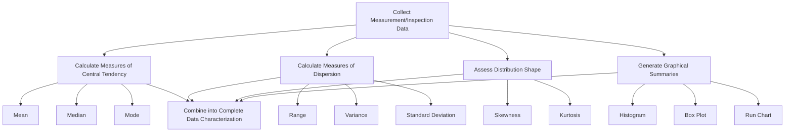

## Descriptive Statistics

### Definition and Purpose

Descriptive statistics are numerical and graphical methods used to summarize, organize, and characterize a set of measurement or inspection data without drawing inferences beyond the data itself. In precision metrology and quality control, descriptive statistics form the essential first step in understanding process behavior, measurement system performance, and product conformance — providing the foundational summary values (central tendency, dispersion, distribution shape) that underpin more advanced techniques such as statistical process control, measurement uncertainty analysis, and process capability studies.

### Key Points

- Descriptive statistics describe **only the data collected**, in contrast to inferential statistics, which uses sample data to draw conclusions or make predictions about a broader population.
- The two fundamental categories of descriptive statistics are **measures of central tendency** (where data values tend to cluster) and **measures of dispersion/variability** (how spread out the data values are) — both are necessary, since either alone gives an incomplete picture of a data set.
- Proper application in metrology requires attention to the distinction between **population** and **sample** statistics, since the formulas for variance and standard deviation differ depending on whether the full population or a subset (sample) is being characterized.
- Visual/graphical summaries (histograms, box plots, run charts) complement numerical summaries, often revealing distribution shape, outliers, or trends that summary numbers alone can obscure.

### Measures of Central Tendency

**Mean (Arithmetic Average)**: The sum of all values divided by the number of values, representing the "balance point" of the data set.

$$\bar{x} = \frac{1}{n}\sum_{i=1}^{n} x_i$$

**Key Points**: The mean is sensitive to extreme values (outliers) — a single unusually large or small measurement can significantly shift the mean, which is an important consideration when characterizing measurement data that may contain occasional gross errors or blunders.

**Median**: The middle value of a data set when values are arranged in ascending order (or the average of the two middle values for an even-numbered data set).

**Key Points**: The median is more robust to outliers than the mean, since it depends only on the rank/position of values rather than their magnitude — useful when a data set may contain occasional anomalous readings that would otherwise distort the mean.

**Mode**: The most frequently occurring value in a data set.

**Key Points**: Less commonly used in continuous dimensional measurement data (where exact repeated values are less likely), but relevant for categorical or discrete-count quality data (e.g., the most common defect type observed).

### Measures of Dispersion (Variability)

**Range**: The difference between the maximum and minimum values in a data set.

$$R = x_{max} - x_{min}$$

**Key Points**: Simple to calculate and widely used in quality control (e.g., in $\bar{x}$-R control charts), but sensitive to sample size and only uses two data points, ignoring the distribution of values between the extremes.

**Variance**: The average of the squared deviations from the mean, quantifying overall data spread in squared units of the original measurement.

For a population:

$$\sigma^2 = \frac{1}{N}\sum_{i=1}^{N} (x_i - \mu)^2$$

For a sample:

$$s^2 = \frac{1}{n-1}\sum_{i=1}^{n} (x_i - \bar{x})^2$$

**Key Points**: The sample variance formula divides by $(n-1)$ rather than $n$ — a correction known as **Bessel's correction** — which compensates for the fact that a sample mean is itself estimated from the same data, and using $n$ alone would systematically underestimate the true population variance; using $n-1$ produces an unbiased estimator of the population variance.

**Standard Deviation**: The square root of the variance, expressed in the same units as the original measurements, making it more directly interpretable than variance.

$$s = \sqrt{s^2} = \sqrt{\frac{1}{n-1}\sum_{i=1}^{n} (x_i - \bar{x})^2}$$

**Key Points**: Standard deviation is the most widely used measure of dispersion in metrology and quality control, forming the basis for control chart limits, process capability indices, and measurement uncertainty expressions.

**Coefficient of Variation (CV)**: The standard deviation expressed as a percentage of the mean, allowing comparison of relative variability across data sets with different units or magnitudes.

$$CV = \frac{s}{\bar{x}} \times 100\%$$

### Distribution Shape Descriptors

**Skewness**: A measure of the asymmetry of a data distribution around its mean; positive skewness indicates a longer tail toward higher values, negative skewness indicates a longer tail toward lower values, and zero (or near-zero) skewness suggests a roughly symmetric distribution.

**Kurtosis**: A measure of the "tailedness" of a distribution relative to a normal distribution; higher kurtosis indicates heavier tails and a more peaked center (more extreme outlier tendency), while lower kurtosis indicates lighter tails and a flatter distribution.

**Key Points**: In quality control applications, significant skewness or kurtosis relative to an assumed normal distribution can indicate that statistical tools relying on normality assumptions (certain control chart limits, capability indices) may need adjustment or that the underlying process itself is exhibiting non-random or asymmetric behavior worth investigating.

### Graphical Descriptive Tools

**Histogram**: A bar chart representation of data frequency across defined intervals (bins), providing a visual impression of the data's distribution shape, central tendency, and spread — one of the most fundamental tools for visualizing measurement or process data.

**Box Plot (Box-and-Whisker Plot)**: A graphical summary showing the median, quartiles (25th and 75th percentiles, forming the "box"), and the range or a defined outlier threshold (the "whiskers"), providing a compact visual summary of central tendency, spread, and potential outliers.

**Run Chart**: A plot of individual data points in the order they were collected (typically over time), useful for revealing trends, shifts, or patterns that a static summary statistic would not show.

**Scatter Plot**: A plot of paired data points (two variables), used to visually assess potential relationships or correlation between variables — for example, plotting measured dimension against ambient temperature to visually assess thermal effects.

### Descriptive Statistics Workflow (svg_diagram)

### Example Calculation

**Example**: A set of 10 repeated caliper measurements (in mm) of a reference gauge block: 25.02, 25.01, 25.03, 25.02, 25.00, 25.04, 25.02, 25.01, 25.03, 25.02.

- **Mean**: $\bar{x} = 25.02$ mm
- **Range**: $25.04 - 25.00 = 0.04$ mm
- **Sample standard deviation**: approximately $s \approx 0.011$ mm (calculated using the $n-1$ divisor)

This kind of summary directly supports repeatability assessment for the measurement instrument, since the spread of repeated readings under identical conditions characterizes the instrument's (or measurement system's) inherent random variation.

### Application in Precision Metrology and Quality Control

**Key Points**:

- **Repeatability and reproducibility studies**: Descriptive statistics (mean, standard deviation) of repeated measurements under controlled versus varied conditions directly quantify measurement system variation, as used in Gauge R&R studies.
- **Process capability analysis**: Descriptive statistics of a production process's output (mean, standard deviation relative to specification limits) form the direct inputs to capability indices such as $C_p$ and $C_{pk}$.
- **Statistical process control**: Control chart center lines and control limits are derived directly from descriptive statistics (typically the mean and standard deviation, or range, of subgroup samples) calculated from historical, in-control process data.
- **Measurement uncertainty evaluation**: Type A uncertainty components (per the GUM methodology) are evaluated statistically from the standard deviation of repeated observations, directly applying descriptive statistical methods.

### Population vs. Sample Considerations

**Key Points**:

- A **population** encompasses every possible value of interest (e.g., every part that could ever be produced by a given process), while a **sample** is a subset actually measured or observed.
- In nearly all practical metrology and quality control work, only a sample of measurements is available, making the sample formulas (with the $n-1$ divisor for variance/standard deviation) the appropriate and standard choice, since the true population parameters are rarely directly knowable.
- Confusing population and sample formulas — particularly using the population ($n$) divisor when only sample data is available — introduces a systematic (though generally small for larger sample sizes) underestimation of true variability, which is a common calculation error.

### Common Sources of Error

- **Using the wrong variance/standard deviation formula**: applying the population ($n$) divisor to sample data (or vice versa) produces a biased estimate, most impactful with small sample sizes.
- **Ignoring outliers without investigation**: automatically excluding extreme values from descriptive calculations without first determining whether they represent genuine measurement anomalies, blunders, or actual process variation can mask real problems or distort legitimate outlier-driven insights.
- **Relying on summary statistics alone without graphical review**: data sets with very different distribution shapes can share identical means and standard deviations (a phenomenon famously illustrated by "Anscombe's Quartet" and similar constructed examples), making graphical review an important complement to numerical summaries.
- **Small sample size overconfidence**: descriptive statistics calculated from very small sample sizes can be highly unstable and unrepresentative of the true underlying variability, requiring caution before drawing firm conclusions from limited data.
- **Conflating range with standard deviation as measures of variability**: range is sensitive to sample size and only reflects two extreme values, while standard deviation reflects the spread of the entire data set — using range-based estimates (e.g., in $\bar{x}$-R charts) relies on established statistical relationships between range and standard deviation that are only valid for the specific subgroup sizes for which they were derived.

### Conclusion

Descriptive statistics provide the essential quantitative and visual foundation for understanding measurement and process data in precision metrology and quality control, characterizing both where data values center and how widely they are dispersed. A solid grasp of central tendency, dispersion, and distribution shape — combined with appropriate graphical tools and correct application of population versus sample formulas — underpins virtually every more advanced statistical technique used in measurement system analysis, process capability assessment, and statistical process control.

**Related Topics**:

- Statistical process control fundamentals
- Process capability indices ($C_p$, $C_{pk}$, $P_p$, $P_{pk}$)
- Measurement uncertainty analysis (GUM methodology)
- Gauge repeatability and reproducibility (Gauge R&R) studies
- Normal distribution and probability in quality control
- Control chart construction and interpretation
- Sampling plans and acceptance sampling