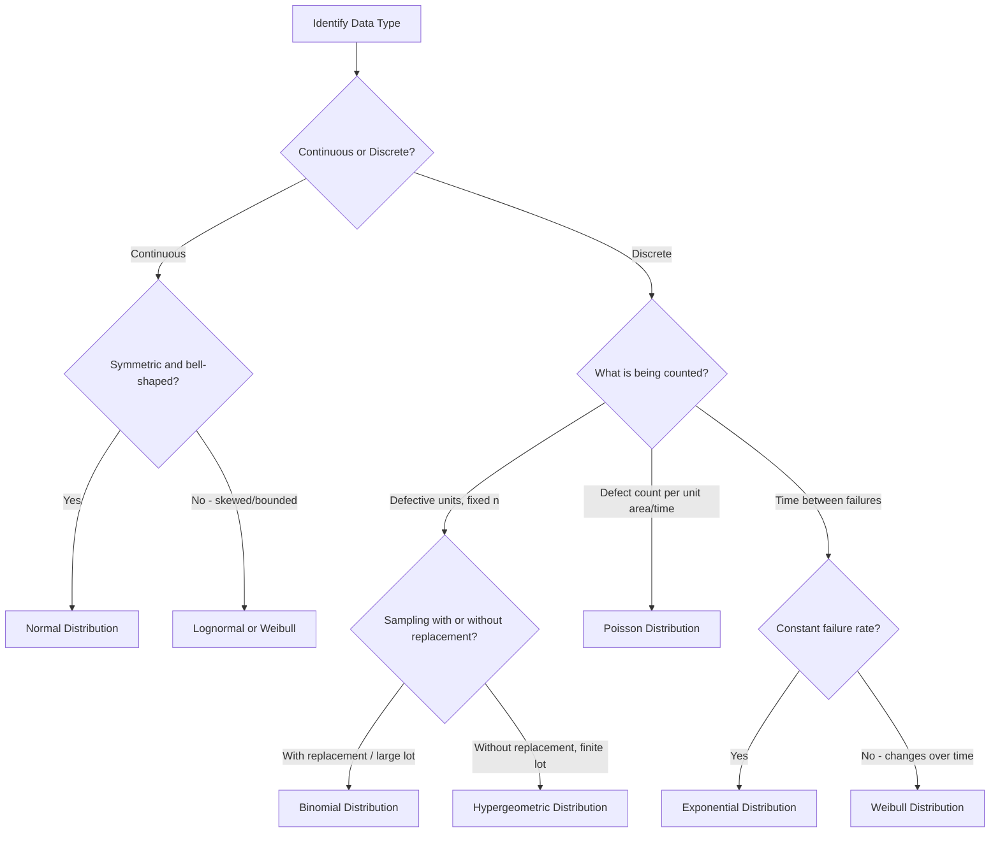

## Probability Distributions for Quality Data

### Overview

Probability distributions form the mathematical foundation of statistical quality control, providing models for how measured or counted characteristics of a process vary. Selecting the correct distribution for a given type of quality data is essential for constructing valid control charts, calculating process capability indices, setting realistic tolerances, and making sound accept/reject decisions. Quality data generally falls into two broad classes — **variable (continuous) data** and **attribute (discrete) data** — each governed by different families of probability distributions.

### Variable vs. Attribute Data

- **Variable data**: measurable on a continuous scale (length, diameter, weight, temperature, force). Typically modeled with continuous distributions such as the normal distribution
- **Attribute data**: countable, categorical, or discrete (number of defects, pass/fail outcomes, number of defective units in a sample). Typically modeled with discrete distributions such as binomial or Poisson

### Normal Distribution

The normal (Gaussian) distribution is the most fundamental distribution in quality metrology, describing many naturally occurring continuous measurement processes, particularly where variation arises from the additive effect of many small, independent causes.

The probability density function is:

$$f(x) = \frac{1}{\sigma \sqrt{2\pi}} e^{-\frac{(x-\mu)^2}{2\sigma^2}}$$

where $\mu$ is the process mean and $\sigma$ is the standard deviation.

**Key characteristics**

- Symmetric, bell-shaped curve centered at $\mu$
- Approximately 68.27% of values fall within $\mu \pm 1\sigma$, 95.45% within $\mu \pm 2\sigma$, and 99.73% within $\mu \pm 3\sigma$ — the basis for traditional $3\sigma$ control chart limits
- Underpins process capability indices ($C_p$, $C_{pk}$) and most variable control charts ($\bar{X}$-R, $\bar{X}$-S)

**Key Points**

- Many real manufacturing processes are approximately, but not perfectly, normal; verifying normality (via normal probability plots, Anderson-Darling, or Shapiro-Wilk tests) is a prerequisite before applying normal-theory control limits or capability indices
- Non-normal data may require transformation (e.g., Box-Cox) or use of non-normal capability methods

### Standard Normal Distribution and Z-Scores

Any normal distribution can be standardized using the Z-transformation:

$$Z = \frac{x - \mu}{\sigma}$$

This converts a measurement to the number of standard deviations it lies from the mean, allowing use of standard normal (Z) tables to compute probabilities — for example, the probability a part falls outside a specification limit.

### Binomial Distribution

Used for attribute data representing the number of "successes" (e.g., defective units) in a fixed number of independent trials, where each trial has the same probability of the outcome occurring.

$$P(X = k) = \binom{n}{k} p^k (1-p)^{n-k}$$

where $n$ is the sample size, $p$ is the probability of a defective unit, and $k$ is the observed number of defectives.

**Applications**

- $np$-charts and $p$-charts for fraction/number defective in quality control
- Acceptance sampling plans (e.g., determining probability of accepting a lot given a certain defect rate)
- Go/no-go gauge inspection outcomes across a sample

**Assumptions**

- Fixed sample size $n$
- Constant probability of defect $p$ across all units
- Independence between units

### Poisson Distribution

Used for modeling the number of discrete events (defects) occurring within a fixed unit of opportunity (area, length, time, or unit), particularly when the number of possible defect locations is large but the probability of a defect at any given location is small.

$$P(X = k) = \frac{\lambda^k e^{-\lambda}}{k!}$$

where $\lambda$ is the average number of defects per unit (the process mean rate).

**Applications**

- $c$-charts (constant sample size) and $u$-charts (variable sample size) for count of defects per unit
- Modeling defect occurrence in continuous processes (e.g., flaws per meter of wire, blemishes per painted panel)

**Key Points**

- The Poisson distribution is often used as an approximation to the binomial distribution when $n$ is large and $p$ is small (rare-event approximation)
- Assumes defects occur independently and at a constant average rate

### Hypergeometric Distribution

Used when sampling without replacement from a finite population, making the probability of drawing a defective item dependent on prior draws — relevant to lot-based acceptance sampling from small finite lots.

$$P(X = k) = \frac{\binom{D}{k}\binom{N-D}{n-k}}{\binom{N}{n}}$$

where $N$ is the population (lot) size, $D$ is the number of defectives in the lot, $n$ is the sample size, and $k$ is the number of defectives found in the sample.

**Key Points**

- More statistically exact than the binomial for finite-lot acceptance sampling, but computationally more complex
- The binomial distribution is often used as a practical approximation to the hypergeometric when the sample is small relative to the lot size (commonly cited as $n/N \leq 0.1$) [Inference: threshold is a general rule of thumb, not a strict statistical cutoff]

### Exponential Distribution

Models the time (or distance) between independent events occurring at a constant average rate — commonly used in reliability engineering for time-between-failures modeling.

$$f(x) = \lambda e^{-\lambda x}, \quad x \geq 0$$

**Applications**

- Reliability and mean time between failures (MTBF) analysis
- Life testing of components with a constant hazard (failure) rate

**Key Points**

- Assumes a constant failure rate (no wear-out or infant mortality effects) — a limiting assumption not valid for all failure mechanisms
- Closely related to the Poisson distribution: if event *counts* per interval follow a Poisson distribution, the *time between* those events follows an exponential distribution

### Weibull Distribution

A flexible distribution widely used in reliability engineering to model time-to-failure data where the failure rate changes over time (wear-in, random failure, or wear-out phases).

$$f(x) = \frac{\beta}{\eta}\left(\frac{x}{\eta}\right)^{\beta - 1} e^{-(x/\eta)^\beta}, \quad x \geq 0$$

where $\beta$ is the shape parameter and $\eta$ is the scale parameter.

**Key characteristics**

- $\beta < 1$: decreasing failure rate (infant mortality)
- $\beta = 1$: constant failure rate (reduces to the exponential distribution)
- $\beta > 1$: increasing failure rate (wear-out)
- Widely used in bathtub-curve reliability modeling and Weibull analysis of fatigue/life test data

### Lognormal Distribution

Used when the logarithm of a variable is normally distributed — common for quality characteristics that are naturally bounded at zero and positively skewed, such as particle size, surface roughness, or certain fatigue-life measurements.

$$f(x) = \frac{1}{x\sigma\sqrt{2\pi}} e^{-\frac{(\ln x - \mu)^2}{2\sigma^2}}, \quad x > 0$$

**Applications**

- Modeling positively skewed dimensional or wear-related data
- Particle size distribution analysis
- Certain corrosion and fatigue life datasets

### Choosing the Right Distribution

| Data Type | Typical Distribution | Common Application |
| --- | --- | --- |
| Continuous measurement | Normal | $\bar{X}$-R, $\bar{X}$-S charts, $C_p$/$C_{pk}$ |
| Skewed continuous (bounded at zero) | Lognormal, Weibull | Surface roughness, fatigue life |
| Fraction defective (fixed n) | Binomial | $p$-chart, $np$-chart |
| Defect count per unit | Poisson | $c$-chart, $u$-chart |
| Sampling from finite lot | Hypergeometric | Lot acceptance sampling |
| Time between failures (constant rate) | Exponential | MTBF, basic reliability |
| Time to failure (variable rate) | Weibull | Life testing, bathtub curve analysis |

**Key Points**

- Selecting the wrong distribution family can lead to incorrect control limits, invalid capability indices, or misleading acceptance sampling risk calculations
- Always verify distributional assumptions against actual process data (histograms, probability plots, goodness-of-fit tests) rather than assuming normality by default

### Illustration: Distribution Selection Logic

### Illustration: Normal Distribution and Sigma Limits (svg_diagram)

<svg xmlns="http://www.w3.org/2000/svg" viewBox="0 0 700 300" font-family="Arial, sans-serif">
<text x="350" y="24" font-size="16" text-anchor="middle" font-weight="bold">Normal Distribution and Sigma Limits (svg_diagram)</text>

<line x1="60" y1="240" x2="640" y2="240" stroke="#333" stroke-width="1.5" />

<path d="M 60 240 C 150 240, 180 60, 350 60 C 520 60, 550 240, 640 240" fill="none" stroke="`#2a6fb0`" stroke-width="2" />

<line x1="280" y1="240" x2="280" y2="100" stroke="#999" stroke-dasharray="3,2" />
<line x1="420" y1="240" x2="420" y2="100" stroke="#999" stroke-dasharray="3,2" />
<line x1="210" y1="240" x2="210" y2="150" stroke="#bbb" stroke-dasharray="3,2" />
<line x1="490" y1="240" x2="490" y2="150" stroke="#bbb" stroke-dasharray="3,2" />
<line x1="140" y1="240" x2="140" y2="220" stroke="#ccc" stroke-dasharray="3,2" />
<line x1="560" y1="240" x2="560" y2="220" stroke="#ccc" stroke-dasharray="3,2" />

<line x1="350" y1="240" x2="350" y2="55" stroke="#c0392b" stroke-width="1.5" />
<text x="350" y="50" font-size="10" text-anchor="middle" fill="#c0392b">μ</text>

<text x="280" y="255" font-size="10" text-anchor="middle">-1σ</text>

<text x="420" y="255" font-size="10" text-anchor="middle">+1σ</text>

<text x="210" y="255" font-size="10" text-anchor="middle">-2σ</text>

<text x="490" y="255" font-size="10" text-anchor="middle">+2σ</text>

<text x="140" y="255" font-size="10" text-anchor="middle">-3σ</text>

<text x="560" y="255" font-size="10" text-anchor="middle">+3σ</text>

<text x="350" y="200" font-size="10" text-anchor="middle" fill="#555">68.27% within ±1σ</text>

<text x="350" y="280" font-size="9" text-anchor="middle" fill="#555">99.73% within ±3σ</text>

</svg>

### Example

A dimensional inspection process records outer diameter measurements on 500 turned shafts. A histogram of the data shows an approximately symmetric, bell-shaped distribution, so the normal distribution is applied:

- Sample mean $\bar{x} = 20.002$ mm, sample standard deviation $s = 0.008$ mm
- Specification limits: $20.000 \pm 0.030$ mm (USL = 20.030, LSL = 19.970)
- Using the normal model, $Z_{USL} = (20.030 - 20.002)/0.008 = 3.5$ and $Z_{LSL} = (19.970 - 20.002)/0.008 = -4.0$
- These Z-values are used to estimate the proportion of parts expected outside specification and to compute $C_{pk}$

Separately, the same production line tracks the number of surface scratches found per shaft during visual inspection. Since this is a defect *count* per unit (not a fixed-trial pass/fail outcome), the Poisson distribution — and a corresponding $c$-chart — is the appropriate model rather than the normal or binomial distribution.

### Common Pitfalls

- Applying normal-distribution control limits ($\bar{X}$-R charts) to inherently non-normal or attribute data
- Using $p$-charts (binomial) when data is actually a defect count per unit (Poisson-appropriate), or vice versa
- Ignoring the finite-population correction when sampling a large fraction of a small lot (hypergeometric situation treated as binomial)
- Assuming a constant failure rate (exponential) for components that actually wear out over time (Weibull with $\beta > 1$ would be appropriate)
- Failing to test for normality before computing $C_p$/$C_{pk}$, leading to misleading capability claims

**Related Topics**

- Central Limit Theorem and its role in control chart theory
- Process capability indices ($C_p$, $C_{pk}$, $P_p$, $P_{pk}$)
- Control chart selection (variable vs. attribute charts)
- Goodness-of-fit testing (Anderson-Darling, Shapiro-Wilk, Chi-square)
- Acceptance sampling plans (ANSI/ASQ Z1.4, Z1.9)
- Weibull reliability analysis and bathtub curve modeling
- Box-Cox and other data transformation techniques for non-normal data
- Measurement system analysis (MSA) and its interaction with distributional assumptions