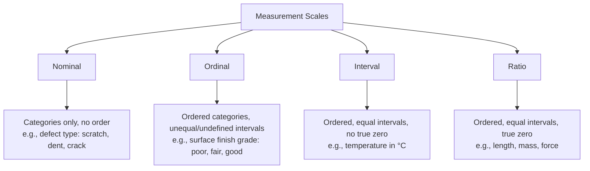

## Data Types and Measurement Scales

### Overview

In precision metrology and quality control, every measured or recorded value belongs to a **data type** and a **measurement scale**. Correct classification determines which statistical tools, control charts, and analysis methods are valid. Misclassifying data (e.g., treating ordinal data as interval data) leads to invalid statistical inferences, incorrect control limits, and flawed process capability conclusions.

### Primary Classification: Variable vs. Attribute Data

**Key Points**

- **Variable (continuous) data**: Measured on a continuous scale; can theoretically take any value within a range, limited only by instrument resolution.
  - Examples: shaft diameter (mm), torque (N·m), surface roughness ($R_a$, μm), temperature (°C), mass (g).
  - Supports arithmetic operations: mean, standard deviation, range.
  - Requires fewer samples than attribute data to detect process shifts of equivalent magnitude. [Inference — sample-size advantage depends on the specific shift size and chart type, but is a well-established principle in SPC literature]
- **Attribute (discrete/count) data**: Categorical or count-based; classifies items or counts occurrences.
  - **Binary/Pass-Fail**: conforming vs. nonconforming (go/no-go gauge results).
  - **Count/Defect data**: number of defects per unit (e.g., scratches per panel).
  - Carries less information per sample than variable data — a part is simply "good" or "bad" rather than "how good."

### The Four Levels of Measurement Scale (Stevens' Typology)

#### 1. Nominal Scale

**Key Points**

- Values are labels/categories with no inherent order.
- Only equality/inequality comparisons are valid ($=$, $\neq$).
- Valid statistics: mode, frequency counts, chi-square tests.
- **Invalid operations**: mean, median, ranking.

**Example**

- Defect classification codes on an inspection sheet: `1 = Surface scratch`, `2 = Dimensional deviation`, `3 = Contamination`, `4 = Assembly error`.
- Machine/operator/shift ID used in stratified Pareto analysis.

#### 2. Ordinal Scale

**Key Points**

- Categories have a meaningful rank order, but intervals between ranks are not necessarily equal or quantifiable.
- Valid statistics: median, percentiles, rank-order correlation (Spearman's $\rho$), non-parametric tests.
- **Invalid operations**: mean and standard deviation are technically inappropriate, though frequently misused in practice. [Inference — this is a widely debated point in measurement theory; many practitioners compute means on ordinal Likert-type scales despite the formal objection]

**Example**

- Visual inspection severity rating: `1 = Minor`, `2 = Moderate`, `3 = Severe`, `4 = Critical`.
- Surface finish visual comparator ratings (e.g., N-series roughness grades used qualitatively).
- Hardness comparison scales that rank materials (e.g., Mohs scale) without equal-interval spacing between ranks.

#### 3. Interval Scale

**Key Points**

- Ordered, with equal and meaningful intervals between values.
- No true (non-arbitrary) zero point — zero does not indicate "absence of the quantity."
- Valid statistics: mean, standard deviation, addition/subtraction.
- **Invalid operations**: ratios are not meaningful (30°C is not "twice as hot" as 15°C).

**Example**

- Temperature in Celsius or Fahrenheit (used in thermal expansion compensation for CMM measurements).
- Date/time stamps used in process timelines.
- Calibration offset values expressed as deviation from a reference (can be negative).

#### 4. Ratio Scale

**Key Points**

- Ordered, equal intervals, AND a true, non-arbitrary zero representing complete absence of the quantity.
- All arithmetic operations are valid: mean, standard deviation, ratios, geometric mean, coefficient of variation ($CV$).
- The vast majority of dimensional and physical metrology data falls here.

**Example**

- Length, diameter, thickness (mm) — zero means no length.
- Mass (g), force (N), pressure (Pa), electrical resistance (Ω).
- Cycle time (s) — zero means no elapsed time.
- Coefficient of variation is only meaningful for ratio data:

  $$CV = \frac{s}{\bar{x}} \times 100\%$$

### Discrete vs. Continuous Data (Cross-Cutting Distinction)

**Key Points**

- Orthogonal to the nominal/ordinal/interval/ratio typology — applies within variable data.
- **Discrete**: countable, finite or countably infinite set of values (defect counts, number of nonconforming units in a sample).
- **Continuous**: infinitely divisible within a range, bounded by measurement resolution (dimensional measurements, weight, time).
- Determines control chart family selection (see below).

### Practical Impact: Data Type Determines Statistical Method

| Data Type | Central Tendency | Dispersion | Control Chart | Capability Index |
| --- | --- | --- | --- | --- |
| Ratio/Interval (continuous) | Mean $\bar{x}$ | Std. dev. $s$, Range $R$ | $\bar{X}$-R, $\bar{X}$-S, I-MR | $C_p$, $C_{pk}$, $P_p$, $P_{pk}$ |
| Ordinal | Median | IQR | Rarely charted directly; often converted to attribute pass/fail | Not applicable in classical sense |
| Nominal (binary attribute) | Proportion $p$ | $\sqrt{p(1-p)/n}$ | p-chart, np-chart | Not applicable |
| Nominal (count/defect) | Mean count $c$ or $u$ | $\sqrt{c}$ | c-chart, u-chart | Not applicable |

### Worked Example

A gauge R&R study on a bearing bore diameter (ratio scale, continuous) yields:

- $\bar{x} = 25.003$ mm
- $s = 0.0021$ mm

Because the data is ratio-scaled and continuous, $C_{pk}$ can be legitimately computed:

$$C_{pk} = \min\left(\frac{USL - \bar{x}}{3s}, \frac{\bar{x} - LSL}{3s}\right)$$

If the same inspection instead recorded only "within tolerance / out of tolerance" (nominal, binary), the same physical parts would only support a p-chart and a proportion-nonconforming estimate — a substantial loss of statistical information from the same underlying physical measurement.

### Common Pitfalls

- **Pseudo-numeric ordinal data**: Assigning numbers 1–5 to a visual defect severity scale and computing a mean severity score treats ordinal data as interval data — statistically questionable, though common in industry dashboards. [Inference]
- **Ratio-to-attribute degradation**: Converting a continuous measurement (e.g., exact diameter) into pass/fail loses information and increases the sample size needed to detect the same process shift.
- **Nominal miscoding**: Using numeric defect codes (1, 2, 3...) in software that then computes statistics like "average defect code" — the numbers are labels, not quantities.

### SVG Diagram: Measurement Scale Hierarchy (svg_diagram)

<svg xmlns="http://www.w3.org/2000/svg" viewBox="0 0 760 300" font-family="Arial, sans-serif">
<text x="380" y="24" text-anchor="middle" font-size="16" font-weight="bold">Measurement Scale Hierarchy (svg_diagram)</text>
<rect x="10" y="50" width="170" height="90" rx="6" fill="#e8f0fe" stroke="#4472c4" stroke-width="1.5" />
<text x="95" y="72" text-anchor="middle" font-size="13" font-weight="bold">Nominal</text>
<text x="95" y="92" text-anchor="middle" font-size="10">Labels only</text>
<text x="95" y="107" text-anchor="middle" font-size="10">No order</text>
<text x="95" y="122" text-anchor="middle" font-size="10">e.g., defect type</text>
<rect x="200" y="50" width="170" height="90" rx="6" fill="#e2f0d9" stroke="#548235" stroke-width="1.5" />
<text x="285" y="72" text-anchor="middle" font-size="13" font-weight="bold">Ordinal</text>
<text x="285" y="92" text-anchor="middle" font-size="10">Ordered ranks</text>
<text x="285" y="107" text-anchor="middle" font-size="10">Unequal intervals</text>
<text x="285" y="122" text-anchor="middle" font-size="10">e.g., severity grade</text>
<rect x="390" y="50" width="170" height="90" rx="6" fill="#fff2cc" stroke="#bf8f00" stroke-width="1.5" />
<text x="475" y="72" text-anchor="middle" font-size="13" font-weight="bold">Interval</text>
<text x="475" y="92" text-anchor="middle" font-size="10">Equal intervals</text>
<text x="475" y="107" text-anchor="middle" font-size="10">No true zero</text>
<text x="475" y="122" text-anchor="middle" font-size="10">e.g., temperature °C</text>
<rect x="580" y="50" width="170" height="90" rx="6" fill="#fbe5d6" stroke="#c55a11" stroke-width="1.5" />
<text x="665" y="72" text-anchor="middle" font-size="13" font-weight="bold">Ratio</text>
<text x="665" y="92" text-anchor="middle" font-size="10">Equal intervals</text>
<text x="665" y="107" text-anchor="middle" font-size="10">True zero</text>
<text x="665" y="122" text-anchor="middle" font-size="10">e.g., length, mass</text>
<line x1="180" y1="95" x2="200" y2="95" stroke="#333" stroke-width="1.5" marker-end="url(#arrow)" />
<line x1="370" y1="95" x2="390" y2="95" stroke="#333" stroke-width="1.5" marker-end="url(#arrow)" />
<line x1="560" y1="95" x2="580" y2="95" stroke="#333" stroke-width="1.5" marker-end="url(#arrow)" />
<text x="380" y="175" text-anchor="middle" font-size="11" font-style="italic">Increasing statistical information content →</text>

<rect x="60" y="200" width="640" height="80" rx="6" fill="#f2f2f2" stroke="#888" stroke-width="1" />
<text x="380" y="222" text-anchor="middle" font-size="12" font-weight="bold">Metrology Application Note</text>
<text x="380" y="242" text-anchor="middle" font-size="10">Most dimensional/physical measurements (length, mass, force, time) are RATIO scale</text>
<text x="380" y="258" text-anchor="middle" font-size="10">Attribute pass/fail inspection reduces ratio data to NOMINAL — a deliberate information loss</text>
<text x="380" y="274" text-anchor="middle" font-size="10">for simplified go/no-go gauging</text>
</svg>

**Next Steps**

- Measures of central tendency and dispersion (mean, median, mode, range, variance, standard deviation)
- Frequency distributions and histograms for quality data
- Normal distribution and its role in process capability analysis
- Discrete probability distributions (binomial, Poisson) for attribute data
- Selecting the correct control chart based on data type