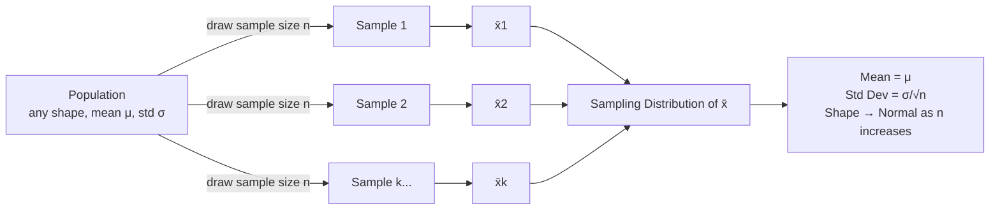

## Sampling Distributions and the Central Limit Theorem

### Overview

A **sampling distribution** is the probability distribution of a statistic (e.g., sample mean $\bar{x}$, sample range $R$, sample proportion $p$) computed from repeated random samples of a fixed size $n$ drawn from a population. The **Central Limit Theorem (CLT)** is the theoretical foundation that justifies most control chart limits, hypothesis tests, and confidence intervals used in quality control, because it describes how the distribution of a sample statistic behaves regardless of the shape of the underlying population.

### Population vs. Sample vs. Sampling Distribution

**Key Points**

- **Population distribution**: The distribution of individual measurements across the entire population (e.g., all bores produced by a process). Can be normal, skewed, bimodal, uniform, etc.
- **Sample distribution**: The distribution of the individual values within one specific sample of size $n$.
- **Sampling distribution**: The distribution of a *statistic* (not individual values) computed across many hypothetical repeated samples of size $n$ from the same population.

### The Central Limit Theorem — Formal Statement

**Key Points**

- For a population with mean $\mu$ and finite standard deviation $\sigma$, the sampling distribution of the sample mean $\bar{x}$ approaches a normal distribution as sample size $n$ increases, **regardless of the shape of the original population distribution**.
- The sampling distribution of $\bar{x}$ has:

$$\mu_{\bar{x}} = \mu$$

$$\sigma_{\bar{x}} = \frac{\sigma}{\sqrt{n}}$$

- The quantity $\sigma_{\bar{x}}$ is called the **standard error of the mean**.
- As $n \to \infty$, the sampling distribution converges to:

$$\bar{x} \sim N\left(\mu, \frac{\sigma^2}{n}\right)$$

**Practical rule of thumb**: In quality engineering practice, $n \geq 30$ is commonly cited as sufficient for the CLT approximation to hold well for most moderately skewed populations; for symmetric or near-normal populations, smaller $n$ (even $n = 4$ or $5$, as used in $\bar{X}$-R charts) often suffices. [Inference — the exact $n$ required depends on the degree of skewness/kurtosis of the parent population; there is no universal threshold]

### Why This Matters for Control Charts

**Key Points**

- $\bar{X}$-R and $\bar{X}$-S control charts plot **subgroup means**, not individual values. The CLT justifies treating these subgroup means as approximately normally distributed even when individual part measurements are not perfectly normal.
- This is why $\bar{X}$ charts are more robust to non-normality of the underlying process than Individual (I-MR) charts, which plot raw individual values and rely on the actual population distribution being approximately normal.
- The standard 3-sigma control limits are derived directly from the sampling distribution's standard error:

$$UCL_{\bar{x}} = \mu + 3\frac{\sigma}{\sqrt{n}}, \quad LCL_{\bar{x}} = \mu - 3\frac{\sigma}{\sqrt{n}}$$

- In practice, $\mu$ and $\sigma$ are unknown and estimated from $\bar{\bar{x}}$ and $\bar{R}$ (or $\bar{s}$) using control chart constants ($A_2$, $A_3$):

$$UCL_{\bar{x}} = \bar{\bar{x}} + A_2\bar{R}, \quad LCL_{\bar{x}} = \bar{\bar{x}} - A_2\bar{R}$$

### Worked Example

A machining process produces shaft diameters with population mean $\mu = 25.000$ mm and population standard deviation $\sigma = 0.012$ mm (individual part variation, possibly non-normal due to tool wear drift).

For subgroups of $n = 5$:

$$\sigma_{\bar{x}} = \frac{0.012}{\sqrt{5}} = 0.00537 \text{ mm}$$

The 3-sigma control limits for the $\bar{X}$ chart:

$$UCL = 25.000 + 3(0.00537) = 25.0161 \text{ mm}$$

$$LCL = 25.000 - 3(0.00537) = 24.9839 \text{ mm}$$

Note the sampling distribution's spread (0.00537 mm) is much tighter than the individual measurement spread (0.012 mm) — this is the "averaging effect" of the CLT: variability of a mean shrinks as $1/\sqrt{n}$.

### Effect of Sample Size on the Sampling Distribution

| Subgroup Size $n$ | $\sigma_{\bar{x}} = \sigma/\sqrt{n}$ | Relative Precision |
| --- | --- | --- |
| 1 | $\sigma$ | Baseline (individuals chart) |
| 4 | $\sigma/2$ | 2× tighter |
| 5 | $\sigma/2.236$ | ~2.24× tighter |
| 9 | $\sigma/3$ | 3× tighter |
| 25 | $\sigma/5$ | 5× tighter |

This table illustrates diminishing returns: quadrupling $n$ only halves the standard error, which is why subgroup sizes of 4–5 are a common economic compromise in SPC rather than very large subgroups.

### Sampling Distributions for Other Statistics

**Key Points**

- **Sample proportion $\hat{p}$** (used in p-charts): approximately normal for large $n$ per the CLT applied to binomial proportions, with

$$\sigma_{\hat{p}} = \sqrt{\frac{p(1-p)}{n}}$$

- **Sample range $R$**: does *not* follow a normal distribution — it follows a distribution related to the range of normal order statistics, which is why R-chart control limits use tabulated constants ($D_3$, $D_4$) rather than a simple $\pm 3\sigma$ normal approximation.
- **Sample variance $s^2$**: follows a scaled chi-square distribution when sampling from a normal population:

$$\frac{(n-1)s^2}{\sigma^2} \sim \chi^2_{n-1}$$

### Visualizing Convergence to Normality

<svg xmlns="http://www.w3.org/2000/svg" viewBox="0 0 780 320" font-family="Arial, sans-serif">
<text x="390" y="22" text-anchor="middle" font-size="15" font-weight="bold">CLT Convergence: Sampling Distribution of x̄ vs. n (svg_diagram)</text>

<g transform="translate(20,50)">
<text x="90" y="0" text-anchor="middle" font-size="11" font-weight="bold">Population (n=1)</text>
<line x1="0" y1="200" x2="200" y2="200" stroke="#333" />
<path d="M0,200 Q20,190 40,140 Q60,80 90,60 Q120,90 150,160 Q170,190 200,200 L200,200 L0,200 Z" fill="#f8cbad" stroke="#c55a11" />
<text x="90" y="220" text-anchor="middle" font-size="10">Skewed, non-normal</text>
</g>

<g transform="translate(280,50)">
<text x="90" y="0" text-anchor="middle" font-size="11" font-weight="bold">Sampling dist. (n=5)</text>
<line x1="0" y1="200" x2="200" y2="200" stroke="#333" />
<path d="M0,200 Q40,195 60,150 Q90,70 100,60 Q110,70 140,150 Q160,195 200,200 Z" fill="#fff2cc" stroke="#bf8f00" />
<text x="90" y="220" text-anchor="middle" font-size="10">Approx. normal, wider</text>
</g>

<g transform="translate(540,50)">
<text x="90" y="0" text-anchor="middle" font-size="11" font-weight="bold">Sampling dist. (n=30)</text>
<line x1="0" y1="200" x2="200" y2="200" stroke="#333" />
<path d="M0,200 Q60,198 80,160 Q95,60 100,58 Q105,60 120,160 Q140,198 200,200 Z" fill="#d9ead3" stroke="#548235" />
<text x="90" y="220" text-anchor="middle" font-size="10">Nearly normal, narrow</text>
</g>
<line x1="230" y1="150" x2="270" y2="150" stroke="#333" stroke-width="1.5" marker-end="url(#arrow2)" />
<line x1="490" y1="150" x2="530" y2="150" stroke="#333" stroke-width="1.5" marker-end="url(#arrow2)" />
<text x="390" y="300" text-anchor="middle" font-size="11" font-style="italic">As n increases: shape → normal, spread narrows by factor 1/√n</text>

</svg>

### Common Pitfalls

- **Confusing $\sigma$ with $\sigma_{\bar{x}}$**: Using the population/individuals standard deviation directly in $\bar{X}$-chart limits instead of dividing by $\sqrt{n}$ produces control limits that are far too wide, masking true process shifts.
- **Assuming small-$n$ normality without justification**: For heavily skewed processes (e.g., particle size distributions, cycle time with long tails), $n = 4$–$5$ may be insufficient for the CLT approximation to hold well, and non-normal or transformed-data control charting methods may be warranted. [Inference]
- **Misapplying CLT to individual values**: The CLT applies to the sampling distribution of the *statistic* (mean), not to individual measurements. I-MR charts still require the underlying individuals distribution to be reasonably normal, since no averaging occurs.

**Next Steps**

- Standard error and confidence intervals for process parameters
- Normal distribution properties and the empirical rule (68-95-99.7)
- Control chart constants ($A_2$, $D_3$, $D_4$, $d_2$) and their derivation
- Hypothesis testing fundamentals for process comparison
- Non-normal data handling and distribution transformations (Box-Cox, Johnson)