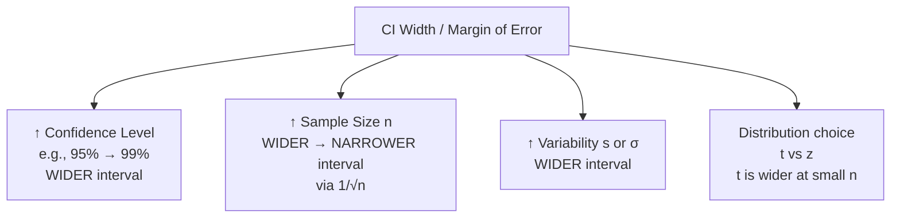

## Confidence Intervals

### Overview

A **confidence interval (CI)** is a range of values, computed from sample data, that is likely to contain an unknown population parameter (such as a true mean, standard deviation, or proportion) with a stated level of confidence. In quality control, confidence intervals quantify the uncertainty inherent in estimating process parameters (mean diameter, defect rate, process standard deviation) from finite sample data, which is essential when making acceptance decisions, comparing processes, or reporting measurement uncertainty.

### Conceptual Foundation

**Key Points**

- A CI is built around a point estimate (e.g., $\bar{x}$) plus/minus a margin of error derived from the sampling distribution of that estimate.
- **Correct interpretation**: If the same sampling and estimation procedure were repeated many times, approximately $C\%$ of the resulting intervals would contain the true population parameter. A CI does **not** mean "there is a $C\%$ probability the true parameter lies in this specific interval" — the parameter is fixed; the interval is the random quantity. [Inference — this is a widely emphasized distinction in classical (frequentist) statistics, though the alternative Bayesian "credible interval" interpretation is sometimes conflated with it in practice]
- General form:

$$\text{Point Estimate} \pm (\text{Critical Value}) \times (\text{Standard Error})$$

### Confidence Interval for the Mean (σ Known)

**Key Points**

- Used when the population standard deviation $\sigma$ is known (rare in practice, but foundational).
- Based on the standard normal ($z$) distribution via the CLT.

$$\bar{x} \pm z_{\alpha/2}\frac{\sigma}{\sqrt{n}}$$

| Confidence Level | $z_{\alpha/2}$ |
| --- | --- |
| 90% | 1.645 |
| 95% | 1.960 |
| 99% | 2.576 |

**Example**

A gauge calibration process has known $\sigma = 0.004$ mm. A sample of $n = 25$ readings gives $\bar{x} = 10.002$ mm. The 95% CI:

$$10.002 \pm 1.960 \times \frac{0.004}{\sqrt{25}} = 10.002 \pm 0.00157$$

$$\Rightarrow (10.0004,\ 10.0036) \text{ mm}$$

### Confidence Interval for the Mean (σ Unknown) — t-Distribution

**Key Points**

- The realistic case in metrology: $\sigma$ is estimated from the sample as $s$, introducing additional uncertainty.
- Uses the **Student's t-distribution** with $n-1$ degrees of freedom, which has heavier tails than the normal distribution, especially at small $n$.

$$\bar{x} \pm t_{\alpha/2,\, n-1}\frac{s}{\sqrt{n}}$$

- As $n \to \infty$, $t_{\alpha/2,n-1} \to z_{\alpha/2}$, and the t-distribution converges to the normal.

**Example**

A CMM operator measures a bore diameter 10 times: $\bar{x} = 25.014$ mm, $s = 0.006$ mm, $n = 10$, so $df = 9$. For 95% confidence, $t_{0.025,9} = 2.262$:

$$25.014 \pm 2.262 \times \frac{0.006}{\sqrt{10}} = 25.014 \pm 0.00429$$

$$\Rightarrow (25.0097,\ 25.0183) \text{ mm}$$

### Confidence Interval for a Proportion (Attribute Data)

**Key Points**

- Applied to defect rates, yield, or pass/fail inspection results.
- Normal (Wald) approximation, valid when $n\hat{p}$ and $n(1-\hat{p})$ are both reasonably large (commonly cited threshold: $\geq 5$, though $\geq 10$ is preferred for closer-to-nominal coverage): [Inference — the exact adequacy threshold is debated in statistical literature; the Wilson score interval is often recommended as more robust at small $n$ or extreme $\hat{p}$]

$$\hat{p} \pm z_{\alpha/2}\sqrt{\frac{\hat{p}(1-\hat{p})}{n}}$$

**Example**

An inspection of 200 units finds 8 nonconforming: $\hat{p} = 0.04$. The 95% CI:

$$0.04 \pm 1.960\sqrt{\frac{0.04(0.96)}{200}} = 0.04 \pm 0.0271$$

$$\Rightarrow (0.0129,\ 0.0671) \text{ or } 1.29\% \text{ to } 6.71\%$$

### Confidence Interval for a Variance/Standard Deviation

**Key Points**

- Important for process capability studies, where uncertainty in $\sigma$ directly propagates into $C_p$/$C_{pk}$ uncertainty.
- Based on the chi-square ($\chi^2$) distribution with $n-1$ degrees of freedom (requires approximate normality of underlying data).

$$\left(\frac{(n-1)s^2}{\chi^2_{\alpha/2,\,n-1}},\ \frac{(n-1)s^2}{\chi^2_{1-\alpha/2,\,n-1}}\right)$$

- Note the asymmetry: the chi-square distribution is not symmetric, so the CI for $\sigma^2$ (and $\sigma$) is not centered on the point estimate — an important distinction from mean-based CIs.

### Factors Affecting Confidence Interval Width

**Key Points**

- **Trade-off**: Higher confidence (e.g., 99% vs. 95%) widens the interval — there is no way to increase confidence and precision simultaneously without increasing sample size.
- **Sample size planning**: To achieve a desired margin of error $E$ for a mean estimate:

$$n = \left(\frac{z_{\alpha/2}\,\sigma}{E}\right)^2$$

This formula is commonly used to determine minimum sample sizes for gauge studies or capability studies before data collection begins.

### Application to Process Capability Reporting

**Key Points**

- Point estimates of $C_{pk}$ computed from limited sample data carry substantial sampling uncertainty; reporting a bare $C_{pk}$ value without a confidence interval can overstate certainty about process performance.
- Approximate CI for $C_{pk}$ (based on standard references such as Bissell's approximation, one of several available approaches):

$$C_{pk} \pm z_{\alpha/2}\sqrt{\frac{1}{9n} + \frac{C_{pk}^2}{2(n-1)}}$$

[Unverified — multiple competing approximation formulas exist in the metrology/SPC literature for $C_{pk}$ confidence intervals (e.g., Bissell, Chou-Owen-Borrego); the specific formula and its accuracy assumptions should be confirmed against the standard being followed, such as AIAG or ISO 22514]

### Common Pitfalls

- **Using $z$ instead of $t$ for small samples**: When $n$ is small (e.g., $n < 30$) and $\sigma$ is estimated rather than known, using $z_{\alpha/2}$ instead of $t_{\alpha/2,n-1}$ understates the true interval width, giving false confidence.
- **Misinterpreting the confidence level**: Treating a 95% CI as "95% of the data falls in this range" — that describes a tolerance interval or reference range, not a confidence interval on a parameter.
- **Ignoring non-normality**: CIs for $\bar{x}$ rely on the CLT for validity; CIs for $\sigma$ (chi-square based) are more sensitive to departures from normality in the underlying data. [Inference]
- **Confusing confidence intervals with tolerance intervals**: A CI bounds a *parameter* (e.g., the mean); a tolerance interval bounds a *proportion of individual values* in the population — these serve different purposes and are frequently conflated in practice.

### Confidence Interval vs. Related Interval Types

| Interval Type | What It Bounds | Typical QC Use |
| --- | --- | --- |
| Confidence Interval | A population parameter (μ, σ, p) | Estimating true process mean/defect rate |
| Prediction Interval | A single future observation | Predicting the next measured value |
| Tolerance Interval | A specified proportion of the population | Specifying where X% of parts will fall |
| Control Limits (SPC) | Expected range of subgroup statistic under stability | Detecting special-cause variation |

**Next Steps**

- Hypothesis testing (one-sample, two-sample, paired t-tests) for process comparison
- Tolerance intervals and their role in specification verification
- Process capability indices ($C_p$, $C_{pk}$, $P_p$, $P_{pk}$) and their uncertainty
- Measurement system analysis (Gauge R&R) and uncertainty budgets
- Sample size determination for acceptance sampling plans