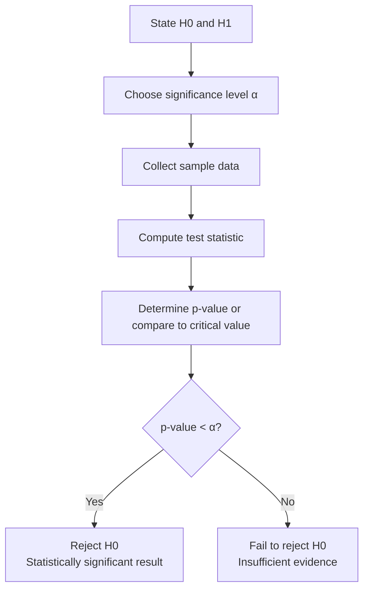

## Hypothesis Testing Basics

### Overview

**Hypothesis testing** is a formal statistical procedure for deciding whether sample evidence is strong enough to reject a default assumption about a population parameter or process. In precision metrology and quality control, hypothesis testing underlies process comparison (before/after a process change), supplier qualification, calibration verification, and acceptance decisions — replacing subjective judgment with a quantified, repeatable decision framework.

### Core Framework

**Key Points**

- **Null hypothesis ($H_0$)**: The default, "no effect" or "no difference" statement (e.g., "the new fixture does not change mean bore diameter").
- **Alternative hypothesis ($H_1$ or $H_a$)**: The statement being tested for, representing a real effect or difference.
- The test never "proves" $H_0$ true — it either **rejects $H_0$** (evidence supports $H_1$) or **fails to reject $H_0$** (insufficient evidence, not proof of no effect).

### Types of Errors

**Key Points**

- **Type I Error (α)**: Rejecting $H_0$ when it is actually true — a "false alarm" (e.g., concluding a process shifted when it did not). Probability = significance level $\alpha$, commonly set at 0.05.
- **Type II Error (β)**: Failing to reject $H_0$ when it is actually false — a "missed detection" (e.g., failing to detect a real process shift). Probability = $\beta$.
- **Power** ($1-\beta$): The probability of correctly detecting a true effect. Power increases with larger sample size, larger true effect size, and higher $\alpha$.

|  | $H_0$ True | $H_0$ False |
| --- | --- | --- |
| **Reject $H_0$** | Type I Error (α) | Correct decision (Power, $1-\beta$) |
| **Fail to reject $H_0$** | Correct decision ($1-\alpha$) | Type II Error (β) |

**Example**

In gauge acceptance testing, a Type I error means rejecting a good gauge as out-of-tolerance (unnecessary recalibration cost); a Type II error means accepting a bad gauge as in-tolerance (risk of shipping nonconforming parts). The consequences of each error type are often asymmetric in cost, which is why $\alpha$ and required power are sometimes set asymmetrically depending on the application. [Inference — the specific balance depends on the organization's risk tolerance and cost structure, not a universal statistical rule]

### Significance Level (α) and p-Value

**Key Points**

- **α (alpha)**: The threshold probability of Type I error the analyst is willing to accept, chosen *before* the test (common values: 0.05, 0.01, 0.10).
- **p-value**: The probability of observing a test statistic as extreme as, or more extreme than, the one obtained, *assuming $H_0$ is true*. It is not the probability that $H_0$ is true. [Inference — this is a standard and frequently misunderstood distinction in classical statistics]
- **Decision rule**: If $p\text{-value} < \alpha$, reject $H_0$.

### One-Tailed vs. Two-Tailed Tests

**Key Points**

- **Two-tailed test**: $H_1$ states the parameter differs from the hypothesized value in *either* direction (e.g., $H_1: \mu \neq \mu_0$). Used when a deviation in either direction matters.
- **One-tailed test**: $H_1$ states the parameter differs in a *specific* direction (e.g., $H_1: \mu > \mu_0$ or $H_1: \mu < \mu_0$). Used when only one direction of deviation is of practical concern (e.g., testing whether mean strength has *decreased*).
- Choosing the tail direction must be justified by the engineering question *before* seeing the data — choosing it after seeing results to force significance is a form of statistical malpractice sometimes called "p-hacking."

### Common Hypothesis Tests in Quality Control

#### 1. One-Sample t-Test (Mean vs. Target)

**Key Points**

- Tests whether a process mean differs from a specified target/nominal value.
- Test statistic:

$$t = \frac{\bar{x} - \mu_0}{s/\sqrt{n}}, \quad df = n-1$$

**Example**

A target bore diameter is 25.000 mm. A sample of $n = 12$ parts gives $\bar{x} = 25.008$ mm, $s = 0.010$ mm.

$$t = \frac{25.008 - 25.000}{0.010/\sqrt{12}} = \frac{0.008}{0.00289} = 2.77$$

With $df = 11$ and $\alpha = 0.05$ (two-tailed), the critical value $t_{0.025,11} \approx 2.201$. Since $2.77 > 2.201$, reject $H_0$: the process mean is statistically significantly different from the 25.000 mm target.

#### 2. Two-Sample t-Test (Comparing Two Process Means)

**Key Points**

- Tests whether two independent processes/machines/operators produce different mean values.
- Requires checking the equal-variance assumption (e.g., via F-test or Levene's test) to select pooled vs. Welch's (unequal-variance) t-test formula.

**Example**

Comparing mean torque output from Machine A ($\bar{x}_A = 45.2$ N·m, $n_A=20$) vs. Machine B ($\bar{x}_B = 44.6$ N·m, $n_B=20$) to determine if the machines produce statistically different torque — informing whether both can be used interchangeably in production.

#### 3. Paired t-Test

**Key Points**

- Used when measurements are naturally paired (e.g., same part measured before/after a process step, or by two different gauges on the same units).
- Reduces variability by analyzing the differences $d_i = x_{i,1} - x_{i,2}$ directly, increasing statistical power compared to treating the two sets as independent.

**Example**

Measuring the same 15 parts on an old CMM and a new CMM to test whether the new equipment introduces a systematic bias — a paired test is appropriate because each part serves as its own control.

#### 4. F-Test / Test for Equality of Variances

**Key Points**

- Tests whether two processes have statistically different variability (not just different means) — critical in metrology, since a process can be "on-target" but still unacceptable due to excessive variation.
- Test statistic: $F = s_1^2/s_2^2$, compared against the F-distribution.
- Sensitive to non-normality; Levene's test is a more robust alternative under departures from normality. [Inference — robustness comparisons depend on the specific type and degree of non-normality]

#### 5. Chi-Square Test (Attribute/Categorical Data)

**Key Points**

- Tests whether observed defect-category frequencies differ from expected frequencies (goodness-of-fit), or whether two categorical variables are independent (test of independence).
- Common QC use: testing whether defect type distribution differs significantly across shifts, machines, or suppliers.

$$\chi^2 = \sum \frac{(O_i - E_i)^2}{E_i}$$

#### 6. Test for a Proportion

**Key Points**

- Tests whether an observed defect rate/yield differs from a target or specification value.
- Uses the normal approximation to the binomial (for adequately large $n$) or exact binomial methods for small $n$.

### Relationship Between Hypothesis Tests and Confidence Intervals

**Key Points**

- A two-tailed hypothesis test at significance level $\alpha$ and a $(1-\alpha)\times100\%$ confidence interval are mathematically equivalent decision tools: if the hypothesized value $\mu_0$ falls **outside** the CI, the corresponding test rejects $H_0$ at that $\alpha$.
- CIs provide additional information (magnitude and direction of the effect) that a simple reject/fail-to-reject decision does not.

### Statistical Significance vs. Practical Significance

**Key Points**

- With very large sample sizes, even a trivially small, practically meaningless difference can become statistically significant (very small p-value).
- Conversely, with small sample sizes, a practically important difference may fail to reach statistical significance due to low power.
- Engineering judgment must always accompany the statistical result: a "statistically significant" 0.0001 mm shift may have zero practical impact on part function, while a "non-significant" result from an underpowered study does not confirm equivalence.

### Common Pitfalls

- **Confusing "fail to reject $H_0$" with "$H_0$ is proven true"**: Absence of evidence is not evidence of absence, especially with small or underpowered samples.
- **Ignoring assumptions**: t-tests assume approximate normality of the underlying data (or large enough $n$ for the CLT to apply) and, for two-sample tests, appropriate variance assumptions; violating these can invalidate the stated $\alpha$.
- **Multiple comparisons without correction**: Running many hypothesis tests (e.g., testing every dimension on a part) without adjusting $\alpha$ (e.g., Bonferroni correction) inflates the overall Type I error rate across the family of tests.
- **Underpowered studies**: Conducting a test with too few samples to have reasonable power to detect a practically meaningful effect, then treating "fail to reject" as confirmation of no difference.

### Decision Framework Summary

| Question | Appropriate Test |
| --- | --- |
| Does process mean differ from a target? | One-sample t-test |
| Do two process means differ? | Two-sample t-test |
| Does a before/after change affect the same units? | Paired t-test |
| Do two processes differ in variability? | F-test / Levene's test |
| Does an observed defect rate differ from a target? | One-proportion z-test |
| Are defect categories independent of a factor (shift, machine)? | Chi-square test |

**Next Steps**

- Analysis of Variance (ANOVA) for comparing three or more process means
- Non-parametric tests (Mann-Whitney U, Kruskal-Wallis) for non-normal data
- Design of Experiments (DOE) for identifying significant process factors
- Statistical power analysis and sample size determination
- Gauge R&R and measurement system analysis using ANOVA methods