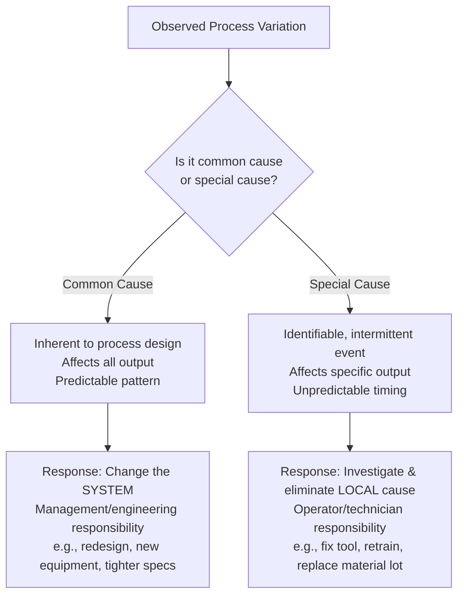
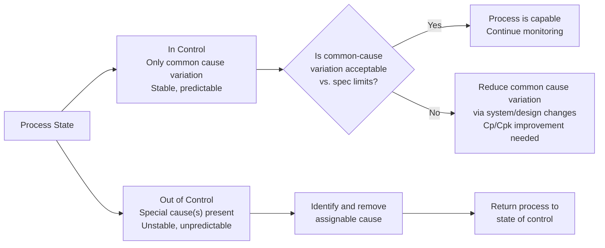

## Common Cause and Special Cause Variation

### Overview

The distinction between **common cause** and **special cause** variation, formalized by Walter Shewhart and popularized by W. Edwards Deming, is the foundational concept underlying all of Statistical Process Control (SPC). Correctly classifying the source of variation determines whether a process problem should be addressed through **local corrective action** (adjusting the immediate cause) or **systemic process redesign** (changing the process itself) — misapplying either response to the wrong variation type wastes resources and can actively increase process variability.

### Definitions

**Key Points**

- **Common cause variation** (also called *chance cause* or *random variation*): Variation that is inherent to the process itself, arising from the cumulative effect of many small, unidentifiable, and unavoidable sources (machine vibration, minor material inconsistency, ambient temperature fluctuation, operator micro-variability).
  - Present at all times, affects all output.
  - Predictable within statistical limits — a process exhibiting only common cause variation is said to be in a **state of statistical control**.
  - Cannot be eliminated by tampering with individual outputs; requires fundamental process/system-level changes to reduce.
- **Special cause variation** (also called *assignable cause*): Variation arising from specific, identifiable events or conditions external to the normal, stable operation of the process (tool breakage, wrong material batch, untrained operator, gauge miscalibration, power surge).
  - Intermittent, unpredictable in timing and magnitude.
  - Signals that something has changed — the process is **out of statistical control**.
  - Should be investigated and eliminated (or, if beneficial, incorporated permanently) at the local/operational level.

### The Control Chart as the Detection Tool

**Key Points**

- Control charts distinguish the two variation types statistically by comparing plotted points against calculated control limits (typically $\pm 3\sigma$ from the centerline), derived from the process's own common-cause variation.
- **In control** (points randomly distributed within limits, no patterns): only common cause variation present.
- **Out of control** (points beyond limits, or non-random patterns within limits): special cause variation present.

$$UCL = \bar{\bar{x}} + 3\sigma_{\bar{x}}, \quad LCL = \bar{\bar{x}} - 3\sigma_{\bar{x}}$$

- The $\pm 3\sigma$ limits are chosen because, for an in-control (common-cause-only) process, they yield a low, well-understood false-alarm rate (~0.27% of points falling outside limits due to chance alone under normality) — a practical trade-off between sensitivity and false alarms established by Shewhart.

### Western Electric Rules (Pattern-Based Special Cause Detection)

**Key Points**

Beyond a single point exceeding $\pm 3\sigma$, several structured pattern rules flag special causes even when no single point is outside the control limits:

| Rule | Pattern | Typical Interpretation |
| --- | --- | --- |
| 1 | 1 point beyond $3\sigma$ | Sudden shift or outlier |
| 2 | 2 of 3 consecutive points beyond $2\sigma$ (same side) | Process shift |
| 3 | 4 of 5 consecutive points beyond $1\sigma$ (same side) | Small sustained shift |
| 4 | 8 consecutive points on same side of centerline | Sustained shift in mean |
| 5 | 6 consecutive points steadily increasing/decreasing | Trend (e.g., tool wear) |
| 6 | 14 consecutive points alternating up/down | Systematic/overcontrol pattern |
| 7 | 15 consecutive points within $1\sigma$ (either side) | Stratification / reduced variability (investigate cause) |

**Example**

A steadily increasing trend across 6+ consecutive subgroup means on an $\bar{X}$ chart for a turned shaft diameter is a classic signature of gradual **tool wear** — a special cause requiring tool replacement, not a system redesign.

### The Two Fundamental "Mistakes" (Deming's Framework)

**Key Points**

- **Mistake 1 (Overcontrol/Tampering)**: Treating common cause variation as if it were special cause — adjusting the process in reaction to every individual data point's deviation from target. This *increases* overall variation, a phenomenon demonstrated by Deming's "funnel experiment."
- **Mistake 2 (Undercontrol)**: Treating special cause variation as if it were common cause — ignoring a genuine process shift or assignable event and attributing it to "normal" random noise, allowing the root cause to persist and continue producing nonconforming output.

**Example**

An operator who resets machine offset after every single part measurement (reacting to normal common-cause scatter around target) is committing Mistake 1 — this is process tampering and will increase part-to-part variation compared to leaving the process alone. [Inference — this outcome is a well-established result of Deming's funnel experiment under the standard assumptions of that model, but the specific magnitude of variance increase depends on the adjustment rule used]

### Statistical Process Control States

### Capability vs. Control — A Critical Distinction

**Key Points**

- A process being **in control** (only common cause variation) does **not** guarantee it is **capable** (meeting specification limits) — control describes statistical stability, not conformance to tolerance.
- Process capability analysis ($C_p$, $C_{pk}$) should only be performed on a process that is first demonstrated to be in statistical control; computing capability indices on an out-of-control process yields misleading, unstable estimates. [Inference — this is standard SPC practice, though the specific degree of distortion depends on the nature and magnitude of the special cause present]

### Responsibility Allocation (Deming's 85/15 Rule — Illustrative)

**Key Points**

- Deming and others estimated that the substantial majority of process problems originate from common cause (system-level) variation, which only management/engineering has the authority to address, while a minority arise from special causes addressable at the operator/technician level. [Speculation — the specific ratio (often cited historically as roughly 85%/15% or 94%/6%) varies across sources and industries and should not be treated as a precise universal figure]
- Practical implication: blaming operators for variation that is actually common-cause (system-driven) is both statistically incorrect and organizationally counterproductive.

### Worked Example: Identifying Variation Type

A CNC-machined part's diameter is monitored via $\bar{X}$-R chart with subgroup size $n=5$, sampled hourly.

- **Scenario A**: All 24 hourly subgroup means scatter randomly within $\pm 3\sigma$ limits with no trends or runs → common cause only; process is stable. If diameters are drifting outside spec, the fix requires reducing inherent process variation (e.g., better fixturing, tighter incoming material tolerance) — a system-level change.
- **Scenario B**: Subgroup mean at hour 14 jumps to $+4\sigma$, coinciding with a documented tool change → special cause; investigate the new tool/insert, and if defective, replace it and exclude the affected subgroup from control limit recalculation once resolved.

### Common Pitfalls

- **Tampering**: Adjusting a stable, in-control process in response to normal common-cause fluctuation, which increases variation rather than reducing it.
- **Ignoring signals**: Dismissing an out-of-control signal (e.g., a point beyond $3\sigma$) as "just noise" without investigation, allowing a genuine special cause to persist.
- **Conflating control with capability**: Assuming an in-control process automatically meets customer specifications — control limits are derived from the process's own variation, not from specification limits, and the two should never be plotted as if equivalent.
- **Recalculating control limits too frequently**: Including data affected by a known, corrected special cause when recalculating limits can artificially widen limits, masking future genuine special causes.

**Next Steps**

- Control chart selection ($\bar{X}$-R, $\bar{X}$-S, I-MR, p, np, c, u charts)
- Western Electric and Nelson rules for pattern-based signal detection
- Process capability analysis ($C_p$, $C_{pk}$, $P_p$, $P_{pk}$)
- Corrective action and root cause analysis methodologies (5 Whys, fishbone diagram)
- Control chart limit calculation and recalculation practices