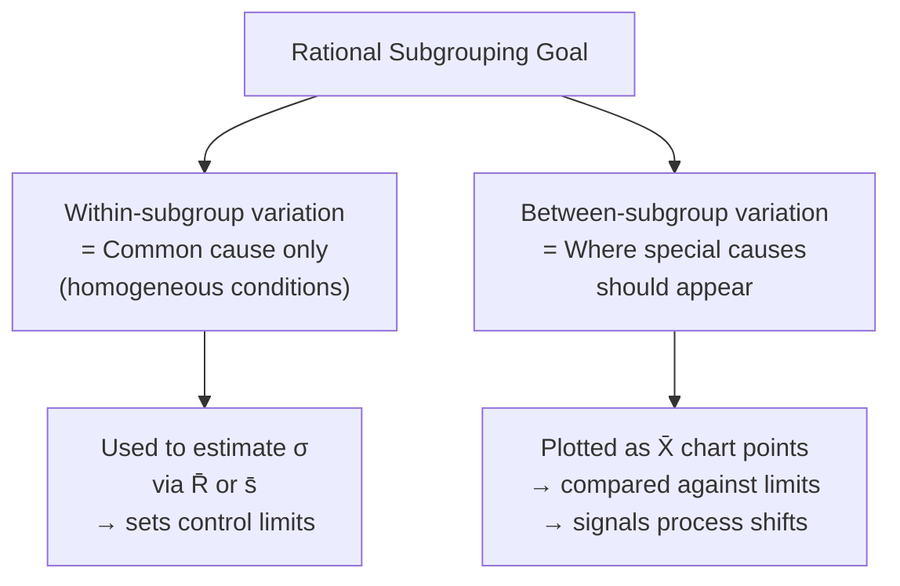
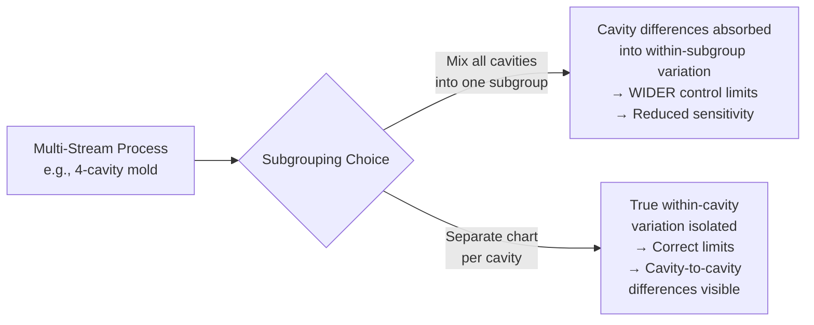

## Rational Subgrouping

### Overview

**Rational subgrouping** is the strategic method of organizing sample data into subgroups for control charting such that variation *within* each subgroup captures only common cause variation, while variation *between* subgroups is where special causes are most likely to be detected. The concept, introduced by Walter Shewhart, is arguably the single most consequential design decision in setting up an SPC system — a poorly designed subgrouping scheme can render a control chart statistically valid in form but practically useless for detecting real process problems.

### The Core Principle

**Key Points**

- Subgroups should be formed so that the conditions **within** a subgroup are as homogeneous as possible (produced under essentially the same conditions: same machine, operator, material lot, short time window).
- Subgroups should be formed so that opportunities for **process change** occur primarily **between** subgroups, not within them.
- This design choice determines what the control chart is actually capable of detecting: within-subgroup variation becomes the *baseline* (used to estimate $\sigma$ and set control limits via $\bar{R}$ or $\bar{s}$), and between-subgroup variation is what gets flagged as a potential special cause on the $\bar{X}$ chart.

### Time-Order Subgrouping (Classic Approach)

**Key Points**

- The most common method: subgroups consist of consecutive units produced close together in time (e.g., 5 consecutive parts off a single machine every hour).
- Rationale: consecutive parts are most likely to share the same immediate process conditions (tool state, temperature, material batch), so within-subgroup variation isolates the process's inherent short-term variability.
- Between subgroups (across the hour-to-hour gap), conditions may drift (tool wear, temperature change, shift change) — precisely what the $\bar{X}$ chart is designed to detect.

**Example**

A CNC lathe producing shaft diameters is sampled by pulling 5 **consecutive** parts every hour, rather than 5 parts scattered randomly throughout the hour. This ensures the within-subgroup range reflects only the momentary machine/process noise, not any drift that occurred during the hour.

### Subgrouping by Source/Stream (Stratification Awareness)

**Key Points**

- When a process has multiple parallel sources of variation (multiple spindles, multiple cavities in a mold, multiple operators, multiple shifts), how subgroups are formed relative to these sources dramatically changes what the chart can detect.
- **Poor practice**: Mixing output from multiple parallel streams (e.g., 4-cavity mold) into a single subgroup. If cavity-to-cavity differences exist, they get absorbed into the *within-subgroup* variation, artificially inflating the estimated common-cause variation and **widening control limits** — this can mask real differences between cavities and reduce the chart's sensitivity to genuine special causes affecting the average.
- **Better practice**: Chart each stream (cavity, spindle, operator) separately, or use a subgrouping scheme specifically designed to isolate stream-to-stream variation (e.g., one part from each cavity per subgroup, analyzed with stream identification retained).

### Common Rational Subgrouping Strategies

| Strategy | Description | Best Detects |
| --- | --- | --- |
| **Consecutive units in time** | 3–5 sequential parts sampled at fixed intervals | Time-based drift, wear, shift changes |
| **Instant-in-time (snapshot)** | All units produced at essentially the same moment, across parallel streams | Between-stream differences, if streams are the concern |
| **One-per-source per subgroup** | One part from each machine/operator/cavity forms a subgroup | Systematic differences between sources (though this can be a form of stratification requiring careful interpretation) |
| **Random sampling across a period** | Parts randomly selected across the full production run in the sampling interval | *Not generally recommended* as primary rational subgrouping; tends to absorb real drift into within-subgroup variation |

### Consequences of Poor Subgrouping

**Key Points**

- **Understated control limits (too narrow)**: If subgroups are formed in a way that includes real special-cause variation *within* the subgroup calculation (e.g., very large time gaps within a subgroup), the estimated $\sigma$ is inflated, making the chart insensitive — it will fail to signal genuine shifts (increased Type II error / missed detections).
- **Overstated control limits (too wide)**: Occurs from the multi-stream stratification problem described above — mixing heterogeneous sources within a subgroup inflates $\bar{R}$/$\bar{s}$, widening limits and masking real between-subgroup shifts.
- **False signals from stratification**: If subgroups are systematically composed of alternating high/low sources (e.g., alternating from two machines with genuinely different means), this can either mask the true difference (if mixed within subgroup) or, in some configurations, produce misleading patterns such as excessive points hugging the centerline (an unusually low-variation-looking pattern), which is itself a Western Electric rule violation signaling investigation is warranted.

### Subgroup Size Considerations

**Key Points**

- Subgroup size ($n$) interacts with subgrouping strategy: even a well-chosen subgrouping scheme performs poorly if $n$ is too small to reliably estimate within-subgroup variation, or too large to remain economically practical.
- Common industry practice uses $n = 4$ or $n = 5$ for $\bar{X}$-R charts — a compromise between statistical power (via the CLT, see prior sampling distribution topic) and sampling cost/practicality. [Inference — the specific optimal size depends on the process's shift-detection requirements and sampling economics; $n=5$ is a convention rather than a universally derived optimum]
- Larger subgroups increase power to detect small shifts (narrower $\sigma_{\bar{x}} = \sigma/\sqrt{n}$) but increase sampling cost and the risk of including real process drift *within* the subgroup if the sampling window is stretched to accommodate the larger $n$.

### Worked Example: Subgrouping Decision

A quality engineer is setting up SPC for an injection molding process with 8 cavities producing the same part, running continuously.

- **Option A (mix cavities)**: Pull 8 parts (one from each cavity) every 30 minutes as one subgroup. If cavity-to-cavity variation is significant (common in multi-cavity molds due to differential cooling/fill), this variation is folded into the within-subgroup range, inflating $\bar{R}$ and widening $\bar{X}$-R chart limits — masking a true shift in overall process mean.
- **Option B (separate cavity charts)**: Chart cavities individually, or use a Group Chart / Multi-Vari approach designed explicitly to track between-cavity variation alongside within-cavity variation.
- **Option C (rational for overall average)**: If the actual quality characteristic of interest is the *combined* output regardless of cavity (e.g., parts are pooled downstream and cavity identity is lost), and cavity-to-cavity variation is a known, accepted, and monitored source of common-cause variation, mixing may be intentional and appropriate — the rational subgrouping principle depends on **what question the chart is meant to answer**, not a single universally "correct" scheme.

This illustrates that rational subgrouping is not a mechanical rule but requires engineering judgment about the process's actual sources of variation and what specifically the control chart is intended to detect.

### Common Pitfalls

- **Applying a "textbook" subgroup size/scheme without process knowledge**: Using $n=5$ consecutive parts by default without first understanding whether the process has multiple streams, shifts, or known cyclic sources of variation.
- **Sampling convenience over rationality**: Choosing subgroup composition based on ease of data collection (e.g., grabbing whatever 5 parts are on the inspection table) rather than deliberate consideration of what variation sources fall within vs. between subgroups.
- **Ignoring known process structure**: Failing to account for multiple machines, operators, molds, or shifts when they are known to exist and contribute meaningfully to variation.
- **Changing subgrouping mid-study without re-baselining**: Altering the subgrouping scheme without recalculating control limits from data collected under the new scheme, leading to internally inconsistent chart interpretation.

**Next Steps**

- Control chart types and selection ($\bar{X}$-R vs. $\bar{X}$-S vs. I-MR)
- Control limit calculation and control chart constants ($d_2$, $A_2$, $D_3$, $D_4$)
- Multi-vari studies for isolating variation sources (positional, cyclical, temporal)
- Western Electric and Nelson rules for out-of-control pattern detection
- Process capability analysis following establishment of statistical control