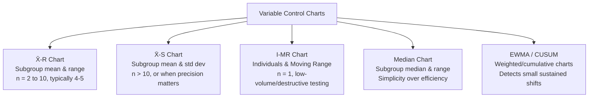
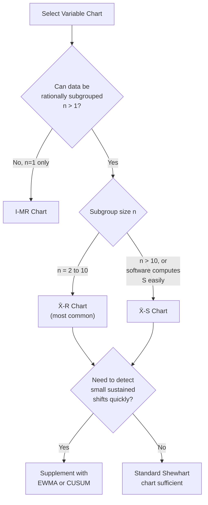

## Variable Control Charts

### Overview

**Variable control charts** monitor continuous (variable) process data — measurements such as length, diameter, weight, or torque — to detect shifts in process location (mean) and/or spread (variability) over time. They form the primary SPC toolset for dimensional and physical metrology, offering greater statistical sensitivity per sample than attribute charts because they retain the full information content of each measurement rather than reducing it to a pass/fail classification.

### Family of Variable Control Charts

### X̄-R Chart (Mean and Range)

**Key Points**

- The most widely used variable chart; pairs a chart of subgroup means ($\bar{X}$) with a chart of subgroup ranges ($R$).
- Appropriate for subgroup sizes $n = 2$ to $10$, with $n = 4$–$5$ most common in practice.
- The $R$ chart must be evaluated for control **first** — control limits on the $\bar{X}$ chart are only valid if the process variability (as shown by R) is itself stable, since $\bar{X}$ limits are derived from $\bar{R}$.

**Formulas**

For each subgroup: $\bar{x} = \frac{\sum x_i}{n}$, $R = x_{max} - x_{min}$

Overall: $\bar{\bar{x}} = \frac{\sum \bar{x}}{k}$, $\bar{R} = \frac{\sum R}{k}$ (where $k$ = number of subgroups)

$$\bar{X} \text{ chart: } UCL = \bar{\bar{x}} + A_2\bar{R}, \quad CL = \bar{\bar{x}}, \quad LCL = \bar{\bar{x}} - A_2\bar{R}$$

$$R \text{ chart: } UCL = D_4\bar{R}, \quad CL = \bar{R}, \quad LCL = D_3\bar{R}$$

| $n$ | $A_2$ | $D_3$ | $D_4$ | $d_2$ |
| --- | --- | --- | --- | --- |
| 2 | 1.880 | 0 | 3.267 | 1.128 |
| 3 | 1.023 | 0 | 2.574 | 1.693 |
| 4 | 0.729 | 0 | 2.282 | 2.059 |
| 5 | 0.577 | 0 | 2.114 | 2.326 |
| 6 | 0.483 | 0 | 2.004 | 2.534 |

**Example**

A machining process samples $n=5$ consecutive shaft diameters hourly across $k=20$ subgroups: $\bar{\bar{x}} = 25.002$ mm, $\bar{R} = 0.018$ mm.

$$\bar{X} \text{ limits: } 25.002 \pm 0.577(0.018) = 25.002 \pm 0.0104 \Rightarrow (24.9916,\ 25.0124)$$

$$R \text{ limits: } UCL = 2.114(0.018) = 0.0381,\quad LCL = 0(0.018) = 0$$

### X̄-S Chart (Mean and Standard Deviation)

**Key Points**

- Uses subgroup standard deviation $s$ instead of range $R$ as the measure of dispersion.
- **Preferred over $\bar{X}$-R when**: subgroup size is larger ($n > 10$), since range becomes an increasingly inefficient (high-variance) estimator of spread as $n$ grows; or when higher statistical efficiency is required and computational tools make $s$ calculation trivial (standard in modern SPC software).
- $s$ uses information from every point in the subgroup, whereas $R$ uses only the two extreme values — $s$ is therefore a more statistically efficient estimator of dispersion at larger $n$. [Inference — the crossover point at which $S$ becomes meaningfully preferable to $R$ is a matter of statistical efficiency trade-off cited across SPC references, commonly around $n>10$, though modern computing has reduced the historical practical justification for $R$'s simplicity advantage]

$$UCL_S = B_4\bar{s}, \quad CL = \bar{s}, \quad LCL_S = B_3\bar{s}$$

$$UCL_{\bar{X}} = \bar{\bar{x}} + A_3\bar{s}, \quad LCL_{\bar{X}} = \bar{\bar{x}} - A_3\bar{s}$$

(Constants $A_3$, $B_3$, $B_4$ are tabulated separately from $A_2$, $D_3$, $D_4$ and depend on $n$.)

### I-MR Chart (Individuals and Moving Range)

**Key Points**

- Used when subgroup size is naturally $n = 1$: destructive testing, low-volume/one-piece-flow production, expensive or slow measurements (e.g., chemical batch analysis, one part per hour), or when consecutive units are not meaningfully groupable.
- **Individuals (I) chart**: plots each raw measurement directly.
- **Moving Range (MR) chart**: plots the absolute difference between consecutive individual values, $MR_i = |x_i - x_{i-1}|$, as a substitute measure of short-term variability since no subgroup range exists.
- More sensitive to non-normality of the underlying individual measurements than $\bar{X}$ charts, because no averaging/CLT effect smooths the distribution (see prior sampling distributions topic).

$$UCL_I = \bar{x} + 2.66\,\overline{MR}, \quad LCL_I = \bar{x} - 2.66\,\overline{MR}$$

$$UCL_{MR} = 3.267\,\overline{MR}, \quad LCL_{MR} = 0$$

(The constant 2.66 corresponds to $3/d_2$ for $n=2$, since moving range is computed from consecutive pairs.)

**Example**

A furnace brazing process measures joint strength destructively on one sample per production lot (only one measurement possible per lot). An I-MR chart is the only appropriate variable chart choice, since no natural subgroup exists.

### Chart Selection Decision Logic

### EWMA and CUSUM (Sensitivity-Enhanced Charts)

**Key Points**

- **EWMA (Exponentially Weighted Moving Average)**: weights recent observations more heavily than older ones using a smoothing constant $\lambda$ (typically $0.1$–$0.3$), making it more sensitive to small, sustained shifts (e.g., $<1.5\sigma$) than standard Shewhart charts.

$$z_i = \lambda x_i + (1-\lambda)z_{i-1}$$

- **CUSUM (Cumulative Sum)**: accumulates deviations from target over time, designed specifically to detect small persistent shifts faster than Shewhart charts, which are optimized for detecting larger, sudden shifts.
- Trade-off: both EWMA and CUSUM are slower to react to very large sudden shifts compared to a standard Shewhart chart, and require more complex setup (choice of $\lambda$, or reference value $k$ and decision interval $h$ for CUSUM). [Inference — the specific sensitivity trade-off curve depends on the chosen tuning parameters]

### Interpreting Variable Control Charts

**Key Points**

- Always evaluate the **dispersion chart (R or S) before the location chart ($\bar{X}$ or I)** — if dispersion is out of control, the location chart's control limits (which depend on $\bar{R}$ or $\bar{s}$) are not valid.
- Apply Western Electric/Nelson rules (see prior topic) to both charts, not just the mean chart — an out-of-control range/S chart indicates increased or decreased process *variability*, a distinct problem from a shifted *mean*.
- A process can show a stable $\bar{X}$ chart while its $R$/$S$ chart signals increasing variability — a warning sign often preceding a mean shift or indicating a degrading component (e.g., worn bearing increasing part-to-part scatter before the average shifts).

### Comparison Summary

| Chart Type | Subgroup Size | Dispersion Statistic | Best Use Case |
| --- | --- | --- | --- |
| $\bar{X}$-R | 2–10 (typ. 4–5) | Range $R$ | General-purpose SPC, manual calculation feasible |
| $\bar{X}$-S | >10, or software-assisted | Std. dev. $s$ | Larger subgroups, higher statistical efficiency needed |
| I-MR | 1 | Moving range $MR$ | Destructive testing, low volume, batch processes |
| EWMA/CUSUM | Variable | Weighted/cumulative statistic | Detecting small sustained shifts quickly |

### Common Pitfalls

- **Using $\bar{X}$-R with $n=1$ data**: Attempting subgroup range calculations when only one measurement per time period is available — I-MR is the correct choice, not a forced $\bar{X}$-R with artificial subgrouping.
- **Ignoring the dispersion chart**: Focusing solely on the mean chart while an out-of-control range/S chart goes unaddressed, missing early signals of process degradation.
- **Applying Shewhart charts when small shifts matter most**: Standard $\bar{X}$-R/S and I-MR charts are relatively insensitive to small sustained shifts (under ~1.5σ); relying on them alone in such applications delays detection compared to EWMA/CUSUM. [Inference]
- **Recalculating limits from out-of-control data**: Including subgroups affected by known special causes when computing baseline $\bar{\bar{x}}$ and $\bar{R}$/$\bar{s}$ inflates control limits and reduces future chart sensitivity.

**Next Steps**

- Attribute control charts (p, np, c, u charts) for pass/fail and count data
- Western Electric and Nelson rules for out-of-control pattern detection
- Process capability analysis ($C_p$, $C_{pk}$, $P_p$, $P_{pk}$) following confirmed statistical control
- Rational subgrouping strategies (prerequisite for correct chart setup)
- Control chart selection for non-normal or autocorrelated data