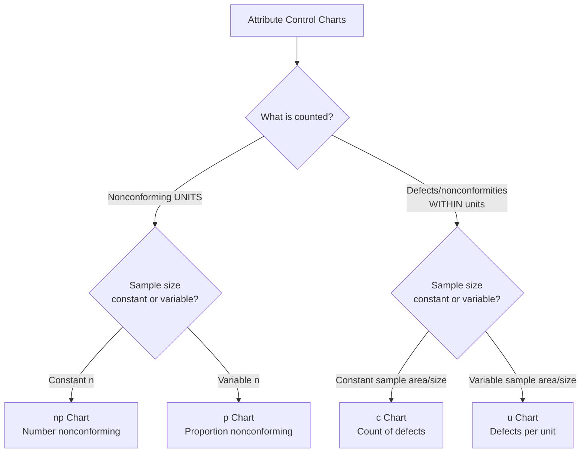
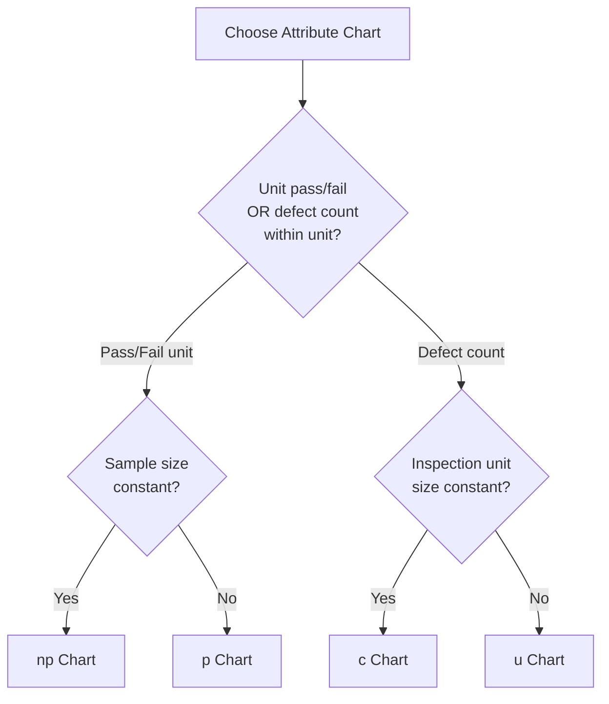

## Attribute Control Charts

### Overview

**Attribute control charts** monitor discrete (count or classification-based) quality data — such as the number or proportion of nonconforming units, or the number of defects per unit — rather than continuous measurements. They are the appropriate SPC tool when quality characteristics are evaluated as pass/fail, go/no-go, or as defect counts, and are essential where variable measurement is impractical, too costly, or the characteristic itself is inherently categorical (e.g., presence/absence of a label, functional test pass/fail).

### Family of Attribute Control Charts

### Key Distinction: Nonconforming Units vs. Nonconformities (Defects)

**Key Points**

- **Nonconforming unit**: An entire item classified as pass/fail — a unit either meets requirements or it does not, regardless of how many individual defects it may contain (p, np charts).
- **Nonconformity (defect)**: A single instance of a specific flaw; one unit may contain multiple nonconformities (e.g., a painted panel with 3 separate scratches has 1 nonconforming unit but 3 nonconformities) (c, u charts).
- This distinction fundamentally determines chart selection — using a p-chart when defect *counts* per unit is the actual characteristic of interest discards useful information.

### p-Chart (Proportion Nonconforming, Variable Sample Size)

**Key Points**

- Tracks the fraction of nonconforming units in each sample; sample size $n$ can vary from subgroup to subgroup (common in 100% inspection scenarios where daily production volume fluctuates).
- Based on the binomial distribution.

$$\hat{p}_i = \frac{\text{number nonconforming}}{n_i}, \quad \bar{p} = \frac{\sum \text{nonconforming}}{\sum n_i}$$

$$UCL = \bar{p} + 3\sqrt{\frac{\bar{p}(1-\bar{p})}{n_i}}, \quad LCL = \bar{p} - 3\sqrt{\frac{\bar{p}(1-\bar{p})}{n_i}}$$

- Because $n_i$ varies, control limits form a "staircase" pattern rather than straight lines — wider limits for smaller samples, narrower for larger ones. If $LCL < 0$, it is set to 0 (proportion cannot be negative).

**Example**

A final inspection station checks all units produced each day; daily volume varies (180–240 units). Over 25 days, $\bar{p} = 0.035$ (3.5% average nonconforming rate). For a day with $n=200$:

$$UCL = 0.035 + 3\sqrt{\frac{0.035(0.965)}{200}} = 0.035 + 0.0392 = 0.0742$$

### np-Chart (Number Nonconforming, Constant Sample Size)

**Key Points**

- Simplified variant of the p-chart used when sample size is held **constant** across all subgroups — plots the raw count of nonconforming units rather than a proportion, which can be more intuitive for shop-floor communication ("7 bad parts" vs. "3.5% nonconforming").

$$\overline{np} = \bar{p} \times n, \quad UCL = \overline{np} + 3\sqrt{\overline{np}(1-\bar{p})}, \quad LCL = \overline{np} - 3\sqrt{\overline{np}(1-\bar{p})}$$

**Example**

A fixed sample of $n=100$ units is pulled every shift. Over 20 shifts, average nonconforming count $\overline{np} = 4.2$, giving $\bar{p} = 0.042$:

$$UCL = 4.2 + 3\sqrt{4.2(0.958)} = 4.2 + 6.02 = 10.22$$

### c-Chart (Count of Defects, Constant Inspection Unit)

**Key Points**

- Tracks the total number of defects/nonconformities found per **constant-size** inspection unit (e.g., one full car body, one 10-meter length of cable, one circuit board).
- Based on the Poisson distribution, which models rare, independent event counts over a fixed area of opportunity.

$$\bar{c} = \frac{\sum c_i}{k}, \quad UCL = \bar{c} + 3\sqrt{\bar{c}}, \quad LCL = \bar{c} - 3\sqrt{\bar{c}}$$

**Example**

Final paint inspection on identical automotive body panels counts total surface defects (scratches, dimples, dirt inclusions) per panel. Over 30 panels, $\bar{c} = 5.4$ defects/panel:

$$UCL = 5.4 + 3\sqrt{5.4} = 5.4 + 6.97 = 12.37, \quad LCL = 5.4 - 6.97 \Rightarrow \text{set to } 0$$

### u-Chart (Defects per Unit, Variable Inspection Area/Size)

**Key Points**

- Generalization of the c-chart for when the inspection unit size or area of opportunity **varies** between samples (e.g., variable-length cable reels, variable batch sizes).
- Normalizes defect count by the actual unit size $n_i$ (which may represent area, length, or number of items inspected).

$$u_i = \frac{c_i}{n_i}, \quad \bar{u} = \frac{\sum c_i}{\sum n_i}$$

$$UCL = \bar{u} + 3\sqrt{\frac{\bar{u}}{n_i}}, \quad LCL = \bar{u} - 3\sqrt{\frac{\bar{u}}{n_i}}$$

**Example**

Weld seam inspection counts defects per meter of weld, but weld lengths vary by assembly (2–8 meters). A u-chart normalizes the defect rate to a per-meter basis, allowing fair comparison across variable-length welds.

### Chart Selection Summary

| Chart | Counts | Sample Size | Distribution | Example |
| --- | --- | --- | --- | --- |
| p | Nonconforming units | Variable | Binomial | Daily % rejected parts |
| np | Nonconforming units | Constant | Binomial | Fixed-lot count of rejects |
| c | Defects (nonconformities) | Constant | Poisson | Defects per identical panel |
| u | Defects (nonconformities) | Variable | Poisson | Defects per meter of variable-length weld |

### Distributional Assumptions and Limitations

**Key Points**

- **Binomial assumption (p, np)**: Requires that each unit's nonconforming status is independent, and the true proportion nonconforming $p$ is constant across the sampling period when the process is stable.
- **Poisson assumption (c, u)**: Requires that defects occur independently and at a constant average rate per unit of opportunity; violated when defects cluster (e.g., one root cause producing multiple simultaneous defects) — clustering causes **overdispersion**, where observed variance exceeds the Poisson-predicted variance, potentially triggering false out-of-control signals from a standard c/u chart. [Inference — the degree of distortion from overdispersion depends on the severity of clustering; specialized charts (e.g., negative binomial-based) exist for such cases but represent a more advanced adaptation]
- Attribute charts generally require **larger sample sizes** than variable charts to detect process shifts of equivalent practical magnitude, since each unit contributes only a binary or count data point rather than a full continuous measurement.

### Attribute vs. Variable Charts — When to Choose Attribute

**Key Points**

- Measurement of the actual continuous characteristic is impractical, too slow, or too costly (e.g., high-speed visual inspection where go/no-go gauging is faster than precision measurement).
- The characteristic is inherently categorical (presence of a required label, correct color, absence of contamination).
- Data is already being collected as pass/fail from an existing inspection system (e.g., final functional test), making retrofitting variable measurement costly.
- **Trade-off acknowledged**: choosing attribute charting over variable charting when variable measurement is feasible sacrifices statistical sensitivity and typically requires larger sample sizes to achieve comparable shift-detection power.

### Common Pitfalls

- **Using p/np when defect counts matter**: Reducing a "count of scratches per panel" characteristic to a simple pass/fail, discarding severity information that a c/u chart would preserve.
- **Applying c-chart with variable inspection unit size**: Using a c-chart when sample area/length genuinely varies between subgroups produces invalid, inconsistent control limits — a u-chart is required.
- **Ignoring overdispersion**: Applying standard Poisson-based c/u limits to data with defect clustering, generating excessive false alarms.
- **Small sample sizes with rare defects**: When $\bar{p}$ or $\bar{c}$ is very small and sample sizes are limited, the lower control limit is frequently zero and the chart may have poor sensitivity to genuine improvement or degradation — larger, more consistent sampling is needed for meaningful signal detection.

**Next Steps**

- Variable control charts ($\bar{X}$-R, $\bar{X}$-S, I-MR) — the continuous-data counterpart
- Western Electric and Nelson rules for pattern-based signal detection
- Acceptance sampling plans (AQL-based, MIL-STD-105E/ANSI Z1.4) as a related attribute-based methodology
- Process capability for attribute data (defects per million opportunities, DPMO/Sigma level)
- Rational subgrouping considerations specific to attribute sampling