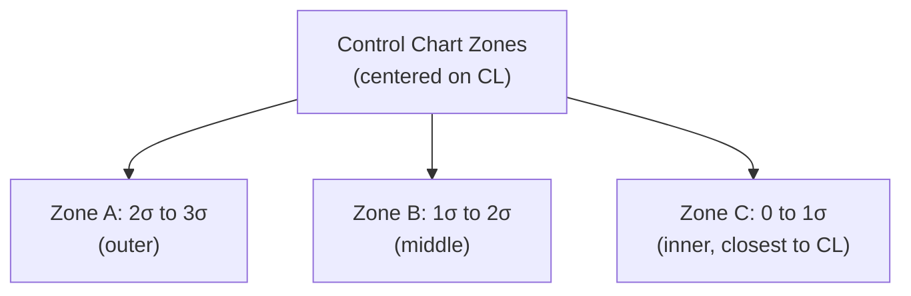
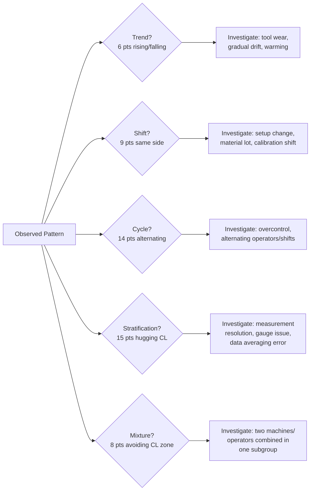

## Control Chart Interpretation Rules

### Overview

**Control chart interpretation rules** are structured pattern-detection criteria applied to plotted data points to determine whether a process is exhibiting only common cause variation (in control) or has been affected by a special cause (out of control). While a single point beyond the $\pm 3\sigma$ control limits is the most basic signal, non-random *patterns* within the limits can also indicate a special cause even when no individual point exceeds them. The two most widely referenced rule sets are the **Western Electric Rules** and the **Nelson Rules**, which formalize what "non-random" looks like on a control chart.

### Why Pattern Rules Are Needed

**Key Points**

- A process operating under pure common-cause variation should produce points that behave like independent draws from a stable distribution — random scatter around the centerline with no discernible trend, cycle, or clustering.
- Certain non-random patterns are statistically improbable under a stable process (their probability of occurring by chance alone is low) and therefore serve as early-warning signals of a special cause, often before any single point crosses the $3\sigma$ limit.
- Applying these rules increases the chart's sensitivity to smaller or gradually developing shifts, at the cost of a higher overall false-alarm rate compared to using the single-point $3\sigma$ rule alone. [Inference — the exact false-alarm rate increase depends on which subset of rules is applied simultaneously; this is a well-known statistical trade-off but the specific combined rate varies by rule set and process assumptions]

### Western Electric Rules (Zone-Based)

**Key Points**

- Divide the region between the centerline and control limits into three equal "zones" on each side:
  - **Zone C**: within $\pm 1\sigma$ of centerline
  - **Zone B**: between $\pm 1\sigma$ and $\pm 2\sigma$
  - **Zone A**: between $\pm 2\sigma$ and $\pm 3\sigma$

| Rule | Criterion | Typical Signal |
| --- | --- | --- |
| WE1 | 1 point beyond Zone A ($>3\sigma$) | Sudden, large shift or gross error |
| WE2 | 2 of 3 consecutive points in Zone A or beyond (same side) | Moderate sustained shift |
| WE3 | 4 of 5 consecutive points in Zone B or beyond (same side) | Small sustained shift |
| WE4 | 8 consecutive points on one side of centerline | Sustained mean shift |

**Example**

On an $\bar{X}$ chart, subgroup means of $+2.3\sigma$, $+2.6\sigma$, $+1.8\sigma$ occur in three consecutive subgroups. Two of these three exceed $2\sigma$ (Zone A) on the same side, triggering WE2 — a signal warranting investigation even though no single point exceeded $3\sigma$.

### Nelson Rules (Extended Set)

**Key Points**

Lloyd S. Nelson extended and formalized eight commonly used rules, several overlapping with the Western Electric set but adding trend, oscillation, and stratification detection:

| Rule | Pattern | Interpretation |
| --- | --- | --- |
| 1 | 1 point beyond $3\sigma$ | Outlier or sudden shift |
| 2 | 9 consecutive points on same side of centerline | Sustained shift in mean |
| 3 | 6 consecutive points steadily increasing or decreasing | Trend (e.g., tool wear, drift) |
| 4 | 14 consecutive points alternating up and down | Systematic variation / overcontrol |
| 5 | 2 of 3 consecutive points beyond $2\sigma$ (same side) | Moderate shift |
| 6 | 4 of 5 consecutive points beyond $1\sigma$ (same side) | Small sustained shift |
| 7 | 15 consecutive points within $1\sigma$ of centerline (either side) | Reduced variability / possible stratification |
| 8 | 8 consecutive points beyond $1\sigma$ on either side, none within $1\sigma$ | Mixture of two distinct sources/populations |

### Interpreting Each Pattern Type — Root Cause Associations

**Key Points**

- **Trend (Rule 3)**: A steadily rising or falling sequence commonly corresponds to a *progressive* physical cause — cutting tool wear, gradual thermal expansion during warm-up, chemical bath depletion, or gauge drift. [Inference — the specific root cause depends entirely on the process; the pattern itself only signals "something is progressively changing," not the specific mechanism]
- **Sustained shift (Rules WE4, Nelson 2)**: An abrupt and lasting change to one side of the centerline typically corresponds to a discrete *step-change* event — new material lot, operator change, setup/fixture adjustment, or equipment repair/replacement.
- **Cyclic/alternating pattern (Nelson 4)**: Regular oscillation often indicates an alternating systematic influence — two alternating machines, operators, or shifts feeding the same chart, or overcorrection from manual process adjustment (tampering).
- **Stratification (Nelson 7 — points hugging centerline)**: An unusually *low* apparent variability can indicate the data does not represent genuine individual variation — commonly caused by inappropriate subgrouping (e.g., averaging away real variation), incorrect control limit calculation, or excessive gauge resolution rounding. This pattern signals a process that appears "too good," which paradoxically warrants investigation. [Inference]
- **Mixture (Nelson 8 — points avoiding the center zone)**: Suggests two distinct underlying distributions/sources are being plotted on a single chart (e.g., two machines with different means combined into one data stream) — a rational subgrouping failure (see prior topic).

### Practical Application Sequence

**Key Points**

1. Confirm the **dispersion chart** (R or S) is in control before interpreting the **location chart** ($\bar{X}$ or I) — location chart limits are invalid if dispersion is unstable (see prior Variable Control Charts topic).
2. Scan for **Rule 1 violations** (points beyond $3\sigma$) first, as these are the most severe and unambiguous signals.
3. Scan for **run/trend/cycle patterns** across the full plotted history, not just the most recent points.
4. When a signal fires, **investigate promptly** at the time and location indicated by the chart — delayed investigation reduces the likelihood of identifying the actual root cause, since transient conditions (temperature, specific material lot, operator presence) may no longer be traceable.
5. Document the investigation outcome (cause found and corrected, cause found but uneconomical to fix, or no assignable cause found) — this feeds into decisions about whether to exclude the affected subgroup(s) when recalculating control limits.

### Worked Example: Multi-Rule Assessment

An $\bar{X}$ chart for a ground bearing race diameter, subgroup size $n=5$, is reviewed after 30 subgroups:

- Subgroups 1–20: random scatter within $\pm 2\sigma$, no violations — process in control.
- Subgroups 21–26: six consecutive points steadily decreasing — **Nelson Rule 3 (trend)** triggered at subgroup 26. Investigation reveals a grinding wheel nearing its dressing interval, causing progressive stock removal changes.
- Action: wheel dressed at subgroup 26; subgroups 27–30 return to random scatter around the original centerline.
- Because the root cause (wheel wear) was identified, corrected, and is not part of the intended long-term process baseline, subgroups 21–26 may be excluded when recalculating control limits going forward, provided the correction is documented. [Inference — whether to exclude out-of-control subgroups when recalculating limits is standard SPC guidance, but the decision should reflect whether the cause is truly non-recurring and correctable, per site procedure]

### Avoiding Rule Overuse and False Alarms

**Key Points**

- Applying all eight Nelson rules (or the full Western Electric set) simultaneously increases sensitivity but also increases the cumulative false-alarm rate compared to applying only Rule 1, since each additional rule independently contributes some probability of a chance trigger under a truly stable process.
- Many practitioners apply a **subset** of rules most relevant to their process's known failure modes (e.g., Rules 1, 2, and 3 for trend-prone tool-wear processes) rather than the full set, to balance sensitivity against alarm fatigue. [Inference — this is a common practical recommendation, but the optimal rule subset is process- and risk-dependent rather than a fixed standard]
- Every triggered rule should be treated as a *signal to investigate*, not an automatic conclusion that a defect has occurred — investigation may find no assignable cause, in which case the point is treated as a rare but real chance occurrence (consistent with the chosen false-alarm rate).

### Common Pitfalls

- **Over-reacting to single in-control points**: Investigating or adjusting the process every time a point sits anywhere off-center, without applying formal rule criteria — this constitutes tampering (see prior Common/Special Cause topic).
- **Ignoring non-limit-violation patterns**: Focusing exclusively on the $\pm 3\sigma$ boundary and missing trend, cycle, or stratification signals that indicate developing problems.
- **Applying rules to an unstable dispersion chart**: Drawing conclusions from $\bar{X}$ chart patterns while the R/S chart itself is out of control, which invalidates the underlying control limits.
- **Failing to timestamp/correlate signals with process events**: Not cross-referencing a chart signal with production logs (tool changes, material lots, shift changes), which makes root cause investigation far more difficult after the fact.

**Next Steps**

- Process capability analysis following confirmed statistical control
- Control chart limit recalculation practices after special cause correction
- Multi-vari studies and root cause analysis tools (fishbone diagram, 5 Whys)
- Automated SPC software alarm configuration and rule subset selection
- Autocorrelated data and its effect on control chart validity