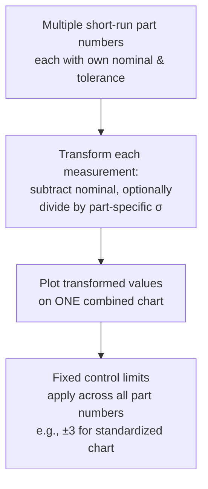

## Pre-Control Charts and Short-Run SPC

### Overview

**Pre-control** and **short-run SPC** address a shared practical challenge: traditional Shewhart control charts require a substantial number of subgroups collected under stable conditions to establish reliable baseline statistics ($\bar{\bar{x}}$, $\bar{R}$), which is often impractical for very short production runs, frequent product changeovers, job-shop environments, or new product introduction where large sample histories simply do not exist before a decision is needed.

### Pre-Control Charts

#### Concept and Origin

**Key Points**

- Developed by Frank Satterthwaite in the 1950s as a simplified, specification-driven alternative to statistically-derived control limits.
- Unlike Shewhart charts, pre-control zones are set directly from the **specification limits** (tolerance), not from the process's own inherent variation — a fundamentally different philosophy from standard SPC.
- Designed for rapid, low-training-overhead shop-floor decision-making: "is the next part likely to be acceptable?" rather than "has the process shifted statistically?"

#### Zone Structure

**Key Points**

- The tolerance zone between the Lower Specification Limit (LSL) and Upper Specification Limit (USL) is divided into three regions:
  - **Green Zone**: middle 50% of the tolerance band, centered between LSL and USL.
  - **Yellow Zones**: the two regions between the green zone and each specification limit (25% of tolerance on each side).
  - **Red Zone**: outside the specification limits entirely (nonconforming).

The pre-control lines (PCL) are positioned at:

$$PCL_{lower} = LSL + 0.25(USL - LSL), \quad PCL_{upper} = USL - 0.25(USL - LSL)$$

#### Decision Rules

**Key Points**

- **Qualification (start-up) rule**: Before production begins, 5 consecutive parts must fall in the green zone before the process is allowed to run; if any part falls outside green, adjust and restart the qualification sequence.
- **Running rule**: Once qualified, sample 2 consecutive parts periodically.
  - Both in green → continue running.
  - One in green, one in yellow (same side) → continue running (still acceptable).
  - Both in yellow (same side) → stop and adjust the process (signals a shift toward that specification limit).
  - One in yellow, one in red, or any part in red → stop production immediately; investigate and correct.
  - Two consecutive points in yellow on **opposite** sides → stop; likely indicates increased process variability rather than a mean shift.

**Example**

A short-run job producing 50 custom brackets samples 2 consecutive parts every 20 minutes. Both samples fall in the green zone for the first three checks; the fourth check shows one part in green and one in the upper yellow zone — per the running rule, production continues since this combination remains acceptable.

#### Advantages and Limitations

**Key Points**

- **Advantages**: extremely simple to implement and train (color-coded zones, minimal calculation), requires no historical process data or control limit calculation, and directly ties decisions to customer specification rather than an abstract statistical limit.
- **Limitations**: pre-control provides comparatively weaker statistical detection power for early identification of gradual process drift compared to a properly constructed Shewhart chart, since it reacts to the sampled parts' position relative to spec rather than tracking a continuously updated estimate of process mean/variation. [Inference — this relative sensitivity comparison is a widely cited criticism of pre-control in SPC literature, though the specific detection lag depends on sampling frequency and shift magnitude] Pre-control also assumes the specification width is appropriately centered relative to the process's natural capability, which is not always true.
- Best suited to short runs, low-volume production, or situations where establishing full statistical control limits is impractical, rather than as a wholesale replacement for Shewhart charts in high-volume, capable, well-established processes.

### Short-Run SPC (Statistically-Based Approaches)

#### The Core Problem

**Key Points**

- Traditional $\bar{X}$-R charts require accumulating many subgroups (commonly 20–25) under a single, stable part/process configuration before reliable control limits can be established.
- In short-run or job-shop manufacturing, a machine may produce only a handful of parts of one type before switching to a different part number, making it impossible to accumulate enough same-part history for conventional control limits.

#### Coded/Standardized Short-Run Charts

**Key Points**

- **Deviation from Nominal (DNOM) charts**: Instead of plotting raw measurements, plot the deviation of each measurement from its part-specific target/nominal value. This allows **different part numbers** with different nominal dimensions to be plotted on the **same chart**, since the chart tracks relative deviation rather than absolute value.

$$x'_i = x_i - \text{Nominal}_i$$

- **Standardized (Z-transformed) short-run charts**: Extend DNOM further by also scaling for differences in part-specific variability, allowing parts with different tolerances or inherent process spread to share a single chart.

$$Z_i = \frac{x_i - \text{Nominal}_i}{\sigma_i \text{ (or estimated } s_i\text{)}}$$

- These transformed values are then plotted on a standard Shewhart-style chart with fixed control limits (e.g., $\pm 3$ for a standardized chart), regardless of which specific part number is currently running.

**Example**

A CNC job shop produces three different shaft part numbers in sequence during one shift, each with different nominal diameters (10.00 mm, 15.00 mm, 22.00 mm) but similar process capability. Using a DNOM chart, deviations from each part's own nominal are plotted together, allowing the operator to monitor process stability across the changeovers on a single, continuous chart rather than requiring three separate charts each needing their own extended qualification period.

#### Group Charts

**Key Points**

- Used when multiple similar streams (e.g., multiple cavities, spindles, or short-run part families) need simultaneous monitoring without excessive chart proliferation.
- Plots only the **highest and lowest** value among the group of streams at each sampling interval, using conventional control limits — flags an out-of-control condition if either extreme falls outside limits, without requiring a full chart per stream.

### Comparison: Pre-Control vs. Short-Run Statistical Charts

| Aspect | Pre-Control | DNOM / Standardized Short-Run Charts |
| --- | --- | --- |
| Basis for limits | Specification limits (tolerance) | Process's own statistical variation (transformed) |
| Historical data required | None (uses spec directly) | Some (estimate of $\sigma$ per part family, ideally) |
| Statistical rigor | Lower; qualitative zone-based | Higher; retains standard Shewhart statistical basis |
| Best use case | Very short runs, minimal training, spec-driven decisions | Job shops with multiple part numbers sharing similar process behavior |
| Sensitivity to gradual drift | Lower | Comparable to standard Shewhart charts, once properly transformed |

### Common Pitfalls

- **Using pre-control as a substitute for capability analysis**: Pre-control zones are based on specification width, not process capability — a process qualifying under pre-control's green-zone rule is not automatically demonstrated to be capable ($C_{pk}$) in the statistical sense.
- **Applying DNOM/standardized charts without verifying comparable variability**: Standardized short-run charts assume the underlying process variability is reasonably similar across the different part numbers being combined; if variability differs substantially between parts, forcing them onto one chart can mask or exaggerate signals. [Inference]
- **Insufficient qualification sampling**: Skipping or shortening the 5-consecutive-green-zone qualification rule in pre-control to save setup time, undermining the method's already limited statistical assurance.
- **Treating short-run methods as permanent solutions**: Using pre-control or DNOM charts indefinitely for a part number that eventually reaches sufficient production volume to justify a full, properly baselined Shewhart chart with statistically-derived limits.

**Next Steps**

- Standard Shewhart variable control charts ($\bar{X}$-R, $\bar{X}$-S, I-MR)
- Process capability analysis and its relationship to specification-based methods
- Control chart interpretation rules (Western Electric, Nelson rules)
- Acceptance sampling as an alternative for very low-volume inspection decisions
- Statistical process control software configuration for multi-part-number environments