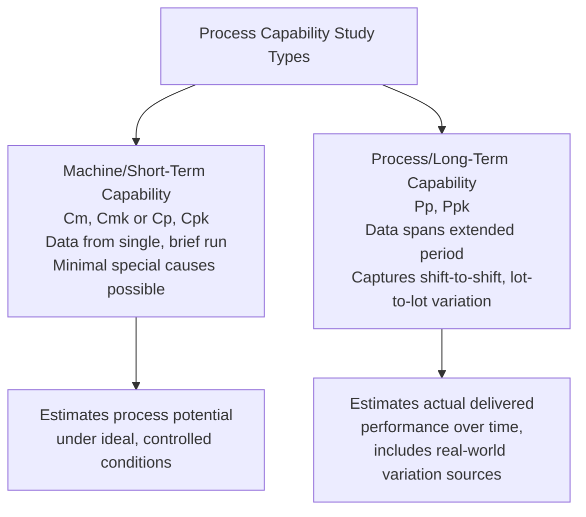
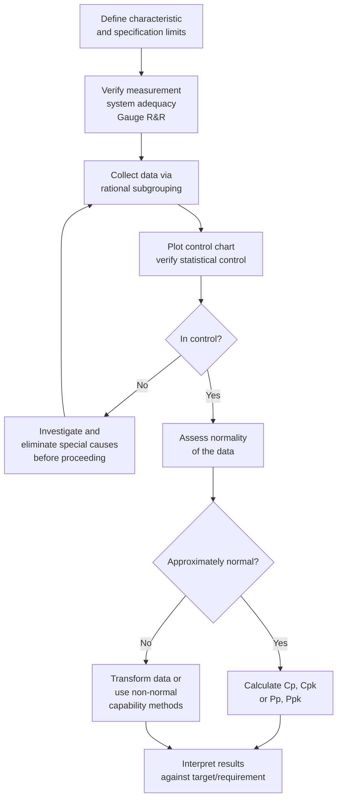

## Process Capability Studies

### Overview

A **process capability study** is a structured statistical analysis that quantifies how well a process's natural, inherent variation aligns with customer or engineering specification limits. It answers the fundamental question: "given how this process actually behaves when operating normally, what proportion of output can we expect to meet specification?" Capability studies are a prerequisite for informed decisions about process qualification, supplier approval, and ongoing quality risk in precision manufacturing.

### Prerequisites for a Valid Capability Study

**Key Points**

- **Statistical control**: The process must first be demonstrated to be in a state of statistical control (only common-cause variation present, per the earlier Common/Special Cause topic) using an appropriate control chart. Computing capability indices on an out-of-control process produces unstable, misleading estimates that do not reliably predict future performance. [Inference — this is standard SPC guidance across major quality references, though the specific degree of distortion depends on the nature of the special cause present]
- **Adequate sample size**: Sufficient data must be collected to obtain a stable estimate of process mean and standard deviation — commonly cited minimums are 100 individual measurements or 25+ subgroups, though smaller preliminary studies (e.g., 30 pieces) are sometimes used for initial machine capability assessment. [Inference — specific minimum sample size recommendations vary by standard (e.g., AIAG vs. ISO 22514) and by whether the study is a short-term machine capability study or a long-term process capability study]
- **Representative sampling period**: Data should be collected over a period and under conditions that represent normal production variation sources (material lots, shifts, tool wear cycles), not an artificially narrow window that understates true variation.
- **Known and appropriate specification limits**: Engineering tolerance (USL/LSL) must be clearly defined and relevant to the characteristic being studied.
- **Approximate normality (for classical indices)**: Standard $C_p$/$C_{pk}$ calculations assume the underlying data is approximately normally distributed; substantially non-normal data requires either transformation or alternative capability methods (see Common Pitfalls).

### Study Types: Short-Term vs. Long-Term

**Key Points**

- **Short-term (machine capability, $C_m/C_{mk}$ or preliminary $C_p/C_{pk}$)**: Conducted over a brief period (often a single shift or run) using consecutive parts, minimizing the chance of special-cause variation entering the data — estimates the process's best-case, inherent capability.
- **Long-term (process performance, $P_p/P_{pk}$)**: Conducted over an extended period spanning multiple shifts, operators, material lots, and environmental conditions — captures the total variation a customer would actually experience in delivered parts.
- The gap between short-term ($C_{pk}$) and long-term ($P_{pk}$) capability is itself diagnostic: a large gap suggests significant between-subgroup (special cause or uncontrolled common cause) variation exists that short-term sampling did not capture.

### Standard Deviation Estimation Methods

**Key Points**

- **Within-subgroup method** (used for $C_p$/$C_{pk}$): Estimates $\sigma$ from within-subgroup variation only (via $\bar{R}/d_2$ or $\bar{s}/c_4$), deliberately excluding between-subgroup variation — reflects the process's short-term, inherent capability.

$$\hat{\sigma}_{within} = \frac{\bar{R}}{d_2}$$

- **Overall/sample method** (used for $P_p$/$P_{pk}$): Estimates $\sigma$ from the standard deviation of all individual data points pooled together, capturing all sources of variation present during the study period.

$$\hat{\sigma}_{overall} = s = \sqrt{\frac{\sum(x_i - \bar{x})^2}{n-1}}$$

- This distinction in $\sigma$ estimation — not a different formula — is what separates the $C_p$/$C_{pk}$ family from the $P_p$/$P_{pk}$ family; the capability index formulas themselves are structurally identical.

### Study Design Workflow

### Worked Example: Full Study Walkthrough

A precision grinding operation produces a shaft with specification $\varnothing 20.000 \pm 0.010$ mm (LSL = 19.990, USL = 20.010).

**Step 1 — Measurement system check**: A prior Gauge R&R study confirmed the CMM measurement system contributes acceptably little variation relative to part tolerance (addressed in a separate topic).

**Step 2 — Data collection**: 25 subgroups of $n=5$ consecutive parts collected hourly across two shifts (125 total measurements), representing normal production conditions.

**Step 3 — Control chart verification**: $\bar{X}$-R chart plotted; both R chart and $\bar{X}$ chart show random scatter within limits, no Western Electric/Nelson rule violations — process confirmed in statistical control.

**Step 4 — Normality check**: A normal probability plot or Anderson-Darling test shows the 125 individual measurements are consistent with a normal distribution (no significant departure detected).

**Step 5 — Capability calculation**:

$$\bar{\bar{x}} = 20.001 \text{ mm}, \quad \hat{\sigma}_{within} = \frac{\bar{R}}{d_2} = \frac{0.0092}{2.326} = 0.00396 \text{ mm}$$

$$C_p = \frac{USL - LSL}{6\hat{\sigma}_{within}} = \frac{0.020}{6(0.00396)} = \frac{0.020}{0.02376} = 0.842$$

$$C_{pk} = \min\left(\frac{USL - \bar{\bar{x}}}{3\hat{\sigma}_{within}}, \frac{\bar{\bar{x}} - LSL}{3\hat{\sigma}_{within}}\right) = \min\left(\frac{0.009}{0.01188}, \frac{0.011}{0.01188}\right) = \min(0.758,\ 0.926) = 0.758$$

**Step 6 — Interpretation**: $C_p = 0.842$ indicates the process spread itself is wider than ideal relative to tolerance (a $C_p < 1.0$ generally suggests the process is not capable of meeting specification even if perfectly centered) [Inference — the specific threshold for "acceptable" $C_p$/$C_{pk}$ varies by industry, customer requirement, and risk tolerance; 1.33 and 1.67 are commonly cited targets but are not universal]; $C_{pk} < C_p$ confirms the process is also off-center (closer to the USL side), compounding the capability shortfall.

### Interpreting the Relationship Between Cp and Cpk

**Key Points**

- $C_p$ measures *potential* capability — how well the process spread fits within tolerance, assuming perfect centering. It ignores where the process mean actually sits.
- $C_{pk}$ measures *actual* capability — accounting for both spread and centering (off-target mean).
- $C_{pk} \leq C_p$ always; equality occurs only when the process is perfectly centered between LSL and USL.
- A large gap between $C_p$ and $C_{pk}$ signals a centering problem (fixable via process adjustment/targeting) rather than an inherent variation problem (which would require reducing $\sigma$ through process/design changes) — an important distinction for selecting the correct corrective action.

### Data Requirements Checklist

**Key Points**

- Process demonstrated in statistical control (no unresolved special causes)
- Measurement system evaluated and deemed adequate (Gauge R&R)
- Sample size sufficient for stable mean/variance estimation
- Sampling period representative of normal operating conditions and variation sources
- Data distribution assessed for normality (or appropriate alternative method selected)
- Specification limits confirmed correct and currently applicable (engineering change history checked)

### Common Pitfalls

- **Skipping the control chart step**: Computing capability indices directly from raw data without first confirming statistical control, risking capability estimates distorted by unresolved special causes.
- **Confusing short-term and long-term capability**: Reporting a favorable $C_{pk}$ (short-term, within-subgroup basis) as if it represents the process's actual long-term delivered performance, when $P_{pk}$ (overall basis) may be substantially lower.
- **Ignoring non-normality**: Applying standard $C_p$/$C_{pk}$ formulas to significantly skewed or multi-modal data without transformation or an appropriate non-normal capability method, producing misleading index values.
- **Insufficient sample size**: Drawing firm capability conclusions from very limited data (e.g., fewer than 30 measurements), where sampling uncertainty in $\hat{\sigma}$ can substantially distort the reported index (see prior Confidence Intervals topic — CIs for $C_{pk}$ address this directly).
- **Using capability studies on an unstable measurement system**: If the gauge itself contributes significant variation, calculated process capability will be inflated (worse than reality) or, in some cases, misleadingly distorted in either direction depending on the nature of the measurement error. [Inference]

**Next Steps**

- Process capability indices in depth: Cp, Cpk, Pp, Ppk formulas and interpretation
- Non-normal process capability analysis (Box-Cox transformation, Johnson distribution, percentile methods)
- Gauge R&R and measurement system analysis as a capability study prerequisite
- Confidence intervals for capability indices
- Sigma level and DPMO (Defects Per Million Opportunities) as related capability metrics