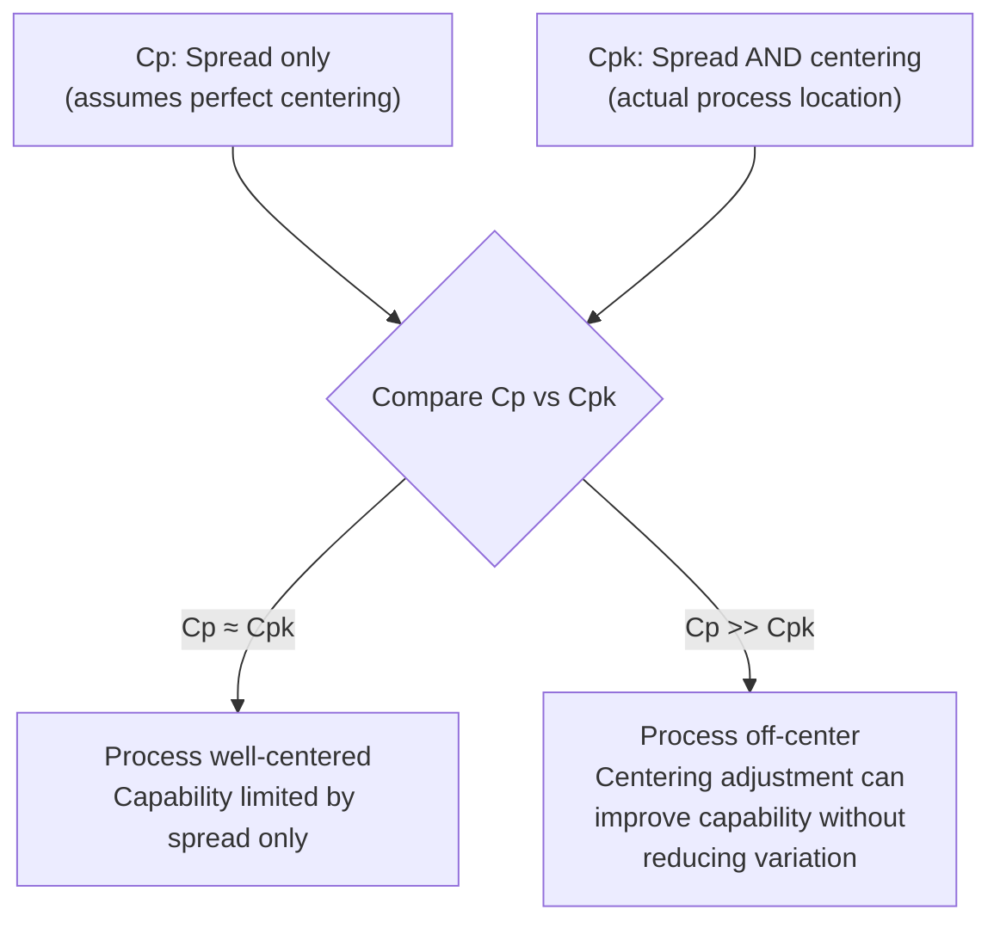

## Process Capability Indices Cp and Cpk

### Overview

$C_p$ and $C_{pk}$ are the two most widely used **short-term process capability indices**, expressing how a process's inherent (within-subgroup) variation compares to engineering specification limits. Both are computed using $\hat{\sigma}_{within}$ (estimated from within-subgroup variation, typically via $\bar{R}/d_2$ or $\bar{s}/c_4$), distinguishing them from their long-term counterparts $P_p$/$P_{pk}$, which use overall sample standard deviation. Together, $C_p$ and $C_{pk}$ separate the two independent contributors to capability: process **spread** and process **centering**.

### Cp — Process Potential Index

**Key Points**

- Measures whether the process's natural spread (6σ width) fits within the tolerance band, **assuming the process is perfectly centered** between LSL and USL.
- Ignores the actual location of the process mean entirely — it is a measure of potential capability, not actual delivered capability.

$$C_p = \frac{USL - LSL}{6\hat{\sigma}_{within}}$$

**Example**

Specification: $\varnothing 20.000 \pm 0.010$ mm (USL = 20.010, LSL = 19.990). $\hat{\sigma}_{within} = 0.0025$ mm.

$$C_p = \frac{20.010 - 19.990}{6(0.0025)} = \frac{0.020}{0.015} = 1.33$$

This indicates the process spread, if perfectly centered, would occupy $\frac{1}{1.33} \approx 75\%$ of the tolerance band.

### Cpk — Process Performance Index (Accounting for Centering)

**Key Points**

- Measures actual capability by accounting for **both** spread and how far the process mean is offset from the tolerance midpoint — takes the minimum of the upper and lower capability calculations.

$$C_{pk} = \min\left(C_{pu},\ C_{pl}\right) = \min\left(\frac{USL - \bar{x}}{3\hat{\sigma}_{within}},\ \frac{\bar{x} - LSL}{3\hat{\sigma}_{within}}\right)$$

- $C_{pu}$ (upper capability) reflects margin to the USL; $C_{pl}$ (lower capability) reflects margin to the LSL. The smaller of the two always governs, since it represents the specification limit the process is closest to violating.
- **$C_{pk} \leq C_p$ always** — equality holds only when the process mean is exactly centered between LSL and USL.

**Example (continuing above)**

$\bar{x} = 20.004$ mm (process running slightly above nominal), $\hat{\sigma}_{within} = 0.0025$ mm.

$$C_{pu} = \frac{20.010 - 20.004}{3(0.0025)} = \frac{0.006}{0.0075} = 0.80$$

$$C_{pl} = \frac{20.004 - 19.990}{3(0.0025)} = \frac{0.014}{0.0075} = 1.87$$

$$C_{pk} = \min(0.80,\ 1.87) = 0.80$$

Despite $C_p = 1.33$ suggesting good potential, the actual $C_{pk} = 0.80$ reveals the off-center mean is consuming most of the process's capability margin on the upper side.

### Visualizing the Relationship

### Interpretation Thresholds (Illustrative Industry Convention)

| $C_{pk}$ Value | Common Interpretation |
| --- | --- |
| $< 1.00$ | Process not capable; nonconforming output likely even if in control |
| $1.00 – 1.33$ | Marginally capable; may require tighter control or 100% inspection |
| $1.33 – 1.67$ | Generally considered capable for many industries (common target) |
| $> 1.67$ | High capability |

[Inference — these numeric thresholds are widely cited conventions (e.g., commonly referenced in automotive and general manufacturing quality guidance), but specific acceptance criteria are ultimately defined by customer requirements, industry standard, or internal quality policy, and are not universal fixed rules]

### Relationship to Sigma Level and Defect Rate

**Key Points**

- Assuming a normal distribution and a centered process, $C_{pk}$ relates approximately to the process "sigma level" (distance in standard deviations from the mean to the nearest specification limit) and the associated expected nonconformance rate.

$$\text{Sigma Level} \approx 3 \times C_{pk}$$

| $C_{pk}$ | Approx. Sigma Level | Approx. Defect Rate (one-sided, centered) |
| --- | --- | --- |
| 1.00 | 3σ | ~1350 ppm |
| 1.33 | 4σ | ~32 ppm |
| 1.67 | 5σ | ~0.3 ppm |
| 2.00 | 6σ | ~0.002 ppm (long-term Six Sigma convention often cites 3.4 ppm, incorporating a 1.5σ shift allowance) |

[Inference — the exact ppm figures depend on the assumed distribution (strict normality) and whether a long-term "1.5σ shift" adjustment (a Six Sigma methodology convention) is applied; real-world defect rates can differ substantially from these theoretical values due to non-normality or process drift]

### One-Sided Specifications

**Key Points**

- When only one specification limit applies (e.g., a maximum flatness, minimum tensile strength, maximum contamination level), $C_p$ cannot be computed (it requires both USL and LSL), but a one-sided capability index can still be calculated using only the relevant side:

$$C_{pu} = \frac{USL - \bar{x}}{3\hat{\sigma}_{within}} \quad \text{(upper-bound-only characteristics)}$$

$$C_{pl} = \frac{\bar{x} - LSL}{3\hat{\sigma}_{within}} \quad \text{(lower-bound-only characteristics)}$$

**Example**

A surface roughness specification requires $R_a \leq 0.8$ μm (upper limit only, no lower limit). With $\bar{x} = 0.55$ μm and $\hat{\sigma}_{within} = 0.06$ μm:

$$C_{pu} = \frac{0.8 - 0.55}{3(0.06)} = \frac{0.25}{0.18} = 1.39$$

### Estimating σ_within — Method Choice Matters

**Key Points**

- From subgroup range: $\hat{\sigma}_{within} = \bar{R}/d_2$ (paired with $\bar{X}$-R charts).
- From subgroup standard deviation: $\hat{\sigma}_{within} = \bar{s}/c_4$ (paired with $\bar{X}$-S charts).
- Using the **overall/pooled sample standard deviation** instead of a within-subgroup estimate produces $P_p$/$P_{pk}$, not $C_p$/$C_{pk}$ — a frequent source of confusion and reporting error when software defaults are not carefully checked. [Inference — this mislabeling is a commonly cited practical error in capability reporting, not a universal software flaw]

### Common Pitfalls

- **Reporting $C_p$ alone without $C_{pk}$**: $C_p$ alone can mask a serious centering problem; a high $C_p$ with a low $C_{pk}$ indicates the process has good inherent precision but is running off-target — a correctable centering issue, not a fundamental capability limitation.
- **Computing Cp/Cpk on non-normal data without adjustment**: Since the formulas assume normality to translate $\sigma$ into an expected defect rate, applying them directly to significantly skewed data can materially misstate true capability. [Inference]
- **Using Cp/Cpk on an out-of-control process**: As emphasized in the parent capability studies topic, indices computed while special causes are present are unstable and not predictive of future performance.
- **Treating Cpk as a single definitive "score" without context**: A given $C_{pk}$ value from a small sample carries sampling uncertainty (see prior Confidence Intervals topic); two studies reporting the same point-estimate $C_{pk}$ may have very different confidence given different sample sizes.
- **Confusing $C_{pk}$ (short-term/within-subgroup) with $P_{pk}$ (long-term/overall)**: Reporting a favorable $C_{pk}$ as evidence of long-term delivered quality when only $P_{pk}$ reflects the full range of real-world variation sources.

**Next Steps**

- Process performance indices Pp and Ppk and their relationship to Cp/Cpk
- Confidence intervals for Cpk given finite sample size
- Non-normal process capability methods (Box-Cox, percentile-based indices)
- Sigma level, DPMO, and Six Sigma methodology context
- Corrective strategies: centering adjustment vs. variation reduction