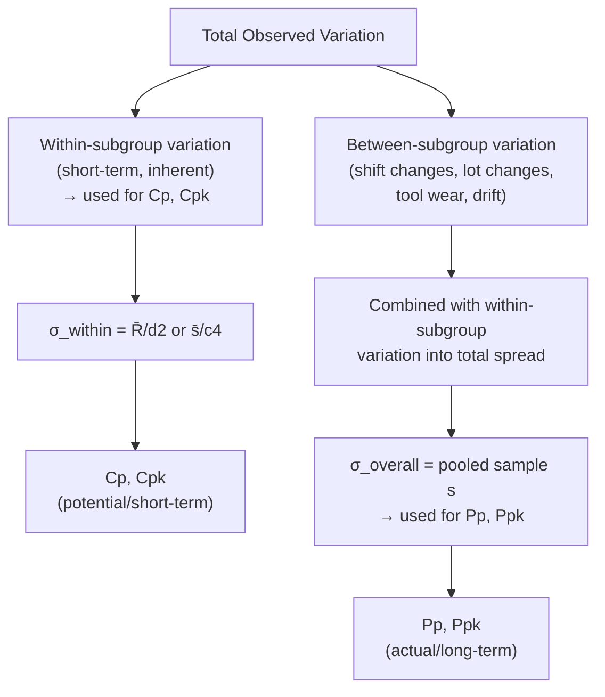
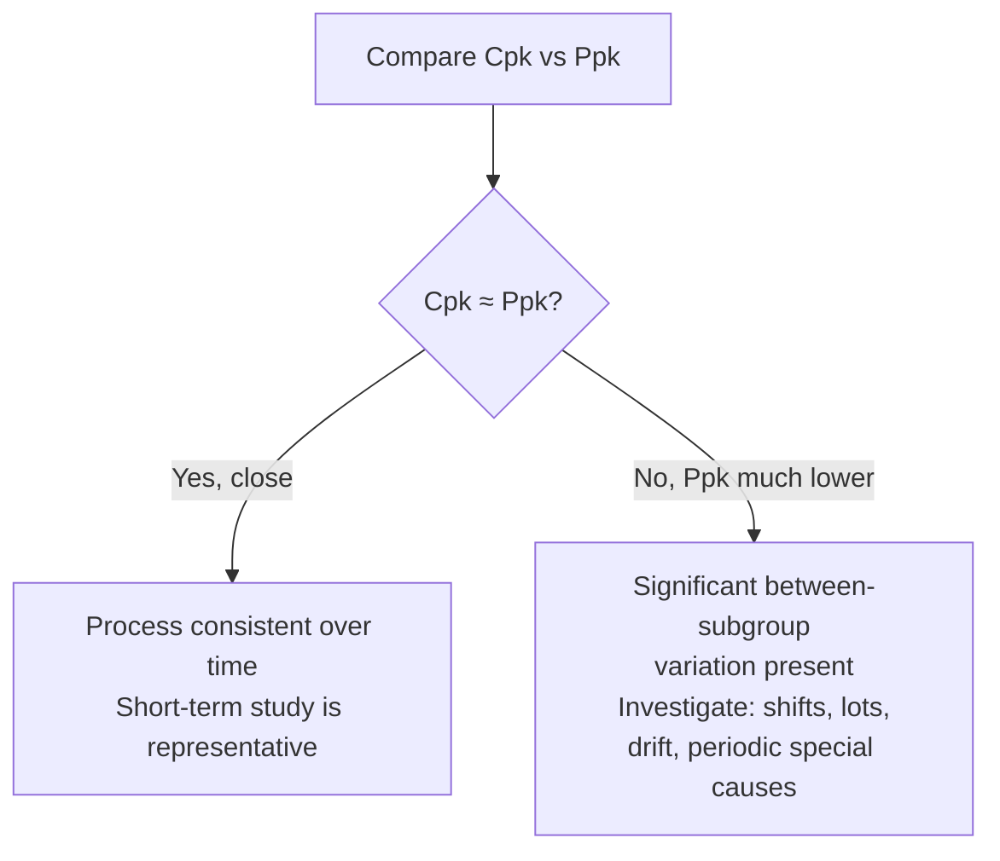

## Process Performance Indices Pp and Ppk

### Overview

$P_p$ and $P_{pk}$ are **long-term process performance indices** that quantify how a process's *total observed variation* — including all real-world sources such as shift-to-shift, lot-to-lot, and operator-to-operator differences — compares to specification limits. Structurally identical in formula to $C_p$/$C_{pk}$, the defining difference lies entirely in how standard deviation is estimated: $P_p$/$P_{pk}$ use the **overall sample standard deviation** rather than a within-subgroup estimate, making them the appropriate metric for reporting what a customer actually experiences in delivered product over time.

### The Critical Distinction: Within-Subgroup vs. Overall Standard Deviation

**Key Points**

- **Cp/Cpk** use $\hat{\sigma}_{within}$, estimated from $\bar{R}/d_2$ or $\bar{s}/c_4$ — capturing only the variation that exists *within* rational subgroups (short-term, inherent process noise).
- **Pp/Ppk** use $\hat{\sigma}_{overall} = s$, the ordinary sample standard deviation calculated across *all* individual data points pooled together, regardless of subgroup — capturing both within-subgroup and between-subgroup variation.

$$\hat{\sigma}_{overall} = s = \sqrt{\frac{\sum_{i=1}^{N}(x_i - \bar{x})^2}{N-1}}$$

### Formulas

**Key Points**

$$P_p = \frac{USL - LSL}{6\hat{\sigma}_{overall}}$$

$$P_{pk} = \min\left(\frac{USL - \bar{x}}{3\hat{\sigma}_{overall}},\ \frac{\bar{x} - LSL}{3\hat{\sigma}_{overall}}\right)$$

- The formulas are structurally identical to $C_p$/$C_{pk}$ — only $\hat{\sigma}$ changes. This is a frequent source of confusion in practice, since software packages sometimes report both sets side by side using the same underlying data set.

### Worked Example

Using the same grinding process from the Process Capability Studies example: specification $\varnothing 20.000 \pm 0.010$ mm, 125 individual measurements collected across 25 subgroups over two shifts.

$$\bar{x} = 20.001 \text{ mm (overall grand mean, same value)}$$

$$\hat{\sigma}_{within} = \frac{\bar{R}}{d_2} = 0.00396 \text{ mm (from earlier)}$$

$$\hat{\sigma}_{overall} = s_{pooled} = 0.00512 \text{ mm (computed from all 125 individual values directly)}$$

$$P_p = \frac{0.020}{6(0.00512)} = \frac{0.020}{0.03072} = 0.651$$

$$P_{pk} = \min\left(\frac{20.010 - 20.001}{0.01536},\ \frac{20.001 - 19.990}{0.01536}\right) = \min(0.586,\ 0.716) = 0.586$$

Comparing to the earlier $C_p = 0.842$ and $C_{pk} = 0.758$: both performance indices are notably lower than their capability counterparts, since $\hat{\sigma}_{overall} > \hat{\sigma}_{within}$ — indicating meaningful between-subgroup variation (shift-to-shift or time-related drift) exists beyond what the within-subgroup estimate alone captures.

### Interpreting the Cpk vs. Ppk Gap

**Key Points**

- If $\hat{\sigma}_{overall} \approx \hat{\sigma}_{within}$, then $C_{pk} \approx P_{pk}$ — the process shows little between-subgroup variation; short-term behavior is representative of long-term performance.
- If $\hat{\sigma}_{overall} \gg \hat{\sigma}_{within}$, then $P_{pk} \ll C_{pk}$ — a substantial gap signals real between-subgroup variation exists (shift effects, lot-to-lot differences, gradual drift, periodic special causes) that a short-term study alone would not reveal.
- This ratio is itself diagnostically useful:

$$\text{Ratio} = \frac{\hat{\sigma}_{overall}}{\hat{\sigma}_{within}}$$

A ratio close to 1.0 suggests good process consistency over time; a ratio well above 1.0 (e.g., $>1.3$–$1.5$) suggests investigation into sources of longer-term variability is warranted. [Inference — no single universally standardized ratio threshold exists across all quality references; this heuristic reflects common practical usage rather than a fixed rule]

### When Each Index Is Appropriate

| Index | Reflects | Typical Use Case |
| --- | --- | --- |
| $C_p$, $C_{pk}$ | Short-term, inherent process potential | Initial machine/process qualification, PPAP short-run studies |
| $P_p$, $P_{pk}$ | Long-term, actual delivered performance | Ongoing production reporting, customer scorecards, PPAP long-run studies |

**Key Points**

- Automotive and other formal quality systems (e.g., PPAP — Production Part Approval Process) commonly require **both** sets of indices at different study stages: $C_p$/$C_{pk}$ from an initial short-term study, and $P_p$/$P_{pk}$ once sufficient production history accumulates to represent long-term performance. [Inference — specific requirements and required sample sizes vary by industry standard (e.g., AIAG PPAP manual) and customer-specific requirements; consult the applicable standard for exact stage definitions]
- Reporting only $C_{pk}$ to a customer without accompanying $P_{pk}$ can overstate the process's real-world reliability if meaningful between-subgroup variation exists.

### Common Pitfalls

- **Mislabeling indices due to software defaults**: Many statistical software packages calculate both sets automatically from the same dataset but may default-display one without clearly distinguishing which $\sigma$ estimation method was used — verifying which formula underlies a reported "Cpk" value is essential before comparing across studies or vendors. [Inference — this describes a commonly reported practical confusion in industry, not a universal software defect]
- **Treating Pp/Ppk as inherently "worse" indices**: $P_p$/$P_{pk}$ are not lower-quality metrics — they measure a genuinely different (and often more customer-relevant) aspect of performance; the goal is correct application, not preferring one over the other universally.
- **Insufficient data span for Ppk**: Calculating $P_p$/$P_{pk}$ from data collected over too short a period fails to capture the very between-subgroup variation sources ($P_p$/$P_{pk}$'s defining purpose) that distinguish it from $C_p$/$C_{pk}$ — the study must span a representative production timeframe (multiple shifts, lots, etc.) to be meaningful.
- **Ignoring the diagnostic value of the Cpk-Ppk gap**: Treating the two indices as redundant reports rather than using their difference as a signal to investigate uncontrolled sources of long-term variation.

**Next Steps**

- Process capability indices Cp and Cpk (short-term basis) — prerequisite comparison
- Confidence intervals for Pp/Ppk given sample size and study duration
- Non-normal process performance analysis methods
- PPAP and production part approval documentation requirements
- Control chart interpretation for identifying between-subgroup variation sources