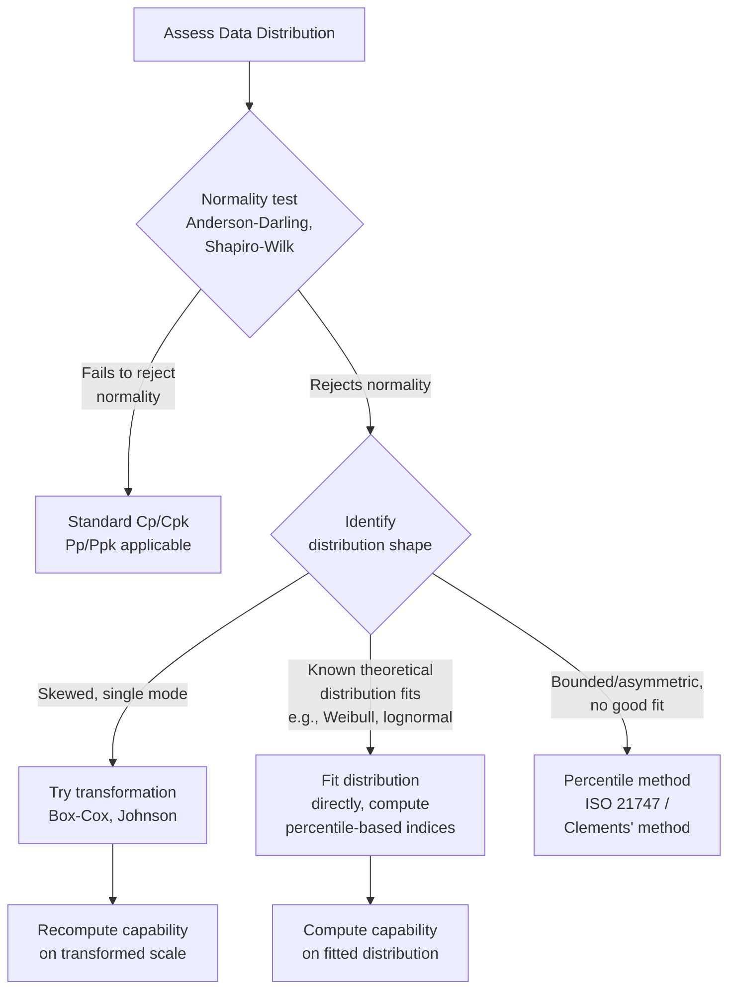

## Capability Analysis for Non-Normal Distributions

### Overview

Standard $C_p$/$C_{pk}$ and $P_p$/$P_{pk}$ formulas assume the underlying process data follows an approximately **normal distribution** — this assumption underlies the use of $6\sigma$ to represent "process spread" and the translation of index values into expected defect rates. Many real metrology characteristics (surface finish, flatness, roundness, position/true position, particle contamination, fatigue life, and any naturally bounded or one-sided characteristic) are inherently **non-normal**, often right-skewed or bounded at zero. Applying classical normal-theory capability formulas to such data can produce materially misleading capability estimates, making non-normal capability methods an essential extension of standard capability analysis.

### Why Non-Normality Matters for Capability

**Key Points**

- The classical $C_{pk}$ formula implicitly assumes that $\pm 3\sigma$ from the mean corresponds to specific, known percentiles (approximately the 0.135th and 99.865th percentiles under normality). For skewed or bounded distributions, this correspondence breaks down — the actual proportion of the population beyond $\pm 3\sigma$ can differ substantially from the normal-theory expectation.
- Common sources of non-normality in metrology data:
  - **Naturally bounded characteristics**: flatness, roundness, cylindricity, position error, surface roughness — all bounded at zero (cannot be negative), producing right-skewed distributions.
  - **Mixture distributions**: data combining two or more distinct sources (e.g., two machines, two shifts) with different means.
  - **Truncated/censored data**: 100% inspection or sorting that removes extreme values before capability data is collected.

### Detecting Non-Normality

**Key Points**

- **Visual methods**: histogram shape (skewness, bimodality), normal probability plot (departures from a straight line indicate non-normality).
- **Formal statistical tests**: Anderson-Darling, Shapiro-Wilk, or Kolmogorov-Smirnov tests for normality — testing $H_0$: data is normally distributed (see prior Hypothesis Testing topic).
- A statistically significant test result (rejecting normality) does not by itself indicate the degree of practical impact on capability estimates; visual inspection of the distribution shape alongside the test result is recommended before choosing a remediation method. [Inference — this combined visual-plus-statistical approach is a widely recommended practice, though the specific decision threshold for "practically significant" non-normality is not universally standardized]

### Method 1: Data Transformation

**Key Points**

- **Box-Cox transformation**: Applies a power transformation $y = \frac{x^\lambda - 1}{\lambda}$ (or $\ln(x)$ when $\lambda = 0$) to the data, selecting $\lambda$ to best approximate normality on the transformed scale. Requires all data values to be strictly positive.
- **Johnson transformation**: A more flexible family of transformations (bounded, log-normal, and unbounded sub-families) that can accommodate a wider range of non-normal shapes than Box-Cox, including data with negative values.
- **Procedure**: transform the data, verify improved normality on the transformed scale, compute $C_p$/$C_{pk}$ using the transformed mean/$\sigma$ and correspondingly transformed specification limits, then interpret the resulting index on the original engineering scale.

**Example**

Surface roughness ($R_a$) measurements are right-skewed (bounded at zero, occasional larger excursions from tool chatter). A Box-Cox transformation with $\lambda \approx 0.3$ produces a transformed dataset that passes a normality test; capability indices computed on the transformed values, with USL similarly transformed, provide a more statistically defensible capability estimate than applying the raw-scale formula directly to the skewed data.

### Method 2: Fitting a Theoretical Non-Normal Distribution

**Key Points**

- Certain non-normal shapes correspond well to known theoretical distributions with established statistical properties:
  - **Weibull distribution**: commonly used for fatigue life, wear, and time-to-failure data.
  - **Lognormal distribution**: appropriate when the *logarithm* of the data is approximately normal — common for particle size, concentration, and some dimensional measurements with multiplicative variation sources.
  - **Gamma or exponential distributions**: sometimes appropriate for certain bounded, right-skewed physical measurements.
- Once a distribution is fitted (via maximum likelihood or method of moments), capability is computed by finding the percentiles of the fitted distribution corresponding to the specification limits, rather than using the mean/$6\sigma$ formula.

$$P_{pk\text{-equivalent}} = \min\left(\frac{z_{USL}}{3},\ \frac{z_{LSL}}{3}\right)$$

where $z_{USL}$ and $z_{LSL}$ are the standard-normal equivalents of the fitted distribution's actual proportion beyond each specification limit. [Inference — this "equivalent Z" percentile-based approach is a standard technique described in multiple capability references, but the precise formula convention can vary slightly by software implementation or standard]

### Method 3: Percentile-Based (Distribution-Free) Method

**Key Points**

- When no transformation or theoretical distribution provides an adequate fit, a **non-parametric percentile method** can be used, avoiding distributional assumptions entirely.
- Directly estimates the process's actual percentiles from the empirical data (or a fitted flexible curve) and compares them to specification limits — commonly following the general approach described in ISO 21747 or the widely referenced Clements' method using Pearson curves.

$$P_{pk} = \min\left(\frac{USL - X_{0.50}}{X_{0.995} - X_{0.50}},\ \frac{X_{0.50} - LSL}{X_{0.50} - X_{0.005}}\right)$$

where $X_{0.50}$, $X_{0.995}$, and $X_{0.005}$ are the median and the 99.5th/0.5th percentiles of the (possibly fitted) distribution — the percentile spread substitutes for the $\pm 3\sigma$ normal-theory spread. [Inference — the specific percentile method formula and reference percentiles vary somewhat between the ISO 21747 approach, Clements' method, and other percentile-based conventions; the underlying principle (using empirical/fitted percentiles instead of the normal $\pm3\sigma$ assumption) is consistent across these methods]

### Comparison of Approaches

| Method | When to Use | Advantage | Limitation |
| --- | --- | --- | --- |
| Box-Cox / Johnson transformation | Data is unimodal, transformable to near-normal | Retains familiar $C_p$/$C_{pk}$ interpretation on transformed scale | Interpretation on original engineering units less direct |
| Theoretical distribution fitting | A known physical/statistical model fits well (Weibull, lognormal) | Leverages known distribution properties, good extrapolation | Requires correct distribution identification |
| Percentile / distribution-free method | No good transformation or theoretical fit exists | No distributional assumption required | Requires larger sample sizes for stable percentile (especially tail) estimates |

### Worked Example: Flatness Measurement

A flatness characteristic is measured on 60 precision plates; specification requires flatness $\leq 0.020$ mm (one-sided upper limit; flatness cannot be negative, so data is naturally bounded at zero and right-skewed).

- A normal probability plot shows clear right-skew; Anderson-Darling test rejects normality ($p < 0.01$).
- A Weibull distribution is fitted to the flatness data using maximum likelihood, providing a good visual and statistical fit.
- The 99.865th percentile of the fitted Weibull distribution (the non-normal equivalent of the "+3σ point" under normality) is computed and compared to the USL to derive an equivalent one-sided capability index.
- Applying the standard normal-theory $C_{pu}$ formula directly to the raw skewed data would have understated true capability, since the normal formula assumes symmetric tail behavior that does not hold for this bounded, right-skewed characteristic. [Inference — the direction and magnitude of the resulting distortion depends on the specific skew of the data; right-skewed data does not universally understate capability in every configuration, though it is a commonly cited concern for this type of characteristic]

### Common Pitfalls

- **Applying normal-theory Cpk to visibly bounded/skewed characteristics by default**: Characteristics like flatness, roundness, and roughness are structurally non-normal (bounded at zero); using standard $C_p$/$C_{pk}$ without checking normality is a frequent source of capability misreporting in geometric dimensioning and tolerancing (GD&T) applications.
- **Choosing a transformation or distribution based on convenience rather than fit**: Selecting Box-Cox or a specific theoretical distribution without validating the fit (visually and statistically) on the actual data can produce a capability estimate that is precise-looking but not accurate.
- **Insufficient sample size for percentile-based methods**: Distribution-free percentile methods are particularly sensitive to sample size in the tails; small samples (e.g., under 100 points) may produce unstable extreme-percentile estimates. [Inference — the specific sample size threshold for stability depends on how extreme the required percentile is and the underlying distribution's tail behavior]
- **Failing to transform specification limits consistently**: When using a data transformation, specification limits must be transformed using the identical transformation applied to the data — comparing transformed data against untransformed specification limits produces invalid results.
- **Ignoring root cause of non-normality**: Non-normality is sometimes itself diagnostic (e.g., a mixture pattern indicating two machines feeding one dataset) — addressing the underlying process issue (see Rational Subgrouping topic) may be more valuable than simply applying a more sophisticated statistical transformation to mask it.

**Next Steps**

- Standard process capability indices Cp, Cpk, Pp, Ppk (normal-theory basis)
- Normality testing methods (Anderson-Darling, Shapiro-Wilk, probability plotting)
- Distribution fitting techniques and goodness-of-fit assessment
- Geometric dimensioning and tolerancing (GD&T) characteristics and their typical distribution shapes
- Rational subgrouping as a diagnostic tool for mixture-pattern non-normality