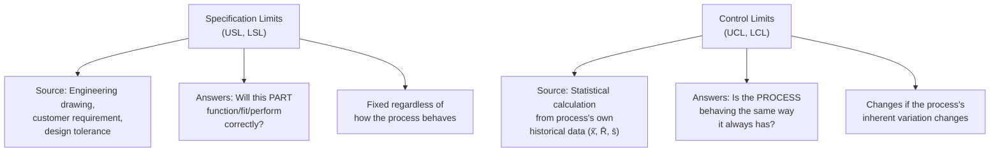
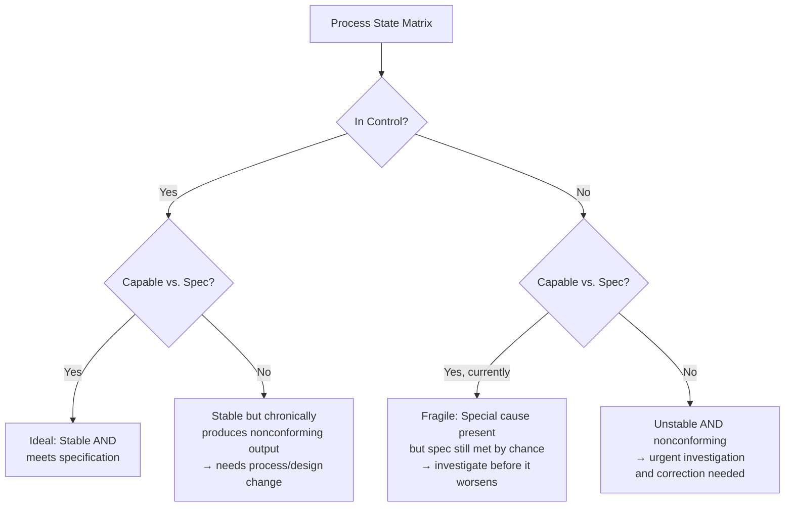

## Specification Limits versus Control Limits

### Overview

Confusing **specification limits** with **control limits** is one of the most consequential and common errors in applied quality control. Though both are plotted as horizontal lines on a chart and both bound "acceptable" behavior in some sense, they originate from entirely different sources, answer entirely different questions, and lead to fundamentally different actions when violated. Understanding this distinction is a prerequisite for correctly interpreting both control charts and capability studies.

### Fundamental Definitions

**Key Points**

- **Specification limits (USL/LSL)**: Externally defined boundaries representing what the customer, design engineer, or governing standard requires for the part to function correctly. Derived from **engineering/design requirements**, not from the process itself. Fixed and independent of how the process actually performs.
- **Control limits (UCL/LCL)**: Statistically calculated boundaries representing the expected range of variation for a process statistic (subgroup mean, range, individual value) when only common-cause variation is present. Derived **from the process's own historical data** ($\bar{\bar{x}}$, $\bar{R}$, or $\bar{s}$), not from any external requirement.

### Key Distinctions Summarized

| Aspect | Specification Limits | Control Limits |
| --- | --- | --- |
| Source | Engineering/design/customer requirement | Statistical calculation from process data |
| Basis | What the part *needs* to be | What the process *actually does* |
| Applies to | Individual part measurements | Subgroup statistics ($\bar{x}$, $R$, $s$) or individuals |
| Fixed or calculated | Fixed by design, independent of process | Recalculated from process performance |
| Violation means | Nonconforming part (may not function) | Process statistically unstable (special cause likely present) |
| Relationship to defect risk | Directly defines "defect" | Does not by itself define nonconformance |

### Why the Two Are Independent

**Key Points**

- There is **no inherent mathematical relationship** between specification limits and control limits — a process can be:
  - **In control AND capable**: control limits narrower than specification limits; process is both stable and produces conforming output. (Ideal state.)
  - **In control BUT NOT capable**: process is stable and predictable, but its natural variation exceeds the tolerance band — it will reliably produce some nonconforming output even with no special causes present. Fixing this requires **process/system redesign** (see Common/Special Cause topic), not chasing "assignable causes" that do not exist.
  - **Out of control BUT appears "capable" on average**: sporadic special causes exist, but current specification limits happen to be wide enough that no individual part yet exceeds tolerance. This is a fragile state — the special cause could worsen and start producing nonconforming parts at any time.
  - **Out of control AND NOT capable**: both unstable and outside tolerance.

### The Critical Practical Consequence: Never Plot Specification Limits on a Control Chart

**Key Points**

- A frequent and serious error is drawing specification limits directly onto an $\bar{X}$ or I chart alongside (or instead of) statistically calculated control limits.
- Control limits are based on the sampling distribution of the **subgroup statistic** (e.g., $\bar{x}$, with reduced variation via $\sigma/\sqrt{n}$ per the Central Limit Theorem), while specification limits apply to **individual part measurements**. Comparing a subgroup mean against limits meant for individual values conflates two different statistical questions and produces false conclusions about process stability. [Inference — this is a well-established SPC principle; the specific degree of statistical invalidity depends on subgroup size and the underlying distribution, but the mismatch between subgroup-mean variation and individual-value tolerance is a formally recognized issue in SPC]
- If specification limits happen to be **narrower** than control limits, a process could show points "in control" (within statistical limits) while individual parts are actually outside tolerance — the control chart would fail to flag a real quality problem because it was never designed to answer that question.
- If specification limits are **wider** than control limits, using them as the chart's action limits would fail to detect real process shifts until parts were already well outside their normal historical behavior, delaying corrective action unnecessarily.

### Where Specification Limits DO Belong

**Key Points**

- **Histograms**: Specification limits are appropriately overlaid on a histogram of *individual* measurements to visually assess capability — this is the correct application, directly supporting the visual basis of $C_p$/$C_{pk}$ analysis (see prior Capability Studies topic).
- **Capability studies**: $C_p$, $C_{pk}$, $P_p$, $P_{pk}$ calculations explicitly combine specification limits (USL/LSL) with process variation estimates ($\hat{\sigma}$) — this is the correct and intended place for the two concepts to interact.
- **Individual (I) charts, with caution**: Since I-charts plot raw individual values (not subgroup means), specification limits are sometimes displayed alongside I-chart control limits for reference — but the two limit types must remain visually distinct (different line styles/colors) and interpreted separately: a point beyond a *control* limit signals a special cause requiring investigation; a point beyond a *specification* limit signals a nonconforming part requiring disposition (scrap/rework/use-as-is). These are different decisions triggered by different limit types occupying the same chart.

### Worked Example: Distinguishing the Two Limit Types in Practice

A precision bore diameter has specification $\varnothing 25.00 \pm 0.02$ mm (USL = 25.02, LSL = 24.98). An $\bar{X}$-R chart with $n=5$ subgroups, based on 25 historical subgroups, yields calculated control limits of $UCL_{\bar{x}} = 25.006$ mm and $LCL_{\bar{x}} = 24.996$ mm.

- Note the control limits (24.996–25.006 mm) are **much narrower** than the specification limits (24.98–25.02 mm) — this is expected and desirable, since control limits reflect the tighter spread of *subgroup means* (via $\sigma/\sqrt{n}$), while specification limits apply to *individual parts*, whose spread is wider.
- A subgroup mean of 25.008 mm would trigger an out-of-control signal (exceeds UCL of 25.006) — this indicates the process **may have shifted**, warranting investigation, even though 25.008 mm is still comfortably within the 25.02 mm specification limit for individual parts.
- This illustrates the correct interpretation: the control chart signal is about **process stability**, not about whether any individual part is nonconforming — the two questions are related (an unstable process eventually risks producing nonconforming parts) but are not the same question and should not be conflated.

### Common Pitfalls

- **Plotting specification limits on an X̄ chart as if they were control limits**: A frequent and serious misapplication that invalidates the chart's statistical basis for the reasons above.
- **Tightening control limits to match specification limits "to be safe"**: Artificially narrowing control limits without a statistical basis increases false alarms (Type I errors) without any genuine improvement in the ability to detect real special causes.
- **Assuming "in control" means "meets specification"**: As shown in the process state matrix above, a stable, in-control process can still be fundamentally incapable of meeting tolerance — control and capability are answering different questions and must both be assessed.
- **Loosening specification limits after observing "chronic" out-of-tolerance control chart behavior**: Adjusting the customer/engineering requirement to match what the process currently does, rather than either improving the process or engaging in a proper engineering change process, undermines the actual functional purpose the specification was designed to protect.
- **Assuming control limits are permanent**: Unlike specification limits (fixed by design), control limits should be recalculated when a process is deliberately and permanently changed (e.g., new equipment, verified process improvement) — using stale, no-longer-representative control limits after such changes reduces the chart's diagnostic value.

**Next Steps**

- Process capability studies and the correct combination of specification limits with process variation
- Control chart interpretation rules (Western Electric, Nelson rules)
- Common cause and special cause variation as the conceptual foundation for this distinction
- Corrective action strategies: process/system redesign vs. local special-cause correction
- Engineering change management and specification limit revision processes