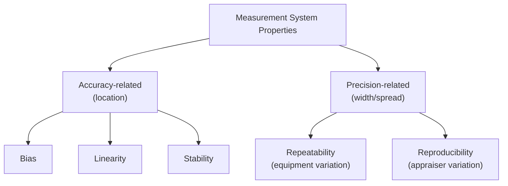
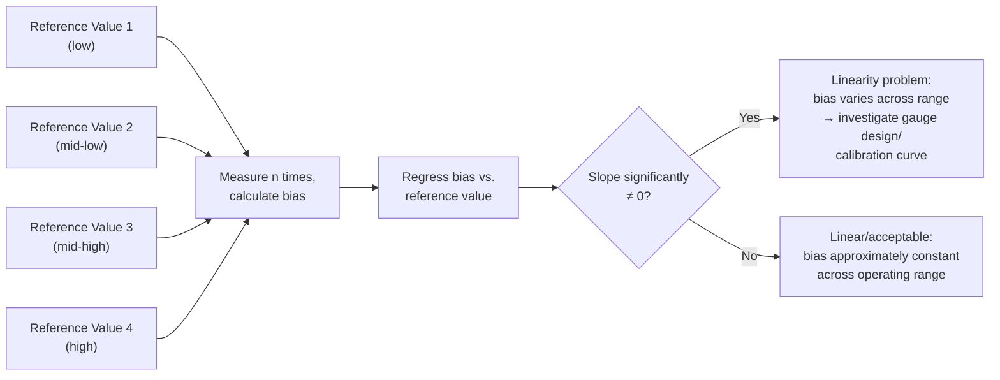
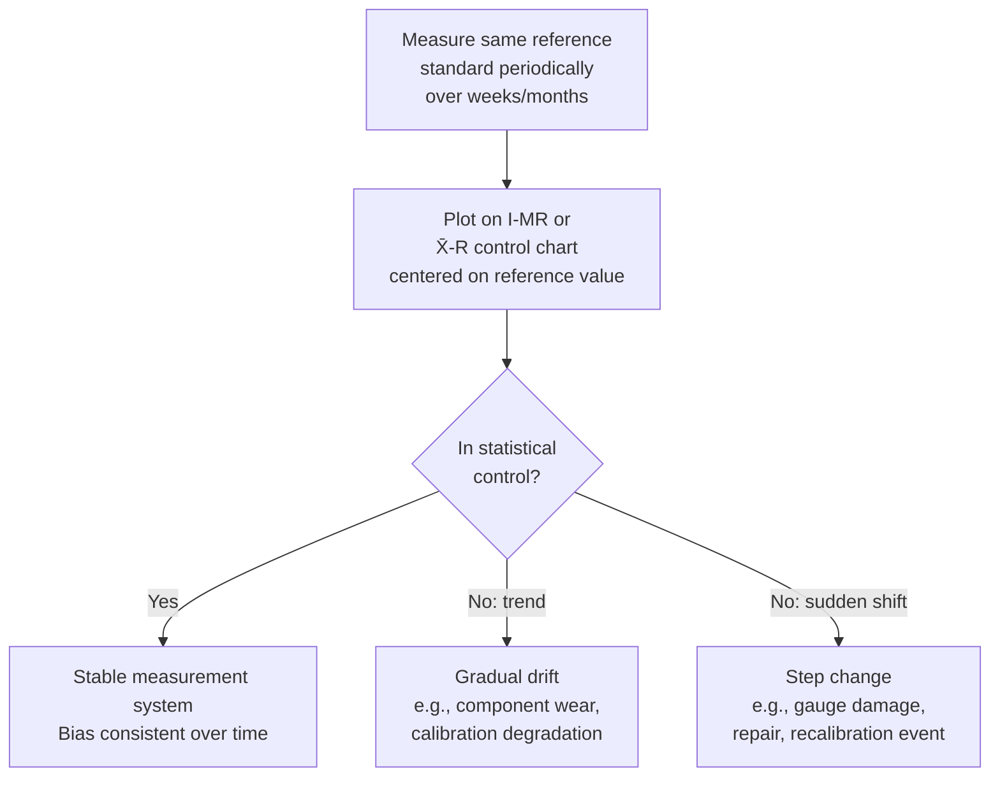

## Bias, Linearity, and Stability Studies

### Overview

**Bias**, **linearity**, and **stability** are three of the five core measurement system properties evaluated in Measurement System Analysis (MSA), collectively addressing the *accuracy* dimension of a gauge (as distinct from precision/repeatability-reproducibility, covered separately). These studies answer whether a measurement system produces results that are systematically correct — on average, across its operating range, and over time — relative to a known reference standard.

### The Five MSA Properties (Context)

### Bias

**Key Points**

- **Definition**: The difference between the observed average of measurements and an accepted reference (true) value, at a single reference point.
- Represents a systematic offset — the gauge consistently reads high or low relative to the true value.

$$Bias = \bar{x} - x_{ref}$$

**Study Procedure**

1. Obtain a reference standard (master part) with a known, traceable value $x_{ref}$ (typically calibrated by a higher-authority lab, e.g., traceable to national/international standards).
2. Have one appraiser measure the reference standard repeatedly (commonly 10+ trials) under normal operating conditions.
3. Calculate the average of the measurements and compare to $x_{ref}$.
4. Perform a t-test on the bias to determine if it is statistically significantly different from zero:

$$t = \frac{\bar{x} - x_{ref}}{s/\sqrt{n}}, \quad df = n-1$$

**Example**

A reference gauge block with certified value 25.0000 mm is measured 15 times on a coordinate measuring machine (CMM): $\bar{x} = 25.0008$ mm, $s = 0.0004$ mm.

$$Bias = 25.0008 - 25.0000 = 0.0008 \text{ mm}$$

$$t = \frac{0.0008}{0.0004/\sqrt{15}} = \frac{0.0008}{0.000103} = 7.76$$

With $df = 14$, this far exceeds the critical t-value at $\alpha = 0.05$ ($t_{0.025,14} \approx 2.145$), indicating the bias is statistically significant — the CMM has a systematic offset requiring calibration adjustment or a documented correction factor.

**Interpreting Practical vs. Statistical Significance**

**Key Points**

- A statistically significant bias may still be practically negligible relative to part tolerance — bias significance should be evaluated both statistically (is it real, not noise?) and practically (does it matter relative to the tolerance being measured?).
- A common practical guideline compares bias magnitude to the tolerance band, though the specific acceptable percentage threshold varies by organization and standard. [Inference — no single universal numeric threshold for "acceptable bias as % of tolerance" applies across all industries or standards; common MSA references discuss this in relative terms without a single fixed cutoff]

### Linearity

**Key Points**

- **Definition**: The consistency of bias across the full operating (measurement) range of the gauge — i.e., whether bias changes as the measured value changes.
- A gauge with poor linearity might be accurate at the low end of its range but increasingly biased at the high end (or vice versa) — a single-point bias study would not reveal this.

**Study Procedure**

1. Select multiple reference standards spanning the gauge's typical operating range (commonly 5+ reference values across low, middle, and high range).
2. Measure each reference standard multiple times (commonly 10+ trials each).
3. Calculate bias at each reference point.
4. Perform linear regression of bias against the reference value:

$$Bias = b_0 + b_1(x_{ref})$$

5. Test whether the slope $b_1$ is statistically significantly different from zero — a nonzero slope indicates linearity is a problem (bias is not constant across the range).

**Example**

A micrometer is tested at 5 reference lengths (5, 15, 25, 35, 45 mm) with 10 measurements each, showing biases of +0.0002, +0.0005, +0.0009, +0.0014, +0.0019 mm respectively. Linear regression of bias vs. reference value yields a slope significantly different from zero ($p < 0.01$) — the bias grows roughly proportionally with measured length, indicating a scale-factor (gain) error rather than a simple constant offset. This is a linearity problem: a single-point bias correction would not adequately compensate across the full range, since the error itself changes with the value being measured. [Inference — the specific interpretation of a proportional bias pattern as a "gain error" is a reasonable engineering inference from this data pattern, though confirming the actual root cause would require gauge-specific investigation]

### Stability

**Key Points**

- **Definition**: The consistency (constancy) of bias for the same reference standard, measured repeatedly, over an **extended period of time** — distinct from bias (single-point-in-time) and linearity (across measurement range at one point in time).
- Addresses whether the gauge's accuracy drifts due to wear, environmental changes, component aging, or calibration drift.

**Study Procedure**

1. Select a single reference standard with a known value.
2. Measure it periodically over an extended time frame (e.g., daily or weekly, over several weeks or months).
3. Plot the results on a control chart (typically an $\bar{X}$-R or I-MR chart) with the reference value as the target centerline.
4. Evaluate for statistical control using standard control chart rules (see prior Control Chart Interpretation topic) — trends, shifts, or out-of-control points indicate instability.

**Example**

A hardness tester is checked weekly against a certified reference test block over 6 months. An I-MR chart of the readings shows a gradual upward trend over the final 8 weeks, exceeding the Nelson trend rule (6 consecutive points increasing) — indicating the indenter or load cell may be drifting and requires recalibration or component inspection before continued use for production acceptance decisions.

### Summary Comparison

| Study | Question Answered | Data Collected | Typical Tool |
| --- | --- | --- | --- |
| Bias | Is the gauge accurate at one known point? | Repeated measurements of one reference standard | t-test vs. reference value |
| Linearity | Is bias consistent across the operating range? | Repeated measurements across multiple reference standards | Linear regression of bias vs. reference value |
| Stability | Is bias consistent over time? | Repeated measurements of one reference standard, over an extended period | Control chart (I-MR or X̄-R) |

### Relationship to Overall Measurement System Assessment

**Key Points**

- Bias, linearity, and stability collectively assess systematic (accuracy) error; they are typically evaluated **alongside**, not instead of, Gauge R&R studies (which assess precision — repeatability and reproducibility, covered in a separate topic).
- A measurement system can have excellent repeatability/reproducibility (very precise, tight clustering) while still exhibiting significant bias (consistently off from the true value) — precision and accuracy are independent properties, and a full MSA program addresses both.
- Traceability to a recognized reference standard (national metrology institute or accredited calibration laboratory) is a prerequisite for meaningful bias, linearity, and stability studies — without a trustworthy reference value, "bias" cannot be meaningfully distinguished from simple gauge-to-gauge disagreement.

### Common Pitfalls

- **Assuming a single-point bias study covers the full range**: A gauge verified accurate at one calibration point may still exhibit significant linearity problems elsewhere in its operating range if only bias (not linearity) is studied.
- **Confusing stability drift with normal repeatability variation**: Applying control chart interpretation rules (see prior topic) is essential to distinguish genuine drift/instability from ordinary measurement noise in a stability study.
- **Using an uncalibrated or non-traceable reference standard**: Any bias, linearity, or stability conclusion is only as trustworthy as the reference standard's own certified accuracy and traceability chain.
- **Neglecting environmental conditions during studies**: Bias and linearity studies conducted under atypical environmental conditions (temperature, humidity) may not represent the gauge's actual performance during normal production use, particularly for precision optical or dimensional metrology equipment sensitive to thermal expansion.
- **Treating a statistically significant bias as automatically requiring action without practical assessment**: As with capability indices, statistical significance and practical significance relative to tolerance must both be considered before deciding whether corrective action (recalibration, correction factor, gauge replacement) is warranted.

**Next Steps**

- Gauge Repeatability and Reproducibility (Gauge R&R) studies
- Measurement uncertainty budgets and traceability to reference standards
- Attribute agreement analysis for pass/fail measurement systems
- Control chart interpretation rules applied to stability monitoring
- Calibration system requirements and interval determination