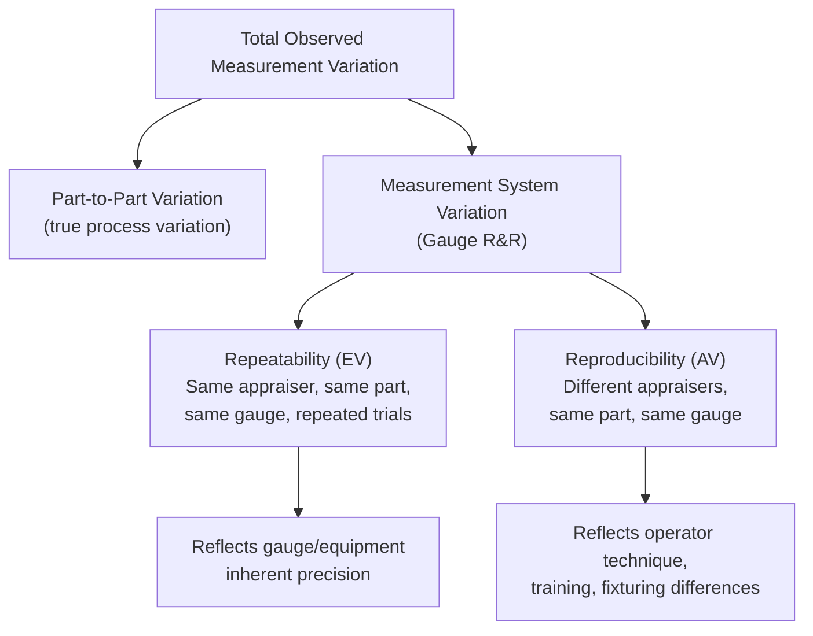
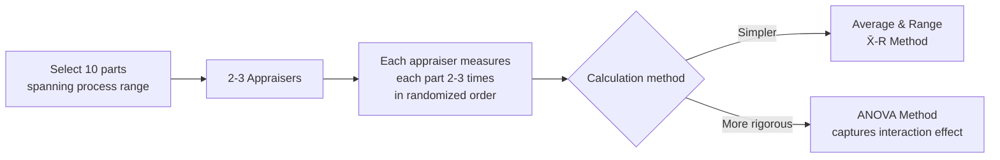
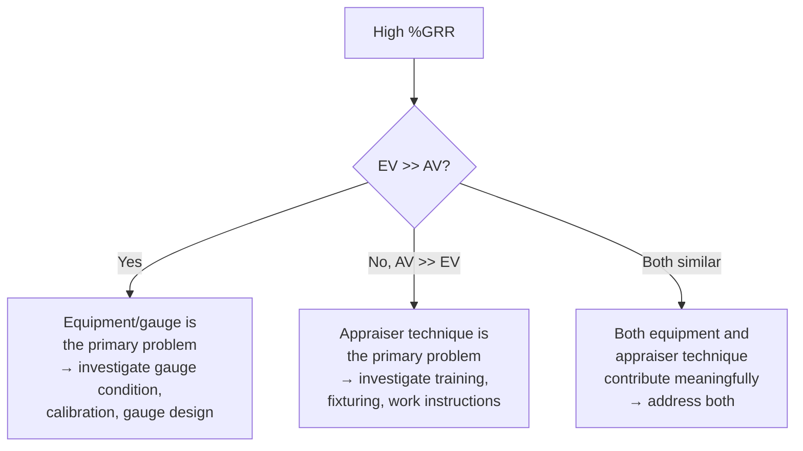

## Gauge Repeatability and Reproducibility

### Overview

**Gauge Repeatability and Reproducibility (Gauge R&R)** is the primary statistical method for quantifying the *precision* component of measurement system variation — how much of the observed variation in measurement data comes from the measurement system itself rather than from genuine part-to-part differences. Because every measured value is a combination of true part variation plus measurement error, a Gauge R&R study is a foundational prerequisite before that data can be trusted for control charting, process capability analysis, or acceptance decisions (see prior MSA and capability topics).

### The Two Components: Repeatability and Reproducibility

**Key Points**

- **Repeatability (Equipment Variation, EV)**: The variation observed when **one appraiser** measures the **same part**, with the **same gauge**, **multiple times**, under the same conditions. Reflects the inherent precision of the gauge/equipment itself.
- **Reproducibility (Appraiser Variation, AV)**: The variation observed when **different appraisers** measure the **same part** with the **same gauge**. Reflects differences in technique, fixturing, or judgment between operators.

### Study Design

**Key Points**

- **Standard design**: Typically 2–3 appraisers, 10 parts (representing the expected process range), 2–3 trials per appraiser per part — commonly referred to as a "2-3-10" or "3-3-10" study design, though exact numbers vary by reference and application.
- Parts should be selected to represent the **actual range of process variation** expected in production — using parts that are too similar to each other understates the part-to-part variation component and can distort the resulting %GR&R metric.
- Appraisers should measure parts in a **randomized order**, and ideally be **blind** to which part they are measuring and to other appraisers' results, to avoid bias from memory or expectation.
- Two primary calculation methods exist: the **Average and Range (X̄-R) method** (simpler, manual-calculation friendly) and the **ANOVA method** (more statistically rigorous, can separate an appraiser-by-part interaction effect that the X̄-R method cannot detect).

### Average and Range (X̄-R) Method — Calculations

**Key Points**

- Uses range-based estimates (similar in spirit to $\bar{X}$-R control charts) to estimate each variance component.

$$EV = \bar{R} \times K_1$$

where $\bar{R}$ is the average range across trials for each appraiser/part combination, and $K_1$ is a constant depending on the number of trials (from standard MSA reference tables; $K_1 = 4.56$ for 2 trials, $3.05$ for 3 trials — commonly tabulated constants). [Inference — these specific $K_1$ values are standard, widely tabulated constants in MSA reference manuals such as the AIAG MSA manual, though the exact table source should be confirmed against the specific reference being followed]

$$AV = \sqrt{\left(\bar{X}_{diff} \times K_2\right)^2 - \frac{EV^2}{nr}}$$

where $\bar{X}_{diff}$ is the range between the highest and lowest appraiser averages, $K_2$ is a constant depending on the number of appraisers, $n$ is the number of parts, and $r$ is the number of trials.

$$GRR = \sqrt{EV^2 + AV^2}$$

$$PV = R_p \times K_3$$

where $PV$ (Part Variation) is estimated from the range of part averages $R_p$ and constant $K_3$ (depending on number of parts).

$$TV = \sqrt{GRR^2 + PV^2}$$

### The Key Metric: %GRR (Percent Gauge R&R)

**Key Points**

- Expresses the measurement system variation as a percentage of total observed variation:

$$\%GRR = \frac{GRR}{TV} \times 100\%$$

- Alternatively, and often preferably, expressed relative to the **tolerance** rather than total variation, since the purpose of the measurement is usually to determine conformance to specification:

$$\%GRR_{tolerance} = \frac{GRR \times \text{multiplier (commonly 6)}}{USL - LSL} \times 100\%$$

[Inference — the specific multiplier (commonly 5.15 or 6, corresponding to different percentile-coverage conventions) varies by reference standard and industry convention; this should be confirmed against the specific guideline being followed, such as AIAG MSA]

### Common Acceptance Criteria (Industry Convention)

| %GRR | Typical Interpretation |
| --- | --- |
| Under 10% | Generally considered an acceptable measurement system |
| 10% – 30% | May be acceptable depending on application, cost of gauge, importance of application, or cost of repair |
| Over 30% | Generally considered unacceptable; measurement system needs improvement |

[Inference — these are widely cited conventional thresholds appearing in common MSA references (e.g., AIAG MSA manual), but final acceptance criteria are ultimately determined by the specific industry standard, customer requirement, or internal quality policy applicable to the application, and are not universal fixed rules]

### Number of Distinct Categories (ndc)

**Key Points**

- A supplementary metric indicating how many distinct groups of part values the measurement system can reliably distinguish within the observed process variation.

$$ndc = 1.41 \times \frac{PV}{GRR}$$

- A commonly cited guideline suggests $ndc \geq 5$ for a measurement system to be considered adequate for process control purposes (i.e., capable of meaningfully distinguishing between different parts rather than lumping them into too few categories). [Inference — the specific threshold of 5 is a widely cited convention in MSA literature, though its universal applicability across all measurement contexts is a matter of practical convention rather than a derived statistical requirement]

### ANOVA Method — Additional Insight

**Key Points**

- Unlike the X̄-R method, ANOVA decomposes variation into four components: part-to-part, appraiser, equipment (repeatability), and the **appraiser-by-part interaction** (whether certain appraisers measure certain parts differently than other appraisers do).
- The interaction term can reveal issues invisible to the X̄-R method — for example, an appraiser who consistently measures large parts correctly but struggles with small parts, while other appraisers show no such pattern.
- Generally considered the more statistically robust method, particularly for larger or more complex studies, though it requires computational tools (spreadsheet or statistical software) rather than manual calculation. [Inference — this comparative statistical robustness is a widely stated advantage of ANOVA over the range method in MSA literature]

### Worked Example (Simplified)

A CMM measures a critical bore diameter; a Gauge R&R study uses 3 appraisers, 10 parts, 3 trials each.

Results: $EV = 0.0021$ mm, $AV = 0.0012$ mm, $PV = 0.0180$ mm.

$$GRR = \sqrt{0.0021^2 + 0.0012^2} = \sqrt{0.00000441 + 0.00000144} = \sqrt{0.00000585} = 0.00242 \text{ mm}$$

$$TV = \sqrt{0.00242^2 + 0.0180^2} = \sqrt{0.00000586 + 0.000324} = \sqrt{0.00033} = 0.01816 \text{ mm}$$

$$\%GRR = \frac{0.00242}{0.01816} \times 100\% = 13.3\%$$

$$ndc = 1.41 \times \frac{0.0180}{0.00242} = 1.41 \times 7.44 = 10.5 \rightarrow 10 \text{ (rounded down)}$$

This measurement system falls in the "may be acceptable" range (10–30%) with an adequate $ndc$ of 10 (well above the commonly cited minimum of 5) — a reasonable system for this application, though improvement could still be considered depending on the criticality and cost trade-offs involved.

### Interpreting Which Component Dominates

**Key Points**

- If **EV dominates**: the gauge itself lacks precision — consider gauge replacement, maintenance, calibration, or a fundamentally different measurement technology.
- If **AV dominates**: appraiser technique varies significantly — consider improved training, standardized work instructions, better part fixturing to reduce operator-dependent handling, or gauge design changes that reduce operator judgment (e.g., digital readout vs. analog/vernier reading).

### Common Pitfalls

- **Using parts that don't represent actual process variation**: Selecting 10 nearly identical parts understates $PV$, which artificially inflates the %GRR ratio even if the gauge itself is perfectly adequate — the parts sample must span the real expected range.
- **Non-blind appraiser measurement**: Allowing appraisers to see prior results (their own or others') introduces bias that can artificially improve (or occasionally worsen) apparent reproducibility, invalidating the study.
- **Confusing %GRR-to-total-variation with %GRR-to-tolerance**: These are two different denominators serving different purposes; a system can look acceptable by one metric and marginal by the other — the tolerance-based version is generally more relevant when the measurement's purpose is conformance determination.
- **Treating Gauge R&R as a one-time event**: Measurement systems can degrade over time (see prior Bias/Linearity/Stability topic); periodic re-verification is necessary, especially after gauge repair, recalibration, or significant usage.
- **Ignoring the appraiser-by-part interaction**: Relying solely on the simpler X̄-R method when systematic appraiser-specific measurement problems on certain part types exist can miss an important root cause that ANOVA would reveal.

**Next Steps**

- Bias, linearity, and stability studies (the accuracy-related MSA properties)
- Attribute agreement analysis (Kappa studies) for pass/fail measurement systems
- Measurement uncertainty budgets and combining Gauge R&R with calibration uncertainty
- Destructive and non-replicable Gauge R&R study designs
- The role of measurement system adequacy as a prerequisite for capability studies and control charting