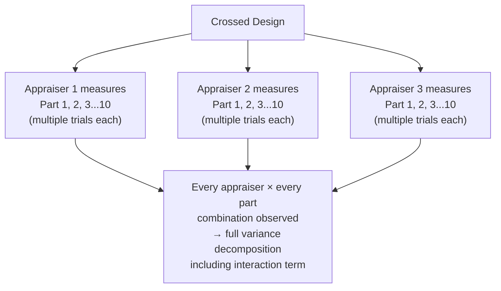
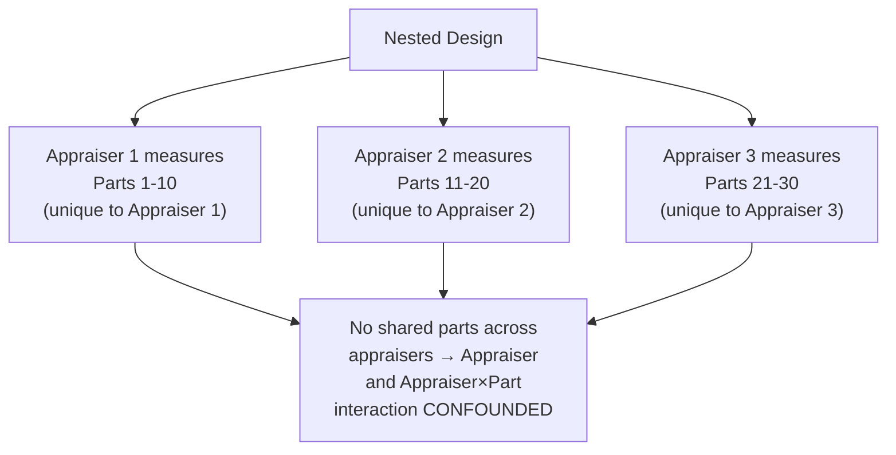

## Crossed and Nested Gauge R&R Studies

### Overview

**Crossed** and **nested** are the two fundamental experimental design structures for Gauge R&R studies, distinguished by whether every appraiser measures every part (crossed) or whether appraisers only ever measure a unique subset of parts (nested). Choosing the correct design is essential because using the wrong ANOVA model structure on a given data collection scheme produces invalid variance component estimates — the two designs are not interchangeable and require different calculation approaches.

### Crossed Design

**Key Points**

- **Definition**: Every appraiser measures every part, multiple times (multiple trials). This is the standard design assumed in most introductory Gauge R&R treatments (see prior Gauge R&R topic).
- Requires that the part being measured is **not altered or destroyed** by the measurement process, and that it retains a stable, identifiable value across repeated measurements by different appraisers at different times.
- Enables full separation of variance components: Repeatability (Equipment Variation), Reproducibility (Appraiser Variation), and — critically — the **Appraiser × Part Interaction** term, since every appraiser-part combination is observed.

**Example**

A standard dimensional Gauge R&R on machined shafts: 3 appraisers each measure the same 10 shafts, 3 times each, using a caliper — since calipers do not alter or destroy the part, this is a natural crossed design.

### Nested Design

**Key Points**

- **Definition**: Each appraiser measures a **different, unique set of parts** — parts are "nested within" appraisers rather than shared across them. No two appraisers ever measure the same physical part.
- Required when measurement is **destructive** (the part is consumed, damaged, or altered by the test — e.g., tensile testing, hardness testing at a specific location, chemical composition analysis, impact/charpy testing) or when practical constraints prevent the same part from being measured by multiple appraisers (e.g., parts physically located at different, distant testing sites; extremely limited/expensive sample availability).
- Cannot separate Reproducibility (Appraiser Variation) from the Appraiser × Part Interaction, because without shared parts across appraisers, there is no way to distinguish "this appraiser reads systematically differently" from "this specific part behaved differently when tested by this specific appraiser." These two effects are statistically **confounded** in a nested design.

**Example**

A tensile strength test destroys each specimen during measurement. Three lab technicians each test 10 unique specimens (30 specimens total, no overlap) — this must be a nested design, since no specimen can be tested twice by different technicians once it has failed.

### Key Structural Comparison

| Aspect | Crossed Design | Nested Design |
| --- | --- | --- |
| Parts shared across appraisers? | Yes — every appraiser measures every part | No — each appraiser measures unique parts |
| Requires non-destructive measurement | Yes | Not required (commonly used specifically because measurement IS destructive) |
| Can separate Appraiser × Part interaction | Yes | No — confounded with Reproducibility |
| Typical ANOVA model | Two-factor crossed (Part, Appraiser, Part×Appraiser interaction) | Two-factor nested (Appraiser, Part-within-Appraiser) |
| Common applications | Dimensional gauges, calipers, CMMs, non-destructive NDT | Destructive testing, hardness/tensile/impact tests, chemical assays |

### Statistical Model Differences

**Key Points**

- **Crossed model** (ANOVA):

$$y_{ijk} = \mu + P_i + A_j + (PA)_{ij} + \epsilon_{ijk}$$

where $P_i$ = part effect, $A_j$ = appraiser effect, $(PA)_{ij}$ = interaction effect, $\epsilon_{ijk}$ = repeatability error.

- **Nested model** (ANOVA):

$$y_{ijk} = \mu + A_j + P_{i(j)} + \epsilon_{ijk}$$

where $P_{i(j)}$ denotes "part $i$ nested within appraiser $j$" — there is no separate interaction term because each part only ever appears under one appraiser, making the part effect and any potential interaction indistinguishable within that appraiser's data.

- This structural difference is why nested Gauge R&R studies report a combined "Reproducibility" estimate that inherently includes what would, in a crossed design, be separately attributed to the interaction term. [Inference — this confounding is a well-established structural consequence of nested designs generally, consistent with standard ANOVA theory for nested vs. crossed factors]

### Study Design Considerations for Nested Studies

**Key Points**

- Because parts cannot be shared across appraisers, the parts assigned to each appraiser must be selected to be **as similar as reasonably possible in expected characteristics** (e.g., from the same material lot, similar dimensions) to avoid confounding genuine appraiser differences with coincidental part-selection differences — though some inherent part-to-part variation naturally remains unavoidable in this design.
- Sample size requirements are often larger for nested designs to achieve comparable statistical confidence, since each appraiser's estimate of "typical part variation" relies only on their own unique subset rather than a shared, common set of reference parts. [Inference — the general principle that nested designs typically require larger samples for comparable precision is a standard statistical design consideration, though the specific sample size needed depends on the desired confidence level and the study's variance component estimates]
- Some practitioners use a **partially nested (mixed) design** — for example, having each appraiser test some parts destructively (nested), but supplementing with a smaller number of shared reference standards measured by multiple appraisers using a non-destructive proxy or setup-verification step, to gain at least partial insight into potential appraiser-to-appraiser bias. [Inference — such hybrid designs appear in applied practice but are less standardized than pure crossed or pure nested designs, and specific implementation varies by application]

### Worked Example: Choosing the Design

A quality engineer needs to evaluate measurement system variation for **Rockwell hardness testing**, where the indentation itself can slightly alter the material's local properties (making exact repeat measurement at precisely the same location impossible, though nearby locations on the same part could arguably serve as approximate repeats depending on material homogeneity).

- **Consideration 1**: If part homogeneity is high and repeat measurements at adjacent locations are considered acceptable practice for this material, a modified crossed-style design might be attempted, accepting some added within-part location variation as part of repeatability. [Inference — this is a judgment call dependent on material properties and standard practice for the specific hardness test method]
- **Consideration 2**: If the test is considered effectively destructive at the specific test location (common for softer materials or thin sections where indentation depth matters), a nested design (each appraiser tests unique parts) is the statistically appropriate and more conservative choice.
- The engineer should document which design was used and its resulting limitation (inability to separate Reproducibility from interaction in the nested case) when reporting %GRR results to stakeholders.

### Common Pitfalls

- **Applying a crossed-design analysis to nested data**: Attempting to force a crossed ANOVA model (or the standard X̄-R Gauge R&R calculation) onto data collected under a nested scheme produces invalid variance component estimates, since the model assumes appraiser-part combinations that were never actually observed.
- **Failing to recognize a measurement is effectively destructive**: Some tests are destructive or alteration-inducing in non-obvious ways (e.g., a coating thickness test that slightly damages a witness sample, or a surface roughness trace that can burnish the surface at high measurement counts) — treating such a case as suitable for a standard crossed design without considering this can produce misleading repeatability estimates.
- **Not selecting comparable part subsets in a nested design**: If parts assigned to different appraisers differ systematically in ways unrelated to normal process variation (e.g., one appraiser happens to receive parts from a different, non-representative production batch), the nested study's part-to-part and appraiser variance estimates become confounded with this unintended selection difference.
- **Reporting a nested study's "Reproducibility" as if it were directly comparable to a crossed study's Reproducibility**: Because the nested value includes confounded interaction effects, direct numeric comparison between %GRR figures computed under the two different designs should be made cautiously. [Inference]

**Next Steps**

- Standard Gauge R&R (crossed design) calculations: Average-Range and ANOVA methods
- Bias, linearity, and stability studies for the accuracy dimension of MSA
- Attribute agreement analysis for pass/fail or categorical measurement systems
- Destructive test method validation and specialized MSA approaches
- Measurement uncertainty budgets incorporating Gauge R&R results