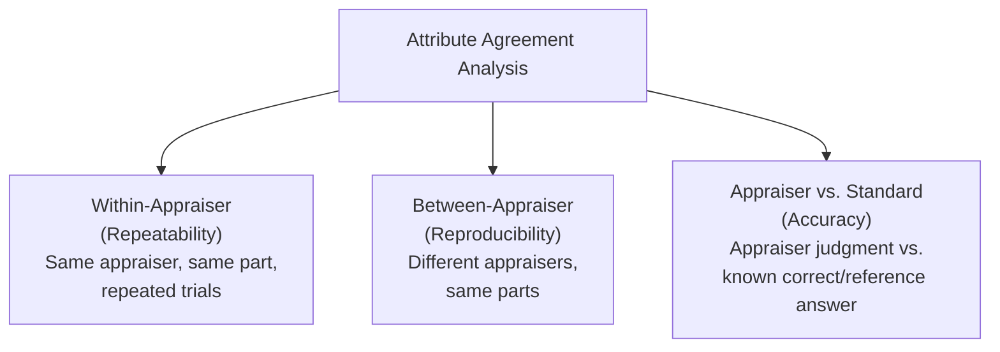
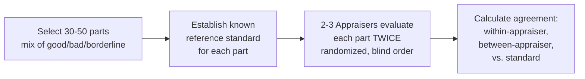
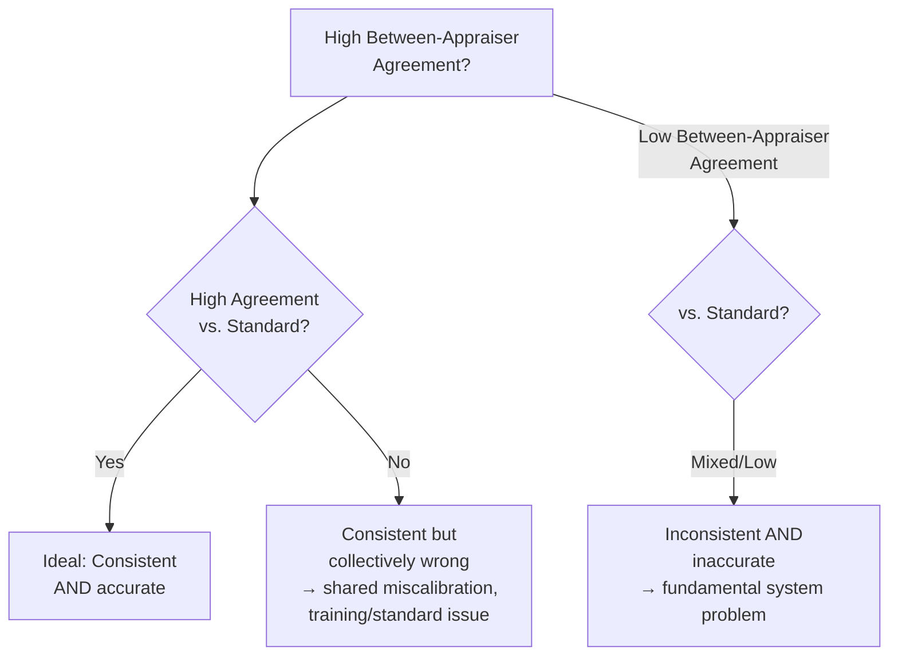

## Attribute Agreement Analysis

### Overview

**Attribute Agreement Analysis (AAA)** is the measurement system analysis method used when the quality characteristic being assessed is **categorical** (pass/fail, go/no-go, defect classification) rather than continuous — the attribute-data counterpart to Gauge R&R. It evaluates whether appraisers consistently agree with themselves (repeatability), with each other (reproducibility), and with a known correct standard (accuracy), when making qualitative judgment-based inspection decisions such as visual defect inspection, functional pass/fail testing, or go/no-go gauging.

### Why Attribute Systems Need Different Analysis

**Key Points**

- Gauge R&R (see prior topic) relies on continuous measurement scales and variance decomposition (EV, AV, PV); these statistical tools do not directly apply to categorical judgments.
- Attribute agreement analysis instead uses **agreement statistics** — measures of how often raters classify the same item the same way, adjusted for the agreement expected by chance alone.
- Common applications: visual inspection (scratches, cosmetic defects), go/no-go gauge acceptance, functional test outcomes, and any inspection station where the recorded result is a category rather than a number.

### Study Design

**Key Points**

- Select a sample of parts that includes a **known mix of good and bad units**, ideally with some borderline/marginal cases included, since these are where measurement system disagreement is most likely to surface. Common designs use 30–50 parts, evaluated by 2–3 appraisers, each appraiser evaluating each part **twice** (in randomized, blind order, unaware it's a repeat).
- A **known reference/master standard** classification (the "correct" answer for each part, established by an independent expert method — e.g., laboratory analysis, higher-precision measurement, or a certified expert panel) should ideally be established beforehand to allow accuracy assessment, not just inter-appraiser agreement.
- Appraisers should be blinded to each other's results and to which parts are repeats, to avoid biasing agreement scores upward through memory or anticipation.

### Key Metrics

#### Percent Agreement

**Key Points**

- The simplest metric: the raw proportion of times ratings match (within an appraiser's two trials, between appraisers, or against the known standard).
- **Limitation**: raw percent agreement does not account for agreement that would occur purely by chance — particularly problematic when one category (e.g., "pass") is much more common than the other, since two random raters could show high raw agreement simply by both frequently guessing the majority category.

#### Cohen's/Fleiss' Kappa Statistic

**Key Points**

- **Kappa ($\kappa$)** corrects for chance agreement, providing a more statistically meaningful measure of true agreement beyond what random chance alone would produce.

$$\kappa = \frac{P_o - P_e}{1 - P_e}$$

where $P_o$ = observed proportion of agreement, $P_e$ = expected proportion of agreement by chance alone.

- **Cohen's Kappa**: used for agreement between exactly two raters (or one rater vs. a standard).
- **Fleiss' Kappa**: extends the concept to three or more raters simultaneously.

| Kappa Value | Typical Interpretation |
| --- | --- |
| < 0.00 | Poor agreement (worse than chance) |
| 0.00 – 0.20 | Slight agreement |
| 0.21 – 0.40 | Fair agreement |
| 0.41 – 0.60 | Moderate agreement |
| 0.61 – 0.80 | Substantial agreement |
| 0.81 – 1.00 | Almost perfect agreement |

[Inference — this specific interpretive scale (Landis & Koch benchmarks) is a widely cited convention in statistical literature, but different fields and standards sometimes apply different thresholds for what constitutes "acceptable" agreement in a quality/manufacturing context specifically]

### Worked Example

Two inspectors independently classify 40 parts as "Accept" or "Reject" for a cosmetic surface defect. Cross-tabulation of their results:

|  | Inspector B: Accept | Inspector B: Reject | Total |
| --- | --- | --- | --- |
| Inspector A: Accept | 22 | 3 | 25 |
| Inspector A: Reject | 2 | 13 | 15 |
| Total | 24 | 16 | 40 |

$$P_o = \frac{22+13}{40} = \frac{35}{40} = 0.875$$

$$P_e = \left(\frac{25}{40}\times\frac{24}{40}\right) + \left(\frac{15}{40}\times\frac{16}{40}\right) = (0.625 \times 0.60) + (0.375 \times 0.40) = 0.375 + 0.15 = 0.525$$

$$\kappa = \frac{0.875 - 0.525}{1 - 0.525} = \frac{0.350}{0.475} = 0.737$$

A kappa of 0.737 falls in the "substantial agreement" range — the two inspectors agree considerably more than chance would predict, though not at the "almost perfect" level, suggesting some room for improved consistency (e.g., clearer visual defect standards, better lighting, reference boundary samples).

### Three-Way Agreement Assessment

**Key Points**

A complete attribute agreement study typically reports agreement at three levels, each answering a distinct question:

| Assessment | Question Answered |
| --- | --- |
| Within-Appraiser | Does the same appraiser classify the same part the same way both times? (Repeatability) |
| Between-Appraiser | Do different appraisers classify the same parts the same way as each other? (Reproducibility) |
| Appraiser vs. Standard | Does each appraiser's classification match the known-correct reference answer? (Accuracy) |
| All-Appraisers vs. Standard | Do all appraisers, in agreement with each other, also match the correct standard? (Overall system effectiveness) |

**Key Points**

- It is possible for appraisers to show **high agreement with each other** but **low agreement with the known standard** — this indicates a systematic, shared misunderstanding or miscalibration (e.g., all inspectors trained on an outdated or incorrect defect boundary), which raw inter-appraiser agreement alone would not reveal.
- This is analogous to the bias-vs-precision distinction in variable Gauge R&R (see prior Bias/Linearity/Stability topic): appraisers can be "precise together" (consistent with each other) while being collectively "inaccurate" (wrong relative to truth).

### Effectiveness, Miss Rate, and False Alarm Rate

**Key Points**

- Beyond kappa, attribute studies often report simpler operational metrics directly relevant to production risk:
  - **Effectiveness**: percentage of parts correctly classified (matching the known standard).
  - **Miss rate (Producer's Risk / Type II analog)**: percentage of truly defective parts incorrectly classified as acceptable — a critical risk metric, since a "miss" means a nonconforming part is shipped.
  - **False alarm rate (Consumer's Risk analog)**: percentage of truly acceptable parts incorrectly classified as defective — leads to unnecessary scrap, rework, or rejection costs.
- The **miss rate** is generally treated as the more critical metric in most quality contexts, since shipping a defective part typically carries greater consequence (customer complaint, safety risk, warranty cost) than the cost of a false alarm — though the relative severity depends on the specific application and cost structure. [Inference — the relative importance of miss rate vs. false alarm rate is application- and industry-specific; safety-critical characteristics may weight miss rate even more heavily, while low-cost/low-risk characteristics may weight the two more evenly]

### Common Pitfalls

- **Using only raw percent agreement**: Ignoring chance-corrected agreement (kappa) can overstate the true reliability of an inspection system, especially when defect rates are low (most parts are "accept," inflating raw agreement trivially).
- **Omitting the known standard comparison**: Assessing only inter-appraiser agreement without an independently verified correct answer for each part misses the possibility of shared, systematic miscalibration across all appraisers.
- **Insufficient inclusion of borderline/marginal parts**: A sample dominated by obviously good or obviously bad parts will show artificially high agreement; the study should deliberately include ambiguous cases near the accept/reject boundary to genuinely stress-test the inspection system.
- **Non-blind repeat trials**: If appraisers recognize a part as a repeat (e.g., due to a visible marking or memorable defect), within-appraiser repeatability agreement can be artificially inflated.
- **Ignoring the miss rate in favor of overall effectiveness**: A system with high overall "percent correct" can still have an unacceptably high miss rate on the specific defect types that matter most, if errors are not evenly distributed across defect categories.

**Next Steps**

- Gauge Repeatability and Reproducibility (Gauge R&R) for continuous/variable measurement systems
- Attribute control charts (p, np, c, u) for ongoing attribute data monitoring
- Visual inspection standards and boundary sample/reference standard development
- Measurement system analysis for ordinal (multi-category ranked) attribute data
- Acceptance sampling plans and their reliance on adequate attribute inspection systems