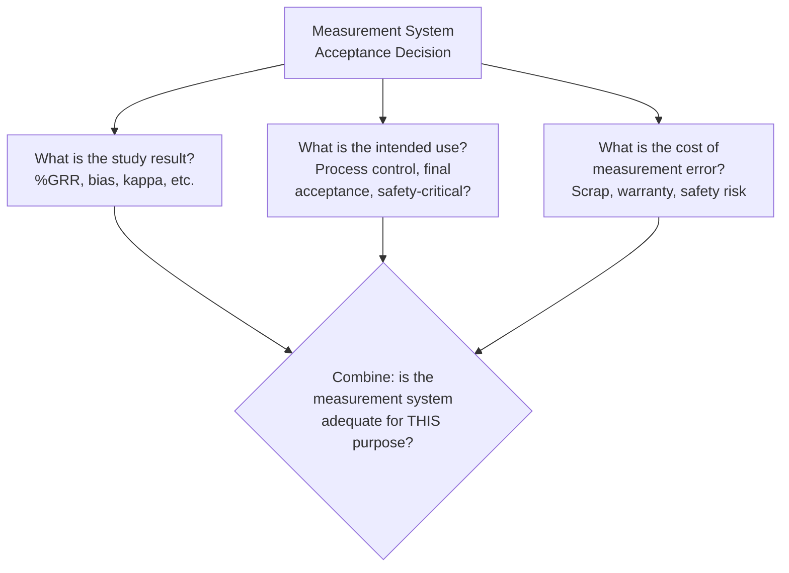
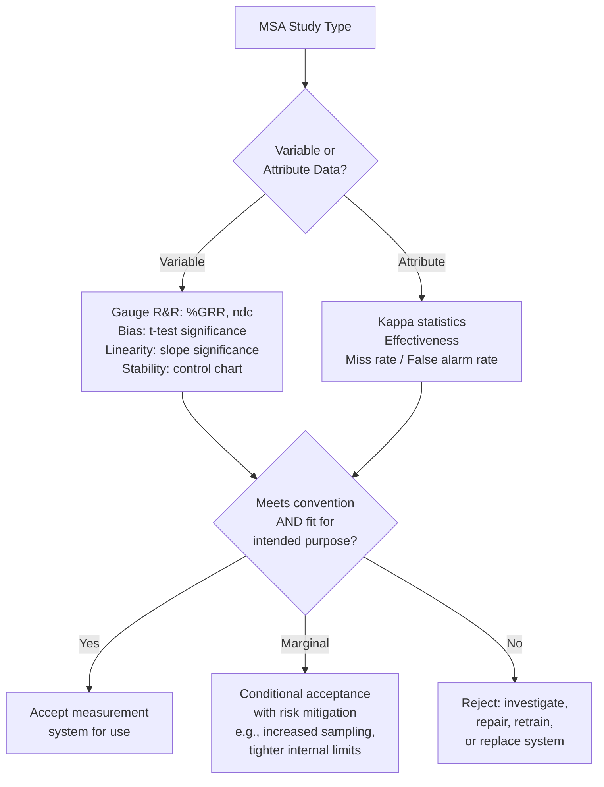

## Acceptance Criteria for Measurement Systems

### Overview

**Acceptance criteria for measurement systems** are the decision thresholds applied to Measurement System Analysis (MSA) study results — Gauge R&R, bias, linearity, stability, and attribute agreement — to determine whether a given measurement system is fit for its intended purpose. Since no measurement system has zero error, the practical question is never "is this gauge perfect?" but "is this gauge's error small enough, relative to what we need to decide, that we can trust its results?" This topic consolidates the acceptance thresholds referenced across the preceding MSA topics into a unified decision framework.

### The Core Principle: Fitness for Purpose

**Key Points**

- Acceptance criteria must always be evaluated **relative to the intended use** of the measurement — the same gauge might be perfectly adequate for one application and inadequate for another, depending on the tolerance being measured, the criticality of the characteristic, and the cost of measurement error.
- There is no single universal numeric standard that applies identically across all industries, standards, and applications; the widely cited thresholds discussed below are common conventions, not fixed statistical laws. [Inference — final acceptance criteria are ultimately determined by the applicable industry standard, customer requirement, contractual agreement, or internal quality policy, which should always take precedence over generic reference-table thresholds]

### Gauge R&R (%GRR) Acceptance Criteria

**Key Points**

- Common industry convention (see prior Gauge R&R topic):

| %GRR (of Tolerance) | Typical Interpretation |
| --- | --- |
| Under 10% | Generally acceptable |
| 10% – 30% | May be acceptable, conditional on application, cost, criticality |
| Over 30% | Generally unacceptable; requires improvement |

- The conditional 10–30% range is where fitness-for-purpose judgment matters most: a %GRR of 22% might be acceptable for a non-critical cosmetic dimension with a generous tolerance, but unacceptable for a safety-critical interference fit with a tight tolerance. [Inference — this is a reasonable extension of the general fitness-for-purpose principle rather than a specifically documented numeric rule]
- **Number of Distinct Categories (ndc)**: commonly cited minimum of $ndc \geq 5$ for a system to adequately support process control decisions (see prior Gauge R&R topic).

### Bias Acceptance Criteria

**Key Points**

- Bias acceptance is generally assessed through two lenses simultaneously:
  1. **Statistical significance**: is the bias significantly different from zero (t-test, see prior Bias/Linearity/Stability topic)?
  2. **Practical significance**: is the bias magnitude small relative to the tolerance, regardless of statistical significance?
- A statistically significant but practically tiny bias (e.g., 0.0002 mm bias against a 0.5 mm tolerance) may be judged acceptable in practice, while a non-significant but practically large bias estimate from a very small sample size might warrant further investigation before acceptance. [Inference — this dual consideration reflects standard MSA guidance emphasizing both statistical and practical significance, though no single universal "acceptable bias as % of tolerance" figure is consistently specified across all references]

### Linearity Acceptance Criteria

**Key Points**

- Assessed via the statistical significance of the regression slope (bias vs. reference value) — a slope not significantly different from zero indicates acceptable linearity (bias is effectively constant across the range).
- As with single-point bias, practical significance matters: even a statistically significant slope may represent a practically negligible change in bias across the tolerance range in question.

### Stability Acceptance Criteria

**Key Points**

- Assessed via standard control chart interpretation (Western Electric/Nelson rules, see prior Control Chart Interpretation topic) applied to periodic reference measurements over time.
- **Acceptance**: the control chart of reference measurements remains in statistical control over the study period, with no trends, shifts, or out-of-control points.
- **Non-acceptance**: any out-of-control signal indicates the measurement system's accuracy is drifting and requires investigation (recalibration, maintenance, or replacement) before continued reliance on the system for acceptance decisions.

### Attribute Agreement Acceptance Criteria

**Key Points**

- Assessed via kappa statistics and effectiveness/miss-rate/false-alarm metrics (see prior Attribute Agreement Analysis topic).
- Common convention: kappa values above roughly 0.75 are often considered indicative of good agreement in a quality/inspection context, though the general statistical literature scale (Landis & Koch) uses a more granular breakdown (substantial: 0.61–0.80; almost perfect: 0.81–1.00). [Inference — specific numeric acceptance thresholds for attribute agreement in a manufacturing/inspection context vary between organizations and standards; no single universal cutoff applies]
- **Miss rate** (defective parts incorrectly accepted) is typically weighted as the more critical failure mode to minimize, given the generally higher cost/risk consequence of shipping nonconforming product compared to a false rejection, though the specific balance depends on the application's cost structure.

### Consolidated Decision Framework

### Risk-Based Acceptance Adjustments

**Key Points**

- **Safety-critical or high-consequence characteristics**: acceptance criteria are often tightened beyond generic conventions — a %GRR that might be "acceptable" for a non-critical dimension may be insufficient for a characteristic tied to functional safety, structural integrity, or regulatory compliance.
- **Low-cost, low-consequence characteristics**: a marginal measurement system may be judged acceptable if the cost of upgrading the gauge exceeds the realistic risk/cost of occasional measurement error, particularly for characteristics with generous tolerances relative to process capability.
- **New product introduction vs. mature production**: acceptance thresholds are sometimes applied more strictly during initial qualification (e.g., PPAP-related gauge studies) than during ongoing production monitoring, reflecting the different consequences of a measurement error at each stage. [Inference — this risk-tiered approach is a reasonable and commonly practiced application of fitness-for-purpose judgment, though it is not a codified universal rule set]

### Conditional Acceptance and Mitigation Strategies

**Key Points**

When a measurement system falls in a marginal or borderline range rather than being clearly accepted or rejected, common mitigation approaches include:

- Increasing sample sizes or measurement replication to average out measurement noise.
- Applying a **guard band** — tightening internal acceptance limits inward from the actual specification limits to account for measurement uncertainty, reducing the risk of accepting a truly nonconforming part or rejecting a truly conforming one due to measurement error.
- Restricting the marginal gauge's use to lower-criticality applications while reserving a more capable measurement system for critical characteristics.
- Scheduling more frequent stability checks or recalibration for a system with known marginal bias/stability performance.

### Worked Example: Applying Fitness-for-Purpose Judgment

A dial indicator used for a runout check shows %GRR = 24% (of tolerance) in a Gauge R&R study.

- **Scenario A**: The characteristic is a non-critical cosmetic runout on a low-cost bracket, tolerance is generous (0.5 mm), and the cost of a more precise gauge would be disproportionate to the part's value. Decision: conditionally accept the current gauge, given the tolerance is wide relative to the measurement error, and monitor ongoing performance.
- **Scenario B**: The same %GRR = 24% applies to a bearing race runout that is safety-critical to rotating equipment performance, with a tight tolerance (0.01 mm) and severe failure consequences. Decision: reject the current measurement system for this application; invest in a higher-precision measurement method (e.g., dedicated runout gauge or CMM-based inspection) despite the same numeric %GRR value.

This illustrates that the identical %GRR figure can lead to opposite acceptance decisions depending entirely on the application context — acceptance criteria are a judgment framework informed by conventions, not a lookup-table verdict.

### Common Pitfalls

- **Treating generic industry thresholds as absolute, universal law**: Applying the 10%/30% Gauge R&R convention (or similar kappa/bias thresholds) mechanically without considering the specific application's criticality, cost, and applicable governing standard.
- **Accepting a measurement system based on a single MSA dimension**: A gauge might show excellent repeatability/reproducibility (%GRR) while carrying an unaddressed bias or stability problem — full acceptance requires considering all relevant MSA properties together, not just the most commonly cited one.
- **Ignoring the customer or regulatory standard's specific requirements**: Many industries (automotive, aerospace, medical device) have customer-specific or regulatory MSA acceptance requirements that supersede generic textbook conventions — these should always be checked and applied when applicable. [Inference — the existence and specifics of such requirements vary by industry and customer; consulting the applicable standard directly is necessary rather than relying on general convention]
- **Failing to re-evaluate acceptance after gauge repair or environment change**: A measurement system previously accepted under one set of conditions (calibration state, environment, appraiser pool) should be re-verified if any of these conditions change materially.
- **Using conditional/marginal acceptance as a permanent state**: Treating a "marginal, conditionally acceptable" gauge as a long-term solution rather than pursuing improvement, when the underlying risk or cost trade-off that justified conditional acceptance may change over time.

**Next Steps**

- Gauge R&R and attribute agreement analysis calculation methods (prerequisite studies)
- Measurement uncertainty budgets and their relationship to acceptance criteria
- Calibration system requirements and recalibration interval determination
- PPAP and customer-specific MSA requirements in regulated industries
- Guard banding methods for specification limits under measurement uncertainty