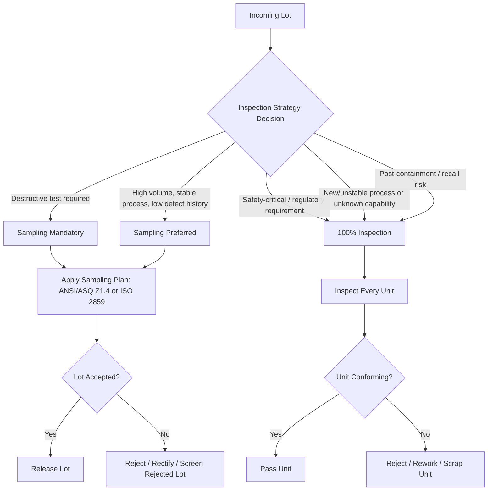

## Sampling versus One Hundred Percent Inspection

### Overview

Sampling inspection and 100% (full/screening) inspection represent two fundamentally different strategies for verifying conformance of a lot or continuous stream of product to specifications. The choice between them is a risk-and-economics decision, not merely a statistical one — it involves trade-offs among inspection cost, inspector fatigue, destructive testing constraints, consumer/producer risk tolerance, and the actual effectiveness of inspection at detecting nonconformities.

### Definitions

**Sampling Inspection**

A statistically-based procedure in which a subset (sample) of items is drawn from a lot or process stream, inspected against acceptance criteria, and the lot is accepted or rejected based on the sample's results, in accordance with a defined sampling plan (e.g., ANSI/ASQ Z1.4, ISO 2859).

**100% Inspection (Screening Inspection)**

Every unit in a lot or production run is inspected against the specification, with nonconforming units removed, reworked, or scrapped. Sometimes called "sorting" or "full inspection."

### Comparative Framework

| Dimension | Sampling Inspection | 100% Inspection |
| --- | --- | --- |
| Coverage | Partial (statistical subset) | Complete (every unit) |
| Cost per lot | Lower | Higher |
| Time | Faster | Slower |
| Applicable to destructive tests | Yes (only option) | No (destroys entire lot) |
| Detection effectiveness | Probabilistic (depends on OC curve) | Theoretically complete, practically imperfect |
| Inspector fatigue effect | Lower impact | Higher impact (accuracy degrades over long runs) |
| Suitable for high-volume/low-defect-rate processes | Yes | Often uneconomical |
| Suitable for critical/safety characteristics | Sometimes, with tightened plans | Often required |
| Encourages process improvement focus | Yes (shifts burden to process control) | Less so (treats symptoms, not causes) |

### Why 100% Inspection Is Not Automatically "Safer"

A common misconception is that 100% inspection guarantees zero defects reach the customer. In practice, inspector detection effectiveness for manual visual or attribute inspection is well-documented to be imperfect, typically ranging from roughly 80% to 95% depending on defect visibility, inspector training, fatigue, and task complexity. This means:

$$P_{escape} = (1 - E)^n$$

where $E$ is single-pass inspection effectiveness and $n$ is the number of independent inspection passes. Even with $E = 0.90$, a single pass leaves a 10% escape probability for any given nonconformity — meaning 100% inspection of a lot with a true defect rate $p$ still allows an expected outgoing defect fraction:

$$p_{AOQ} = p \times (1 - E)$$

This is the theoretical basis for the **Average Outgoing Quality (AOQ)** concept, which is formally used to characterize the residual defect rate after screening under **Rectifying Inspection** programs.

**Key Points**

- 100% inspection does not equal 100% defect detection in practice.
- Repeated/redundant inspection passes reduce but do not eliminate escape probability.
- Automated inspection (vision systems, gauging, CMM) can push $E$ close to but rarely exactly 1.0, subject to measurement system capability.

### When Sampling Inspection Is Preferred

- High production volume where 100% inspection is cost-prohibitive.
- Destructive testing is required (e.g., tensile strength, drop testing, weld pull tests) — sampling is the *only* viable method.
- Historical process capability data ($C_{pk}$) demonstrates a stable, capable process with low defect rates.
- Supplier has demonstrated quality history, allowing reduced/skip-lot sampling per schemes like ANSI/ASQ Z1.4 switching rules.
- Inspection itself introduces handling damage or contamination risk.

### When 100% Inspection Is Preferred or Mandated

- Safety-critical or regulatory-mandated characteristics (e.g., aerospace fasteners, medical device critical dimensions, automotive safety-critical components per IATF 16949 special characteristics).
- Process is new, unstable, or has unknown/unproven capability (early production runs, first-article stages).
- Historical defect rate is high enough that sampling risk (accepting a bad lot) is unacceptable.
- Contractual or customer requirement explicitly specifies full inspection.
- Following a nonconformance or containment action (customer complaint, recall risk mitigation) — 100% sort is standard containment practice.
- Low-volume, high-value items where the cost of a single escape vastly exceeds inspection cost.

### Economic Decision Model

A simplified breakeven comparison balances inspection cost against the cost of an escaped nonconformity:

$$C_{sampling} = n \times c_i + P_a(p) \times N \times c_f$$

$$C_{100\%} = N \times c_i + N \times p \times (1-E) \times c_f$$

Where:

- $n$ = sample size, $N$ = lot size
- $c_i$ = cost per unit inspection
- $c_f$ = cost of a failure/escape reaching the next stage or customer
- $P_a(p)$ = probability of lot acceptance at defect fraction $p$ (from the OC curve)
- $E$ = inspection effectiveness for 100% screening

Sampling becomes economically favorable when $n \ll N$ and $c_f$ is not catastrophically large relative to $c_i$; 100% inspection becomes favorable as $c_f$ grows (e.g., safety recalls, field failures) even though $E < 1$.

**Example**

A lot of $N = 10{,}000$ connectors has a true nonconformance rate $p = 0.5\%$. Inspection cost $c_i = \$0.10$/unit; failure cost if an escape reaches assembly $c_f = \$50$.

- 100% inspection cost: $10{,}000 \times \$0.10 = \$1{,}000$, plus residual escapes at $E=0.90$: $10{,}000 \times 0.005 \times 0.10 \times \$50 = \$250$ → total ≈ $1,250.
- Sampling plan (n=200, single sampling, AQL 1.0%) cost: $200 \times \$0.10 = \$20$, plus expected escape cost depends on $P_a(0.005)$ from the OC curve (typically high acceptance probability at this AQL, so escape cost is proportionally larger across the full lot) — often still lower total cost when $c_f$ is moderate, but the risk profile is fundamentally different (variance, not just expected value).

This illustrates why decision-makers must weigh **risk tolerance and variance**, not just expected cost — sampling accepts a nonzero probability of shipping a fully bad lot.

### Operating Characteristic (OC) Curve Relevance

The OC curve is the core tool distinguishing sampling risk from 100% inspection risk. It plots probability of lot acceptance $P_a$ against true lot fraction defective $p$:

$$P_a(p) = \sum_{d=0}^{c} \binom{n}{d} p^d (1-p)^{n-d}$$

(binomial model; hypergeometric more precise for finite lots without replacement)

100% inspection, by contrast, has no OC curve in the acceptance-sampling sense — every lot is "inspected to disposition," so the relevant curve becomes the **inspection effectiveness curve** as a function of defect type, size, and inspector/system capability rather than sample size and acceptance number.

### Hybrid Approaches

**Rectifying Inspection Plans**

Combine both: sample the lot; if accepted, ship as-is (accepting AOQ risk); if rejected, subject the *entire remaining lot* to 100% screening. This bounds the worst-case outgoing quality via the **Average Outgoing Quality Limit (AOQL)**.

**Skip-Lot Sampling**

Reduces inspection intensity below standard sampling when supplier quality history is excellent — an extension of the sampling philosophy that further reduces inspection burden.

**Tightened–Normal–Reduced Switching**

Per ANSI/ASQ Z1.4, sampling rigor adapts based on recent lot history, dynamically moving between sampling intensities rather than defaulting to fixed 100% inspection.

### Common Pitfalls

- Assuming 100% inspection is a substitute for process control (root cause elimination) rather than a containment measure.
- Using undocumented or ad hoc 100% "resort" activities without measurement system validation, leading to unknown $E$ and false confidence.
- Applying standard sampling plans (e.g., AQL-based) to safety-critical characteristics where any nonconformance is unacceptable — AQL sampling inherently accepts some nonzero defect probability, which is unsuitable for zero-defect-tolerance characteristics.
- Failing to account for inspector fatigue and repetitive-task error rates in long 100% screening runs. [Inference: exact effectiveness degradation curves vary significantly by task and are typically empirically measured via Gauge R&R or Attribute Agreement Analysis studies specific to the inspection task.]

### Related Topics

- Operating Characteristic (OC) Curves and Producer's/Consumer's Risk
- Average Outgoing Quality (AOQ) and AOQL
- ANSI/ASQ Z1.4 / ISO 2859 Sampling Plan Structures
- Rectifying Inspection Programs
- Measurement System Analysis (Attribute Agreement Analysis, Gauge R&R)
- Process Capability ($C_p$, $C_{pk}$) as a Basis for Inspection Strategy Selection
- Skip-Lot and Reduced Inspection Schemes
- Containment Actions in Nonconformance Management