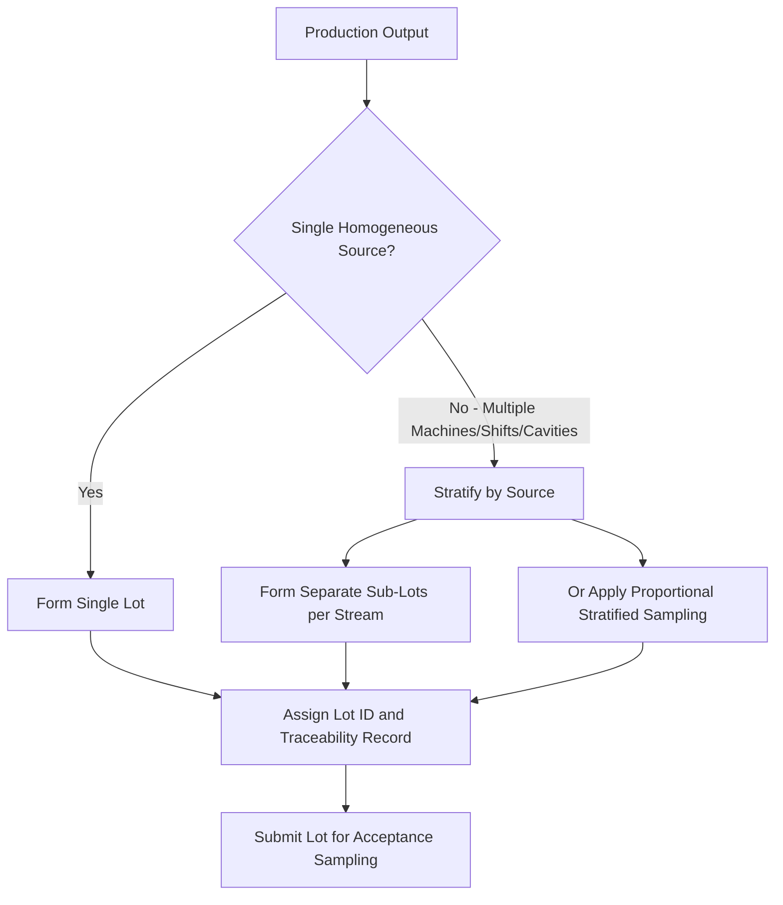
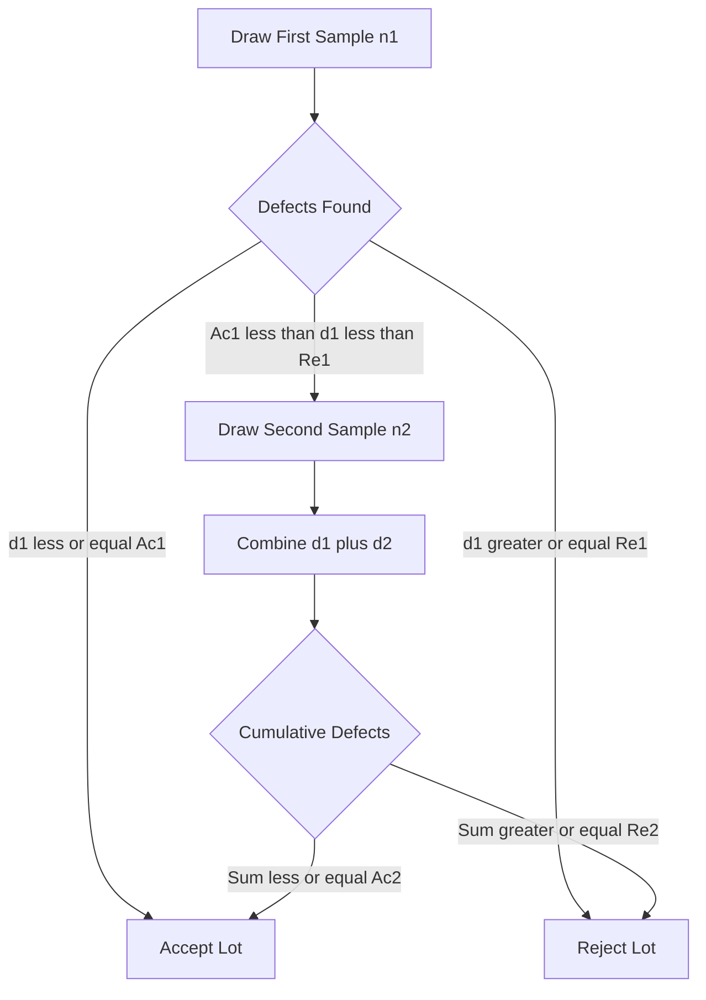

## Lot Formation and Sampling Plan Structure

### Overview

Effective acceptance sampling depends as much on how a lot is *formed* as on the statistical plan used to inspect it. A statistically valid sampling plan applied to a poorly formed lot (one with mixed sources, mixed production dates, or non-random internal structure) can produce misleading acceptance decisions. This topic covers the principles of proper lot formation and the structural components that define a sampling plan.

### Lot Formation Principles

**Definition**

A lot (or batch) is a defined quantity of product, manufactured or assembled under essentially uniform conditions, submitted for inspection as a single unit for acceptance decision purposes.

**Key Principles for Valid Lot Formation**

- **Homogeneity**: Units within a lot should originate from a single, uniform source — same machine, same shift, same raw material batch, same process settings — so that a sample drawn from any part of the lot is representative of the whole.
- **Traceability**: Each lot must be identifiable and traceable to its production record (date, line, operator, material lot) to support root cause investigation if rejected.
- **Physical Accessibility**: Units must be arranged so random or systematic sampling is physically practical (e.g., not buried at the bottom of a sealed container).
- **Segregation**: Lots should be physically separated and clearly identified/labeled to prevent commingling with other lots, especially accepted vs. rejected material.
- **Consistent Lot Size**: Where feasible, maintaining consistent lot sizes simplifies application of standard sampling tables and switching rules.

**Key Points**

- Violating homogeneity is one of the most common root causes of sampling plan failure in practice — a sample can look statistically fine while masking a defective sub-population within a mixed lot.
- Lots formed by combining multiple shifts, machines, or suppliers without stratification undermine the statistical assumptions (independence, representativeness) underlying the sampling plan's OC curve.

### Consequences of Poor Lot Formation

| Poor Practice | Consequence |
| --- | --- |
| Mixing multiple production shifts into one lot | Sample may miss a defective sub-batch entirely (non-representative sampling) |
| Combining supplier shipments from different dates | Loses traceability; rejection cannot be attributed to a specific cause |
| Inconsistent lot sizes | Complicates use of standard tables (e.g., ANSI/ASQ Z1.4 lot-size code letters) |
| Sampling only from top layer of a container | Systematic bias if defects cluster by fill order or settling |
| No physical segregation of rejected lots | Risk of rejected material re-entering the accepted stream |

### Stratified Lot Formation

When production naturally occurs across multiple streams (e.g., multiple cavities in a mold, multiple spindles on a machine), stratified sampling within lot formation ensures each stream is proportionally represented rather than assuming a single random draw captures all sources equally.

### Sampling Plan Structure

A sampling plan is the formal statistical protocol that specifies how a sample is drawn and how the accept/reject decision is made. Its structure consists of the following core parameters.

**1. Lot Size ($N$)**

The total number of units in the lot being inspected. Determines the applicable sample size code letter in standardized systems (e.g., ANSI/ASQ Z1.4).

**2. Sample Size ($n$)**

The number of units drawn from the lot for inspection. May be fixed (single sampling) or determined progressively (double/multiple/sequential sampling).

**3. Acceptance Number ($Ac$ or $c$)**

The maximum number of nonconforming units (or defects) permitted in the sample for the lot to still be accepted.

**4. Rejection Number ($Re$)**

The minimum number of nonconforming units in the sample that causes lot rejection. In single sampling, typically $Re = Ac + 1$.

**5. Acceptable Quality Level (AQL)**

The worst tolerable process average defect rate that, for purposes of sampling inspection, is considered acceptable as a process average when a continuing series of lots is submitted (per ANSI/ASQ Z1.4 definition).

**6. Inspection Level**

Determines the relationship between lot size and sample size (General Levels I, II, III; Special Levels S-1 through S-4), reflecting the discriminating power desired relative to inspection cost.

**7. Sampling Type**

| Type | Structure |
| --- | --- |
| Single Sampling | One sample of size $n$; accept if defects $\leq Ac$ |
| Double Sampling | First sample taken; if result is inconclusive (between accept and reject thresholds), a second sample is drawn and combined for final decision |
| Multiple Sampling | Extends double sampling to several successive smaller samples |
| Sequential Sampling | Units inspected one at a time (or in small groups); cumulative results plotted against decision boundaries after each unit, allowing earliest possible accept/reject decision |

**8. Switching Rules**

Govern movement between Normal, Tightened, and Reduced inspection based on recent lot acceptance/rejection history — a structural feature of continuous-lot sampling systems like ANSI/ASQ Z1.4, not a property of a single isolated plan.

### Sampling Plan Structure — Single Sampling Example

**Example**

Lot size $N = 5{,}000$, Inspection Level II, AQL = 1.0% (ANSI/ASQ Z1.4):

- Sample size code letter: L
- Sample size $n = 200$
- $Ac = 5$, $Re = 6$

Decision rule: Inspect 200 units drawn from the lot. If 5 or fewer nonconforming units are found, accept the lot. If 6 or more are found, reject the lot.

### Double Sampling Structure

### Relationship Between Lot Formation and Plan Structure

The two topics are interdependent: a sampling plan's OC curve mathematically assumes the sample is drawn randomly from a homogeneous, well-defined lot. If lot formation violates homogeneity or randomness assumptions:

- The hypergeometric/binomial probability model underlying $P_a(p)$ no longer accurately reflects real acceptance risk.
- Standardized tables (Z1.4, ISO 2859-1) become statistically invalid even though procedurally they were "followed correctly."

[Inference: The magnitude of risk introduced by lot formation violations is highly context-dependent — clustering severity and defect distribution patterns determine actual impact, and are typically only quantified through targeted studies of the specific process.]

### Common Pitfalls

- Treating "lot" as a purely administrative/paperwork boundary (e.g., one purchase order) rather than a production-homogeneity boundary.
- Failing to re-form lots when a process change (tooling change, material lot change, setup adjustment) occurs mid-run.
- Applying standard table sample sizes without verifying the lot size code letter matches actual current lot size (recalculation needed if lot sizes vary shipment to shipment).
- Ignoring physical sampling location bias (e.g., only sampling from accessible top layers of packaging).

### Related Topics

- ANSI/ASQ Z1.4 / ISO 2859 Standard Sampling Systems
- Operating Characteristic (OC) Curves
- Random Sampling Techniques and Randomization Bias
- Stratified and Cluster Sampling Methods
- Switching Rules: Normal, Tightened, Reduced Inspection
- Rectifying Inspection and AOQL
- Producer's Risk and Consumer's Risk