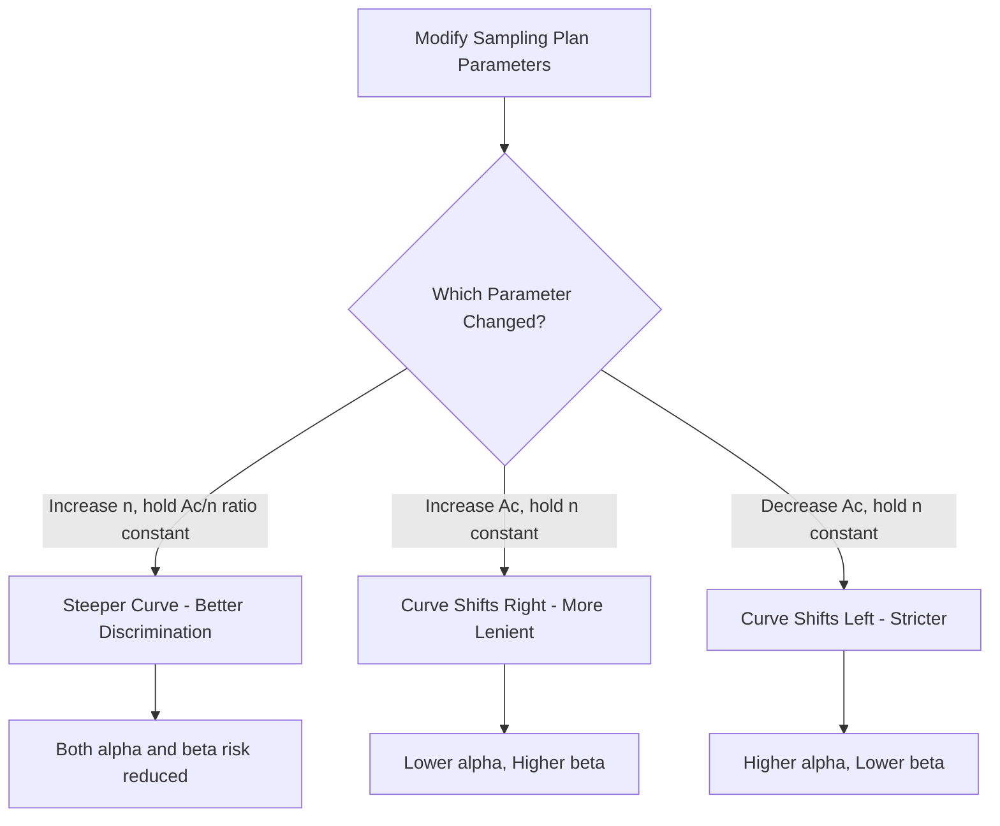

## Operating Characteristic Curves

### Overview

The Operating Characteristic (OC) curve is the central analytical tool in acceptance sampling. It graphically and mathematically characterizes the discriminating power of a sampling plan — that is, the probability that a lot will be accepted as a function of its true (but unknown) fraction nonconforming. Every sampling plan has a unique OC curve, and understanding it is essential for selecting a plan that balances producer and consumer risk appropriately.

### Definition

The OC curve plots the **probability of lot acceptance** $P_a$ on the vertical axis against the **true lot fraction nonconforming** $p$ on the horizontal axis, for a given sampling plan defined by sample size $n$ and acceptance number $Ac$.

$$P_a(p) = P(\text{lot accepted} \mid \text{true fraction nonconforming} = p)$$

### Mathematical Models

**Hypergeometric Distribution (exact, finite lot)**

Used when sampling without replacement from a finite lot of size $N$ containing $D = pN$ nonconforming units:

$$P_a(p) = \sum_{d=0}^{Ac} \frac{\binom{D}{d}\binom{N-D}{n-d}}{\binom{N}{n}}$$

**Binomial Distribution (approximation)**

Valid when $n/N \leq 0.1$ (sample is small relative to lot size), simplifying computation:

$$P_a(p) = \sum_{d=0}^{Ac} \binom{n}{d} p^d (1-p)^{n-d}$$

**Poisson Distribution (approximation)**

Valid when $n$ is large and $p$ is small (common in low-AQL applications), using $\lambda = np$:

$$P_a(p) = \sum_{d=0}^{Ac} \frac{e^{-\lambda}\lambda^d}{d!}$$

**Key Points**

- The Poisson approximation is widely used in practice for constructing standard OC curve tables because it depends only on $np$, simplifying tabulation across many $(n, Ac)$ combinations.
- Binomial and hypergeometric converge as $N \to \infty$ relative to $n$; for most industrial lot sizes with $n/N < 0.1$, the binomial approximation is considered adequate. [Inference: the specific threshold at which the approximation error becomes practically significant depends on the required decision precision for the application.]

### Shape and Characteristics of the OC Curve

An ideal OC curve would be a vertical step function: accept all lots with $p \leq AQL$ with probability 1, reject all lots with $p > AQL$ with probability 0. No real sampling plan achieves this because inspection is based on a partial sample, not the full lot (this ideal is only achievable via 100% inspection with perfect effectiveness).

Real OC curves are smooth, monotonically decreasing S-shaped curves:

- $P_a$ near 1.0 when $p$ is very small (good lots almost always accepted).
- $P_a$ decreases as $p$ increases.
- $P_a$ near 0 when $p$ is large (bad lots almost always rejected).
- The steepness of the curve's descent reflects the plan's **discriminating power** — steeper curves discriminate better between good and bad lots.

```mermaid
flowchart LR
    subgraph OC_Curve_Behavior [OC Curve Shape (svg_diagram)]
    A["Low p: Pa near 1.0<br/>Good lots accepted"] --> B["AQL point:<br/>Pa = 1 - alpha<br/>Producer's Risk region"]
    B --> C["Indifference zone:<br/>Pa transitioning"]
    C --> D["LTPD/RQL point:<br/>Pa = beta<br/>Consumer's Risk region"]
    D --> E["High p: Pa near 0<br/>Bad lots rejected"]
    end
```

### Key Reference Points on the OC Curve

**Acceptable Quality Level (AQL)**

The quality level that represents the boundary of acceptable process average quality. At $p = AQL$, the OC curve gives a high probability of acceptance (commonly around 0.95, though this varies by specific plan).

**Producer's Risk ($\alpha$)**

The probability of rejecting a lot that is actually at or better than the AQL — a "false rejection" of good quality. Conventionally denoted:

$$\alpha = 1 - P_a(AQL)$$

**Lot Tolerance Percent Defective (LTPD) / Rejectable Quality Level (RQL)**

The quality level considered unacceptable by the consumer; the OC curve gives a low probability of acceptance at this point (commonly around 0.10).

**Consumer's Risk ($\beta$)**

The probability of accepting a lot that is actually at or worse than the LTPD — a "false acceptance" of bad quality:

$$\beta = P_a(LTPD)$$

**Indifference Quality Level (IQL)**

The quality level, typically near $P_a = 0.50$, at which the decision-maker is statistically "indifferent" between accepting and rejecting.

| Reference Point | Typical $P_a$ | Risk Represented |
| --- | --- | --- |
| AQL | ≈ 0.95 | Producer's Risk ($\alpha$) — good lot rejected |
| IQL | ≈ 0.50 | Neither risk dominates |
| LTPD/RQL | ≈ 0.10 | Consumer's Risk ($\beta$) — bad lot accepted |

### Effect of Sample Size and Acceptance Number on Curve Shape

- **Increasing $n$ while holding $Ac/n$ constant**: Steepens the OC curve, improving discrimination between good and bad lots (reduces both risks simultaneously at the cost of higher inspection expense).
- **Increasing $Ac$ while holding $n$ constant**: Shifts the curve to the right (more lenient plan — higher $P_a$ across all $p$), increasing consumer's risk but decreasing producer's risk.
- **Decreasing $Ac$ while holding $n$ constant**: Shifts curve to the left (stricter plan), decreasing consumer's risk but increasing producer's risk.



### Type A vs Type B OC Curves

**Type A OC Curve**

Applies to isolated/individual lots; calculated using the hypergeometric distribution since the lot is finite and specific.

**Type B OC Curve**

Applies to a continuous stream of lots from a stable process; calculated using the binomial or Poisson distribution, treating $p$ as a long-run process average rather than a specific finite-lot count.

Most published standard tables (e.g., ANSI/ASQ Z1.4) are constructed using Type B curves, since they're designed for ongoing supplier relationships rather than isolated lot acceptance.

### Example

**Example**

Sampling plan: $n = 89$, $Ac = 2$ (Poisson approximation).

At $p = 0.01$ (1% defective): $\lambda = np = 0.89$

$$P_a = e^{-0.89}\left(1 + 0.89 + \frac{0.89^2}{2}\right) \approx 0.937$$

At $p = 0.05$ (5% defective): $\lambda = 4.45$

$$P_a = e^{-4.45}\left(1 + 4.45 + \frac{4.45^2}{2}\right) \approx 0.174$$

This shows the plan accepts lots at 1% defective with ~93.7% probability but drops to ~17.4% probability of acceptance at 5% defective — illustrating discrimination between good and marginal lots.

### Comparing OC Curves Across Plans

When selecting among multiple candidate sampling plans, overlaying their OC curves allows direct visual/numerical comparison of:

- Which plan better protects the producer at the AQL.
- Which plan better protects the consumer at the LTPD.
- The relative inspection cost ($n$) required to achieve a desired discrimination level.

**Key Points**

- No single sampling plan can simultaneously minimize both $\alpha$ and $\beta$ without increasing $n$ — this is an inherent statistical trade-off, not a plan design flaw.
- Matching plans (e.g., via the Cameron tables or software-based plan search) are often constructed by specifying desired $(AQL, \alpha)$ and $(LTPD, \beta)$ pairs and solving for $(n, Ac)$ that best satisfies both simultaneously.

### Common Pitfalls

- Interpreting AQL as a "quality target" rather than a risk-based boundary — AQL is not a guarantee that shipped lots are that quality, only that lots at that quality have a defined high acceptance probability.
- Assuming a steeper OC curve is always "better" without accounting for the higher inspection cost required to achieve it.
- Using Type B (continuous stream) curves to evaluate a truly isolated, one-time lot decision, where Type A hypergeometric treatment would be more appropriate.
- Confusing the AQL point on the OC curve with the acceptance number $Ac$ — they are related but distinct concepts ($Ac$ is a plan parameter; AQL is a quality reference point on the resulting curve).

### Related Topics

- Producer's Risk and Consumer's Risk in Detail
- ANSI/ASQ Z1.4 / ISO 2859 Standard Sampling Systems
- Average Outgoing Quality (AOQ) and AOQL
- Lot Formation and Sampling Plan Structure
- Double and Multiple Sampling Plan OC Curves
- Sequential Sampling and SPRT (Sequential Probability Ratio Test)