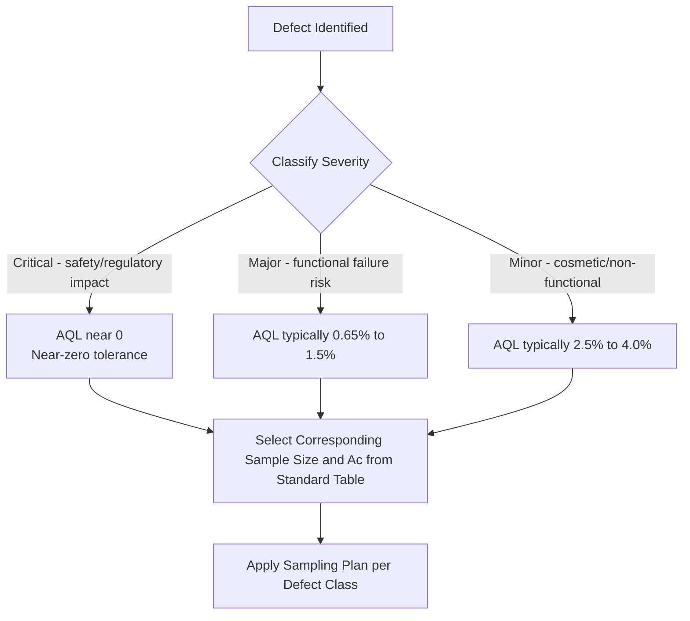

## Acceptable Quality Level Concepts

### Overview

Acceptable Quality Level (AQL) is one of the foundational concepts in acceptance sampling, defining the boundary of quality that a sampling plan is designed to treat as satisfactory when evaluating a continuing series of lots from a supplier or process. Despite its widespread use, AQL is frequently misunderstood as a quality *target* rather than what it actually is: a statistically defined risk boundary embedded in a sampling plan's design.

### Formal Definition

Per ANSI/ASQ Z1.4 (and equivalently ISO 2859-1), the AQL is defined as:

> The quality level that is the worst tolerable process average when a continuing series of lots is submitted for acceptance sampling.

Critically, AQL is a property of the **sampling plan's design intent**, not a guarantee about any individual lot's actual quality, and not a specification that shipped product must meet.

### AQL as a Point on the OC Curve

AQL corresponds to a specific point on a sampling plan's Operating Characteristic (OC) curve — the fraction nonconforming $p$ at which the plan yields a high probability of acceptance, conventionally near $P_a = 0.95$ for the associated single sampling plans in standard tables, though the exact $P_a$ at the tabulated AQL varies plan-to-plan due to the discrete nature of $(n, Ac)$ combinations.

$$P_a(AQL) \approx 1 - \alpha$$

where $\alpha$ is the Producer's Risk — the probability that a lot genuinely at the AQL quality level will still be rejected by chance sampling variation.

**Key Points**

- AQL does not mean "the quality level the customer wants" — it means "the quality level at which the sampling plan is designed to usually (but not always) accept the lot."
- A lot can be accepted under an AQL-based plan even though it contains some nonconforming units — AQL sampling inherently tolerates a nonzero, quantified probability of both good-lot rejection and marginal-lot acceptance.
- AQL values are typically expressed as a percentage defective or as defects per hundred units (DHU).

### AQL Selection Considerations

Choosing an appropriate AQL value is a business and engineering risk decision, not a purely statistical one. Considerations include:

| Factor | Influence on AQL Selection |
| --- | --- |
| Severity of defect (critical/major/minor classification) | Critical defects warrant much tighter (lower) AQLs, often near-zero |
| Downstream cost of a nonconformity | Higher downstream cost → lower AQL |
| Process capability history | Mature, capable processes can support tighter AQLs economically |
| Customer/contractual/regulatory requirements | May mandate specific AQL values regardless of internal preference |
| Inspection cost constraints | Very low AQLs require larger sample sizes, raising inspection cost |

### Defect Classification and Differentiated AQLs

A common industrial practice (formalized in ANSI/ASQ Z1.4) is assigning different AQLs by defect severity classification within the same lot:

**Critical Defects**

Defects that could result in hazardous or unsafe conditions, or noncompliance with regulations. Typically assigned AQL = 0 or a very small value (e.g., 0.065%), often requiring 100% inspection or near-zero acceptance tolerance rather than standard sampling.

**Major Defects**

Defects likely to result in failure, or materially reduce the usability of the unit for its intended purpose. Common AQL range: 0.65% – 1.5%.

**Minor Defects**

Defects that do not materially reduce usability but represent a departure from established standards (e.g., cosmetic imperfections). Common AQL range: 2.5% – 4.0%.

### AQL and Sample Size Relationship

Within a standardized system like ANSI/ASQ Z1.4, once lot size (via sample size code letter) and Inspection Level are fixed, the AQL value determines the acceptance number $Ac$ and rejection number $Re$ for the fixed sample size $n$. Lower AQL values, for the same sample size, require a smaller $Ac$ (stricter plan); to maintain a reasonable producer's risk at very low AQLs, larger sample sizes are typically needed.

$$n \propto \frac{1}{AQL} \text{ (approximate relationship for fixed risk points)}$$

[Inference: this is a general tendency observed in standard tables rather than an exact formula; actual sample size progression in Z1.4/ISO 2859-1 tables follows discrete code-letter steps rather than a continuous function of AQL.]

### AQL Misconceptions

**Key Points**

- **Misconception**: "AQL is the maximum defect rate we will accept." **Reality**: AQL is the defect rate at which lots have a high (not certain) probability of acceptance; lots with higher defect rates can still occasionally be accepted, and lots at the AQL can occasionally be rejected.
- **Misconception**: "If our AQL is 1.0%, our shipped quality will be about 1.0% defective." **Reality**: Actual outgoing quality depends on the true process average defect rate relative to AQL, not on the AQL value itself — a process running well below its stated AQL will ship much better quality than the AQL number suggests.
- **Misconception**: "Passing AQL sampling means the lot is good." **Reality**: It means the lot was not rejected by the sample evidence at the chosen risk level — a probabilistic, not absolute, statement.

### AQL in Relation to Average Outgoing Quality (AOQ)

AQL characterizes the *sampling plan's decision threshold*, while AOQ characterizes the *actual expected outgoing quality* after applying a rectifying inspection program (where rejected lots are 100% screened). These are related but distinct:

$$AOQ = \frac{P_a(p) \times p \times (N-n)}{N}$$

The Average Outgoing Quality Limit (AOQL) — the worst-case AOQ across all possible incoming $p$ values — is often a more meaningful long-run quality metric than AQL alone, since it accounts for the rectification of rejected lots.

### Example

**Example**

A supplier submits lots at AQL = 1.5%, Inspection Level II, lot size $N = 3{,}000$ (code letter K per ANSI/ASQ Z1.4):

- Sample size $n = 125$
- $Ac = 5$, $Re = 6$

If the supplier's true long-run process average is actually 0.5% defective (well below the AQL), the OC curve indicates a very high acceptance probability (well above 95%), and the customer receives predominantly high-quality lots despite the "1.5% AQL" label — the AQL is a contractual sampling boundary, not the expected shipped quality.

### AQL in Modern Practice and Alternatives

Many quality-mature organizations are shifting away from AQL-based acceptance sampling toward:

- **Statistical Process Control (SPC)** and process capability monitoring ($C_{pk}$), preventing defects rather than sorting them after the fact.
- **Skip-lot and reduced sampling** as supplier quality history improves, reducing reliance on lot-by-lot AQL decisions.
- **Zero Acceptance Number (c=0) plans**, which eliminate the "some defects tolerated" aspect of standard AQL tables for critical characteristics, at the cost of requiring larger sample sizes for equivalent producer's risk.

[Inference: The trend toward reduced dependence on traditional AQL sampling in favor of process-based quality assurance reflects broader industry practice, though the specific extent of adoption varies by industry and regulatory context.]

### Common Pitfalls

- Setting AQL based on historical convention without linking it to actual defect severity/risk classification.
- Using a single blanket AQL across critical, major, and minor defects rather than differentiated AQLs.
- Communicating AQL to customers/stakeholders as a quality guarantee rather than a sampling risk parameter.
- Failing to revisit AQL values as process capability improves — an AQL set for an immature process may be unnecessarily loose (or costly to inspect against) once the process matures.

### Related Topics

- Operating Characteristic (OC) Curves
- Producer's Risk and Consumer's Risk
- ANSI/ASQ Z1.4 / ISO 2859 Standard Sampling Systems
- Average Outgoing Quality (AOQ) and AOQL
- Critical, Major, Minor Defect Classification Systems
- Zero Acceptance Number (c=0) Sampling Plans
- Process Capability Indices ($C_p$, $C_{pk}$) as Alternatives to Lot Sampling