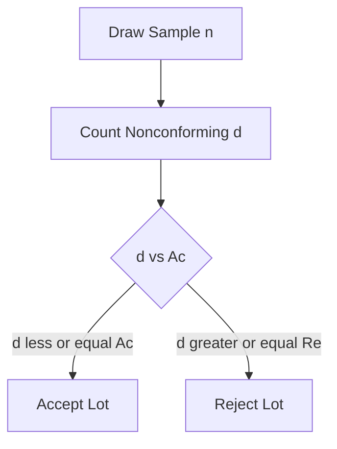
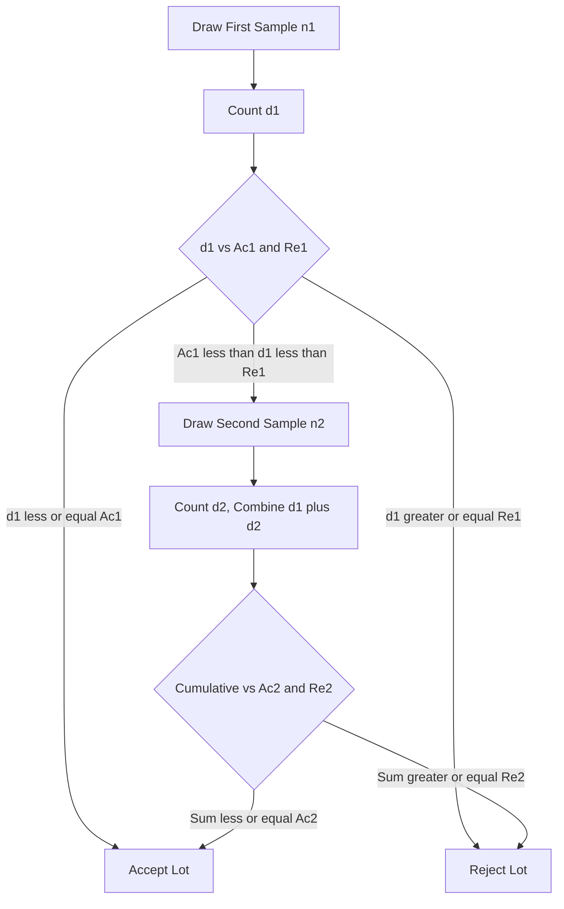
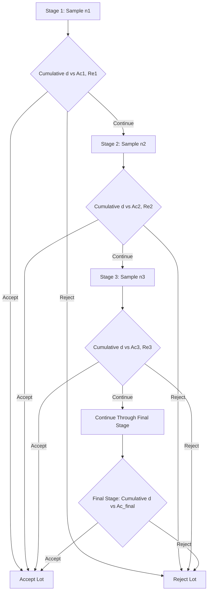

## Single, Double, and Multiple Sampling Plans

### Overview

Sampling plan *type* refers to the structural procedure by which samples are drawn and decisions are made, independent of the acceptance criteria (AQL, risk points) chosen. The three principal types — single, double, and multiple sampling — represent increasingly complex procedures that trade administrative simplicity for reduced average sample size. All three can be constructed to achieve statistically equivalent OC curves; the choice among them is primarily an operational and economic decision.

### Single Sampling Plans

**Structure**

One sample of fixed size $n$ is drawn from the lot. The number of nonconforming units $d$ is counted and compared against a single acceptance number $Ac$.

**Decision Rule**

$$\text{Accept if } d \leq Ac; \quad \text{Reject if } d \geq Re \text{ (where typically } Re = Ac + 1\text{)}$$

**Characteristics**

- Simplest to administer and explain.
- Fixed, predictable sample size and inspection duration.
- Requires the largest average sample size among the three types for equivalent discrimination.
- Most widely used in practice due to administrative simplicity, especially in ANSI/ASQ Z1.4 and ISO 2859-1 standard tables.

### Double Sampling Plans

**Structure**

A first sample of size $n_1$ is drawn. Based on the result, the lot may be immediately accepted, immediately rejected, or — if the result falls in an inconclusive middle zone — a second sample of size $n_2$ is drawn, and the combined results from both samples determine the final decision.

**Parameters**

- $n_1, n_2$ — first and second sample sizes
- $Ac_1, Re_1$ — accept/reject numbers after first sample
- $Ac_2, Re_2$ — accept/reject numbers after combined samples

**Decision Rule**

After first sample ($d_1$ = defects found):

$$\text{Accept if } d_1 \leq Ac_1; \quad \text{Reject if } d_1 \geq Re_1; \quad \text{Otherwise, draw second sample}$$

After second sample (cumulative $d_1 + d_2$):

$$\text{Accept if } d_1+d_2 \leq Ac_2; \quad \text{Reject if } d_1+d_2 \geq Re_2$$

**Characteristics**

- Reduces average sample size (ASN) compared to single sampling for the same discriminating power, particularly when lots are either very good or very bad (the decision is often reached after only the first, smaller sample).
- More administratively complex — requires tracking two-stage logic and clear procedures for the "inconclusive" zone.
- ASN varies by lot quality — approaches $n_1$ for very good or very bad lots, approaches $n_1 + n_2$ for marginal lots.

### Multiple Sampling Plans

**Structure**

Extends the double sampling concept to several (typically up to 5–7) successive smaller samples. After each stage, the cumulative defect count is compared against stage-specific accept/reject numbers; if inconclusive, another (smaller) sample is drawn.

**Characteristics**

- Further reduces Average Sample Number (ASN) compared to double sampling for equivalent discrimination.
- Highest administrative complexity — requires careful record-keeping across multiple stages and clear operational procedures to avoid errors.
- Individual stage sample sizes are typically smaller than in double sampling, making each stage faster, but the overall procedure has more decision points.
- Represents a practical step toward the theoretical limit approached by sequential sampling (item-by-item testing with continuously updated decision boundaries).

### Comparative Summary

| Attribute | Single Sampling | Double Sampling | Multiple Sampling |
| --- | --- | --- | --- |
| Number of stages | 1 | Up to 2 | Typically 5–7 |
| Average Sample Number (ASN) | Highest (fixed $n$) | Lower than single | Lowest of the three |
| Administrative complexity | Lowest | Moderate | Highest |
| Decision speed for clear-cut lots | Fixed duration | Faster (often resolved at stage 1) | Fastest (often resolved early) |
| Recordkeeping burden | Minimal | Moderate | Significant |
| Common use case | General industrial inspection, simplicity valued | Cost-sensitive, high-volume inspection | Very high-volume, cost-critical inspection with trained staff |
| OC curve | Can be matched to any type below | Matched to equivalent single plan | Matched to equivalent single/double plan |

### Average Sample Number (ASN) Curve

The ASN curve plots the expected (average) sample size required to reach a decision as a function of the true lot fraction defective $p$, distinguishing double and multiple sampling from single sampling's constant $n$.

$$ASN(p) = n_1 + n_2 \times P(\text{second sample required} \mid p)$$

For double sampling, $ASN(p)$ is typically lowest at the extremes (very good or very bad lots resolve quickly at stage 1) and highest near the indifference quality level, where the decision is frequently inconclusive after the first sample.

**Key Points**

- The reduction in ASN is the primary economic justification for choosing double or multiple sampling over single sampling.
- The ASN reduction is most pronounced when incoming quality is consistently either very good or very bad; it is smallest when incoming quality frequently falls in the indifference zone.
- Equivalent OC curves across single, double, and multiple plans can be designed (matched at the same AQL/LTPD risk points), meaning the *choice* between them does not have to sacrifice discriminating power — it is primarily an ASN/administrative trade-off.

### Example

**Example**

A supplier's lot size code letter is L (per ANSI/ASQ Z1.4), AQL = 1.0%:

*Single sampling*: $n = 200$, $Ac = 5$, $Re = 6$

*Double sampling* (approximately matched OC curve): $n_1 = 125$, $Ac_1 = 2$, $Re_1 = 5$; if inconclusive, $n_2 = 125$, $Ac_2 = 6$, $Re_2 = 7$ (cumulative). For a very good incoming lot (true $p$ near 0), the decision is very likely to be resolved after the first 125-unit sample, yielding a substantial ASN reduction versus the fixed 200-unit single sample.

[Inference: exact matched-plan parameter values depend on the specific standard table/edition used and the risk points selected for matching; the example illustrates the structural principle rather than a universally fixed value.]

### Selecting Among Plan Types

| Consideration | Favors Single | Favors Double/Multiple |
| --- | --- | --- |
| Inspection staff training level | Lower-skill inspectors, simple rule application | Trained inspectors comfortable with multi-stage logic |
| Recordkeeping systems | Manual/paper-based, simple tracking | Automated data systems tracking cumulative counts |
| Incoming quality variability | Highly variable, unpredictable | Consistently good or consistently poor (extremes) |
| Inspection cost sensitivity | Less cost-sensitive | High cost per unit inspected, ASN savings valuable |
| Need for administrative simplicity/auditability | High | Lower priority |

### Common Pitfalls

- Assuming double/multiple sampling always reduces inspection cost — for lots frequently falling in the indifference zone, ASN can approach or exceed the equivalent single sampling size.
- Implementing double/multiple sampling without adequate staff training, leading to errors in tracking cumulative counts across stages.
- Failing to verify that double/multiple plan parameters are properly matched to the intended AQL/LTPD risk points (using mismatched tables can silently shift producer's/consumer's risk).
- Treating the plan type choice as a statistical decision when it is primarily an operational/cost trade-off, given that equivalent OC curves are achievable across all three types.

### Related Topics

- Operating Characteristic (OC) Curves
- Average Sample Number (ASN) Curves
- Sequential Sampling and SPRT (Sequential Probability Ratio Test)
- ANSI/ASQ Z1.4 / ISO 2859 Standard Sampling Systems
- Acceptable Quality Level Concepts
- Lot Formation and Sampling Plan Structure