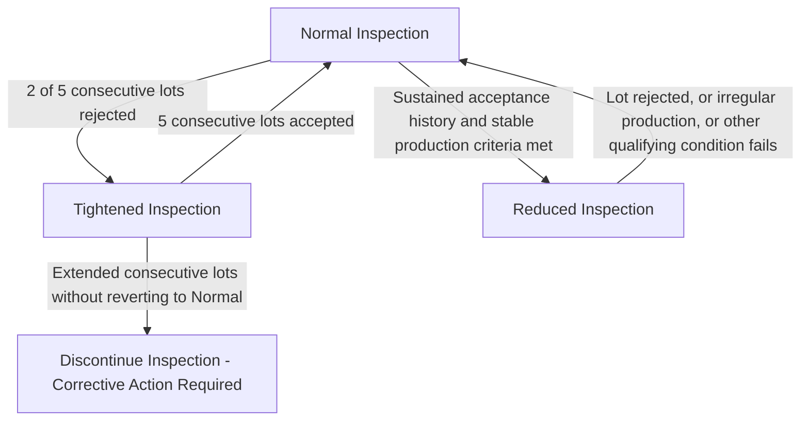
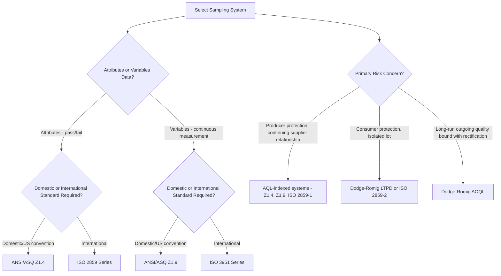

## Standard Sampling Plan Systems

### Overview

Rather than designing sampling plans from first principles for every application, industry relies on published, standardized sampling plan systems that provide pre-tabulated sample sizes, acceptance numbers, and switching rules for common inspection scenarios. These systems codify decades of statistical and practical experience into ready-to-use tables, ensuring consistency, auditability, and interoperability across suppliers and customers.

### ANSI/ASQ Z1.4 (Attributes Sampling)

**Origin and Scope**

Derived from the U.S. military standard MIL-STD-105E, ANSI/ASQ Z1.4 is the dominant attributes-based (pass/fail, go/no-go) acceptance sampling system in American industry. It provides sampling plans for inspection by attributes across single, double, and multiple sampling structures.

**Core Structure**

- Lot size determines a **sample size code letter** (A through R) via a lookup table, cross-referenced with the chosen **Inspection Level** (General I, II, III; Special S-1 to S-4).
- The code letter, combined with the specified **AQL**, indexes into master tables to yield $n$, $Ac$, and $Re$.
- Includes formal **switching rules** governing movement between Normal, Tightened, and Reduced inspection based on recent lot history.

**Switching Rules Logic**

- **Normal → Tightened**: Triggered when 2 of 5 consecutive lots are rejected under normal inspection.
- **Tightened → Normal**: Triggered after 5 consecutive lots are accepted under tightened inspection.
- **Normal → Reduced**: Triggered when a specified number of consecutive lots have been accepted under normal inspection and other qualifying conditions are met (e.g., stable production, no lot rejections in a defined preceding period).
- **Discontinuation**: If tightened inspection continues for a specified number of consecutive lots without reverting to normal, inspection under the plan is discontinued pending corrective action.

**Key Points**

- Z1.4 tables are organized so that within a single AQL column, the OC curve remains approximately consistent across different lot size code letters — a design feature intended to provide comparable protection regardless of lot size.
- Z1.4 is attributes-only; it does not cover variables (continuous measurement) sampling.

### ANSI/ASQ Z1.9 (Variables Sampling)

**Scope**

The variables-data counterpart to Z1.4, used when the quality characteristic is measured on a continuous scale (e.g., dimension, weight, force) rather than simply classified as conforming/nonconforming.

**Key Distinction from Attributes Sampling**

Variables sampling plans use the sample mean and standard deviation (or range) of a continuous measurement, compared against calculated acceptability constants, rather than simply counting nonconforming units.

$$Q_U = \frac{USL - \bar{x}}{s}, \quad Q_L = \frac{\bar{x} - LSL}{s}$$

The computed $Q$ statistic is compared to a tabulated acceptability constant $k$ for the given sample size and AQL; the lot is accepted if $Q \geq k$ (or equivalent form depending on the specific procedure — Method A "Standard Deviation Method" or Method B "Range Method").

**Advantages of Variables Sampling**

- Achieves equivalent statistical protection (comparable OC curve) with substantially smaller sample sizes than attributes sampling, since continuous measurements carry more information per unit than a binary pass/fail classification.
- Provides richer process information (how far units are from limits, not just whether they pass).

**Disadvantages**

- Requires the underlying characteristic to be reasonably well-approximated by a normal distribution for the standard procedures to be valid.
- More complex to administer — requires actual measurement and calculation rather than simple attribute counting.
- A separate variables plan is generally needed per characteristic, whereas one attributes sample can screen multiple attributes simultaneously.

### ISO 2859 Series (International Attributes Sampling)

**Scope**

The international counterpart to Z1.4, closely related in structure and largely harmonized in modern editions.

- **ISO 2859-1**: Sampling schemes indexed by AQL for lot-by-lot inspection — structurally parallel to ANSI/ASQ Z1.4.
- **ISO 2859-2**: Sampling plans indexed by Limiting Quality (LQ) for isolated lot inspection (a Type A / hypergeometric-based approach, suited to one-off lots rather than continuing series).
- **ISO 2859-3**: Skip-lot sampling procedures.
- **ISO 2859-4**: Procedures for assessment of declared quality levels.

### ISO 3951 Series (International Variables Sampling)

The international counterpart to ANSI/ASQ Z1.9, providing variables sampling plans indexed by AQL, structured in parallel parts covering single-characteristic and multiple-characteristic inspection scenarios.

### Dodge-Romig Sampling Tables

**Scope and Distinguishing Feature**

An older but still-referenced system distinguished by being indexed on **LTPD** (Lot Tolerance Percent Defective) or **AOQL** (Average Outgoing Quality Limit) rather than AQL — meaning the tables are designed to explicitly bound *consumer* risk or long-run outgoing quality, rather than primarily protecting the producer.

- **LTPD tables**: Minimize average sample size for a specified consumer's risk (typically $\beta = 0.10$) at a stated LTPD.
- **AOQL tables**: Minimize average total inspection for a specified AOQL, applicable to rectifying inspection programs where rejected lots undergo 100% screening.

Dodge-Romig tables require knowledge of the lot's process average to select the appropriate plan, distinguishing them structurally from the AQL-indexed Z1.4/ISO 2859-1 approach.

### Comparative Summary of Systems

| System | Data Type | Indexed By | Typical Use Context |
| --- | --- | --- | --- |
| ANSI/ASQ Z1.4 | Attributes | AQL | General industrial lot-by-lot inspection, continuing series |
| ANSI/ASQ Z1.9 | Variables | AQL | Continuous measurement characteristics, smaller sample sizes |
| ISO 2859-1 | Attributes | AQL | International equivalent to Z1.4 |
| ISO 2859-2 | Attributes | Limiting Quality (LQ) | Isolated lot inspection, Type A curve basis |
| ISO 2859-3 | Attributes | AQL (skip-lot extension) | Reduced inspection for demonstrated high-quality suppliers |
| ISO 3951 | Variables | AQL | International equivalent to Z1.9 |
| Dodge-Romig LTPD | Attributes | LTPD, fixed consumer's risk | Consumer-risk-focused, isolated lots |
| Dodge-Romig AOQL | Attributes | AOQL | Rectifying inspection programs |

### Selecting a Standard System

### Example

**Example**

A manufacturer inspects incoming fastener lots (attributes, pass/fail thread gauge check), lot size $N = 8{,}000$, ongoing supplier relationship, AQL = 0.65% (major defects), General Inspection Level II:

- Using ANSI/ASQ Z1.4: code letter L → $n = 200$, $Ac = 3$, $Re = 4$ under Normal inspection.
- If the supplier demonstrates a strong quality history (per Z1.4 reduced inspection qualifying conditions), the same relationship could transition to Reduced inspection, lowering sample size while maintaining the switching-rule safety net back to Normal or Tightened if quality slips.

### Common Pitfalls

- Mixing AQL-indexed (Z1.4/ISO 2859-1) and LTPD-indexed (Dodge-Romig) tables without recognizing they encode fundamentally different risk priorities (producer-centric vs. consumer-centric).
- Applying attributes sampling (Z1.4) to a characteristic that is naturally continuous/variable, missing the sample-size efficiency available through Z1.9/ISO 3951.
- Neglecting to implement switching rules correctly, effectively running a static single-plan system rather than the adaptive tightened/normal/reduced scheme the standard intends.
- Selecting a standard system without confirming which edition/revision is in effect, as risk-point calibrations and table values can differ between older and current editions. [Inference: the practical impact of edition differences depends on which specific tables and risk points are compared; users should verify against the current published standard for their application.]

### Related Topics

- Operating Characteristic (OC) Curves
- Acceptable Quality Level Concepts
- Single, Double, and Multiple Sampling Plans
- Average Outgoing Quality (AOQ) and AOQL
- Switching Rules: Normal, Tightened, Reduced Inspection
- Skip-Lot Sampling Procedures
- Variables vs. Attributes Data in Quality Control