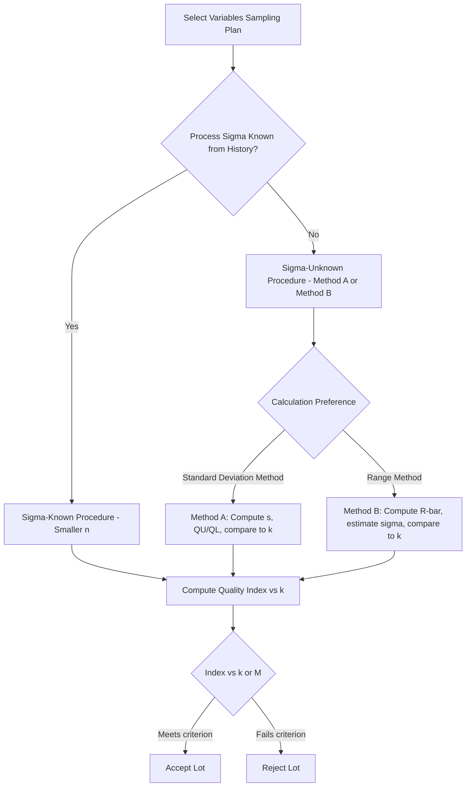

## Variables Sampling Plans

### Overview

Variables sampling plans make acceptance decisions based on continuous (measured) data — dimensions, weights, forces, concentrations — rather than simple pass/fail classification. By using the actual measured values and their statistical distribution (mean and standard deviation), variables plans extract more information per inspected unit than attributes plans, enabling equivalent discriminating power with substantially smaller sample sizes.

### Core Principle

An attributes plan reduces each measurement to a binary outcome (conforming/nonconforming), discarding information about *how close* the measurement is to the specification limit. A variables plan retains the actual measured value, using the sample statistics to estimate the proportion of the lot falling outside specification limits via the assumed underlying distribution (typically normal).

$$\hat{p} = P(X < LSL) + P(X > USL) \text{ estimated from } \bar{x}, s$$

**Key Points**

- Because continuous measurements carry more statistical information than binary attribute classifications, variables plans typically require notably smaller sample sizes than attributes plans for an equivalent OC curve. [Inference: the exact sample-size reduction factor depends on the specific AQL and risk points being matched; general references commonly cite meaningful reductions, but the precise magnitude is table- and application-specific.]
- The trade-off is a distributional assumption: variables plans generally assume the underlying characteristic follows a normal distribution (or a transformation to normality); if this assumption is materially violated, the acceptance decision's actual risk levels can deviate from the nominal design.

### Standard Systems

**ANSI/ASQ Z1.9** (U.S. standard) and **ISO 3951 series** (international) are the principal standardized variables sampling systems, structurally parallel to ANSI/ASQ Z1.4 / ISO 2859-1 for attributes but built around measured data and normality assumptions.

### Method A: Standard Deviation (k-Method)

**Structure**

Uses the sample standard deviation $s$ (unknown standard deviation case) to compute a quality index, compared against a tabulated acceptability constant $k$.

**For a Single Specification Limit (Upper)**

$$Q_U = \frac{USL - \bar{x}}{s}$$

Accept if $Q_U \geq k$; reject otherwise. Analogous form for a lower specification limit:

$$Q_L = \frac{\bar{x} - LSL}{s}$$

**For Double Specification Limits**

Both $Q_U$ and $Q_L$ are computed, and the estimated total fraction nonconforming $\hat{p}$ (combining both tails via the normal distribution) is compared against a maximum allowable percent defective (M) tabulated for the plan.

**Key Points**

- The constant $k$ is analogous in function to the acceptance number $Ac$ in attributes sampling — a threshold derived to achieve the designed producer's/consumer's risk at the stated AQL.
- Sample size $n$ and constant $k$ are jointly tabulated based on lot size code letter and AQL, similar in structure to Z1.4 lookup tables.

### Method B: Range Method

An alternative to Method A that uses the sample range (or average of subgroup ranges) rather than the standard deviation to estimate variability — historically used when hand calculation of $s$ was impractical, though less statistically efficient than the standard deviation method.

$$\bar{R} = \text{average of subgroup ranges}; \quad \hat{\sigma} = \bar{R}/d_2$$

where $d_2$ is a control-chart constant dependent on subgroup size.

### Known vs. Unknown Standard Deviation Procedures

**σ-Known (Standard Deviation Known)**

When the process standard deviation is well-established from historical data, plans using known $\sigma$ achieve even smaller sample sizes than the standard-deviation-unknown case, since one fewer parameter must be estimated from the current sample.

**σ-Unknown (Standard Deviation Unknown)**

The more commonly applied case in practice, where $s$ is calculated from the current sample itself (Method A above).

### Normality Assumption and Its Implications

Variables sampling plans' stated risk levels ($\alpha$, $\beta$, AQL, LTPD) are derived assuming the underlying characteristic is normally distributed. Departures from normality (skewness, heavy tails, multimodality) can cause the *actual* acceptance probability at a given true fraction nonconforming to differ from the plan's nominal OC curve.

**Key Points**

- Practitioners typically verify approximate normality (e.g., via normal probability plots or goodness-of-fit tests) before relying on variables sampling for a given characteristic.
- For characteristics known to be non-normal, transformation (e.g., log transformation for right-skewed data) or fallback to attributes sampling may be more statistically defensible.

### Single vs. Double Specification Limit Handling

| Scenario | Approach |
| --- | --- |
| Single upper limit only (e.g., max contamination level) | Compute $Q_U$, compare to $k$ |
| Single lower limit only (e.g., minimum strength) | Compute $Q_L$, compare to $k$ |
| Both limits, estimate combined fraction nonconforming | Compute $Q_U$ and $Q_L$, estimate $\hat{p}_U + \hat{p}_L$ from normal tables, compare to allowable M |
| Both limits, treated independently | Each limit evaluated against its own $k$ separately (more conservative) |

### Comparison: Variables vs. Attributes Sampling

| Dimension | Variables Sampling | Attributes Sampling |
| --- | --- | --- |
| Data type | Continuous measurement | Binary pass/fail |
| Sample size for equivalent OC curve | Smaller | Larger |
| Distributional assumption required | Yes (typically normality) | No |
| Information retained per unit | High (magnitude of deviation) | Low (conforming/nonconforming only) |
| Applicability across multiple characteristics per sample | One characteristic per plan (generally) | One attributes sample can screen multiple defect types |
| Administrative/calculation complexity | Higher (requires measurement, statistical computation) | Lower (simple counting) |
| Standard tables | ANSI/ASQ Z1.9, ISO 3951 | ANSI/ASQ Z1.4, ISO 2859-1 |

### Example

**Example**

A lot of precision shafts has an Upper Specification Limit (USL) of 25.10 mm; per a variables sampling plan (Method A, code letter H, AQL = 1.0%), $n = 10$, $k = 1.72$.

Sample results: $\bar{x} = 25.02$ mm, $s = 0.035$ mm.

$$Q_U = \frac{25.10 - 25.02}{0.035} = \frac{0.08}{0.035} \approx 2.29$$

Since $Q_U = 2.29 \geq k = 1.72$, the lot is **accepted**. An equivalent attributes plan achieving comparable discrimination at this AQL and lot size would typically require a substantially larger sample size than the $n=10$ used here. [Inference: the specific attributes-plan sample size for exact equivalence depends on the matched risk points and specific table used; the qualitative direction — variables requiring fewer units — is the standard/documented behavior of these systems.]

### Advantages and Limitations Summary

**Advantages**

- Smaller sample sizes reduce inspection time and destructive-test material consumption.
- Provides process insight (proximity to specification) beyond a simple pass/fail outcome, useful for trend monitoring.
- Statistically efficient use of measurement data already being collected for other purposes (e.g., SPC).

**Limitations**

- Requires a validated measurement system (see Measurement System Analysis) with adequate resolution and accuracy.
- Normality assumption must hold or be addressed; violations undermine the plan's nominal risk guarantees.
- Generally limited to one quality characteristic per plan application, unlike attributes plans that can simultaneously screen multiple defect types in a single sample draw.
- Requires more sophisticated training and calculation than attributes counting.

### Common Pitfalls

- Applying a standard variables plan to a characteristic without verifying normality, silently invalidating the nominal risk levels.
- Using Method B (range method) with modern digital measurement/calculation tools available, when Method A (standard deviation) offers better statistical efficiency at negligible added calculation burden.
- Failing to distinguish sigma-known vs. sigma-unknown table sections, leading to selection of an incorrectly sized sample.
- Assuming variables sampling automatically transfers to multi-characteristic inspection without recognizing that, in general, a separate plan application is needed per characteristic.

### Related Topics

- Operating Characteristic (OC) Curves
- Acceptable Quality Level Concepts
- Standard Sampling Plan Systems (Z1.4, Z1.9, ISO 2859, ISO 3951)
- Measurement System Analysis (Gauge R&R)
- Normal Distribution and Process Capability ($C_p$, $C_{pk}$)
- Single, Double, and Multiple Sampling Plans