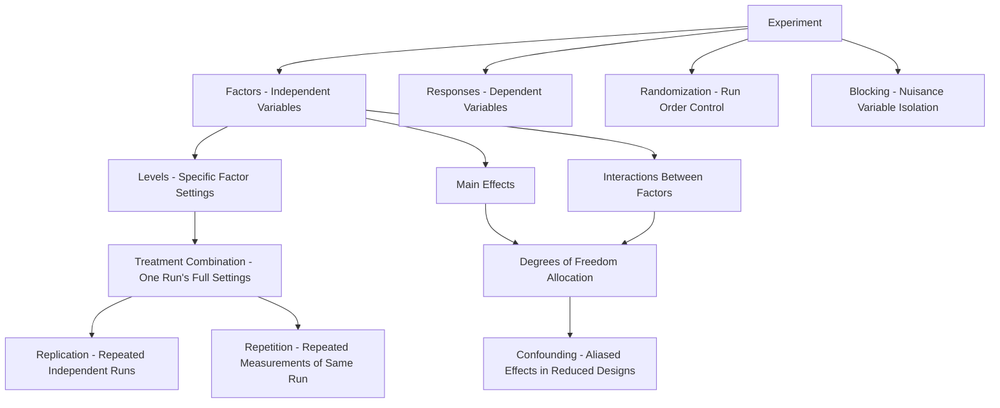
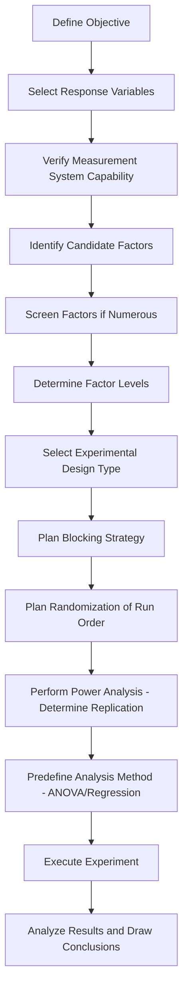

## DOE Terminology and Planning

### Overview

Design of Experiments (DOE) is a structured, statistically rigorous methodology for planning experiments to efficiently determine the relationships between input factors (independent variables) and output responses (dependent variables). Effective DOE application depends on precise understanding of core terminology and disciplined upfront planning, since poorly planned experiments cannot be statistically salvaged after the fact.

### Core Terminology

**Factor**

An independent variable that is deliberately varied in the experiment to study its effect on the response(s). Factors may be quantitative (continuous, e.g., temperature) or qualitative (categorical, e.g., supplier, machine type).

**Level**

A specific value or setting of a factor used in the experiment (e.g., temperature levels of 150°C and 180°C for a two-level factor).

**Response**

The measured output variable(s) of interest, whose relationship to the factors is being studied (e.g., tensile strength, surface roughness, cycle time).

**Treatment / Run**

A specific combination of factor levels applied during a single experimental trial.

**Treatment Combination / Design Point**

The complete set of factor-level settings for one experimental run, often denoted using standard notation (e.g., "+" for high level, "−" for low level in two-level designs).

**Replication**

Repeating a treatment combination multiple times (as independent runs, not repeated measurements of the same run) to estimate experimental (pure) error and improve precision of effect estimates.

**Repetition (Repeated Measurement)**

Taking multiple measurements from a single experimental run — distinct from replication because it does not capture run-to-run variability, only measurement variability.

**Randomization**

The random assignment of the run order of treatment combinations, protecting against the confounding effect of uncontrolled, time-related, or lurking variables (e.g., machine warm-up drift, ambient condition changes).

**Blocking**

Grouping experimental runs into blocks (e.g., by day, by raw material lot, by operator) to isolate and remove the effect of a known nuisance variable from the estimate of factor effects.

**Interaction**

The condition where the effect of one factor on the response depends on the level of another factor — i.e., the factors do not act independently/additively.

**Main Effect**

The average change in the response produced by changing a single factor from its low level to its high level, averaged across all levels of the other factors.

**Confounding (Aliasing)**

A design property in which the effect of one factor (or interaction) cannot be statistically distinguished from the effect of another — common in fractional factorial designs, where higher-order interactions are deliberately sacrificed to reduce run count.

**Degrees of Freedom**

The number of independent pieces of information available to estimate a parameter or effect; total degrees of freedom in an experiment equal (total number of runs − 1), partitioned among factors, interactions, and error.

**Orthogonality**

A design property where factor effects can be estimated independently of one another — changes in the estimate of one factor's effect are unaffected by the presence of other factors in the model, a critical property of well-constructed factorial and fractional factorial designs.

### Terminology Relationship Overview

### DOE Planning Framework

Rigorous DOE planning follows a structured sequence, since decisions made early (objective definition, factor selection) constrain and determine what can be statistically concluded later.

**1. Define the Objective**

Clearly state what question the experiment must answer (e.g., "identify which of five process parameters significantly affect weld strength" vs. "optimize parameter settings to maximize weld strength").

**2. Select the Response Variable(s)**

Choose measurable, relevant output(s). Ensure measurement system capability (see Measurement System Analysis) is adequate — an experiment cannot detect effects smaller than the noise floor of an incapable measurement system.

**3. Identify and Select Factors**

Brainstorm candidate factors (often via cause-and-effect/fishbone analysis or process knowledge), then screen to a manageable subset based on engineering judgment, prior data, or a screening experiment (e.g., Plackett-Burman design).

**4. Determine Factor Levels**

Select levels wide enough to detect a meaningful effect but within safe/feasible operating ranges. Levels too close together risk failing to detect a real effect (low power); levels too far apart risk operating outside the region where linear/simple models remain valid.

**5. Choose the Experimental Design**

Select a design structure (full factorial, fractional factorial, response surface, etc.) matched to the number of factors, resources available, and whether interaction effects must be resolved.

**6. Plan for Blocking and Randomization**

Identify known nuisance variables (day, shift, material lot, operator) and incorporate blocking; establish a randomized run order for all runs not otherwise constrained by blocking.

**7. Determine Sample Size / Replication**

Perform a power analysis to determine the number of replicates needed to detect the smallest effect size of practical importance, given the expected noise (error variance) and desired significance level.

**8. Plan Data Collection and Analysis Method**

Define in advance the statistical analysis method (ANOVA, regression) and acceptance criteria for significance — planning analysis after seeing the data risks bias.

### The Three Fundamental Principles of Experimental Design

Attributed to foundational statistical design theory (Fisher), these principles underlie all sound DOE planning:

**Randomization**

Protects against systematic bias from uncontrolled/lurking variables by ensuring each treatment combination has an equal chance of being affected by such variables.

**Replication**

Provides an estimate of experimental error (pure error), enabling statistical tests of significance and providing more precise estimates of factor effects.

**Blocking**

Increases the precision of factor effect estimates by removing the influence of known, controllable nuisance variables from the error term.

**Key Points**

- These three principles collectively distinguish a designed experiment from mere observational data collection — without randomization, effects can be confounded with time trends; without replication, no valid error estimate exists to test significance; without blocking, avoidable noise inflates the error term and reduces power to detect real effects.

### Factor Selection Considerations

| Consideration | Guidance |
| --- | --- |
| Controllability | Prioritize factors the process owner can actually control/set in production |
| Prior knowledge | Use historical data, fishbone diagrams, or FMEA outputs to prioritize likely influential factors |
| Number of factors vs. resources | More factors increase run count exponentially in full factorial designs — screening designs manage this |
| Factor type | Continuous factors generally allow more efficient designs (response surface methods) than categorical factors |
| Range/level selection | Levels should span a practically meaningful range without leaving the safe/feasible operating envelope |

### Sample Size and Power Considerations in Planning

$$n \geq \left(\frac{(z_{\alpha/2} + z_{\beta}) \sigma}{\delta}\right)^2$$

Where $\delta$ is the minimum effect size of practical importance, $\sigma$ is the estimated experimental error standard deviation, and $z_{\alpha/2}, z_\beta$ correspond to the chosen significance level and desired power. Underpowered experiments risk failing to detect real effects (Type II error), wasting the resources invested regardless of design sophistication.

**Key Points**

- Planning replication and sample size *before* running the experiment, based on the smallest effect size that matters practically (not just statistically), is a defining feature of rigorous DOE planning versus ad hoc experimentation.
- [Inference: appropriate values for $\sigma$ in the power calculation are often estimated from historical process data, pilot studies, or engineering judgment when no prior data exists; the reliability of the resulting sample size recommendation depends directly on the quality of this estimate.]

### Example

**Example**

An engineer wants to determine which of three candidate factors (injection pressure, mold temperature, cooling time) significantly affect part shrinkage in an injection molding process.

- **Objective**: Screen for significant main effects and detect two-factor interactions.
- **Response**: Part shrinkage (mm), measured via CMM — measurement system previously validated via Gauge R&R.
- **Factors/Levels**: Pressure (80, 100 MPa), Mold Temp (40°C, 60°C), Cooling Time (10s, 20s) — three factors, two levels each.
- **Design Choice**: Full factorial ($2^3 = 8$ treatment combinations) selected since only three factors are involved and resolving interactions is a stated objective.
- **Blocking**: Runs blocked by production shift, since raw material lot changes occur at shift boundaries.
- **Randomization**: Run order within each block randomized to avoid confounding with machine warm-up drift.
- **Replication**: Each treatment combination replicated twice (16 total runs) based on a power analysis targeting detection of a 0.05 mm shrinkage difference given estimated process noise $\sigma = 0.02$ mm.

### Common Pitfalls

- Confusing replication with repetition — taking multiple measurements of the same physical run and treating it as replication overstates precision and understates true experimental error.
- Skipping randomization "to save time," inadvertently confounding factor effects with time-related drift.
- Selecting factor levels too narrow to produce a detectable effect, then incorrectly concluding a factor is "not significant."
- Failing to perform a power analysis, resulting in an experiment too small to reliably detect effects of practical importance (or unnecessarily large, wasting resources).
- Changing the analysis plan or significance criteria after viewing the data, undermining the statistical validity of significance conclusions.

### Related Topics

- Full and Fractional Factorial Designs
- Randomization and Blocking Techniques
- Analysis of Variance (ANOVA) for DOE
- Response Surface Methodology
- Screening Designs (Plackett-Burman)
- Measurement System Analysis (Gauge R&R)
- Power Analysis and Sample Size Determination