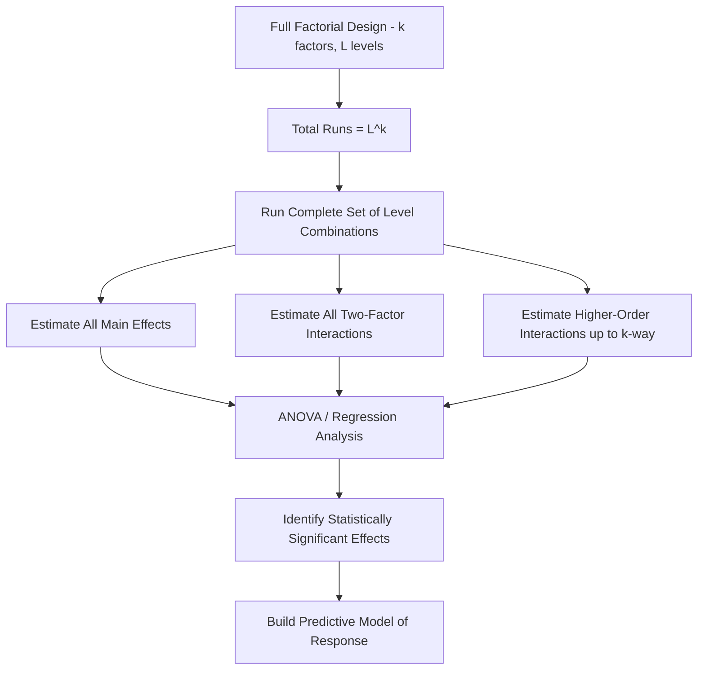

## Full Factorial Designs

### Overview

A full factorial design is an experimental structure in which every possible combination of factor levels is tested. This exhaustive coverage allows estimation of all main effects and all interaction effects (two-factor, three-factor, and higher-order) without confounding, making full factorial designs the most statistically complete — though most resource-intensive — class of designed experiments.

### Definition and Structure

For $k$ factors, each with a fixed number of levels, a full factorial design includes every combination of those levels. The most common case in industrial practice is the **two-level full factorial**, denoted $2^k$, where each of $k$ factors is studied at two levels (typically coded "−1" for low and "+1" for high).

$$\text{Number of runs} = L^k$$

where $L$ is the number of levels per factor (assuming equal levels across factors) and $k$ is the number of factors.

**Example run counts**:

| Factors ($k$) | Levels ($L$) | Total Runs |
| --- | --- | --- |
| 2 | 2 | 4 |
| 3 | 2 | 8 |
| 4 | 2 | 16 |
| 5 | 2 | 32 |
| 3 | 3 | 27 |

### Coded Design Matrix ($2^3$ Example)

| Run | Factor A | Factor B | Factor C |
| --- | --- | --- | --- |
| 1 | − | − | − |
| 2 | + | − | − |
| 3 | − | + | − |
| 4 | + | + | − |
| 5 | − | − | + |
| 6 | + | − | + |
| 7 | − | + | + |
| 8 | + | + | + |

This standard layout (Yates' standard order) ensures the design is **orthogonal** — every factor's effect estimate is statistically independent of every other factor's effect estimate.

### Effects Estimable in a Full Factorial Design

A $2^k$ full factorial design allows estimation of:

- **Main effects**: the average effect of each factor individually.
- **Two-factor interactions**: how the effect of one factor changes depending on the level of a second factor.
- **Higher-order interactions**: three-factor, four-factor interactions, etc., up to the full $k$-factor interaction.

$$\text{Total effects estimable} = 2^k - 1$$

(all main effects and interactions, excluding the overall mean)

**Key Points**

- Full factorial designs are the only standard design class capable of estimating *all* interaction effects, up to the highest order, without confounding any effect with another.
- In practice, higher-order interactions (three-factor and above) are frequently negligible in real physical systems — this observation (the "sparsity of effects" principle) is what justifies using fractional factorial designs when resources are constrained, since it means little information is typically lost by not resolving those high-order terms.

### Effect Calculation ($2^k$ Design)

For a two-level design, each main effect and interaction effect is calculated as the difference between the average response at the "+" level and the average response at the "−" level of the relevant contrast:

$$\text{Effect}_A = \bar{y}_{A+} - \bar{y}_{A-}$$

Interaction effects are computed analogously using the product of the relevant coded columns (e.g., the AB interaction column is formed by multiplying the coded A and B columns row-wise).

### Analysis of Full Factorial Designs

**ANOVA (Analysis of Variance)**

Partitions total variability in the response into components attributable to each factor, each interaction, and residual (error), enabling formal significance testing via F-tests.

$$SS_{Total} = SS_A + SS_B + \ldots + SS_{AB} + \ldots + SS_{Error}$$

**Regression Model Form**

A full factorial's results can equivalently be expressed as a regression equation including all main effects and interaction terms:

$$y = \beta_0 + \beta_1 x_1 + \beta_2 x_2 + \beta_{12} x_1 x_2 + \ldots + \epsilon$$

**Normal/Half-Normal Probability Plots of Effects**

A common visual analysis technique (particularly for unreplicated designs lacking a formal error estimate) — effects that fall along the plotted line are considered consistent with random noise, while effects that deviate are flagged as likely significant.

### Full Factorial Design Structure Diagram

### Advantages of Full Factorial Designs

- Complete, unconfounded estimation of all main effects and interactions.
- Highest resolution possible — no aliasing between any effects.
- Straightforward to analyze and interpret due to design orthogonality.
- Ideal for confirmatory studies where interaction effects are of direct interest or cannot be assumed negligible.

### Limitations of Full Factorial Designs

- Run count grows exponentially with the number of factors, quickly becoming impractical for screening large numbers of candidate factors (e.g., $2^7 = 128$ runs).
- Resource-intensive (time, material, cost) relative to fractional designs achieving similar main-effect information.
- Often wasteful when higher-order interactions are known or strongly suspected to be negligible, since substantial experimental effort is spent resolving effects unlikely to matter physically.

### Full Factorial vs. Fractional Factorial: When to Use Full

| Scenario | Recommendation |
| --- | --- |
| Number of factors is small (typically ≤ 4–5) | Full factorial often practical |
| Interaction effects (especially higher-order) are of direct research interest or physically plausible | Full factorial preferred |
| Confirmatory/final-stage experimentation after screening | Full factorial appropriate to resolve confirmed factors precisely |
| Large number of candidate factors, early screening stage | Fractional factorial or Plackett-Burman preferred instead |
| Resource/time/cost constraints are severe | Fractional factorial preferred |

### Example

**Example**

A quality engineer studies the effect of three factors on the diameter precision of a machined part: cutting speed (A), feed rate (B), and tool wear state (C), each at two levels. A full $2^3$ factorial (8 runs, replicated twice = 16 total runs) is selected because prior process knowledge suggests a strong speed–feed rate interaction may exist (higher speed combined with higher feed rate may compound tool deflection effects), making resolution of the AB interaction essential rather than optional.

Results (illustrative):

- Main effect of A (speed): +0.015 mm
- Main effect of B (feed rate): +0.022 mm
- Main effect of C (tool wear): +0.008 mm
- AB interaction: +0.019 mm (comparable in magnitude to main effects — confirms the suspected interaction)
- Higher-order interactions (ABC, etc.): small, consistent with experimental noise on the half-normal probability plot

Because the AB interaction proved significant, a model that ignored interactions (main-effects-only, as might result from a highly fractionated design) would have produced a materially incomplete and potentially misleading process model.

### Center Points and Curvature Detection

For continuous factors, adding replicated **center points** (runs at the midpoint level of all factors) to a $2^k$ design allows a check for curvature in the response surface — a two-level design alone can only detect linear effects, so center points provide a diagnostic for whether a more complex model (e.g., response surface methodology with quadratic terms) is warranted.

### Common Pitfalls

- Defaulting to full factorial for a large number of factors without considering the exponential run-count cost, when a well-chosen fractional design could answer the same practical question with far fewer runs.
- Failing to include replication (or center points), leaving no formal estimate of pure error for hypothesis testing in an unreplicated design.
- Ignoring randomization of run order within the design matrix, risking confounding of factor effects with time-related drift despite the design's inherent statistical orthogonality.
- Interpreting a "significant" higher-order interaction without first verifying it is not an artifact of an inadequately powered or non-randomized experiment.

### Related Topics

- Fractional Factorial Designs
- DOE Terminology and Planning
- Analysis of Variance (ANOVA) for DOE
- Response Surface Methodology
- Center Points and Curvature Detection
- Screening Designs (Plackett-Burman)
- Confounding and Design Resolution