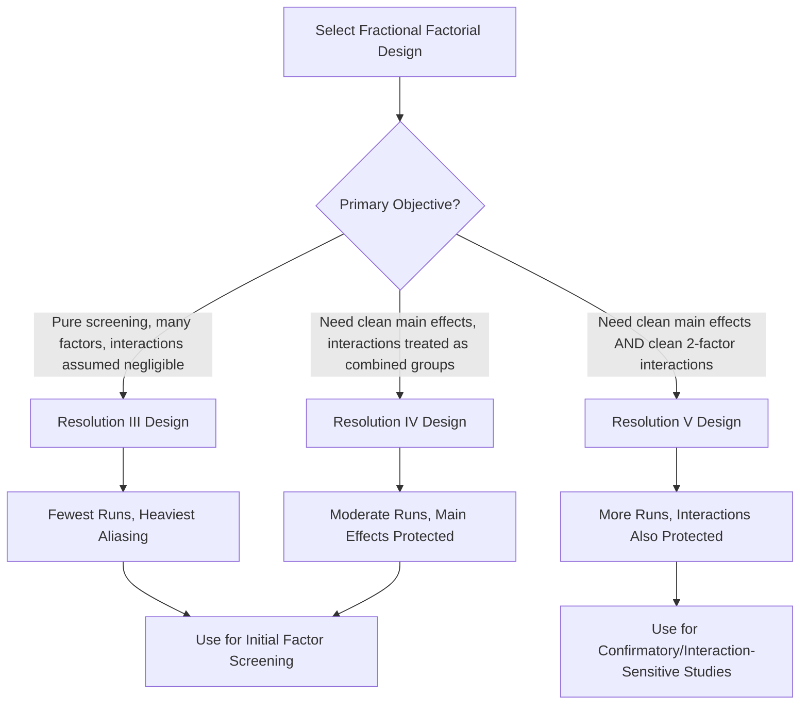
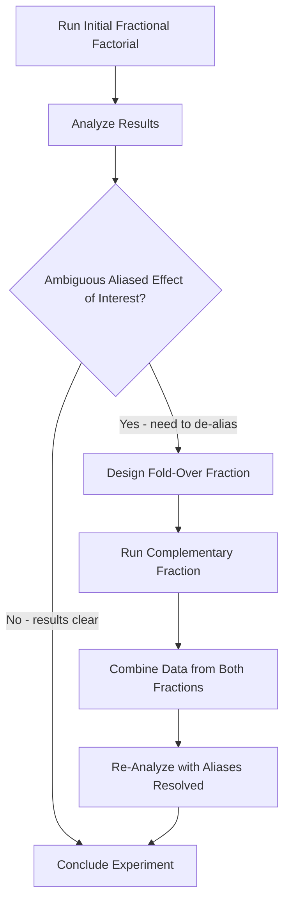

## Fractional Factorial Designs

### Overview

A fractional factorial design tests only a carefully selected subset (fraction) of the full set of treatment combinations that a full factorial design would require. By exploiting the principle that higher-order interactions are frequently negligible in real physical systems (the sparsity-of-effects principle), fractional designs deliberately sacrifice the ability to independently estimate certain higher-order interactions in exchange for a substantial reduction in the number of experimental runs required.

### Core Concept

Instead of running all $2^k$ combinations, a fractional factorial design runs a $1/2^p$ fraction, denoted:

$$2^{k-p}$$

where $k$ is the number of factors and $p$ determines the size of the fraction (e.g., $p=1$ for a half-fraction, $p=2$ for a quarter-fraction).

**Example**: A 5-factor experiment run as a half-fraction is denoted $2^{5-1}$, requiring 16 runs instead of the 32 runs a full $2^5$ factorial would require.

| Design Notation | Factors | Fraction | Runs |
| --- | --- | --- | --- |
| $2^{4-1}$ | 4 | 1/2 | 8 |
| $2^{5-1}$ | 5 | 1/2 | 16 |
| $2^{5-2}$ | 5 | 1/4 | 8 |
| $2^{6-2}$ | 6 | 1/4 | 16 |
| $2^{7-3}$ | 7 | 1/8 | 16 |

### Generators and Defining Relations

**Generator**

The rule used to assign levels of the additional factor(s) not included in the base full factorial, expressed as a product of other factor columns (e.g., $D = ABC$ means factor D's levels are set equal to the product of the coded A, B, and C columns).

**Defining Relation**

The complete set of aliasing equations implied by the generator(s), written in the form $I = ABC D$ (where $I$ is the identity column of all "+" signs). The defining relation is the master reference for determining which effects are confounded (aliased) with which.

$$I = ABCD \implies A = BCD, \ B = ACD, \ AB = CD, \ldots$$

**Key Points**

- Every effect in a fractional factorial design is aliased with one or more other effects according to the defining relation; the design cannot statistically distinguish between aliased effects using the data from that design alone.
- Generators must be chosen deliberately (not arbitrarily) to alias effects believed likely to be negligible (higher-order interactions) with effects of practical interest (main effects, low-order interactions), preserving the design's usefulness despite the reduced run count.

### Design Resolution

Resolution is a shorthand classification (Roman numeral) describing the *severity* of aliasing in a fractional factorial design — specifically, the length of the shortest word in the defining relation.

| Resolution | Aliasing Pattern | Practical Implication |
| --- | --- | --- |
| Resolution III | Main effects aliased with two-factor interactions | Main effects potentially confounded with 2-factor interactions — use with caution, primarily for pure screening |
| Resolution IV | Main effects clear of two-factor interactions, but two-factor interactions aliased with each other | Main effects cleanly estimable; individual 2-factor interactions cannot be separated from each other |
| Resolution V | Main effects and two-factor interactions both clear of each other; two-factor interactions aliased with three-factor interactions | Main effects and 2-factor interactions both cleanly estimable — generally preferred when interactions matter |

**Key Points**

- Higher resolution designs provide cleaner (less confounded) effect estimates but require more runs for a given number of factors — resolution and run economy are in direct tension.
- Resolution III designs are appropriate primarily for initial screening among many factors where the objective is identifying which factors matter at all, not precisely quantifying interactions.
- Resolution IV and V designs are preferred when interaction effects are plausible and must be distinguished with reasonable confidence.

### Alias Structure Example ($2^{4-1}$, Generator D = ABC)

Defining relation: $I = ABCD$

| Effect | Aliased With |
| --- | --- |
| A | BCD |
| B | ACD |
| C | ABD |
| D | ABC |
| AB | CD |
| AC | BD |
| AD | BC |

This is a Resolution IV design ($2^{4-1}_{IV}$) — main effects (A, B, C, D) are aliased only with three-factor interactions (typically negligible), but two-factor interactions are aliased pairwise with each other (AB with CD, etc.).

### Sequential Experimentation and Fold-Over

A key practical strategy in fractional factorial use is **sequential experimentation**: running an initial fraction, analyzing results, and — if ambiguity remains (e.g., a significant effect that could be either of two aliased terms) — running a second, complementary fraction (a "fold-over") to resolve the ambiguity.

**Fold-Over Technique**

Reversing the signs of one or more factor columns in a follow-up fraction breaks specific aliases present in the original fraction, allowing the combined data from both fractions to separate previously confounded effects.

### Plackett-Burman Designs (Extreme Screening)

A specialized class of highly fractionated, Resolution III designs used for screening a large number of factors (often 7 to 47+) in a minimal number of runs, typically in multiples of 4 rather than powers of 2. Plackett-Burman designs assume interactions are negligible and focus exclusively on efficiently identifying significant main effects among many candidates.

**Key Points**

- Plackett-Burman designs are appropriate only as a screening step — confirmed significant factors are typically carried forward into a higher-resolution design (full factorial or Resolution IV/V fractional) for further study, including interaction effects.

### Advantages of Fractional Factorial Designs

- Dramatically reduces run count and resource consumption compared to full factorial designs, especially as the number of factors grows.
- Enables practical screening of many candidate factors early in an investigation.
- Maintains orthogonality (within the fraction run) for the effects that remain estimable, preserving valid statistical inference for those effects.
- Supports a sequential experimentation strategy — resources are only committed to resolving interactions if initial screening indicates they matter.

### Limitations of Fractional Factorial Designs

- Some effects are inherently confounded and cannot be separated without further experimentation (fold-over or full factorial follow-up).
- Requires careful upfront selection of generators/resolution matched to the study's objectives — a poorly chosen design can alias factors of genuine interest with each other.
- Lower-resolution designs (III) risk misattributing a significant interaction effect to a main effect, or vice versa, if the sparsity-of-effects assumption does not hold for the system under study.

### Example

**Example**

An engineer must screen six candidate factors affecting solder joint reliability, but production constraints allow only 16 experimental runs. A full $2^6$ factorial would require 64 runs — impractical. A $2^{6-2}$ (quarter-fraction, 16 runs) Resolution IV design is selected instead, chosen specifically so that all six main effects remain unaliased with any two-factor interaction, though the twelve possible two-factor interactions are aliased pairwise with each other.

Analysis reveals three factors (reflow temperature, dwell time, solder paste volume) show statistically significant main effects; the remaining three show effects consistent with noise. Because the design was Resolution IV, the engineer has high confidence these three main effects are not artifacts of confounded two-factor interactions. A focused follow-up experiment (full $2^3$ factorial on just the three significant factors, 8 runs) is then conducted to resolve their interactions precisely.

### Fractional vs. Full Factorial: Decision Summary

| Factor | Favors Fractional | Favors Full |
| --- | --- | --- |
| Number of candidate factors | Large (5+) | Small (≤4) |
| Stage of investigation | Early screening | Confirmatory/final study |
| Interaction effects suspected important | No / unknown, sparsity assumption reasonable | Yes, strongly suspected |
| Resource/time/cost constraints | Significant | Minimal |
| Prior process knowledge | Limited (broad screening needed) | Substantial (few factors already known to matter) |

### Common Pitfalls

- Selecting a design resolution without explicitly considering which interactions are aliased with which main effects — using a Resolution III design when interaction confounding with main effects could seriously mislead conclusions.
- Failing to plan a fold-over or follow-up strategy in advance, leaving no clear path to resolve ambiguous aliased effects if screening results are unclear.
- Treating fractional factorial screening results as final/confirmatory conclusions about interactions, when the design was never capable of independently resolving them.
- Choosing generators arbitrarily (e.g., via default software settings) without verifying the resulting alias structure matches the study's actual priorities.

### Related Topics

- Full Factorial Designs
- DOE Terminology and Planning
- Design Resolution and Confounding
- Screening Designs (Plackett-Burman)
- Response Surface Methodology
- Analysis of Variance (ANOVA) for DOE
- Sequential Experimentation and Fold-Over Techniques