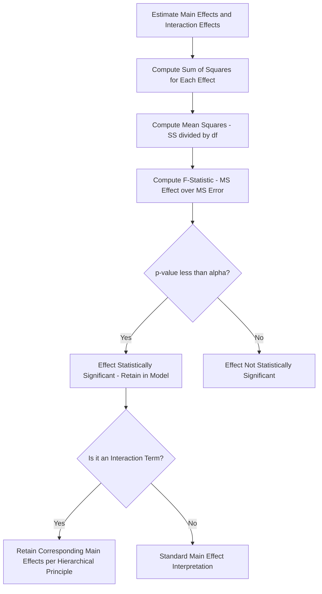

## Main Effects and Interaction Effects

### Overview

Main effects and interaction effects are the two fundamental categories of information extracted from a designed experiment. Main effects describe how a response changes as a single factor changes, while interaction effects describe how the effect of one factor depends on the level of another. Correctly identifying and interpreting both is essential — analyzing main effects in isolation when meaningful interactions exist can produce a misleading or incomplete process model.

### Main Effect: Definition

The main effect of a factor is the average change in the response variable produced by moving that factor from its low level to its high level, averaged across all levels of every other factor in the design.

$$\text{Main Effect}_A = \bar{y}_{A+} - \bar{y}_{A-}$$

where $\bar{y}_{A+}$ is the average response across all runs where factor A is at its high level, and $\bar{y}_{A-}$ is the average response across all runs where factor A is at its low level.

**Key Points**

- The main effect is a single-number summary of a factor's average influence — it does not, by itself, reveal whether that influence is consistent across the levels of other factors.
- In an orthogonal design (e.g., full or well-constructed fractional factorial), the main effect of one factor can be estimated independently of the levels of other factors, which is precisely what makes factorial designs statistically efficient.

### Interaction Effect: Definition

An interaction effect exists when the effect of one factor on the response changes depending on the level of a second (or additional) factor — the factors do not act additively/independently on the response.

**Two-Factor Interaction Calculation**

$$\text{Interaction}_{AB} = \frac{(\bar{y}_{A+B+} - \bar{y}_{A-B+}) - (\bar{y}_{A+B-} - \bar{y}_{A-B-})}{2}$$

Equivalently: the interaction effect is half the difference between the effect of A when B is high and the effect of A when B is low.

**Key Points**

- A significant interaction means main effects cannot be interpreted independently — the "effect of A" is not a single fixed number but depends on which level of B is present.
- Interactions can exist at higher orders (three-factor, four-factor) but these become progressively harder to interpret physically and are, per the sparsity-of-effects principle, frequently negligible in real systems — though this must be verified statistically, not assumed.

### Visualizing Interactions: Main Effects and Interaction Plots

**Main Effects Plot**

Plots the average response at each level of each factor, connected by a line; steep slopes indicate strong main effects, flat lines indicate negligible effects.

**Interaction Plot**

Plots the average response at each level of one factor, with separate lines for each level of a second factor.

- **Parallel lines** indicate no interaction — the effect of factor A is consistent regardless of factor B's level.
- **Non-parallel lines** (converging, diverging, or crossing) indicate an interaction — the magnitude, or even direction, of factor A's effect depends on factor B's level.
- **Crossing lines** indicate a particularly strong interaction, where the effect of A actually reverses direction depending on B's level.

```mermaid
flowchart TD
    subgraph No_Interaction [No Interaction - Parallel Lines (svg_diagram)]
    A1["B low: A effect = +5"] --- A2["B high: A effect = +5"]
    end
    subgraph Moderate_Interaction [Moderate Interaction - Converging/Diverging Lines (svg_diagram)]
    B1["B low: A effect = +2"] --- B2["B high: A effect = +8"]
    end
    subgraph Strong_Interaction [Strong Interaction - Crossing Lines (svg_diagram)]
    C1["B low: A effect = +6"] --- C2["B high: A effect = -4"]
    end
```

### Why Interactions Matter: The Danger of Main-Effects-Only Interpretation

If a strong interaction exists but is ignored (or was not estimable due to design confounding), conclusions drawn purely from main effects can be actively misleading. A factor might show a small or near-zero *average* main effect while having a large effect at one specific level of another factor and an opposing effect at the other level — the two effects canceling out in the overall average.

**Example**

Factor A (catalyst concentration) shows a main effect of +0.5 (small, seemingly negligible) across a full factorial study. However, the AB interaction plot reveals: at low temperature (B−), increasing catalyst concentration increases yield by +5.0; at high temperature (B+), increasing catalyst concentration decreases yield by −4.0. The near-zero average main effect masks a substantial, temperature-dependent, and practically important effect of catalyst concentration — a main-effects-only analysis would have wrongly concluded catalyst concentration "doesn't matter."

### Hierarchical Principle in Model Building

When a two-factor interaction (e.g., AB) is found statistically significant, standard practice retains the corresponding main effects (A and B) in the model even if their individual main-effect estimates appear small or non-significant on their own — because the interaction term's interpretation depends on the presence of both main effects in the model.

**Key Points**

- Removing a main effect while retaining its associated interaction term violates the hierarchical principle and can produce a model that is difficult to interpret or that changes meaning under simple coding transformations (e.g., re-centering factor levels).

### Statistical Testing of Effects (ANOVA Context)

Both main effects and interaction effects are tested for statistical significance via ANOVA, comparing each effect's mean square against the error mean square:

$$F = \frac{MS_{Effect}}{MS_{Error}}$$

An effect (main or interaction) is deemed statistically significant if the resulting F-statistic exceeds the critical value for the chosen significance level $\alpha$, or equivalently if the associated p-value falls below $\alpha$.



### Confounding of Main and Interaction Effects in Reduced Designs

In fractional factorial designs, the ability to cleanly separate main effects from interaction effects depends directly on the design's **resolution**:

| Design Resolution | Main Effects vs. 2-Factor Interactions |
| --- | --- |
| Resolution III | Main effects potentially aliased with 2-factor interactions — cannot be cleanly separated |
| Resolution IV | Main effects clear of 2-factor interactions; 2-factor interactions aliased with each other |
| Resolution V | Main effects and 2-factor interactions both cleanly estimable |

This is why design resolution selection (covered under Fractional Factorial Designs) is directly tied to whether a study's conclusions about interactions can be trusted.

### Quantifying Relative Importance: Pareto Chart of Effects

A common practical tool for comparing the magnitude of multiple main and interaction effects simultaneously is a Pareto chart (bar chart of absolute standardized effect magnitudes, ranked largest to smallest), often overlaid with a significance threshold line derived from the design's error estimate — allowing rapid visual identification of which effects (main or interaction) dominate the response.

### Example

**Example**

A full $2^3$ factorial studies weld strength as a function of current (A), voltage (B), and travel speed (C).

Results:

- Main effect A (current): +12.5
- Main effect B (voltage): +3.2
- Main effect C (speed): −8.7
- AB interaction: +1.1 (small — consistent with noise)
- AC interaction: −9.8 (large — comparable in magnitude to main effects)
- BC interaction: +0.9 (small)
- ABC interaction: +0.4 (small)

Interpretation: Current (A) and travel speed (C) show strong main effects, but the substantial AC interaction means the effect of current on weld strength differs materially depending on travel speed — a process recommendation of "increase current to improve strength" would be incomplete without specifying the travel speed at which that recommendation holds. Voltage (B) shows a modest main effect and no meaningful interactions, suggesting it can be treated largely independently in process guidance.

### Practical Guidance for Interpretation

**Key Points**

- Always examine interaction plots before finalizing conclusions from main effects alone, particularly for any two factors flagged as jointly significant by ANOVA.
- A significant interaction is not necessarily "bad" — it is genuine information about how the system behaves, and optimal process settings for interacting factors typically cannot be determined by optimizing each factor independently.
- When reporting main effects for factors involved in a significant interaction, report them conditionally (i.e., "the effect of A at low B" and "the effect of A at high B") rather than as a single unconditional average, since the average can be misleading as shown above.

### Common Pitfalls

- Reporting only main effects without checking for significant interactions, especially in designs (Resolution III) where interactions could not even be estimated cleanly.
- Removing a "non-significant" main effect from a model while retaining its significant interaction term, violating the hierarchical principle.
- Interpreting a near-zero main effect as "factor doesn't matter" without checking whether opposing effects at different interaction levels are canceling out in the average.
- Over-interpreting small, likely-noise interaction effects as physically meaningful without reference to the design's formal significance threshold (from ANOVA or a Pareto/normal probability plot of effects).

### Related Topics

- Full Factorial Designs
- Fractional Factorial Designs and Design Resolution
- Analysis of Variance (ANOVA) for DOE
- DOE Terminology and Planning
- Response Surface Methodology
- Pareto and Normal Probability Plots of Effects