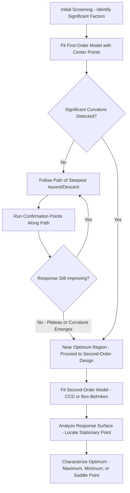
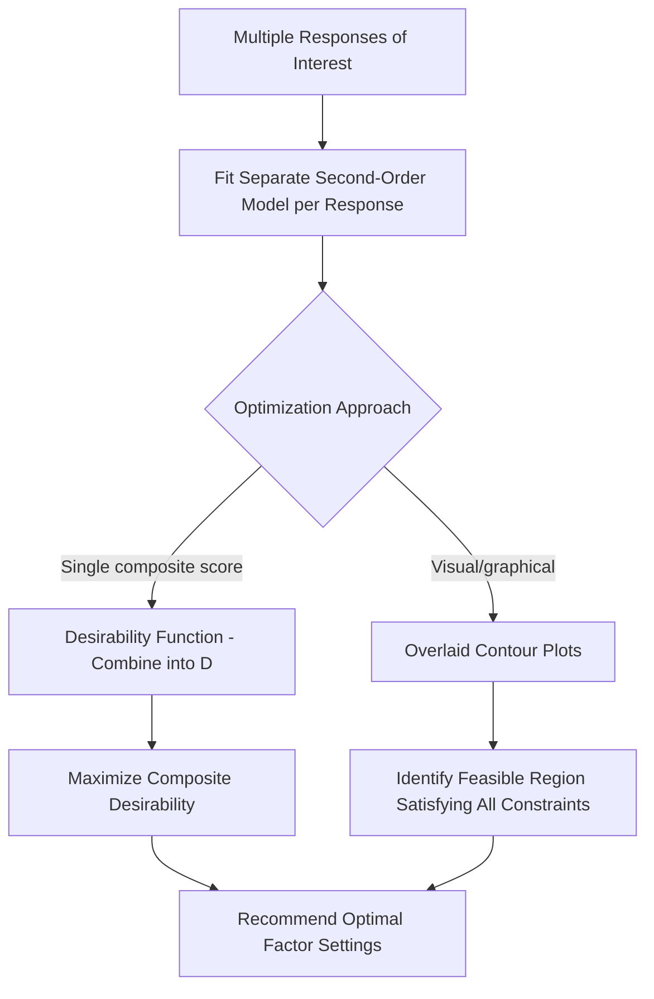
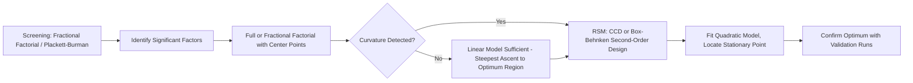

## Response Surface Methodology


### Overview

Response Surface Methodology (RSM) is a collection of statistical and mathematical techniques used to model and optimize a response as a function of one or more continuous factors, particularly when the relationship is suspected to be curved (nonlinear) rather than strictly linear. Where standard two-level factorial designs can detect that curvature exists, RSM provides the design structures and analytical framework needed to characterize and exploit that curvature — most commonly to locate the factor settings that optimize (maximize, minimize, or target) the response.

### When RSM Is Appropriate

RSM is typically employed after initial screening (via factorial or fractional factorial designs) has identified a small number of significant factors, and evidence of curvature has been detected — commonly via a significant center-point test in a two-level factorial design, indicating the true response surface is not adequately described by a linear (first-order) model.

**Key Points**

- RSM is an optimization-stage technique, not typically a screening technique — it is most efficient when applied to a reduced set of factors already known to matter, since RSM designs (particularly higher-order ones) become resource-intensive as the number of factors grows.
- RSM specifically targets continuous, quantitative factors; it is not designed for categorical/qualitative factors in the same way.

### First-Order Models and Steepest Ascent

**First-Order (Linear) Model**

$$y = \beta_0 + \sum_{i=1}^{k}\beta_i x_i + \epsilon$$

Fit using a two-level factorial or fractional factorial design augmented with center points. Adequate when the response surface is approximately planar within the current experimental region.

**Method of Steepest Ascent (or Descent)**

When operating far from the optimum, a first-order model's gradient indicates the direction of most rapid response improvement. Sequential experiments are conducted by stepping along this gradient path (a "path of steepest ascent") until the response stops improving — signaling the experimental region has approached the vicinity of the optimum (often marked by significant curvature/lack-of-fit in the first-order model).



### Second-Order Models

Once the experimental region is near the optimum, a **second-order (quadratic) model** captures curvature:

$$y = \beta_0 + \sum_{i=1}^{k}\beta_i x_i + \sum_{i=1}^{k}\beta_{ii} x_i^2 + \sum_{i<j}\beta_{ij} x_i x_j + \epsilon$$

This model includes linear terms, quadratic (squared) terms, and two-factor interaction terms, requiring a design with at least three levels per factor to estimate the quadratic coefficients.

### Central Composite Design (CCD)

**Structure**

The most widely used second-order RSM design, composed of three elements:

- A **factorial (or fractional factorial) portion** — typically a $2^k$ design providing the corner points of the design space.
- **Axial (star) points** — points extending along each factor axis at a distance $\alpha$ from the center, enabling estimation of quadratic terms.
- **Center points** — replicated runs at the midpoint of all factors, providing an estimate of pure error and a check for lack of fit.

**Axial Distance ($\alpha$)**

Chosen to achieve a desired design property — commonly **rotatability** (equal prediction variance at any point equidistant from the design center), calculated as $\alpha = (2^k)^{1/4}$ for a full factorial base, or set to $\alpha = 1$ for a **face-centered CCD**, which keeps all points within the original factor range (useful when factor levels cannot safely extend beyond the original screening range).

```mermaid
flowchart TD
    subgraph CCD_Structure [Central Composite Design Structure (svg_diagram)]
    A[Factorial Corner Points - 2^k design] --> D[Combined CCD]
    B[Axial - Star Points - extend along each axis] --> D
    C[Center Points - replicated at midpoint] --> D
    end
```

### Box-Behnken Design

**Structure**

An alternative second-order design that does not include the extreme corner points (all factors simultaneously at their highest or lowest levels) of a CCD, instead placing points at the midpoints of the edges of the factor space, combined with center points.

**Key Advantage**

Avoids testing at extreme combinations of all factors simultaneously — useful when such combinations are physically infeasible, unsafe, or outside a known safe operating envelope.

**Comparison: CCD vs. Box-Behnken**

| Attribute | Central Composite Design | Box-Behnken Design |
| --- | --- | --- |
| Extreme corner points tested | Yes (in factorial portion) | No |
| Axial/star points beyond original range | Yes (unless face-centered) | No |
| Suitable when extreme combinations are unsafe/infeasible | Less suitable (unless face-centered) | Well suited |
| Number of levels required per factor | 5 (standard) or 3 (face-centered) | 3 |
| Efficiency (runs per estimated parameter) | Good | Generally good, varies by factor count |

### Analyzing the Fitted Response Surface

Once a second-order model is fit, standard analysis techniques characterize the surface:

**Contour Plots**

Two-dimensional plots showing response value contours across two factors (holding others fixed), visually revealing the shape and location of optimal regions.

**3D Surface Plots**

Visual rendering of the fitted response surface across two factors, illustrating peaks, valleys, ridges, or saddle configurations.

**Canonical Analysis**

Mathematical transformation of the fitted quadratic model to its canonical form, identifying the **stationary point** (where all partial derivatives equal zero) and classifying it as a maximum, minimum, or saddle point based on the eigenvalues of the associated matrix of quadratic coefficients.

$$\frac{\partial y}{\partial x_i} = 0 \text{ for all } i \implies \text{stationary point}$$

- All eigenvalues negative → maximum
- All eigenvalues positive → minimum
- Mixed-sign eigenvalues → saddle point (a ridge system, requiring further investigation rather than a simple optimum)

### Multiple Response Optimization

Real processes often require optimizing several responses simultaneously (e.g., maximize strength while minimizing cost and keeping a dimension within tolerance), which may involve competing trade-offs.

**Desirability Function Approach**

Each individual response is transformed into a "desirability" score (0 to 1, where 1 is ideal), and a composite desirability (typically the geometric mean of individual desirabilities) is maximized to find the best overall compromise setting.

$$D = (d_1 \times d_2 \times \ldots \times d_m)^{1/m}$$

**Overlaid Contour Plots**

Visually superimposing contour plots for multiple responses to identify a feasible region satisfying constraints on all responses simultaneously.



### Example

**Example**

A process engineer seeks to maximize the yield of a chemical reaction, with reaction temperature and catalyst concentration as the two significant continuous factors identified from prior screening. A center-point test in the initial $2^2$ factorial (plus center points) shows significant curvature, indicating a first-order model is inadequate.

A face-centered CCD is constructed (since safety constraints limit how far temperature can extend beyond the previously validated range): 4 factorial points, 4 axial points at the face centers, and 5 replicated center points (13 runs total). The fitted second-order model reveals a stationary point within the design region; canonical analysis confirms both eigenvalues are negative, identifying it as a true maximum. Contour plot analysis pinpoints the optimal temperature and catalyst concentration combination, with a surrounding region of near-optimal settings providing operational flexibility for the production team.

### RSM in the Broader DOE Sequence



### Common Pitfalls

- Applying RSM (second-order designs) prematurely, before screening has narrowed the factor list, resulting in an impractically large and expensive design.
- Extrapolating the fitted response surface model beyond the actual experimental region — quadratic models can behave erratically outside the range over which they were fit.
- Failing to run confirmation experiments at the predicted optimum, treating the model's mathematical optimum as guaranteed without empirical verification.
- Misclassifying a saddle point as a true optimum without performing canonical analysis, leading to an incorrect process recommendation.
- Ignoring practical/safety constraints when CCD axial points would require operating outside a validated safe range — face-centered designs or Box-Behnken designs address this directly.

### Related Topics

- Full and Fractional Factorial Designs
- Center Points and Curvature Detection
- Analysis of Variance (ANOVA) for DOE
- Multiple Response Optimization and Desirability Functions
- DOE Terminology and Planning
- Process Capability and Optimization Follow-Up