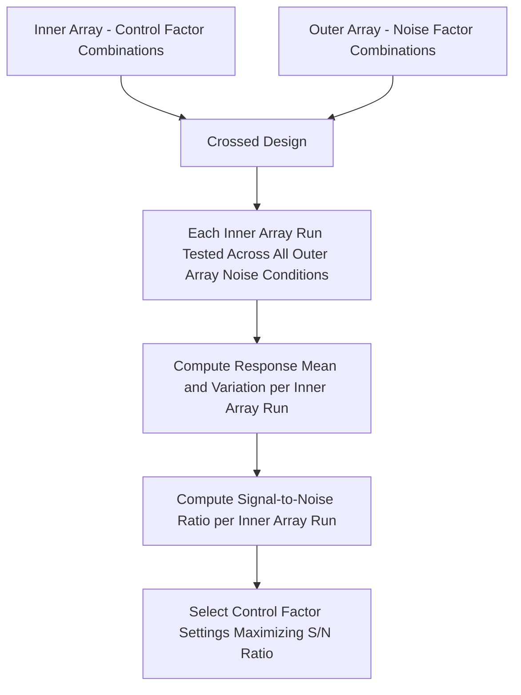
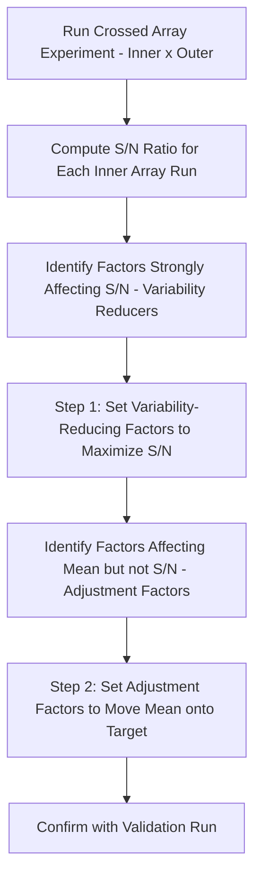

## Taguchi Methods Overview


### Overview

Taguchi Methods, developed by Genichi Taguchi, constitute a distinctive philosophy and toolset within Design of Experiments centered on achieving **robustness** — designing products and processes whose performance remains consistent despite uncontrollable variation (noise). Rather than focusing solely on optimizing the average response, Taguchi methods explicitly target *minimizing variability around a target value*, reframing quality as "loss to society" from deviation, not merely conformance to specification limits.

### Philosophical Foundation

**Quality Loss Function**

Taguchi's central conceptual departure from traditional acceptance-based quality thinking is the **Quality Loss Function**, which asserts that any deviation from the target value — not just deviation beyond specification limits — incurs a loss, and that this loss increases (commonly modeled as quadratic) with the magnitude of deviation.

$$L(y) = k(y - T)^2$$

where $y$ is the measured characteristic, $T$ is the target value, and $k$ is a cost constant.

**Contrast with Traditional Goal-Post Thinking**

Traditional specification-limit thinking treats all units within specification as equally "good" and all units outside as equally "bad" (a step-function view of loss). The Taguchi Loss Function instead asserts loss begins accruing the moment a characteristic departs from its target, even while still within specification — reframing the objective from "meet spec" to "hit the target with minimum variation."

```mermaid
flowchart TD
    subgraph Loss_Function_Concept [Quality Loss: Goal-Post vs Taguchi View (svg_diagram)]
    A["Traditional View:<br/>Loss = 0 within spec limits<br/>Loss = constant outside spec"] 
    B["Taguchi View:<br/>Loss increases continuously<br/>as deviation from Target grows<br/>(quadratic loss function)"]
    end
```

**Key Points**

- The practical implication is that reducing variation around the target — even for units already well within specification — has genuine economic and quality value under the Taguchi framework, motivating variation-reduction efforts beyond simple pass/fail conformance.

### Robust Design Concept

**Definition**

Robust design refers to designing a product or process such that its performance is insensitive (robust) to variation in factors that are difficult, expensive, or impossible to control in the field — commonly called **noise factors** — by instead exploiting **control factors** that the designer can set and adjust.

**Factor Classification in Taguchi Methods**

| Factor Type | Description | Example |
| --- | --- | --- |
| Control Factors | Factors the designer/engineer can set and control | Material grade, dimension, process temperature setpoint |
| Noise Factors | Factors that vary in practice and are difficult/costly to control | Ambient temperature, raw material lot variation, operator differences, customer usage patterns |
| Signal Factors | Factors representing the intended input in dynamic systems | Throttle position (in a dynamic response system) |

**Key Points**

- The central strategic insight of robust design is that certain combinations of control factor settings can reduce the *sensitivity* of the response to noise factor variation, even when the noise factors themselves cannot be reduced or eliminated — achieving robustness through design rather than through tighter control of uncontrollable variation.

### Orthogonal Arrays

**Definition**

Taguchi methods rely heavily on standardized, pre-tabulated **orthogonal arrays** — highly fractionated experimental designs that allow efficient estimation of main effects for many factors with a relatively small number of runs, under the assumption that interactions are generally negligible (similar in spirit to Resolution III fractional factorial designs, but presented in a standardized, catalog-based format).

**Common Orthogonal Array Designations**

Denoted by notation such as $L_8$, $L_9$, $L_{16}$, $L_{18}$, $L_{27}$ — where the subscript indicates the number of experimental runs, and the array's structure indicates how many factors (at how many levels) it can accommodate.

| Array | Runs | Typical Capacity |
| --- | --- | --- |
| $L_4$ | 4 | Up to 3 factors, 2 levels |
| $L_8$ | 8 | Up to 7 factors, 2 levels |
| $L_9$ | 9 | Up to 4 factors, 3 levels |
| $L_{18}$ | 18 | Mixed-level designs (1 factor at 2 levels, up to 7 factors at 3 levels) |

### Inner and Outer Arrays (Crossed Array Design)

**Structure**

A distinguishing structural feature of Taguchi's approach to robust design is the **crossed array**: an inner orthogonal array of control factors is combined with an outer orthogonal array of noise factors, so that every control-factor combination is tested across multiple noise-factor combinations — directly measuring how sensitive each control-factor setting is to noise variation.



### Signal-to-Noise (S/N) Ratios

**Purpose**

Taguchi methods condense each treatment combination's multiple noise-condition results into a single **signal-to-noise ratio**, a composite metric intended to simultaneously capture both the mean response level and its variability, expressed on a decibel-like scale (larger S/N is better in all standard forms).

**Common S/N Ratio Types**

*Larger-the-Better* (maximize response, e.g., strength):

$$S/N = -10\log_{10}\left(\frac{1}{n}\sum \frac{1}{y_i^2}\right)$$

*Smaller-the-Better* (minimize response, e.g., defects, wear):

$$S/N = -10\log_{10}\left(\frac{1}{n}\sum y_i^2\right)$$

*Nominal-the-Best* (hit a target with minimum variation, e.g., a dimension):

$$S/N = 10\log_{10}\left(\frac{\bar{y}^2}{s^2}\right)$$

**Key Points**

- The choice of S/N ratio type must match the engineering objective of the characteristic under study — using the wrong type (e.g., larger-the-better for a characteristic that should hit a target) will optimize the wrong thing.
- Control factor levels are selected by choosing, for each factor, the level that maximizes the average S/N ratio across the outer array noise conditions — this is the core "robust optimization" step of the methodology.

### Two-Step Optimization Procedure

A characteristic Taguchi analysis sequence for nominal-the-best characteristics:

**Step 1 — Reduce Variability**

Identify control factors that significantly affect the S/N ratio (variability) but have little effect on the mean; adjust these factors to maximize S/N (minimize variability) first.

**Step 2 — Adjust the Mean**

Identify control factors that primarily affect the mean response without materially affecting the S/N ratio (often called "adjustment factors" or "scaling factors"); use these to shift the mean onto the target value, since variability has already been minimized in Step 1.



### Comparison: Taguchi Methods vs. Classical DOE (Fisherian) Approach

| Dimension | Taguchi Methods | Classical Factorial/RSM DOE |
| --- | --- | --- |
| Primary objective | Robustness — minimize sensitivity to noise | Characterize/optimize mean response, understand effects |
| Treatment of variability | Explicit design objective (S/N ratio) | Typically analyzed via error term/residuals, not a primary optimization target by default |
| Interaction effects | Generally assumed negligible (heavily fractionated arrays) | Explicitly modeled where design resolution allows |
| Noise factors | Explicitly and deliberately varied (outer array) | Often held constant or randomized as a nuisance source, not deliberately varied |
| Design efficiency for main effects | Very high (highly fractionated) | Varies by chosen design (full vs. fractional) |
| Statistical rigor of significance testing | Debated among statisticians; less formal ANOVA emphasis in original methodology | Strong formal ANOVA/hypothesis testing framework |

**Key Points**

- Taguchi methods have drawn substantive methodological criticism from segments of the statistical community — particularly regarding the heavy reliance on highly fractionated, interaction-confounded orthogonal arrays and debate over the statistical properties of S/N ratios compared to conventional ANOVA-based analysis of mean and variance separately. [Unverified: the precise current balance of methodological opinion varies by source and industry context; practitioners should be aware this is a genuinely debated area rather than settled consensus.]
- Despite this debate, the underlying strategic concept — deliberately testing control factor settings against varied noise conditions to achieve robustness — is widely regarded as a valuable contribution and has influenced modern robust parameter design practice, including hybridized approaches that combine Taguchi's crossed-array robustness concept with classical RSM's more statistically rigorous modeling framework.

### Example

**Example**

An engineer seeks a robust setting for an injection molding process (part dimension, nominal-the-best characteristic), where ambient humidity and raw material lot variation are noise factors outside production control.

- **Inner array** ($L_9$): three control factors (mold temperature, injection pressure, cooling time) at three levels each.
- **Outer array**: combinations representing low/high humidity crossed with two different material lots (4 noise conditions).
- Each of the 9 inner array runs is tested across all 4 outer array noise conditions (36 total observations), and a nominal-the-best S/N ratio is computed for each of the 9 inner runs.
- Analysis identifies cooling time as strongly affecting S/N ratio (variability) with minimal effect on the mean dimension — set to its S/N-maximizing level in Step 1.
- Injection pressure is identified as primarily affecting the mean dimension with little S/N impact — used in Step 2 to fine-tune the mean onto the target dimension.
- A confirmation run at the selected settings, repeated across the noise conditions, verifies reduced dimensional variability compared to the original process baseline.

### Practical Application Considerations

**Key Points**

- Taguchi methods are most valuable when noise factors are identifiable and can be deliberately varied in an outer array — if noise sources cannot be characterized or simulated, the crossed-array robustness analysis cannot be performed as designed.
- Because standard orthogonal arrays are heavily fractionated, confirmation runs at the recommended optimal settings are considered essential practice, since interaction effects (if present but unaccounted for) could cause the predicted optimum to differ from the actual observed result.

### Common Pitfalls

- Selecting the wrong S/N ratio type (larger-the-better, smaller-the-better, nominal-the-best) relative to the actual engineering objective for the characteristic.
- Treating orthogonal array screening results as final without a confirmation run, given the heavy confounding inherent in highly fractionated arrays.
- Omitting or inadequately characterizing noise factors in the outer array, undermining the core robustness objective of the crossed-array design.
- Applying Taguchi methods where interactions between control factors are known or strongly suspected to be significant, without recognizing the standard orthogonal array approach may not cleanly resolve them.

### Related Topics

- Fractional Factorial Designs and Orthogonal Arrays
- Response Surface Methodology
- Quality Loss Function and Cost of Poor Quality
- Robust Parameter Design
- Signal-to-Noise Ratio Analysis
- Process Capability Indices ($C_p$, $C_{pk}$) and Target-Based Quality