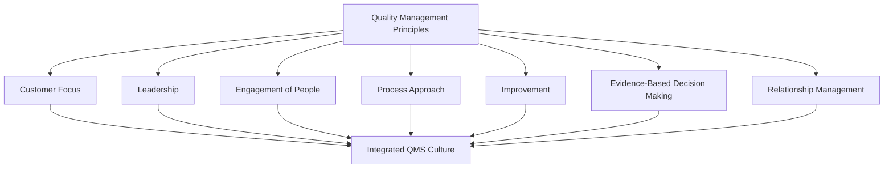
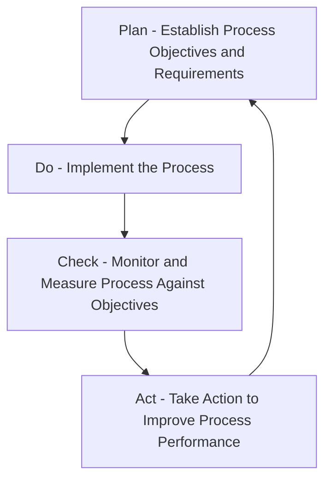
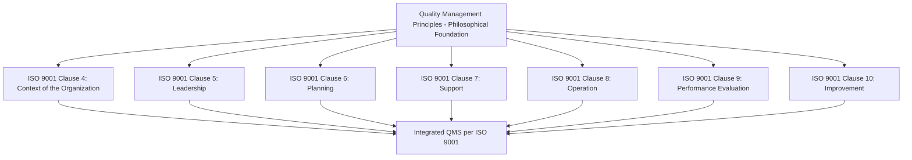

## Quality Management Principles

### Overview

Quality management principles are the foundational set of beliefs and practices that guide an organization's approach to quality management systems (QMS). The most widely referenced formalization is the seven Quality Management Principles (QMPs) underlying ISO 9001 and the broader ISO 9000 family of standards, representing a distillation of decades of quality management theory and practice into actionable organizational guidance.

### The Seven Quality Management Principles (ISO 9000 Framework)

**1. Customer Focus**

The primary focus of quality management is meeting customer requirements and striving to exceed customer expectations. Sustained organizational success depends on attracting and retaining customer confidence.

**2. Leadership**

Leaders at all levels establish unity of purpose and direction, creating the conditions in which people are engaged in achieving the organization's quality objectives.

**3. Engagement of People**

Competent, empowered, and engaged people at all levels throughout the organization are essential to enhance its capability to create and deliver value.

**4. Process Approach**

Consistent and predictable results are achieved more effectively and efficiently when activities are understood and managed as interrelated processes that function as a coherent system.

**5. Improvement**

Successful organizations maintain an ongoing focus on improvement as a permanent objective.

**6. Evidence-Based Decision Making**

Decisions based on the analysis and evaluation of data and information are more likely to produce desired results.

**7. Relationship Management**

For sustained success, organizations manage their relationships with relevant interested parties, such as suppliers, in a way that optimizes their impact on performance.

### Principle 1: Customer Focus — Detailed

**Key Points**

- Customer focus extends beyond meeting explicitly stated requirements to understanding current and future customer needs and expectations, including those not directly articulated.
- Practical manifestations include systematic collection of customer feedback, complaint handling processes, and linking customer satisfaction metrics to organizational objectives.

**Example**

A precision component manufacturer implements structured post-delivery customer surveys and formally tracks Net Promoter Score alongside internal defect rate metrics, using both together (not defect rate alone) as an input to quality objective-setting — recognizing that a product can meet internal specifications while still failing to satisfy evolving customer expectations.

### Principle 2: Leadership — Detailed

**Key Points**

- Leadership involvement in quality is not delegated solely to a quality department; top management establishes the quality policy, ensures quality objectives are compatible with organizational strategic direction, and visibly demonstrates commitment.
- ISO 9001 explicitly requires top management to demonstrate leadership and commitment with respect to the QMS, rather than treating quality as a function that can be fully outsourced to a quality manager role.

### Principle 3: Engagement of People — Detailed

**Key Points**

- Recognizes that quality outcomes depend on the competence, empowerment, and genuine engagement of personnel at all levels — not solely on documented procedures.
- Practical elements include competence development, communication of the relevance and importance of individual contributions, and recognition mechanisms.

### Principle 4: Process Approach — Detailed

**Concept**

Managing activities as interconnected processes, rather than as isolated functional silos, enables the organization to understand how outputs of one process become inputs to another, and to manage the system holistically rather than optimizing individual functions at the expense of overall system performance.

**PDCA Cycle Integration**

The process approach is commonly operationalized through the Plan-Do-Check-Act (PDCA) cycle applied at both the overall QMS level and at the level of individual processes.

**Key Points**

- A core benefit of the process approach is the ability to identify interactions between processes — a change or problem in one process (e.g., incoming material inspection) can be traced to its impact on downstream processes (e.g., production, delivery), supporting more effective root cause analysis and system-level improvement.

### Principle 5: Improvement — Detailed

**Key Points**

- Improvement is framed as a permanent organizational objective, not a one-time project or periodic initiative — encompassing both incremental (continuous) improvement and, where needed, breakthrough change.
- Commonly supported by structured methodologies such as PDCA, Six Sigma DMAIC, Kaizen, and formal corrective/preventive action processes.

### Principle 6: Evidence-Based Decision Making — Detailed

**Key Points**

- Decisions grounded in the analysis of factual data and information (rather than intuition or anecdote alone) are more likely to produce intended results and can be more readily validated against past decisions.
- Requires organizational investment in reliable data collection, measurement system capability, and appropriate statistical/analytical methods — connecting this principle directly to statistical process control, measurement system analysis, and other quantitative QMS tools.

### Principle 7: Relationship Management — Detailed

**Key Points**

- Recognizes that an organization's performance is influenced by its network of interested parties (suppliers, partners, distributors) — not solely by its own internal processes.
- Practical application includes supplier qualification and development programs, collaborative improvement initiatives with key suppliers, and shared risk/benefit arrangements designed to optimize the entire value chain's performance rather than only the immediate organization's outcomes.

### Interrelationship of the Principles

**Key Points**

- The seven principles are not independent, isolated concepts — they function as a mutually reinforcing system. For example, evidence-based decision making (Principle 6) depends on engaged people (Principle 3) collecting accurate data within well-defined processes (Principle 4), under leadership that prioritizes data-driven culture (Principle 2), ultimately serving the organization's customer focus objective (Principle 1).
- ISO 9000/9001 does not treat these as a checklist to be independently satisfied, but as an integrated philosophical foundation underlying every clause and requirement of the standard.

### Relationship to ISO 9001 Structure

The seven QMPs are not, in current ISO 9001 editions, presented as standalone auditable clauses; rather, they are embedded throughout the standard's requirements (e.g., customer focus appears in clauses on customer requirements and satisfaction monitoring; process approach underlies the entire clause structure and the standard's adoption of the High-Level Structure/Annex SL common framework shared across multiple ISO management system standards).

### Historical Context and Evolution

[Inference: The specific formalization of these seven principles has evolved across ISO 9000 revisions; earlier editions organized quality management principles somewhat differently (e.g., an eight-principle version in earlier standard editions, later consolidated), reflecting ongoing refinement of the framework rather than a static, unchanging list. Readers working with a specific edition of ISO 9000/9001 should verify the principle framework against that specific edition's published documentation, since detailed wording and enumeration can shift between standard revisions.]

### Application in Metrology and Quality Control Context

Within Precision Metrology & Quality Control specifically, the quality management principles manifest concretely:

| Principle | Metrology/QC Application |
| --- | --- |
| Customer Focus | Calibration and inspection results meet the actual measurement uncertainty needs of downstream users, not merely a generic specification |
| Leadership | Management ensures adequate investment in calibration infrastructure, traceability, and metrology competence |
| Engagement of People | Metrologists and inspectors are trained, competent, and empowered to flag measurement system issues |
| Process Approach | Calibration, measurement, and inspection are managed as interconnected processes feeding into overall product conformance decisions |
| Improvement | Ongoing Gauge R&R studies, measurement uncertainty reduction initiatives, and calibration interval optimization |
| Evidence-Based Decision Making | Acceptance/rejection decisions and process adjustments are grounded in validated measurement data and statistical analysis |
| Relationship Management | Calibration service providers and gauge/instrument suppliers are managed as quality-critical partners |

### Common Pitfalls

- Treating the seven principles as an abstract, unactionable philosophical statement disconnected from concrete QMS clause requirements and daily operational practice.
- Assuming customer focus is satisfied solely by meeting written specifications, without investigating actual customer use conditions and evolving expectations.
- Implementing the process approach only at a superficial documentation level (process maps that exist on paper) without genuine management of process interactions and system-level performance.
- Pursuing improvement initiatives disconnected from evidence-based decision making, relying on anecdote or opinion rather than validated data and analysis.
- Managing supplier relationships purely transactionally, missing the relationship management principle's emphasis on mutual, sustained value optimization.

### Related Topics

- ISO 9001 Quality Management System Requirements
- PDCA Cycle and Continuous Improvement
- Process Approach and Process Mapping
- Measurement System Analysis and Metrology Traceability
- Customer Satisfaction Monitoring and Feedback Systems
- Supplier Quality Management and Development