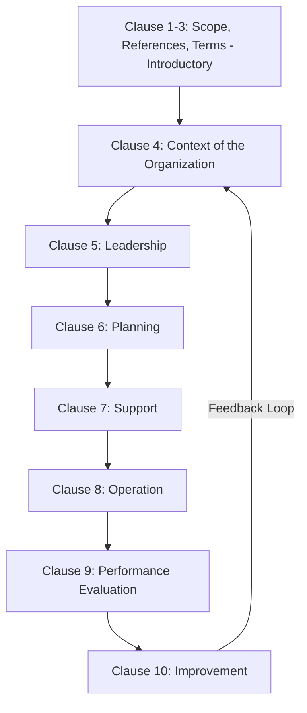
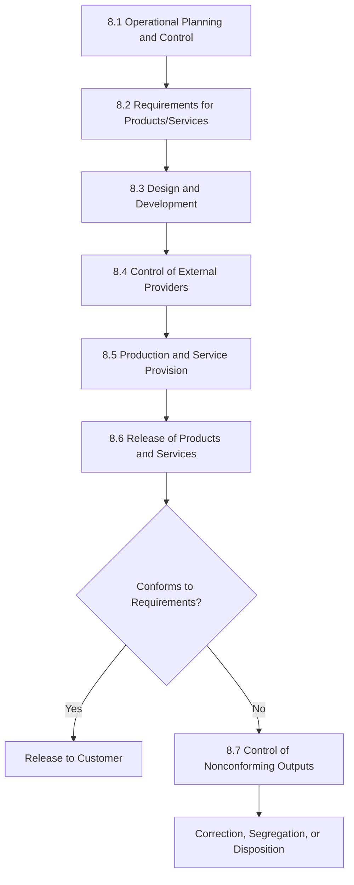

## ISO 9001 Structure and Requirements

### Overview

ISO 9001 is the international standard specifying requirements for a Quality Management System (QMS), used by organizations to demonstrate consistent ability to provide products and services meeting customer and applicable statutory/regulatory requirements. Its current structure follows the **High-Level Structure (HLS)**, also referred to as Annex SL, a common framework shared across multiple ISO management system standards (e.g., ISO 14001, ISO 45001) to facilitate integrated management system implementation.

### High-Level Structure (Annex SL) — Ten Clauses

ISO 9001 is organized into ten clauses; the first three are introductory/foundational and contain no auditable requirements, while clauses 4 through 10 contain the requirements against which certification audits are conducted.

| Clause | Title | Nature |
| --- | --- | --- |
| 1 | Scope | Introductory — defines applicability |
| 2 | Normative References | Introductory — references other standards |
| 3 | Terms and Definitions | Introductory — references ISO 9000 vocabulary |
| 4 | Context of the Organization | Requirements |
| 5 | Leadership | Requirements |
| 6 | Planning | Requirements |
| 7 | Support | Requirements |
| 8 | Operation | Requirements |
| 9 | Performance Evaluation | Requirements |
| 10 | Improvement | Requirements |

### Clause 4: Context of the Organization

**Key Requirements**

- **4.1** Understanding the organization and its context — determining internal and external issues relevant to the organization's purpose and strategic direction that affect its ability to achieve intended QMS results.
- **4.2** Understanding the needs and expectations of interested parties — identifying relevant interested parties (customers, regulators, employees, suppliers) and their requirements.
- **4.3** Determining the scope of the QMS — establishing boundaries and applicability, documented as a formal scope statement.
- **4.4** QMS and its processes — establishing, implementing, maintaining, and continually improving the QMS, including processes and their interactions (embodying the Process Approach principle).

**Key Points**

- Clause 4 introduces risk-based thinking as a foundational concept carried throughout the standard — organizations must consider risks and opportunities arising from their context when planning the QMS.

### Clause 5: Leadership

**Key Requirements**

- **5.1** Leadership and commitment — top management must demonstrate leadership with respect to the QMS (not merely delegate it), including accountability for QMS effectiveness and integration of QMS requirements into business processes.
- **5.2** Quality Policy — establishing, implementing, and maintaining a documented quality policy appropriate to organizational purpose and context.
- **5.3** Organizational roles, responsibilities, and authorities — top management ensures responsibilities are assigned and communicated.

**Key Points**

- A notable structural change from the previous 2008 edition is the elimination of the mandatory "Management Representative" role — top management now bears direct, non-delegable accountability for QMS leadership.

### Clause 6: Planning

**Key Requirements**

- **6.1** Actions to address risks and opportunities — planning actions based on the risks/opportunities identified under Clause 4, integrated into QMS processes rather than treated as a separate standalone activity.
- **6.2** Quality objectives and planning to achieve them — establishing measurable quality objectives at relevant functions and levels, consistent with the quality policy.
- **6.3** Planning of changes — ensuring changes to the QMS are carried out in a planned, controlled manner.

### Clause 7: Support

**Key Requirements**

- **7.1** Resources — encompassing people, infrastructure, process environment, monitoring/measuring resources (directly relevant to metrology — calibration and measurement traceability requirements reside here), and organizational knowledge.
- **7.2** Competence — ensuring personnel performing work affecting QMS performance are competent based on education, training, or experience.
- **7.3** Awareness — personnel are aware of the quality policy, relevant objectives, and their contribution to QMS effectiveness.
- **7.4** Communication — determining internal and external communications relevant to the QMS.
- **7.5** Documented information — requirements for creating, updating, and controlling documented information (replacing the 2008 edition's separate "documents" and "records" terminology with a unified concept).

**Key Points**

- Clause 7.1.5 (Monitoring and Measuring Resources) directly governs measurement equipment, requiring resources suitable for the specific type of monitoring/measurement activities, maintained to ensure continuing fitness for purpose, and — where measurement traceability is a requirement — calibrated/verified against measurement standards traceable to international or national standards, a core linkage point to Precision Metrology practice.

### Clause 8: Operation

**Key Requirements**

- **8.1** Operational planning and control — planning, implementing, and controlling processes needed to meet product/service requirements.
- **8.2** Requirements for products and services — customer communication, determination and review of requirements.
- **8.3** Design and development of products and services (where applicable).
- **8.4** Control of externally provided processes, products, and services — supplier/outsourcing control.
- **8.5** Production and service provision — including control of production, identification and traceability, property belonging to customers/external providers, preservation, post-delivery activities, control of changes.
- **8.6** Release of products and services — verification that requirements have been met prior to release (directly tied to inspection and acceptance sampling activities).
- **8.7** Control of nonconforming outputs — identifying and controlling outputs that do not conform to requirements, preventing unintended use or delivery.

**Key Points**

- Clause 8 is typically the largest and most operationally detailed clause, containing the bulk of requirements most directly relevant to production, inspection, and quality control activities — including acceptance sampling, in-process inspection, and final release verification.

### Clause 9: Performance Evaluation

**Key Requirements**

- **9.1** Monitoring, measurement, analysis, and evaluation — including customer satisfaction monitoring and analysis/evaluation of QMS performance data (directly linking to the Evidence-Based Decision Making principle).
- **9.2** Internal audit — planned internal audits at defined intervals to verify QMS conformance and effective implementation.
- **9.3** Management review — top management reviews the QMS at planned intervals to ensure continuing suitability, adequacy, effectiveness, and alignment with strategic direction.

### Clause 10: Improvement

**Key Requirements**

- **10.1** General — selecting and implementing improvement opportunities to meet customer requirements and enhance satisfaction.
- **10.2** Nonconformity and corrective action — reacting to nonconformities, evaluating the need for action to eliminate root causes, and implementing corrective actions.
- **10.3** Continual improvement — ongoing improvement of the suitability, adequacy, and effectiveness of the QMS.

**Key Points**

- A structural change from the 2008 edition is the removal of "preventive action" as a standalone separate clause — its function is now embedded within the risk-based thinking woven throughout Clauses 4 and 6, rather than treated as a distinct corrective/preventive action pairing.

### PDCA Mapping to Clause Structure

The ten-clause structure maps conceptually onto the Plan-Do-Check-Act cycle:

| PDCA Phase | Corresponding Clauses |
| --- | --- |
| Plan | Clauses 4, 5, 6 (Context, Leadership, Planning) |
| Do | Clauses 7, 8 (Support, Operation) |
| Check | Clause 9 (Performance Evaluation) |
| Act | Clause 10 (Improvement) |

### Documented Information Requirements

ISO 9001 requires documented information in specific instances explicitly called out in the standard (e.g., quality policy, quality objectives, scope of the QMS, evidence of competence, monitoring/measurement results) but does not mandate a specific document structure or a fixed "quality manual" format, unlike the more prescriptive 2008 edition — organizations retain flexibility in how they structure their documentation, provided the required documented information is maintained and controlled.

### Risk-Based Thinking as a Cross-Cutting Concept

**Key Points**

- Unlike the 2008 edition, which treated preventive action as a discrete clause, the current structure embeds risk-based thinking as a pervasive requirement throughout Clauses 4, 5, 6, and 9 — organizations are expected to proactively consider risks and opportunities as an integral part of QMS planning and operation, rather than as an isolated, separately documented activity.

### Example

**Example**

A precision machined-parts manufacturer implementing ISO 9001 maps its calibration program under Clause 7.1.5 (Monitoring and Measuring Resources), ensuring all CMMs, gauges, and hand tools used for acceptance decisions are calibrated against traceable standards at defined intervals. Its incoming material acceptance sampling procedures and final inspection sign-off fall under Clause 8.6 (Release of Products and Services), with any lots failing inspection routed through the Clause 8.7 nonconforming output process (segregation, disposition, and — where a systemic root cause is identified — escalation into the Clause 10.2 corrective action process).

### Common Pitfalls

- Treating ISO 9001 documentation requirements as more prescriptive than the current edition actually mandates (e.g., assuming a fixed "quality manual" structure is still required, a holdover from the 2008 edition's more document-centric approach).
- Implementing Clause 6 risk-based thinking as an isolated, standalone risk register disconnected from actual QMS planning and operational decisions.
- Treating internal audits (Clause 9.2) and management review (Clause 9.3) as compliance formalities rather than genuine performance evaluation mechanisms feeding into Clause 10 improvement activity.
- Neglecting the Clause 7.1.5 traceability and calibration requirements for measurement equipment, undermining the validity of acceptance/rejection decisions made throughout Clause 8 operations.
- Assuming certification to ISO 9001 alone certifies product quality — the standard certifies the management system's capability to consistently meet requirements, not any specific product's inherent quality level.

### Related Topics

- Quality Management Principles
- PDCA Cycle and Continuous Improvement
- Risk-Based Thinking and Risk Management in QMS
- Internal Audit and Management Review Processes
- Corrective and Preventive Action (CAPA)
- Measurement System Analysis and Calibration Traceability
- Control of Nonconforming Outputs