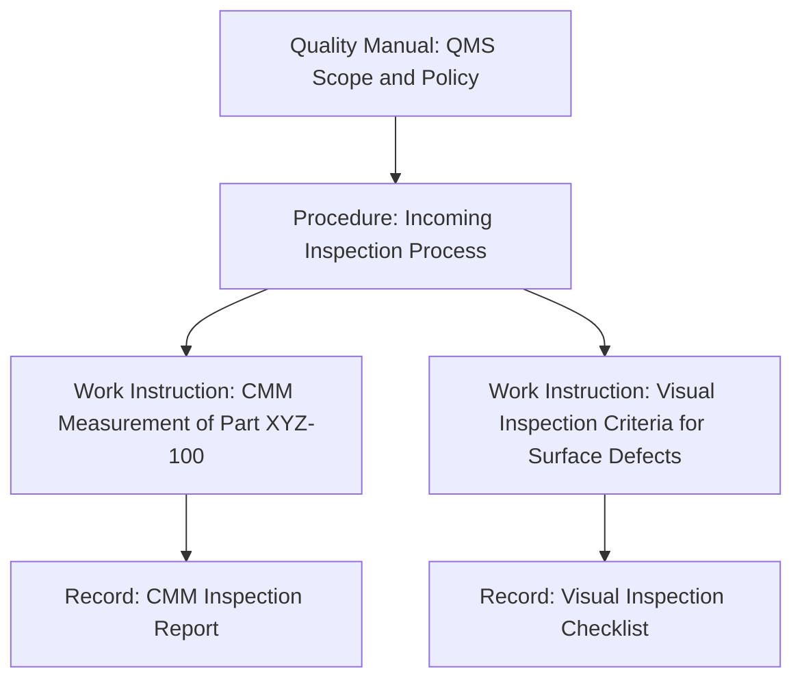
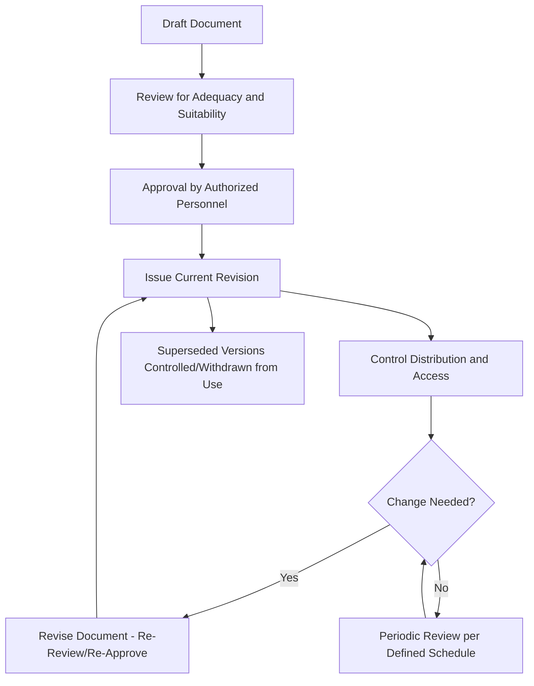

## Quality Manuals, Procedures, and Records

### Overview

Quality management systems rely on a hierarchy of documented information to establish, communicate, and demonstrate conformance to defined processes and requirements. Traditionally organized as a four-tier documentation pyramid (quality manual, procedures, work instructions, records), this structure — while no longer explicitly mandated by current ISO 9001 editions — remains a widely used practical framework for organizing QMS documentation in a coherent, auditable manner.

### The Documentation Hierarchy

```mermaid
flowchart TD
    subgraph Documentation_Pyramid [QMS Documentation Hierarchy (svg_diagram)]
    A["Tier 1: Quality Manual<br/>What the organization does - policy level"]
    B["Tier 2: Procedures<br/>How processes are executed - cross-functional"]
    C["Tier 3: Work Instructions<br/>Detailed step-by-step task guidance"]
    D["Tier 4: Records<br/>Evidence that activities occurred"]
    A --> B --> C --> D
    end
```

**Key Points**

- Higher tiers are broader in scope and change less frequently; lower tiers are more detailed, task-specific, and typically revised more often as operational practices evolve.
- Current ISO 9001 editions use the unified term "documented information" and do not mandate this specific four-tier structure or a standalone quality manual — organizations retain flexibility in how they structure documentation, provided required documented information (as explicitly called out in specific clauses) is maintained and controlled.

### Quality Manual

**Definition**

A top-level document describing the organization's QMS at a policy level — historically the master document establishing quality policy, scope, and a high-level description of how the organization addresses each applicable QMS requirement.

**Typical Contents (Traditional Structure)**

- Quality policy statement
- Scope of the QMS and any justified exclusions
- Organizational structure and responsibilities (high level)
- Description of process interactions (often via a process map)
- References to supporting procedures

**Key Points**

- While no longer explicitly required by current ISO 9001 editions, many organizations retain a quality manual as a practical, useful summary document — particularly valuable for onboarding, customer/auditor orientation, and providing a single point of reference to the QMS's overall structure.
- Some organizations have transitioned away from a standalone quality manual toward embedding equivalent content within a documented QMS process map or integrated management system documentation, consistent with the standard's current flexibility.

### Procedures

**Definition**

Documents describing *how* a process or activity is carried out, typically covering the sequence of steps, responsibilities, and interfaces between functions — narrower in scope than the quality manual but broader and less granular than work instructions.

**Typical Structure of a Procedure Document**

- Purpose and scope
- Definitions/terminology specific to the procedure
- Responsibilities (who performs which steps)
- Process description (sequence of activities, often supported by a flowchart)
- References to related documents, forms, or records generated
- Revision history

**Key Points**

- Procedures are commonly written for processes that are cross-functional, higher-risk, or require consistency across multiple performers — not every task within an organization necessarily warrants a formal documented procedure; the level of documentation should be proportionate to the complexity of the activity and the competence of personnel performing it.
- ISO 9001 explicitly requires documented information for the QMS to be effective, but the specific extent (which processes need formal procedures) is left to organizational judgment based on factors such as organizational size, process complexity, and personnel competence.

### Work Instructions

**Definition**

Detailed, task-level documents providing explicit step-by-step guidance for performing a specific activity — the most granular tier of the traditional documentation hierarchy, often specific to a particular machine, workstation, or task.

**Characteristics**

- Highly specific — often including exact settings, sequences, visual aids, or acceptance criteria for a single task.
- Typically used at the point of work performance (e.g., posted at a workstation) rather than referenced only during audits or training.
- Common in precision manufacturing and metrology contexts for tasks such as specific gauge calibration steps, CMM programming sequences, or detailed inspection procedures for a particular part number.



### Records

**Definition**

Documented information providing objective evidence that an activity was performed or a result achieved — distinct from procedures/work instructions in that records are typically not revised after creation (they capture a historical fact), whereas procedures are living documents subject to periodic revision.

**Key Distinction: Documents vs. Records**

| Attribute | Procedural Documents (Manual, Procedures, Work Instructions) | Records |
| --- | --- | --- |
| Purpose | Describe intended process/method | Provide evidence of what actually happened |
| Revision status | Living — revised as processes change | Static — represents a fixed point in time, not revised after creation |
| Control focus | Version control, approval, distribution of current revision | Retention, retrievability, protection from unauthorized alteration |
| Example | "Inspection Procedure QP-014" | "Inspection Report #4471, dated 2026-03-14" |

**Common Types of Quality Records**

- Inspection and test results
- Calibration certificates and records
- Internal audit reports
- Management review minutes
- Training and competence records
- Nonconformance reports and corrective action records
- Supplier evaluation and approval records

### Control of Documented Information (ISO 9001 Clause 7.5)

**Key Requirements**

- **Creation and updating**: appropriate identification/description (title, date, author, reference number), format, and review/approval for suitability and adequacy prior to issue.
- **Control**: availability at point of use, adequate protection (from loss, unauthorized modification, or unintended use), control of distribution, access, retrieval, and use, storage and preservation (including legibility), control of changes (e.g., version control), and defined retention and disposition.



**Key Points**

- Version control is essential to prevent obsolete document use at the point of operation — a common audit finding is an outdated work instruction still posted or in circulation at a workstation after a revision has been issued.
- Records require different control emphasis than living documents: rather than version control, the focus is on protecting the integrity of the historical record and ensuring appropriate retention periods and retrievability for audit, traceability, or legal/regulatory purposes.

### Retention and Disposition of Records

Organizations must define retention periods for quality records, often driven by:

- Contractual requirements (customer-specified retention periods)
- Regulatory requirements (industry-specific mandates, e.g., aerospace, medical device, automotive sectors often impose specific minimum retention periods)
- Internal risk management considerations (product liability exposure, warranty periods)
- Statutory limitation periods for potential legal claims

**Key Points**

- Retention requirements vary substantially by industry and jurisdiction; organizations in regulated industries (aerospace, medical device, automotive) typically face longer or more specific mandated retention periods than general commercial manufacturing. [Inference: specific retention duration requirements should be verified against the applicable industry standard, contract, or regulatory requirement for the organization's specific context, as these vary and are subject to change.]

### Electronic vs. Paper-Based Documentation Systems

| Consideration | Paper-Based | Electronic (QMS software, document control systems) |
| --- | --- | --- |
| Version control enforcement | Manual, relies on discipline | Can be automated (system prevents access to superseded versions) |
| Accessibility across sites | Limited, requires physical distribution | Real-time access across locations |
| Audit trail | Manual sign-off logs | Automated, timestamped change history |
| Integration with other systems (ERP, MES) | Limited | Often integrated, supporting traceability |
| Records tamper-evidence | Physical signatures, controlled forms | Electronic signatures, access controls, audit logs |

### Practical Application in Metrology and Quality Control

In precision metrology contexts specifically, the documentation hierarchy commonly manifests as:

| Tier | Metrology/QC Example |
| --- | --- |
| Quality Manual | High-level statement that calibration is performed per defined intervals traceable to national standards |
| Procedure | "Calibration Control Procedure" describing calibration scheduling, supplier qualification, out-of-tolerance handling |
| Work Instruction | Step-by-step instructions for calibrating a specific micrometer type against a gauge block standard |
| Record | Individual calibration certificate for a specific instrument, dated and signed, with as-found/as-left data |

### Example

**Example**

A precision parts manufacturer structures its documentation as follows: the Quality Manual states the organization maintains a calibration program ensuring measurement traceability to national standards. A supporting Procedure ("Measurement Equipment Control") describes the calibration interval-setting methodology, supplier qualification criteria for external calibration labs, and the out-of-tolerance investigation process. A Work Instruction provides the exact step-by-step method for calibrating a specific dial indicator model against a certified reference standard. Each calibration event generates a Record — a calibration certificate — retained per the organization's defined 7-year retention policy (aligned with customer contractual requirements), stored in a controlled electronic document management system with automated version control for the living documents and tamper-evident storage for the records.

### Common Pitfalls

- Maintaining excessive, overly granular procedures/work instructions for low-risk, simple tasks, creating documentation maintenance burden disproportionate to actual risk.
- Allowing obsolete document revisions to remain accessible or posted at points of use after a new revision is issued.
- Confusing documents and records in a document control system, applying version-control practices (which assume future revision) to records (which should remain fixed as historical evidence).
- Failing to define clear retention periods for records, risking either premature disposal (losing needed traceability/evidence) or unnecessary indefinite retention (storage burden, potential liability exposure).
- Assuming a formal quality manual remains mandatory under current ISO 9001 editions, leading to unnecessary rigidity in documentation structure when more flexible, integrated approaches are permitted.

### Related Topics

- ISO 9001 Structure and Requirements
- Control of Nonconforming Outputs
- Calibration Programs and Measurement Traceability
- Internal Audit and Management Review Processes
- Corrective and Preventive Action (CAPA)
- Document Control Systems and Electronic QMS Platforms