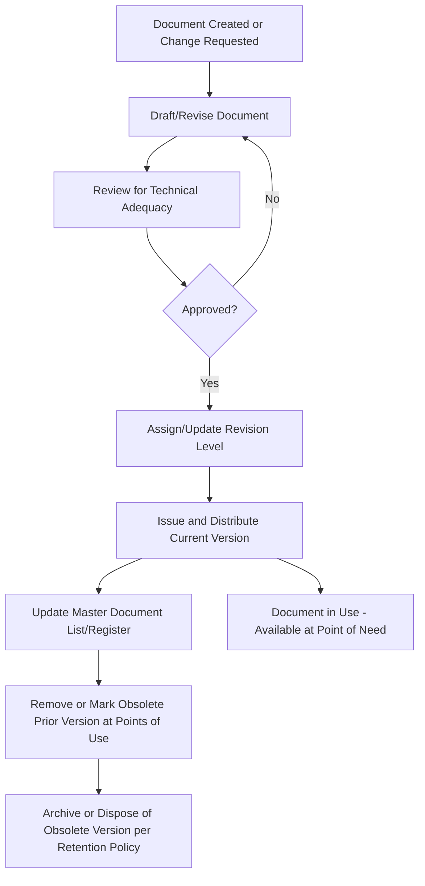
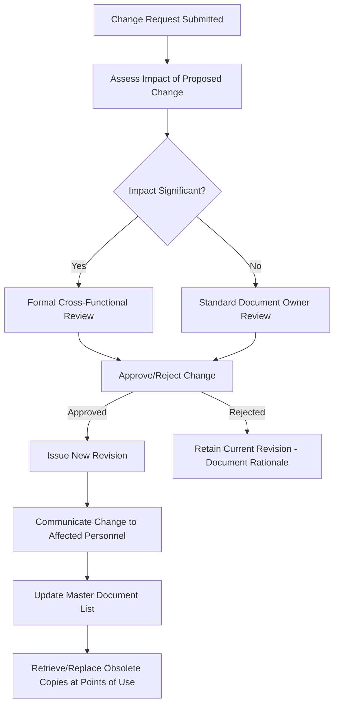
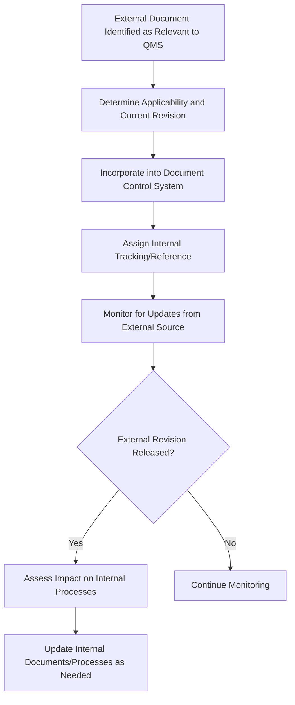

## Document and Data Control

### Overview

Document and data control is the systematic process by which an organization ensures that documented information — whether procedures, specifications, drawings, or electronic data — is properly created, reviewed, approved, distributed, maintained, and eventually disposed of, so that only current, authorized versions are available and used at the point of need. It is a foundational QMS discipline underpinning process consistency, traceability, and audit readiness.

### Objectives of Document and Data Control

- Ensure personnel use only the current, approved version of a document at the point of use.
- Prevent inadvertent use of obsolete or superseded documents.
- Provide traceability of what version of a procedure, specification, or drawing was in effect at any given time (critical for investigating historical nonconformances).
- Ensure documents are legible, readily identifiable, and retrievable when needed.
- Protect the integrity, confidentiality, and availability of controlled data.

### Core Elements of a Document Control Process

**1. Document Identification**

Every controlled document carries a unique identifier (document number), title, revision level/date, and often an owner/author designation, enabling unambiguous reference and retrieval.

**2. Review and Approval**

Documents are reviewed for adequacy and suitability by qualified personnel, and formally approved by authorized individuals prior to issue — establishing accountability for document content.

**3. Distribution and Access Control**

Controlled distribution ensures the correct personnel have access to current documents at their point of use, while restricting unauthorized modification.

**4. Revision Control**

When a document requires change, revisions follow a defined change control process, incrementing the revision level and re-triggering review/approval; the change history is maintained.

**5. Obsolete Document Control**

Superseded documents are removed from points of use or otherwise clearly and unambiguously identified as obsolete, if retained for legal/knowledge-preservation purposes.

**6. Storage, Protection, and Retrieval**

Documents and data are stored to prevent loss, damage, or unauthorized access, while remaining retrievable within a reasonable time when needed.

### Master Document List / Document Register

A centralized register (often called a Master Document List or Document Index) listing all controlled documents, their current revision level, approval date, and location/owner — serving as the authoritative single source of truth for "what is the current approved version" of any controlled document.

**Key Points**

- Without a reliable master document list, organizations risk multiple conflicting "current" versions circulating simultaneously, undermining the entire purpose of document control.
- In electronic document management systems, the master list function is often automated — the system itself enforces that only the current version is retrievable/printable by default.

### Change Control Process

**Key Requirements of a Robust Change Process**

- A formal change request mechanism (who can request changes, and how).
- Impact assessment — evaluating downstream effects of a proposed document change (e.g., a specification change may require re-validation, customer notification, or re-training).
- Re-approval by the same level of authority (or higher) as the original approval.
- Communication of the change to affected personnel.
- Update of the master document list and removal/replacement of obsolete copies at points of use.

### Data Control Distinguished from Document Control

**Documents**

Typically refer to procedural/descriptive content (procedures, specifications, drawings, work instructions) — living content subject to periodic revision.

**Data**

Refers more broadly to recorded information generated through operation of the QMS — measurement data, test results, process parameters, calibration values — which may be structured (databases, spreadsheets) or unstructured, and often overlaps conceptually with "records" but can also refer to raw operational data feeding into records or analyses.

**Key Points**

- Data control encompasses considerations beyond simple version control — data integrity (accuracy, completeness), data security (protection from unauthorized alteration), backup/recovery, and, increasingly, cybersecurity considerations for electronic quality data systems.

### Electronic Document and Data Control Systems

**Common Capabilities**

- Automated version control — preventing access to or printing of superseded revisions.
- Workflow-based review/approval routing with electronic signatures.
- Audit trail logging — timestamped record of who created, reviewed, approved, or modified a document/data record.
- Access control — role-based permissions restricting who can view, edit, or approve specific document types.
- Automated obsolescence handling — superseded versions automatically archived or access-restricted upon new revision approval.

**Considerations for Electronic Systems**

- Validation of the software system itself (particularly relevant in regulated industries such as medical device or pharmaceutical manufacturing, where electronic record/signature regulations may apply).
- Backup and disaster recovery planning to prevent data loss.
- Data integrity principles (commonly summarized via frameworks such as ALCOA — Attributable, Legible, Contemporaneous, Original, Accurate — particularly emphasized in regulated industries).

### External Origin Documents

Special consideration applies to documents of external origin that the organization must control despite not being the document's originator — customer specifications, industry standards, regulatory requirements, and supplier drawings.

**Key Points**

- Organizations must identify which externally originated documents are necessary for QMS planning and operation, and control their distribution and use appropriately — including tracking when external standards or customer specifications are updated/revised by their originating body, since the organization does not control the revision process itself.

### Document Control in Regulated and Contractual Contexts

Certain industries impose additional, more rigorous document and data control requirements beyond baseline ISO 9001 expectations:

| Context | Additional Consideration |
| --- | --- |
| Aerospace (AS9100) | Configuration management, more rigorous control of design/engineering data |
| Medical Device (ISO 13485, FDA 21 CFR Part 820/11) | Electronic signature validation, device history record control, specific retention mandates |
| Automotive (IATF 16949) | Control plan and PPAP documentation linkage, customer-specific requirements |
| Pharmaceutical (GMP) | Data integrity (ALCOA+) principles applied rigorously across electronic and paper records |

[Inference: The specific additional requirements imposed by each regulated industry framework are subject to periodic revision by their respective standard-issuing bodies; organizations operating in these contexts should verify current requirements against the applicable current edition of the relevant industry standard or regulation.]

### Example

**Example**

A precision metrology lab controls its calibration procedures through an electronic document management system. When a procedure for calibrating a specific gauge type requires revision (e.g., due to a change in the reference standard used), the change is submitted through a formal change request, reviewed by the metrology lab supervisor and quality manager, and — upon approval — issued as Revision C, automatically superseding Revision B in the system. All workstations accessing the procedure via the system's controlled terminals are immediately restricted from viewing Revision B; any printed paper copies of Revision B in circulation are recalled per the organization's controlled-copy tracking log. The master document list is automatically updated, and an audit trail entry records the approver, date, and reason for the change.

### Common Pitfalls

- Allowing uncontrolled printed copies of documents to circulate without a mechanism to recall or invalidate them when a new revision is issued.
- Relying on informal, undocumented change processes for "minor" document edits, creating gaps in the change history and approval trail.
- Failing to distinguish between documents (subject to revision control) and records (fixed historical evidence), applying inappropriate control mechanisms to each.
- Neglecting to establish a process for monitoring and incorporating updates to externally originated documents (standards, customer specifications), risking operation against an outdated external requirement.
- Implementing an electronic document control system without adequate backup, disaster recovery planning, or user access control review, creating data integrity and availability risk.

### Related Topics

- Quality Manuals, Procedures, and Records
- ISO 9001 Structure and Requirements
- Control of Nonconforming Outputs
- Calibration Programs and Measurement Traceability
- Configuration Management (AS9100 Context)
- Data Integrity Principles (ALCOA+)