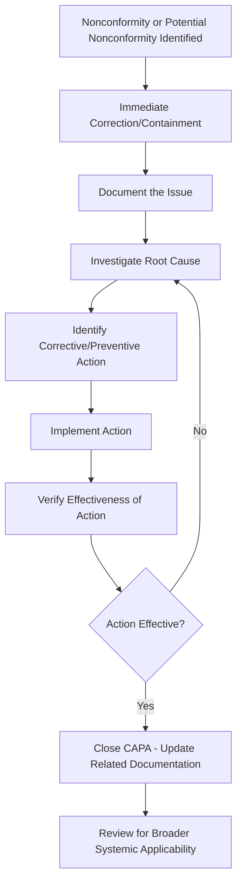

## Corrective and Preventive Action


### Overview

Corrective and Preventive Action (CAPA) is the systematic process by which an organization identifies nonconformities or potential nonconformities, investigates their underlying causes, and implements actions to eliminate those causes — preventing recurrence (corrective action) or occurrence (preventive action) of quality problems. CAPA is one of the primary mechanisms through which a QMS achieves the Improvement principle and closes the loop between detection and systemic organizational learning.

### Corrective Action vs. Preventive Action: Definitions

**Correction**

Action taken to eliminate a detected nonconformity itself — addressing the immediate symptom (e.g., reworking a defective part, scrapping nonconforming stock). Correction does not address the underlying cause.

**Corrective Action**

Action taken to eliminate the root cause of a detected nonconformity, to prevent its recurrence. Corrective action is reactive — triggered by an actual nonconformity that has already occurred.

**Preventive Action**

Action taken to eliminate the cause of a *potential* nonconformity, to prevent its occurrence in the first place. Preventive action is proactive — addressing risks or trends identified before an actual nonconformity has occurred.

| Term | Trigger | Timing | Example |
| --- | --- | --- | --- |
| Correction | An actual nonconformity | Immediate/reactive | Reworking a defective batch |
| Corrective Action | An actual nonconformity | After-the-fact, root-cause-focused | Redesigning a fixture that caused the defect |
| Preventive Action | A potential nonconformity or identified risk | Proactive, before occurrence | Upgrading a fixture on a similar line before a defect occurs there |

**Key Points**

- A common and consequential mistake is confusing correction with corrective action — reworking a defective part (correction) does nothing to prevent the next defective part from occurring, since it does not address why the nonconformity happened.
- Current ISO 9001 editions have integrated "preventive action" conceptually into the standard's pervasive risk-based thinking (Clauses 4 and 6) rather than retaining it as a standalone separate clause as in the 2008 edition — but the underlying proactive principle remains a core QMS expectation.

### The CAPA Process Flow



### Step-by-Step CAPA Process

**1. Identification and Documentation**

The nonconformity or potential issue is identified (via inspection, customer complaint, audit finding, process monitoring, near-miss reporting) and formally documented, including a clear, factual problem statement.

**2. Immediate Containment/Correction**

Address the immediate symptom to prevent further impact — e.g., segregate nonconforming material, halt an affected process — while the underlying cause investigation proceeds.

**3. Root Cause Investigation**

Systematically investigate to identify the true underlying cause(s), distinguishing root cause from mere symptoms or proximate causes. Common tools include:

- **5 Whys**: Iteratively asking "why" to drill past symptoms to underlying cause.
- **Fishbone (Ishikawa) Diagram**: Categorizing potential cause factors (e.g., Man, Machine, Method, Material, Measurement, Environment) to structure investigation.
- **Fault Tree Analysis**: Logical, top-down deductive analysis of failure pathways.
- **Pareto Analysis**: Identifying which of several contributing factors account for the largest share of occurrences.

**4. Action Planning**

Define specific action(s) targeting the identified root cause, including responsibility, resources, and target completion date.

**5. Implementation**

Execute the planned action(s).

**6. Effectiveness Verification**

Confirm, based on objective evidence (not merely completion of the action), that the implemented action actually eliminated or sufficiently reduced the root cause and prevented recurrence — typically assessed over a defined monitoring period after implementation.

**7. Closure and Broader Review**

Formally close the CAPA record once effectiveness is confirmed; assess whether the same root cause or corrective action has broader applicability to other products, processes, or lines (systemic corrective action).

### Root Cause Analysis Tools in Detail

**5 Whys Example**

| Iteration | Question | Answer |
| --- | --- | --- |
| Why 1 | Why did the part fail dimensional inspection? | The bore diameter was oversized |
| Why 2 | Why was the bore diameter oversized? | The boring tool had excessive wear |
| Why 3 | Why did the tool have excessive wear? | Tool change interval was not being followed |
| Why 4 | Why was the tool change interval not followed? | The tool life tracking system was manual and error-prone |
| Why 5 (Root Cause) | Why was tracking manual and error-prone? | No automated tool-life monitoring had been implemented on this machine |

**Fishbone Diagram Categories (6M Framework)**

```mermaid
flowchart LR
    subgraph Fishbone [Fishbone Diagram - 6M Categories (svg_diagram)]
    A[Man/People] --> Z[Effect: Nonconformity]
    B[Machine] --> Z
    C[Method] --> Z
    D[Material] --> Z
    E[Measurement] --> Z
    F[Environment] --> Z
    end
```

**Key Points**

- Root cause analysis should continue past the first plausible explanation — stopping at a proximate cause (e.g., "the tool was worn") rather than the true systemic root cause (e.g., "no automated tool-life monitoring exists") typically results in a corrective action that only temporarily resolves the issue, with recurrence likely once conditions repeat.

### Effectiveness Verification

**Key Points**

- Effectiveness verification is distinct from and must not be conflated with implementation confirmation — implementing an action (e.g., installing a new fixture) confirms the action was *done*, but effectiveness verification confirms the action actually *worked* (e.g., monitoring subsequent production runs to confirm the defect rate has genuinely decreased).
- A defined monitoring period, with objective data collection, is standard practice for effectiveness verification — closing a CAPA immediately upon implementation without a monitoring period risks premature closure of an ineffective action.

### CAPA Triggers

| Source | Example |
| --- | --- |
| Internal inspection/testing | In-process or final inspection detects nonconforming product |
| Customer complaints | Field failure, warranty claim, return |
| Internal audit findings | Audit identifies a process nonconformity |
| Supplier quality issues | Incoming inspection rejects a supplier lot |
| Process monitoring/SPC | Control chart signals an out-of-control condition or trend |
| Near-miss/hazard reporting | A potential issue identified before it caused actual nonconformity (typically feeds preventive action) |
| Management review | Trend analysis reveals a systemic issue requiring action |

### CAPA Documentation Record Elements

A well-structured CAPA record typically includes:

- Unique CAPA identifier/number
- Problem description (factual, specific)
- Immediate correction/containment taken
- Root cause investigation findings and methodology used
- Corrective/preventive action(s) planned, with responsible owner and target date
- Implementation evidence
- Effectiveness verification method, data, and results
- Closure approval and date
- Assessment of broader applicability (systemic corrective action)

### Distinguishing Effective vs. Ineffective CAPA Practice

| Ineffective Practice | Effective Practice |
| --- | --- |
| Correction only (rework/scrap), no root cause investigation | Root cause investigation using structured tools (5 Whys, fishbone) |
| Action targets a symptom, not the underlying cause | Action targets the verified root cause |
| CAPA closed immediately upon action implementation | CAPA closed only after objective effectiveness verification over a defined period |
| CAPA scope limited to the single reported instance | Broader review for systemic applicability across similar products/processes |
| No documented evidence trail | Fully documented investigation, action, and verification evidence |

### Example

**Example**

A recurring dimensional nonconformity is detected during final inspection of machined housings. Immediate correction: the affected lot is segregated and 100% re-inspected, with nonconforming units reworked. Root cause investigation using the 5 Whys traces the issue to inconsistent fixture clamping pressure caused by a worn clamping mechanism, which in turn traces to the absence of a scheduled preventive maintenance interval for that fixture. Corrective action: the fixture is repaired, and a preventive maintenance schedule is established and added to the maintenance management system. Effectiveness verification: the next 30 production lots are monitored via SPC control charting of the critical dimension, confirming the process has returned to and sustained statistical control. Upon confirmed effectiveness, the CAPA is closed, and — because similar fixtures exist on two other production lines — a broader review extends the same preventive maintenance scheduling to those lines as a systemic corrective action.

### CAPA in the Broader QMS Context

**Key Points**

- CAPA is closely linked to, but distinct from, the acceptance sampling and inspection activities that often trigger it — inspection detects nonconformities, while CAPA addresses why they occurred and prevents recurrence.
- Effective CAPA is a primary input to management review (ISO 9001 Clause 9.3) and to the organization's overall continual improvement activity (Clause 10.3), providing the evidence base for evaluating QMS effectiveness over time.

### Common Pitfalls

- Treating correction (fixing the immediate nonconforming item) as if it were corrective action (addressing the root cause), leaving the underlying issue unresolved and recurrence likely.
- Stopping root cause investigation at the first plausible proximate cause rather than continuing to the true systemic root cause.
- Closing CAPA records based on action implementation alone, without objective effectiveness verification data.
- Failing to assess broader applicability, missing opportunities to prevent the same root cause from producing nonconformities elsewhere in the organization.
- Inadequate documentation of the investigation and verification process, undermining auditability and organizational learning from the CAPA.
- Treating CAPA purely as a compliance/paperwork exercise rather than a genuine problem-solving and improvement tool.

### Related Topics

- Quality Management Principles
- ISO 9001 Structure and Requirements
- Root Cause Analysis Techniques (5 Whys, Fishbone, Fault Tree Analysis)
- Control of Nonconforming Outputs
- Internal Audit and Management Review Processes
- Statistical Process Control and Out-of-Control Signal Investigation
- Risk-Based Thinking in QMS