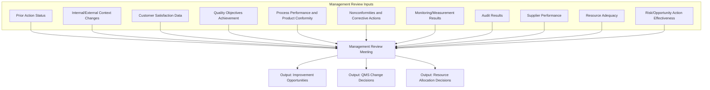
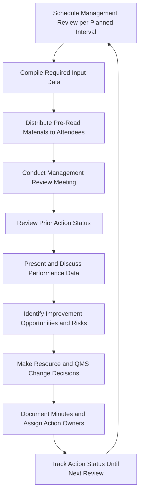

## Management Review

### Overview

Management review is a formal, periodic process in which top management evaluates the Quality Management System's continuing suitability, adequacy, effectiveness, and alignment with the organization's strategic direction. It functions as the top-level governance mechanism through which QMS performance data is synthesized, decisions are made, and resources are allocated to sustain and improve quality outcomes — the "Act" step of the QMS operating at the strategic, organization-wide level.

### Purpose and Position in the QMS

**Key Points**

- Management review is distinct from internal audit: internal audit verifies conformance of the QMS to requirements and its own defined processes at an operational/process level, while management review evaluates whether the QMS as a whole remains suitable, adequate, and effective in supporting organizational objectives — a strategic rather than compliance-verification activity.
- Management review is where top management's Leadership responsibility (per the Quality Management Principles) becomes concretely operationalized — it is the recurring forum through which leadership demonstrably engages with QMS performance, rather than delegating quality oversight entirely.

### ISO 9001 Clause 9.3 Requirements

**9.3.1 General**

Top management must review the organization's QMS at planned intervals to ensure its continuing suitability, adequacy, effectiveness, and alignment with the strategic direction of the organization.

**9.3.2 Management Review Inputs**

The review must consider:

- Status of actions from previous management reviews
- Changes in external and internal issues relevant to the QMS
- Information on QMS performance and effectiveness, including trends in:
  - Customer satisfaction and feedback from relevant interested parties
  - Extent to which quality objectives have been met
  - Process performance and conformity of products/services
  - Nonconformities and corrective actions
  - Monitoring and measurement results
  - Audit results
  - Performance of external providers (suppliers)
- Adequacy of resources
- Effectiveness of actions taken to address risks and opportunities
- Opportunities for improvement

**9.3.3 Management Review Outputs**

The review must produce decisions and actions related to:

- Opportunities for improvement
- Any need for changes to the QMS
- Resource needs

### Planning and Scheduling Management Review

**Key Points**

- ISO 9001 requires review "at planned intervals" but does not mandate a specific frequency — organizations determine an appropriate interval based on factors such as organizational size, process stability, rate of change, and risk profile; annual reviews are common, though many organizations supplement a comprehensive annual review with more frequent (e.g., quarterly) partial reviews of key metrics.
- The planned interval and agenda structure are typically documented in a management review procedure, ensuring consistency and completeness of required inputs across review cycles.

### Typical Management Review Meeting Structure

**1. Review of Prior Action Item Status**

Confirming whether actions committed to in the previous management review were completed and effective.

**2. Presentation of Performance Data**

Structured presentation of QMS performance metrics against the required input categories (customer satisfaction, process performance, audit results, etc.), often visualized via dashboards or trend charts.

**3. Discussion and Analysis**

Top management discusses trends, root causes of underperformance, and emerging risks or opportunities revealed by the data.

**4. Decision-Making**

Formal decisions on resource allocation, QMS changes, improvement initiatives, and strategic direction adjustments.

**5. Documentation of Outputs**

Formal minutes/records capturing inputs reviewed, discussion highlights, decisions made, and assigned actions with owners and target dates.

### Attendees and Participation

**Key Points**

- Top management (as defined by the organization — typically senior executives with authority over the QMS and resource allocation) must participate, since management review outputs require decisions on resource allocation and strategic QMS changes that fall within top management's authority.
- Functional leaders (quality, operations, engineering) commonly present performance data relevant to their area, even where top management holds final decision authority — broadening the evidence base available for review.

### Connecting Management Review to Other QMS Processes

| Input Source | Feeds Into Management Review |
| --- | --- |
| Internal Audit (Clause 9.2) | Audit findings and trends inform QMS effectiveness evaluation |
| CAPA Process | Corrective/preventive action status and trends |
| Customer Satisfaction Monitoring | Customer feedback trends |
| Process Performance/SPC | Process capability and control status |
| Risk-Based Planning (Clause 6.1) | Effectiveness of risk/opportunity actions |
| Supplier Performance Monitoring | External provider performance data |

**Key Points**

- Management review functions as a genuine integration point, synthesizing outputs from multiple QMS processes into a coherent picture — its value depends directly on the quality, accuracy, and completeness of the underlying data feeding into it from these other processes.

### Common Review Metrics and Dashboards

| Metric Category | Example Metrics |
| --- | --- |
| Customer | Customer satisfaction score, complaint rate, on-time delivery performance |
| Process/Product Conformity | First-pass yield, defect rate, $C_{pk}$ trends, scrap/rework cost |
| Quality Objectives | Percentage of quality objectives met vs. target |
| Audit | Number/severity of audit findings, audit closure timeliness |
| Corrective Action | Number of open CAPAs, average time to closure, recurrence rate |
| Supplier | Supplier defect rate, on-time delivery, supplier audit results |
| Resource | Training completion rate, equipment calibration compliance rate |

### Management Review Outputs: From Discussion to Action

**Key Points**

- A management review lacking documented, assigned, and tracked outputs (decisions and actions) fails to satisfy the standard's intent — the review must produce tangible decisions, not merely a data presentation or discussion without resulting commitments.
- Effective management review outputs typically feed directly into Clause 6 planning activities (updated risk/opportunity actions, revised quality objectives) and Clause 7 resource decisions (budget, staffing, equipment investment), closing the loop between strategic review and operational planning.

### Example

**Example**

A precision components manufacturer conducts quarterly management reviews, supplemented by a comprehensive annual review. At a quarterly review, data presented includes: customer satisfaction trending downward over the prior two quarters, driven by late deliveries traced to a specific bottleneck process; internal audit results showing a recurring finding related to calibration record completeness; and CAPA data showing three open corrective actions related to a specific machining center exceeding the organization's target closure time.

Management review outputs: (1) approval of capital investment in additional capacity at the bottleneck process, (2) a decision to revise the calibration record documentation process and retrain affected personnel, with a follow-up internal audit scheduled to verify effectiveness, and (3) assignment of additional engineering resources to accelerate the three open CAPAs related to the machining center, with a target closure date and a commitment to review status at the next quarterly meeting. All decisions, along with the supporting data reviewed, are documented in the management review minutes as required documented information.

### Common Pitfalls

- Conducting management review as a status-reporting exercise without genuine analysis, decision-making, or resource commitment.
- Failing to review the status of prior management review actions, allowing commitments to lapse without accountability.
- Incomplete input coverage — omitting required input categories (e.g., supplier performance, risk/opportunity action effectiveness) specified by ISO 9001 Clause 9.3.2.
- Treating management review purely as an annual compliance event disconnected from ongoing operational decision-making throughout the year.
- Inadequate documentation of outputs, leaving decisions and actions ambiguous, unassigned, or unverifiable at the next audit or review cycle.
- Excluding genuine top management participation, delegating the review entirely to quality department personnel who lack authority to make the resource and strategic decisions the review requires.

### Related Topics

- ISO 9001 Structure and Requirements
- Internal Audit and Management Review Processes
- Corrective and Preventive Action (CAPA)
- Quality Management Principles
- Risk-Based Thinking and Risk Management in QMS
- Customer Satisfaction Monitoring and Feedback Systems
- Quality Objectives and Strategic Planning