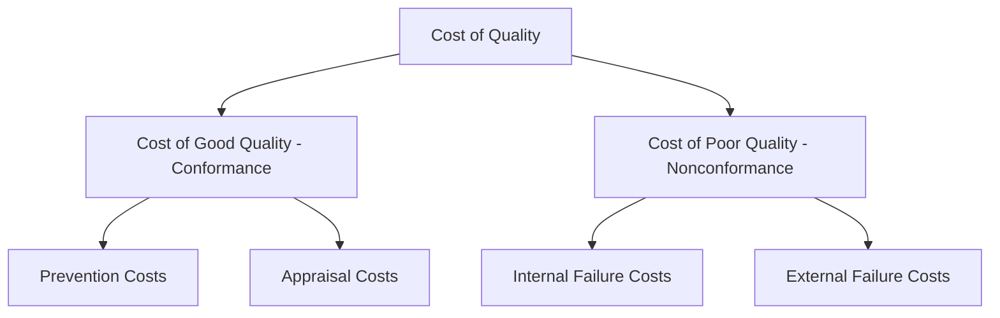
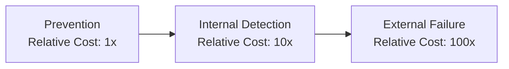

## Cost of Quality


### Overview

Cost of Quality (COQ) is a framework for quantifying the financial impact of quality-related activities — both the costs invested to ensure good quality and the costs incurred when quality fails. By translating quality performance into financial terms, COQ provides a common language for connecting quality management decisions to organizational economics, enabling data-driven prioritization of quality investments (directly supporting the Evidence-Based Decision Making principle).

### The Four Categories of Cost of Quality (PAF Model)

The most widely used COQ framework is the **Prevention-Appraisal-Failure (PAF) model**, organizing costs into four categories.

**1. Prevention Costs**

Costs incurred to prevent defects from occurring in the first place — investments made *before* production/service delivery to keep failure and appraisal costs low.

**2. Appraisal Costs**

Costs incurred to determine the degree of conformance to quality requirements — inspection, testing, and measurement activities.

**3. Internal Failure Costs**

Costs resulting from nonconformities detected *before* delivery to the customer.

**4. External Failure Costs**

Costs resulting from nonconformities detected *after* delivery to the customer — generally the most expensive category due to reputational, warranty, and liability impacts.



### Prevention Costs — Detailed

**Examples**

- Quality planning and DOE (Design of Experiments) activities
- Process capability studies
- Supplier quality development and qualification
- Training programs for quality-related skills
- Preventive maintenance
- Design review and design for manufacturability activities
- Quality system development and maintenance

**Key Points**

- Prevention costs are generally the least expensive category per dollar of quality outcome achieved — investment here tends to reduce costs in all three other categories, which is the central economic argument for shifting spending "upstream" in the COQ model.

### Appraisal Costs — Detailed

**Examples**

- Incoming material inspection and testing (including acceptance sampling)
- In-process inspection
- Final inspection and testing
- Calibration of measurement/test equipment
- Maintenance and depreciation of inspection/test equipment
- Outside endorsements/certifications (e.g., third-party testing)

**Key Points**

- Appraisal costs detect nonconformities but do not, by themselves, prevent them from occurring — a heavy reliance on appraisal (inspection-based quality) without corresponding prevention investment tends to produce persistently high appraisal costs, since the underlying causes generating nonconformities remain unaddressed.

### Internal Failure Costs — Detailed

**Examples**

- Scrap
- Rework and repair
- Re-inspection and re-testing of reworked items
- Downtime caused by quality problems (e.g., line stoppage for defect investigation)
- Failure analysis/root cause investigation of internal nonconformities
- Downgrading (selling as a lower grade/price due to a defect)

### External Failure Costs — Detailed

**Examples**

- Warranty claims and costs
- Customer complaint handling
- Returns and replacements
- Product recalls
- Liability claims and litigation costs
- Lost sales/customer defection due to dissatisfaction
- Reputational damage (often difficult to quantify precisely but real in impact)

**Key Points**

- External failure costs are generally regarded as the most expensive category, both because of direct costs (warranty, recall, litigation) and because of harder-to-quantify but potentially larger costs (lost future business, brand/reputational damage) — this asymmetry is the central rationale for the classical COQ "1-10-100 rule" heuristic.

### The 1-10-100 Rule (Cost Escalation Principle)

A widely cited heuristic asserting that the cost of addressing a quality problem escalates roughly by an order of magnitude at each stage further from its origin:

| Stage of Detection | Relative Cost (Illustrative) |
| --- | --- |
| Prevention (before production) | 1x |
| Appraisal/internal detection (during production, before shipment) | 10x |
| External failure (after reaching the customer) | 100x |

**Key Points**

- The 1-10-100 rule is a directional heuristic illustrating the economic logic for investing upstream, not a precise universal multiplier — actual cost escalation ratios vary substantially by industry, product complexity, and failure mode severity. [Inference: specific numeric ratios cited for a given industry or product category should be treated as illustrative unless supported by the organization's own COQ data analysis.]



### Total Cost of Quality and Optimal Balance

**Traditional COQ Curve Concept**

Classical COQ theory posits a trade-off curve: as prevention/appraisal spending increases, failure costs decrease, and an "optimal" total COQ point exists where the sum of all four cost categories is minimized.

$$COQ_{Total} = C_{Prevention} + C_{Appraisal} + C_{Internal Failure} + C_{External Failure}$$

**Modern Perspective (Zero Defects / Continuous Improvement View)**

A more contemporary view, influenced by modern quality philosophy (e.g., Six Sigma, Lean, Taguchi's Quality Loss Function concept), challenges the traditional "optimal balance" curve — arguing that with sufficiently effective prevention investment, both failure costs and the eventual need for extensive appraisal can be driven toward continuously lower levels simultaneously, rather than accepting a fixed trade-off equilibrium.

```mermaid
flowchart TD
    subgraph Traditional_View [Traditional COQ View: Fixed Optimal Balance (svg_diagram)]
    A["Increasing Prevention/Appraisal Spending"] --> B["Decreasing Failure Costs"]
    B --> C["Total Cost Minimized at Some Intermediate Point"]
    end
    subgraph Modern_View [Modern View: Continuous Improvement (svg_diagram)]
    D["Sustained Prevention Investment"] --> E["Declining Appraisal Need Over Time"]
    E --> F["Declining Failure Costs Over Time"]
    F --> G["Total COQ Trends Continuously Downward"]
    end
```

**Key Points**

- Organizations pursuing mature continuous improvement cultures often observe that the traditional "cost of quality trade-off" framing understates the achievable long-run benefit of prevention investment, since process capability improvements can reduce both appraisal and failure costs simultaneously over time rather than trading one against the other at a fixed equilibrium.

### Typical Distribution of COQ Categories (Illustrative)

[Inference: Distribution patterns vary substantially by industry maturity and quality management approach; the following reflects commonly cited general patterns in quality management literature rather than a universal fixed ratio, and organizations should base conclusions on their own measured COQ data.]

A commonly cited illustrative pattern in organizations with immature quality systems shows failure costs (internal + external) dominating total COQ, with prevention costs representing a comparatively small share — and a key goal of quality maturity initiatives is shifting this distribution toward greater prevention investment and correspondingly lower failure costs.

### Measuring and Reporting COQ

**Key Points**

- COQ data collection requires cross-functional cost accounting cooperation, since relevant costs (scrap, rework labor, warranty claims, inspection labor) are often recorded in different accounting systems or cost centers not natively organized by the PAF framework.
- COQ is commonly expressed as a percentage of sales revenue or total operating cost to enable trend tracking and benchmarking over time, and is a common input to management review (feeding the Clause 9.3.2 performance data requirements).

### COQ in Relation to Other Quality Frameworks

| Framework | Relationship to COQ |
| --- | --- |
| Taguchi Quality Loss Function | Reframes "cost" beyond the PAF categories to include the economic loss from any deviation from target, even within specification |
| Six Sigma / DMAIC | Uses COQ (often termed Cost of Poor Quality, COPQ) as a key project selection and financial justification metric |
| Lean | Waste reduction (including defect-related waste) directly reduces internal/external failure cost categories |
| Acceptance Sampling / Inspection Strategy | Appraisal cost trade-offs (sampling vs. 100% inspection) are a direct COQ optimization decision |

### Example

**Example**

A precision components manufacturer conducts a first formal COQ analysis and finds: prevention costs at 2% of total quality-related spend, appraisal costs at 28%, internal failure costs at 35%, and external failure costs at 35% — indicating the organization is spending heavily on inspection and absorbing substantial failure costs, with minimal upstream prevention investment. Following the COQ analysis, the organization redirects budget toward a targeted DOE-based process improvement initiative on its highest-scrap-rate process and expands supplier quality development for its highest-defect-rate incoming material category. Over the following year, internal failure costs decline meaningfully as process capability improves, and appraisal costs are subsequently reduced by transitioning select stable, capable processes from 100% inspection to reduced sampling inspection — illustrating the intended cascading effect of prevention investment on the other three COQ categories.

### Common Pitfalls

- Focusing COQ measurement narrowly on easily quantified costs (scrap, warranty claims) while omitting harder-to-quantify but often larger costs (lost customer goodwill, reputational damage, opportunity cost of management time spent firefighting).
- Treating appraisal spending as inherently "good" quality investment without recognizing it primarily detects rather than prevents nonconformities.
- Using COQ data purely for retrospective reporting without connecting it to prospective investment decisions (e.g., prevention-focused DOE or process improvement initiatives).
- Applying the 1-10-100 rule's specific numeric ratios as a precise universal calculation rather than a directional heuristic.
- Failing to secure cross-functional accounting cooperation, resulting in incomplete or inconsistent COQ data that undermines trend analysis credibility.

### Related Topics

- Quality Management Principles
- Sampling versus One Hundred Percent Inspection
- Taguchi Methods Overview (Quality Loss Function)
- Corrective and Preventive Action (CAPA)
- Management Review
- Process Capability Indices and Continuous Improvement