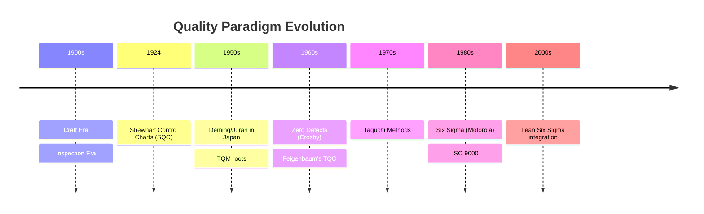

## Evolution of Quality Management Thought

### Overview

Quality management thought has evolved through distinct paradigms, each responding to the industrial, economic, and competitive pressures of its era. Understanding this progression is essential context for precision metrology professionals, since measurement systems, tolerancing philosophies, and inspection strategies are downstream consequences of which quality paradigm an organization operates under.

### Pre-Industrial and Craft Era Quality

Before mass production, quality was controlled through craftsmanship: a single artisan performed production and inspection simultaneously, with quality embedded in individual skill and apprenticeship training. There was no formal separation between "making" and "checking," and no statistical basis for acceptance — judgment was purely experiential.

### The Inspection Era (Early 1900s)

**Key Points**

- Driven by the rise of interchangeable parts and mass production (notably Ford's assembly line)
- Quality became a separate department function performed *after* production
- Go/no-go gauges and fixed-limit inspection dominated
- Frederick Taylor's scientific management separated planning from execution, reinforcing inspection as a distinct downstream activity
- Metrology role: purely binary conformance checking against blueprint tolerances; no feedback loop into the process

**Limitations**

Inspection-based quality is detection-oriented rather than prevention-oriented — defects are found, not avoided, resulting in scrap, rework, and no systemic learning.

### Statistical Quality Control (SQC) Era (1920s–1940s)

Walter Shewhart at Bell Labs introduced the control chart in 1924, founding statistical process control (SPC). This reframed quality from a binary inspection outcome to a statistical property of a process over time.

**Key Points**

- Shewhart distinguished **common cause variation** (inherent, random, process-stable) from **special cause variation** (assignable, signals a process shift)
- Control limits, typically $\bar{x}\pm3\sigma$, replaced pure tolerance-based accept/reject decisions
- Harold Dodge and Harry Romig developed acceptance sampling plans, enabling statistically justified lot sampling instead of 100% inspection
- World War II accelerated adoption via U.S. military standards (precursors to MIL-STD-105)

**Example**

A control chart for a shaft diameter process plots subgroup means against upper/lower control limits (UCL/LCL) derived from process variation itself, not the drawing tolerance — a critical conceptual shift for metrology: measurement data now drives process understanding, not just conformance.

### Post-War Japan and the Rise of Total Quality (1950s–1960s)

**Key Points**

- **W. Edwards Deming** brought SPC to Japan (1950 lectures), later formalizing his **14 Points for Management** and the **System of Profound Knowledge**
- **Joseph Juran** emphasized the "quality trilogy": planning, control, and improvement, and championed the Pareto principle (80/20 rule) applied to defect causes
- **Kaoru Ishikawa** developed the cause-and-effect (fishbone/Ishikawa) diagram and promoted company-wide quality circles, democratizing quality tools to shop-floor workers
- **Armand Feigenbaum** coined **Total Quality Control (TQC)**, arguing quality is the responsibility of every function, not just an inspection department

**Fishbone Diagram Structure (svg_diagram)**

<svg xmlns="http://www.w3.org/2000/svg" viewBox="0 0 700 360">
<rect width="700" height="360" fill="#ffffff" />
<text x="350" y="24" font-size="16" font-weight="bold" text-anchor="middle" fill="#1a1a1a">Ishikawa (Fishbone) Diagram Structure (svg_diagram)</text>
<line x1="80" y1="190" x2="560" y2="190" stroke="#333" stroke-width="3" />
<polygon points="560,180 590,190 560,200" fill="#333" />
<text x="600" y="195" font-size="14" font-weight="bold" fill="#1a1a1a">Defect/Effect</text>
<line x1="180" y1="190" x2="140" y2="80" stroke="#666" stroke-width="2" />
<text x="100" y="70" font-size="13" fill="#1a1a1a">Machine</text>
<line x1="260" y1="190" x2="220" y2="80" stroke="#666" stroke-width="2" />
<text x="190" y="70" font-size="13" fill="#1a1a1a">Method</text>
<line x1="340" y1="190" x2="300" y2="80" stroke="#666" stroke-width="2" />
<text x="270" y="70" font-size="13" fill="#1a1a1a">Material</text>
<line x1="180" y1="190" x2="140" y2="300" stroke="#666" stroke-width="2" />
<text x="90" y="320" font-size="13" fill="#1a1a1a">Manpower</text>
<line x1="260" y1="190" x2="220" y2="300" stroke="#666" stroke-width="2" />
<text x="190" y="320" font-size="13" fill="#1a1a1a">Measurement</text>
<line x1="340" y1="190" x2="300" y2="300" stroke="#666" stroke-width="2" />
<text x="270" y="320" font-size="13" fill="#1a1a1a">Environment</text>
</svg>

**Metrology relevance:** the "Measurement" branch of the fishbone is itself a standard root-cause category — recognizing gauge R&R, calibration drift, or fixturing error as contributors to defects is a direct legacy of this era's systems thinking.

### Zero Defects and Cost of Quality (1960s)

**Philip Crosby** introduced **Zero Defects (ZD)** and the "Quality is Free" philosophy, arguing prevention costs less than the **Cost of Quality (COQ)** — the sum of prevention, appraisal, internal failure, and external failure costs. Crosby's Four Absolutes of Quality:

1. Quality is conformance to requirements, not "goodness"
2. Prevention, not appraisal, creates quality
3. The performance standard is Zero Defects
4. Quality is measured by the price of nonconformance

### Robust Design and Variation Reduction (1970s–1980s)

**Genichi Taguchi** reframed quality loss as continuous rather than binary pass/fail, via the **Quality Loss Function**:

$$L(y)=k(y-T)^2$$

where $y$ is the measured characteristic, $T$ is the target value, and $k$ is a cost coefficient. This directly challenges tolerance-zone thinking: a part at the tolerance limit is not "as good" as one at nominal, even though both pass inspection. Taguchi also promoted **design of experiments (DOE)** and **robust parameter design** to make products insensitive to noise factors before tight tolerancing is even required.

**Metrology implication [Inference]:** Taguchi's loss function is often cited as conceptual justification for process capability indices ($C_p$, $C_{pk}$) favoring centered, low-variance distributions over merely "in-spec" ones, though the direct historical linkage between Taguchi's work and $C_{pk}$'s formal adoption in industry standards is not always explicitly documented.

### Total Quality Management (TQM) Consolidation (1980s–1990s)

TQM synthesized the prior decades into an organizational management philosophy:

**Key Points**

- Customer-focused, involving all employees, continuous improvement (**kaizen**)
- Process-centered rather than output-centered
- Fact-based decision making using data and statistical methods
- Integrated systems and strategic/systematic approach
- **ISO 9000** series (first published 1987) formalized quality management system (QMS) requirements internationally, creating auditable documentation and traceability requirements that directly shape metrology recordkeeping (calibration records, measurement traceability to national/international standards)

### Six Sigma and Statistical Rigor (1980s–2000s)

**Key Points**

- Originated at **Motorola** (1986, Bill Smith), popularized by **General Electric** under Jack Welch in the 1990s
- Targets a defect rate of 3.4 defects per million opportunities (DPMO), corresponding to a $6\sigma$ process capability (with the standard 1.5$\sigma$ long-term shift allowance)
- Formalized the **DMAIC** framework: Define, Measure, Analyze, Improve, Control
- The "Measure" phase institutionalizes **Measurement System Analysis (MSA)** and **Gauge R&R studies** as prerequisite steps before process data can be trusted — a direct and explicit convergence of metrology and quality management methodology
- **Lean Six Sigma** later merged Six Sigma's variation-reduction rigor with Lean's waste-elimination focus (originating from the Toyota Production System)

### Contemporary and Emerging Paradigms (2000s–Present)

**Key Points**

- **Industry 4.0 / Smart Manufacturing**: in-line and in-process metrology (e.g., in-machine probing, real-time SPC data feeds) shifts quality control from post-process sampling to continuous, automated monitoring
- **Model-Based Definition (MBD)** and **Model-Based Enterprise (MBE)**: tolerancing information embedded directly in 3D CAD models (per ASME Y14.41/ISO 16792) rather than 2D drawings, changing how metrology software consumes nominal/tolerance data
- **Digital twins** and closed-loop metrology feed dimensional measurement data back into process control algorithms in near-real-time
- **AI/ML-driven quality prediction** uses historical measurement and process data to predict defects before they occur [Speculation: the maturity and standardization of ML-based quality prediction varies significantly by industry and is still an actively developing practice area]

### Conclusion

The evolution from craft-based inspection to statistical process control, organization-wide total quality, robust design, Six Sigma rigor, and now data-driven smart manufacturing reflects a consistent trajectory: quality has moved progressively upstream — from detecting defects, to controlling processes, to designing variation out entirely, to predicting and preventing it before it occurs. Precision metrology has evolved in lockstep, from simple go/no-go gauging to statistically integrated, traceable, and increasingly automated measurement systems that serve as the data backbone for every paradigm since Shewhart.

**Related Topics**

- Statistical Process Control (SPC) and control chart theory
- Process capability indices ($C_p$, $C_{pk}$, $P_p$, $P_{pk}$)
- Measurement System Analysis (MSA) and Gauge R&R
- ISO 9001 Quality Management System requirements
- Design of Experiments (DOE) and Taguchi methods
- Measurement traceability and calibration hierarchies
- Model-Based Definition (MBD) and GD&T fundamentals