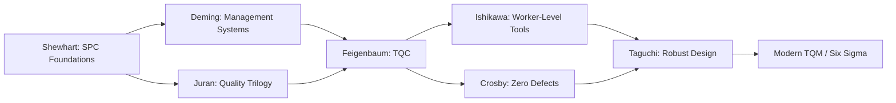

## Quality Pioneers and Their Philosophies

### Overview

This chapter documents the principal quality philosophy founders whose frameworks underpin modern quality management systems. Each pioneer's philosophy carries distinct implications for how measurement, inspection, and process control are structured in precision metrology environments.

### Walter A. Shewhart

**Key Points**

- Physicist and statistician at Bell Telephone Laboratories; widely regarded as the father of statistical process control (SPC)
- Introduced the **control chart** in a 1924 internal memo, formalized in *Economic Control of Quality of Manufactured Product* (1931)
- Core distinction: **common cause variation** (inherent, stable, predictable) vs. **special cause variation** (assignable, signals process instability)
- Introduced the **Plan-Do-Check-Act (PDCA)** cycle concept, later popularized by Deming as **Plan-Do-Study-Act (PDSA)**

**Core Philosophy**

A process should be brought into and held in statistical control before its capability relative to specification is meaningfully assessed. Judging conformance against tolerance alone, without first establishing statistical control, conflates noise with signal.

$$UCL,LCL=\bar{x}\pm3\sigma$$

### W. Edwards Deming

**Key Points**

- Statistician who brought SPC methods to postwar Japan (1950 lectures to JUSE — Union of Japanese Scientists and Engineers)
- Developed the **14 Points for Management** and the **System of Profound Knowledge (SoPK)**
- SoPK comprises four interrelated components: appreciation for a system, knowledge of variation, theory of knowledge, and psychology
- Strongly opposed to numerical quotas, management by fear, and grading/ranking employees, which he argued destroy intrinsic motivation and obscure system-level causes of variation
- Famous aphorism: a stable process's output is predictable only within the bounds of its common-cause variation; most problems (Deming estimated roughly 94%) originate in the system, not the worker [Unverified: the specific percentage attribution varies across secondary sources]

**Core Philosophy**

Quality is a management responsibility, not a worker responsibility — leadership must redesign the system itself, since workers operating within a stable system cannot outperform what the system allows.

### Joseph M. Juran

**Key Points**

- Authored the **Quality Trilogy**: Quality Planning, Quality Control, Quality Improvement
- Applied the **Pareto Principle** (80/20 rule) to quality: roughly 80% of defects trace to roughly 20% of causes — the "vital few vs. trivial many"
- Defined quality as **"fitness for use"**, emphasizing the customer's perspective over pure specification conformance
- Advocated project-by-project quality improvement with clear financial justification (the "cost of poor quality")

**Core Philosophy**

Quality management is a trilogy of interlocking processes; sustainable improvement requires structured, project-based initiatives with return-on-investment justification rather than slogans or exhortation alone.

### Philip B. Crosby

**Key Points**

- Introduced **Zero Defects (ZD)** as a performance standard, not merely an aspirational slogan
- **Four Absolutes of Quality**:
  1. Quality is conformance to requirements
  2. The system of quality is prevention
  3. The performance standard is Zero Defects
  4. The measurement of quality is the price of nonconformance (Cost of Quality)
- Authored *Quality Is Free* (1979), arguing prevention investment is offset by eliminated failure costs

**Core Philosophy**

Defects are not inevitable — they result from insufficient attention to prevention, training, and process discipline, not from an intrinsic limit on human performance.

### Armand V. Feigenbaum

**Key Points**

- Coined **Total Quality Control (TQC)**, later evolving into the broader **Total Quality Management (TQM)** movement
- Argued quality is a company-wide responsibility spanning every function (design, purchasing, production, marketing, service), not solely the quality department's
- Introduced formal **Cost of Quality** categorization: prevention costs, appraisal costs, internal failure costs, external failure costs

**Core Philosophy**

Quality cannot be inspected into a product after the fact; it must be engineered in through cross-functional coordination across the entire product lifecycle.

### Kaoru Ishikawa

**Key Points**

- Developed the **cause-and-effect (fishbone/Ishikawa) diagram**
- Championed **Quality Circles** — small worker groups voluntarily analyzing and solving workplace quality problems
- Promoted the **"seven basic tools of quality"**: check sheets, Pareto charts, cause-and-effect diagrams, histograms, control charts, scatter diagrams, stratification/flowcharts
- Advocated company-wide quality control (CWQC), democratizing statistical tools beyond specialists to all employees

**Core Philosophy**

Quality tools should be simple enough for shop-floor workers to use directly, decentralizing quality responsibility rather than concentrating it in a specialist inspection function.

### Genichi Taguchi

**Key Points**

- Introduced the **Quality Loss Function**, treating deviation from target — not merely out-of-tolerance status — as a continuous economic loss:

$$L(y)=k(y-T)^2$$

- Pioneered **robust parameter design**: using **Design of Experiments (DOE)**, particularly orthogonal arrays, to make product/process performance insensitive to uncontrollable "noise factors"
- Distinguished **control factors** (adjustable by the designer) from **noise factors** (environmental, manufacturing, or usage variation outside direct control)

**Core Philosophy**

Off-target performance incurs loss even within specification limits; robustness should be engineered into the design stage rather than compensated for through tighter (and more costly) tolerancing downstream.

### Comparative Summary

| Pioneer | Central Concept | Primary Focus |
| --- | --- | --- |
| Shewhart | Control charts, common/special cause | Statistical process control |
| Deming | System of Profound Knowledge, 14 Points | Management responsibility for systems |
| Juran | Quality Trilogy, fitness for use | Structured project-based improvement |
| Crosby | Zero Defects, Cost of Quality | Prevention-based conformance |
| Feigenbaum | Total Quality Control | Cross-functional accountability |
| Ishikawa | Fishbone diagram, Quality Circles | Worker-level tool democratization |
| Taguchi | Quality Loss Function, robust design | Variation reduction at design stage |

### Metrology Relevance

Each philosophy imposes distinct requirements on measurement systems:

- **Shewhart/Deming**: require measurement data with sufficient precision and frequency to distinguish common from special cause variation, demanding low measurement system variation relative to process variation
- **Juran**: requires stratified defect/measurement data to identify the vital-few contributors via Pareto analysis
- **Crosby**: requires 100% conformance verification capability, driving investment in reliable, high-throughput inspection/gauging
- **Taguchi**: motivates $C_{pk}$-style capability metrics that penalize off-center distributions, not just out-of-spec parts, reinforcing the value of high-accuracy, well-calibrated measurement over simple pass/fail gauging

**Conclusion**

No single pioneer's philosophy is complete in isolation; modern quality systems (ISO 9001, Six Sigma, Lean, TQM) are syntheses of these frameworks. For metrology practitioners, the practical throughline is that measurement is never philosophy-neutral: the choice of what to measure, how often, and against what statistical criteria reflects which of these underlying philosophies an organization has adopted, whether explicitly or by default.

**Related Topics**

- Statistical Process Control (SPC) fundamentals
- Cost of Quality (COQ) categorization and calculation
- Design of Experiments (DOE) and orthogonal arrays
- Quality Circles and employee-driven improvement programs
- Process capability indices ($C_p$, $C_{pk}$) and their relationship to the Taguchi Loss Function
- ISO 9001 quality management system requirements