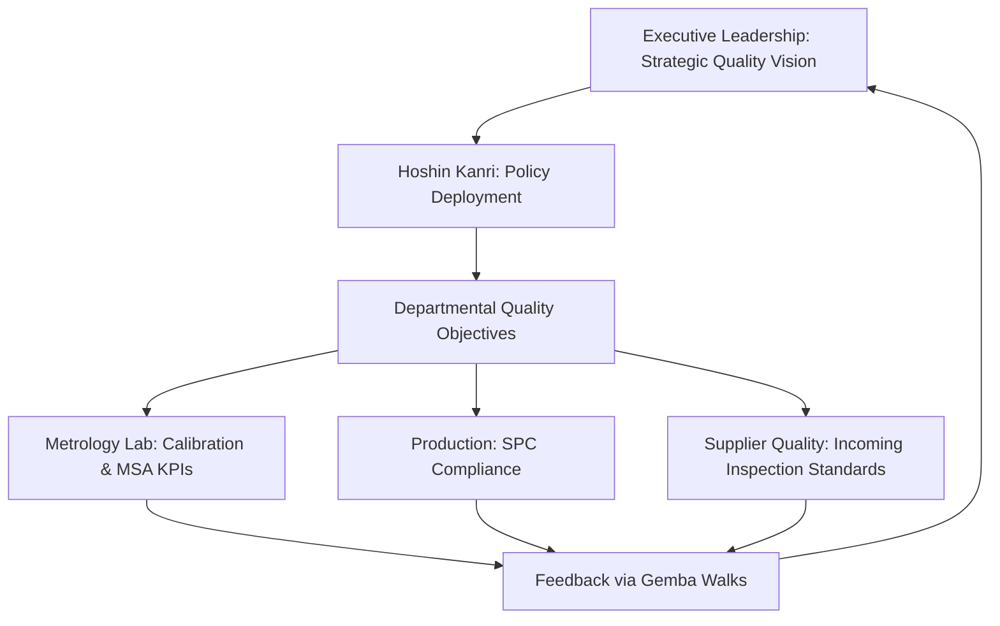

## Quality Leadership Principles

### Overview

Quality leadership refers to the specific management behaviors, structures, and accountability mechanisms that translate quality philosophy into sustained organizational practice. Where the pioneers (Deming, Juran, Crosby, et al.) defined the underlying theory, quality leadership principles define the operational role of management in enacting that theory day to day — a distinction with direct consequences for how metrology functions are resourced, staffed, and empowered within an organization.

### Leadership as a Systemic Responsibility

**Key Points**

- Deming's position that management, not the workforce, controls the system within which workers operate is the foundational premise of quality leadership theory
- Leadership's role is to remove systemic barriers (poor tooling, conflicting incentives, inadequate training, unreliable measurement systems) rather than to exhort individual effort
- A corollary for metrology: chronic measurement variability or calibration drift is a leadership/resourcing failure (inadequate investment in gauge maintenance, training, or environmental controls), not an operator failure, unless proven otherwise through root-cause analysis

### Deming's 14 Points for Management (Leadership Application)

**Key Points** (leadership-relevant subset)

- **Create constancy of purpose**: long-term quality investment over short-term cost-cutting
- **Cease dependence on mass inspection**: build quality into the process; inspection alone cannot improve quality, only detect its absence after the fact
- **Break down barriers between departments**: quality, design, and metrology functions must collaborate rather than operate as isolated silos
- **Drive out fear**: employees (including inspectors and metrologists) must be able to report nonconformances, measurement anomalies, or process concerns without punitive consequences
- **Eliminate numerical quotas and management by objective (MBO) without method**: targets divorced from process understanding drive data manipulation and short-termism
- **Institute leadership**: supervision should help people do a better job, not merely monitor and judge them

### Juran's Leadership Trilogy Application

**Key Points**

- **Quality Planning**: senior leadership must define quality goals and allocate resources (including metrology equipment, calibration programs, and skilled personnel) before production begins
- **Quality Control**: leadership establishes the standards against which operational performance is measured and ensures corrective action processes function
- **Quality Improvement**: leadership sponsors structured, resourced improvement projects with explicit financial justification — a leadership commitment, not a bottom-up volunteer effort alone

**Juran's "Vital Few" Leadership Implication**

Leadership attention itself is finite and should follow Pareto logic: leadership should prioritize the small number of systemic issues (often measurement system inadequacy, supplier variability, or design-tolerance mismatches) responsible for the majority of quality cost.

### Crosby's Management Commitment Model

**Key Points**

- Crosby's *Quality Improvement Process* begins explicitly with **management commitment** as step one of fourteen — quality initiatives fail without visible, sustained executive sponsorship
- Introduced the concept that **quality is free**: the cost of prevention (training, robust process design, calibrated and capable measurement systems) is recovered many times over by eliminated failure costs
- Leadership must set **Zero Defects Day** and similar visible commitment events, but backed by structural investment, not slogans alone

### Servant and Transformational Leadership Models

**Key Points**

- Modern quality leadership literature draws on **servant leadership** (leader's primary role is enabling subordinates' effectiveness) and **transformational leadership** (inspiring shared vision and intrinsic motivation) as complements to classical quality philosophy
- **Gemba walks** (Japanese: "the real place") — leaders physically visiting the shop floor, inspection stations, or metrology lab to observe processes directly rather than relying solely on reported data
- **Hoshin Kanri** (policy deployment): cascading strategic quality objectives from executive level down to measurable, department-level actions, ensuring metrology KPIs (e.g., Gauge R&R pass rates, calibration compliance rates) trace directly to strategic quality goals

### Leadership Accountability Structures

**Key Points**

- **Quality Councils / Steering Committees**: cross-functional leadership bodies that review quality metrics, approve corrective action resources, and own escalation of systemic issues
- **Management Review** (formal requirement under ISO 9001 clause 9.3): periodic leadership-level review of QMS performance, audit results, customer feedback, and resource adequacy — including metrology equipment calibration status and measurement uncertainty budgets
- **Quality Responsibility Matrix (RACI)**: explicit leadership-level assignment of who is Responsible, Accountable, Consulted, and Informed for quality decisions, preventing diffusion of accountability

### Leadership's Role in Supplier Quality (Chapter Linkage)

**Key Points**

- Leadership sets the tone for **supplier partnership vs. adversarial models**: Deming explicitly opposed awarding business on price alone, advocating long-term supplier relationships built on trust and joint quality improvement
- Executive-level supplier quality agreements (SQAs) formalize measurement system requirements, calibration traceability expectations, and acceptable Gauge R&R thresholds for incoming inspection
- Leadership must resource **supplier development programs** (audits, joint problem-solving, shared metrology standards) rather than relying solely on receiving-inspection rejection as the quality control mechanism

### Common Leadership Failure Modes

**Key Points**

- **Inspection-only mindset**: treating quality as an end-of-line gate rather than a designed-in process characteristic
- **Fear-based metrics**: punishing the messenger for reporting defects or measurement system problems, which suppresses the data leadership needs
- **Underinvestment in measurement infrastructure**: treating calibration, Gauge R&R studies, and metrology training as discretionary cost centers rather than risk-mitigation investment
- **Initiative fatigue**: launching quality programs (Six Sigma, Lean, TQM) sequentially without sustained follow-through, eroding organizational trust in subsequent initiatives

### Conclusion

Quality leadership principles operationalize the philosophies of Deming, Juran, Crosby, and others into concrete management behavior: systemic thinking over individual blame, sustained resource commitment over slogans, and structural accountability mechanisms (management review, quality councils, Hoshin Kanri) over ad hoc initiatives. For precision metrology functions specifically, leadership commitment directly determines whether measurement systems are treated as strategic infrastructure — properly calibrated, resourced, and trusted — or as a cost-minimized afterthought, with corresponding downstream effects on process capability and defect escape rates.

**Related Topics**

- ISO 9001 Management Review requirements (clause 9.3)
- Hoshin Kanri and policy deployment methodology
- Supplier Quality Agreements (SQAs) and supplier development programs
- Cost of Quality (COQ) and leadership resource allocation
- Gemba walks and leader standard work
- Quality Councils and cross-functional governance structures