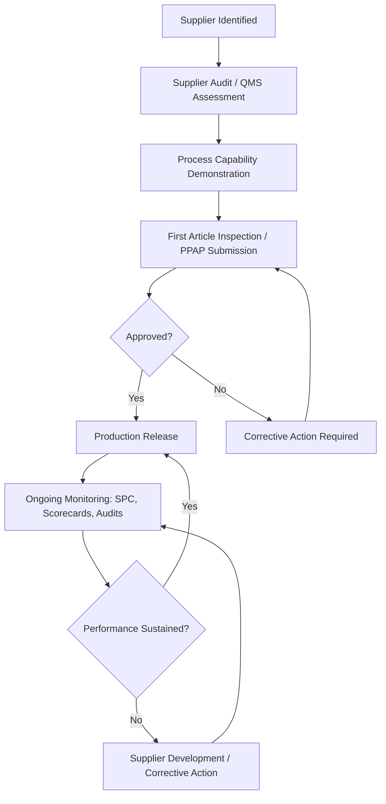

## Supplier Quality Management and Development

### Overview

Supplier quality management (SQM) encompasses the systems, agreements, and collaborative processes an organization uses to ensure purchased materials, components, and services meet specified quality requirements. In precision metrology contexts, SQM directly governs measurement traceability, dimensional conformance verification, and the statistical trust an organization can place in incoming material without resorting to costly 100% receiving inspection.

### Foundational Philosophy

**Key Points**

- Deming explicitly criticized awarding business on price alone (his 4th of the 14 Points: "end the practice of awarding business on price tag alone"), advocating instead for long-term, single-source relationships built on trust and joint improvement
- Modern SQM treats suppliers as an extension of the internal manufacturing process rather than an external, adversarial transaction
- The objective is to shift quality assurance **upstream**: verified process capability at the supplier reduces or eliminates the need for receiving inspection

### Supplier Selection and Qualification

**Key Points**

- **Supplier audits**: on-site assessment of the supplier's quality management system (commonly against ISO 9001, IATF 16949 for automotive, or AS9100 for aerospace), process controls, and measurement capability
- **Process Capability Studies**: suppliers may be required to demonstrate $C_{pk}\geq1.33$ (or industry-specific thresholds) on critical characteristics before qualification
- **First Article Inspection (FAI)**: comprehensive dimensional and material verification of initial production samples, often per AS9102 in aerospace, confirming the supplier's process can produce conforming parts before full production release
- **Supplier scorecards**: quantitative qualification criteria spanning quality (PPM defect rate), delivery performance, cost, and responsiveness

### Supplier Quality Agreements (SQAs)

**Key Points**

- Formal contractual documents specifying quality requirements beyond the basic purchase order, typically including:
  - Required inspection and testing protocols
  - Measurement system requirements (calibration traceability to national/international standards, required Gauge R&R performance)
  - Nonconformance reporting and corrective action timelines
  - Change notification requirements (process, material, or subcontractor changes requiring customer approval — often called **PPAP-style change control**)
  - Record retention and traceability requirements

### Production Part Approval Process (PPAP)

**Key Points**

- Formalized primarily in the automotive industry (AIAG PPAP manual), widely adapted across precision manufacturing sectors
- Requires supplier submission of standardized elements, commonly including:
  - Design records and engineering change documentation
  - Process flow diagrams and Process FMEA (Failure Mode and Effects Analysis)
  - Control plans
  - Measurement System Analysis (MSA) results, including Gauge R&R studies
  - Dimensional results (full layout inspection against the drawing)
  - Process capability studies ($C_p$/$C_{pk}$ or $P_p$/$P_{pk}$)
  - Material certifications
- **Submission Levels**: PPAP defines multiple submission levels (typically Level 1 through 5) specifying how much documentation is submitted to the customer versus retained on-site by the supplier

### Incoming Inspection Strategies

**Key Points**

- **100% Inspection**: exhaustive verification of every unit; costly and typically reserved for critical or newly qualified suppliers/characteristics
- **Statistical Sampling**: acceptance sampling plans (e.g., ANSI/ASQ Z1.4, based on AQL — Acceptable Quality Level) reduce inspection burden while maintaining statistical confidence
- **Skip-Lot Inspection**: for suppliers with demonstrated sustained process control, inspection frequency is reduced (e.g., inspecting one lot in every five) based on historical performance
- **Certificate of Conformance (CoC) / Certificate of Analysis (CoA) reliance**: for highly mature, trusted suppliers, physical receiving inspection may be reduced or eliminated in favor of supplier-provided documentation, contingent on periodic audit verification

### Supplier Development Programs

**Key Points**

- Distinguishes reactive **supplier correction** (fixing a specific nonconformance) from proactive **supplier development** (systemic capability improvement)
- Common mechanisms:
  - Joint root-cause problem-solving (e.g., 8D methodology, 5 Whys, fishbone analysis conducted collaboratively)
  - Shared training on SPC, MSA, and GD&T interpretation to align understanding of print requirements
  - Technology and equipment investment support (in some tiered manufacturing relationships, OEMs assist suppliers in acquiring capable measurement equipment)
  - Regular business reviews (QBRs) tracking scorecard trends over time rather than isolated incidents

### Measurement Traceability in the Supply Chain

**Key Points**

- Every measurement used to accept or reject supplied product should be traceable through an unbroken calibration chain to a national metrology institute (e.g., NIST in the U.S.) or international standard
- Supplier calibration records, typically ISO/IEC 17025-accredited where required by contract, must be auditable
- **Measurement Uncertainty** budgets should ideally be shared or harmonized between supplier and customer measurement systems to avoid disputes over borderline conformance decisions — a part measured as conforming by the supplier's system should not be measured as nonconforming by the customer's system purely due to unaddressed measurement system disagreement [Inference: the degree of formal uncertainty-budget harmonization varies significantly by industry maturity and contractual rigor]

### Nonconformance and Corrective Action

**Key Points**

- **Supplier Corrective Action Request (SCAR)**: formal documentation issued to a supplier upon nonconformance, requiring root cause analysis and verified corrective action, commonly using the **8D (Eight Disciplines)** problem-solving framework
- **Containment**: immediate action to prevent further nonconforming material from reaching production (sorting, quarantine) before root cause is fully understood
- **Effectiveness verification**: corrective actions should be verified through follow-up data (not merely documentation review) before a SCAR is closed

### Supplier Performance Metrics

| Metric | Typical Measure |
| --- | --- |
| PPM Defect Rate | Rejected parts per million received |
| On-Time Delivery | % of shipments meeting agreed delivery date |
| SCAR Response Time | Days from issuance to closure |
| $C_{pk}$ / $P_{pk}$ Trend | Process capability sustained over time |
| Audit Score | Periodic QMS/process audit rating |

### Conclusion

Supplier quality management extends the organization's own quality system across the supply chain boundary, converting supplier relationships from transactional to collaborative wherever process maturity allows. For precision metrology, robust SQM is what makes reduced-inspection strategies statistically defensible: PPAP, MSA, and calibration traceability requirements collectively provide the evidentiary basis for trusting supplier-reported conformance rather than re-verifying every incoming characteristic internally.

**Related Topics**

- Production Part Approval Process (PPAP) documentation requirements
- Measurement System Analysis (MSA) and Gauge R&R in supplier qualification
- Acceptance sampling plans (ANSI/ASQ Z1.4, AQL methodology)
- 8D problem-solving and Supplier Corrective Action Requests (SCARs)
- ISO/IEC 17025 calibration laboratory accreditation
- First Article Inspection (FAI) per AS9102