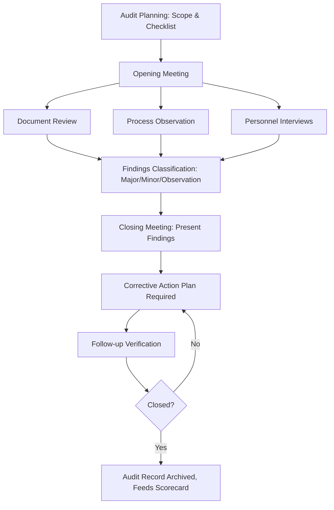

## Supplier Audits and Scorecards

### Overview

Supplier audits and scorecards are the two primary mechanisms by which an organization converts supplier quality requirements into ongoing, measurable oversight. Audits provide periodic, qualitative-and-quantitative assessment of a supplier's system and process capability; scorecards provide continuous, quantitative tracking of actual delivered performance. Together they form the feedback loop that sustains the confidence required for reduced incoming inspection strategies.

### Supplier Audit Types

**Key Points**

- **System Audit**: assesses the supplier's quality management system against a standard (ISO 9001, IATF 16949, AS9100) — evaluates documented procedures, management commitment, and QMS structure rather than a specific process
- **Process Audit**: examines a specific manufacturing process against defined requirements (commonly using the **VDA 6.3** or similar process-audit methodology), verifying that documented process parameters, control plans, and reaction plans are actually followed at the point of production
- **Product Audit**: verifies that a specific finished product conforms to specification, functioning as an independent check layered on top of the supplier's own inspection results
- **Layered Process Audit (LPA)**: short, frequent audits conducted by multiple levels of the supplier's own organization (operators, supervisors, plant management) to verify process discipline is sustained between formal external audits

### Audit Methodology and Structure

**Key Points**

- Audits are typically structured around a **checklist or standard framework** to ensure consistency and repeatability across auditors and audit cycles
- Common audit phases:
  1. **Pre-audit preparation**: review of prior audit history, nonconformance trends, and scorecard data to focus audit scope
  2. **Opening meeting**: scope, objectives, and logistics agreed with supplier management
  3. **On-site assessment**: document review, process observation, and interviews with operators and quality personnel
  4. **Evidence-based scoring**: findings classified by severity (e.g., major nonconformance, minor nonconformance, observation)
  5. **Closing meeting**: findings presented to supplier management before departure
  6. **Corrective Action Plan (CAP)**: supplier response with root cause and corrective action, subject to follow-up verification
- **Audit scoring** is typically weighted, with major nonconformances (e.g., no calibration traceability, no control plan for a critical characteristic) carrying disproportionately heavy point deductions relative to minor administrative findings

### Metrology-Specific Audit Focus Areas

**Key Points**

- **Calibration system verification**: confirmation that all measurement equipment used for conformance decisions has current calibration, traceable to national/international standards, with defined calibration intervals and out-of-tolerance (OOT) handling procedures
- **Gauge R&R / MSA evidence**: verification that measurement systems used on critical characteristics have documented, acceptable repeatability and reproducibility (commonly %GRR thresholds per AIAG MSA guidelines: <10% generally acceptable, 10-30% conditionally acceptable depending on application, >30% generally unacceptable) [Inference: exact acceptance thresholds vary by industry standard and criticality classification]
- **Environmental controls**: for precision dimensional or surface metrology, verification of temperature-controlled inspection areas, vibration isolation, and other conditions affecting measurement uncertainty
- **Gauge/fixture control**: verification that inspection fixtures and custom gauges are themselves subject to a calibration or verification schedule, not just standard instruments

### Supplier Scorecards

**Key Points**

- Continuous, typically monthly or quarterly, quantitative performance tracking distinct from the periodic (often annual) audit cycle
- **Common scorecard dimensions**:
  - **Quality**: PPM (parts per million) defect rate, number of SCARs issued, SCAR closure timeliness
  - **Delivery**: on-time delivery percentage, lead time adherence
  - **Cost**: cost performance against agreements, cost-reduction contribution
  - **Responsiveness**: communication timeliness, engineering change response
- Scorecards frequently use a **weighted composite score** (e.g., Quality 40%, Delivery 30%, Cost 20%, Responsiveness 10%) rolled into a single supplier rating, often tiered (e.g., Preferred, Approved, Conditional, Disqualified)

**Example**

| Dimension | Weight | Supplier Score (0-100) | Weighted Contribution |
| --- | --- | --- | --- |
| Quality (PPM/SCAR) | 40% | 88 | 35.2 |
| Delivery | 30% | 95 | 28.5 |
| Cost | 20% | 80 | 16.0 |
| Responsiveness | 10% | 90 | 9.0 |
| **Composite** | 100% | — | **88.7** |

### Scorecard-Driven Tiering and Escalation

**Key Points**

- Suppliers are commonly segmented into performance tiers, each with different oversight intensity:
  - **Preferred/Strategic**: reduced inspection, skip-lot sampling, minimal audit frequency
  - **Approved**: standard sampling and audit cadence
  - **Conditional/Probation**: increased inspection frequency, mandatory corrective action plan, more frequent audits
  - **Disqualified/Suspended**: sourcing halted pending demonstrated remediation
- Sustained scorecard decline (e.g., composite score below a defined threshold for two consecutive periods) typically triggers automatic escalation to a formal audit or supplier development intervention, rather than waiting for the next scheduled audit cycle

### Integrating Audit and Scorecard Data

**Key Points**

- Audit findings and scorecard trends should inform each other: a declining PPM trend on the scorecard is a leading indicator that should trigger a targeted process audit rather than waiting for the next calendar-scheduled system audit
- **Supplier Business Reviews (SBRs/QBRs)**: periodic joint meetings where both audit results and scorecard trends are reviewed collaboratively with supplier leadership, distinguishing this proactive review from purely reactive nonconformance handling
- Audit and scorecard data together form the evidentiary basis supporting reduced incoming inspection: an organization typically requires both a passing system/process audit *and* a sustained acceptable scorecard trend before approving skip-lot or CoC-based acceptance for a given supplier/characteristic combination

### Common Pitfalls

**Key Points**

- **Audit as checkbox exercise**: treating audits as documentation review only, without process observation, misses real-world deviations between documented and actual practice
- **Scorecard gaming**: suppliers optimizing narrowly to the measured metrics (e.g., shipping early to inflate on-time delivery) rather than genuine capability improvement, absent deeper trend analysis
- **Audit-scorecard disconnect**: treating audits and scorecards as separate administrative processes rather than an integrated oversight system, delaying detection of emerging supplier risk

### Conclusion

Supplier audits provide depth (verifying the system and process are genuinely capable) while scorecards provide continuity (tracking whether that capability is sustained in actual delivered performance). Neither is sufficient alone: a supplier can pass an audit snapshot while scorecard trends reveal drift, or maintain acceptable short-term metrics while masking systemic process control gaps only visible through on-site audit observation. Effective supplier quality management requires both mechanisms operating as an integrated, mutually reinforcing feedback system.

**Related Topics**

- Production Part Approval Process (PPAP) and supplier qualification
- Measurement System Analysis (MSA) and Gauge R&R acceptance criteria
- 8D problem-solving and Supplier Corrective Action Requests (SCARs)
- Acceptance sampling and skip-lot inspection strategies
- ISO 9001 / IATF 16949 supplier management requirements
- VDA 6.3 process audit methodology