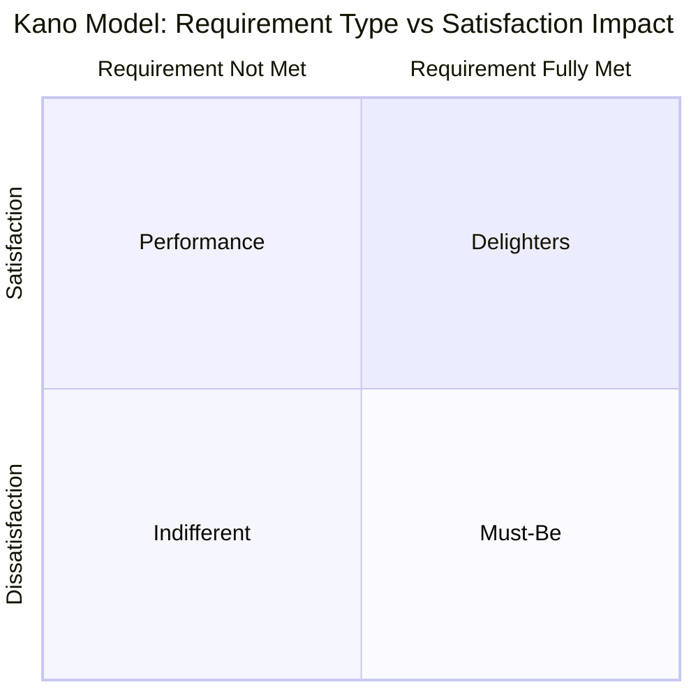

## Customer Relations and Voice of the Customer

### Overview

Voice of the Customer (VOC) is the structured process of capturing, analyzing, and translating customer needs, expectations, and feedback into actionable quality and design requirements. In precision metrology contexts, VOC determines which characteristics are designated critical-to-quality, what tolerance and measurement precision customers actually require (versus what is merely convenient to specify), and how conformance disputes are resolved when supplier and customer measurement systems disagree.

### Foundational Philosophy

**Key Points**

- Juran's definition of quality as **"fitness for use"** places the customer's actual need, not the specification document alone, as the ultimate quality reference point
- A part can be perfectly within specification tolerance yet fail to satisfy the customer's functional need if the specification itself was derived incorrectly from VOC — underscoring that VOC precedes and informs tolerancing, not the reverse
- Deming's systems view extends the "customer" concept internally: the next process step is the customer of the current step, meaning VOC principles apply to internal handoffs (e.g., metrology lab as a service provider to production) as well as external buyers

### VOC Data Collection Methods

**Key Points**

- **Direct methods**: customer interviews, surveys, focus groups, on-site visits to observe actual product use in context
- **Indirect methods**: warranty claims, field failure data, customer complaints, returns/RMA analysis, call center/support ticket trends
- **Competitive/benchmarking methods**: analysis of competitor products and customer preferences relative to alternatives
- **Kano Model**: classifies customer requirements into three categories to prioritize VOC-derived specifications:
  - **Must-be (basic) requirements**: expected baseline; absence causes strong dissatisfaction, presence generates no particular satisfaction
  - **Performance (one-dimensional) requirements**: satisfaction scales linearly with performance level (e.g., tighter dimensional tolerance correlating with better fit/function up to a point)
  - **Delighter (attractive) requirements**: unexpected features that generate disproportionate satisfaction when present but no dissatisfaction when absent

### Translating VOC into Technical Requirements

**Key Points**

- **Quality Function Deployment (QFD)**, structured via the **House of Quality** matrix, systematically translates qualitative customer statements ("the part must feel solid," "the assembly must not rattle") into quantifiable engineering characteristics (specific dimensional tolerances, surface finish requirements, material stiffness specifications)
- The House of Quality maps customer requirements (the "whats") against engineering characteristics (the "hows"), with a correlation matrix identifying which technical parameters most strongly influence which customer-perceived qualities, and a roof matrix showing interactions/tradeoffs between engineering characteristics themselves
- This translation step is where metrology requirements are effectively born: a customer's vague functional requirement becomes a specific measurable characteristic, a specific tolerance band, and by extension a specific required measurement uncertainty and Gauge R&R capability

**Example**

A customer requirement "the connector must mate smoothly without excessive force" translates through QFD into an engineering characteristic (mating force, $N$) with a target range, which then requires a calibrated force gauge with sufficient resolution and repeatability to verify conformance — VOC directly drives the metrology equipment specification.

### Critical-to-Quality (CTQ) Characteristics

**Key Points**

- **CTQ characteristics** are the specific, measurable product or process characteristics derived from VOC that must be controlled to satisfy customer requirements
- CTQ flow-down typically proceeds: Customer Need → Critical-to-Satisfaction (CTS) → Critical-to-Quality (CTQ) → Critical-to-Process (CTP) parameters
- CTQ designation drives which characteristics receive the tightest measurement scrutiny: higher-frequency inspection, tighter Gauge R&R requirements, and SPC monitoring, versus non-critical characteristics that may receive lighter oversight

### Customer Feedback Loops and Complaint Handling

**Key Points**

- **8D (Eight Disciplines)** or similar structured problem-solving is the standard response framework for formal customer complaints, requiring containment, root cause analysis, corrective action, and preventive action with customer visibility into each stage
- **Customer Scorecards** (the inverse of supplier scorecards) — many customers, particularly in automotive and aerospace, formally rate their suppliers' quality performance (PPM, on-time delivery, responsiveness), creating a reciprocal accountability structure
- **Field data feedback loops**: warranty and field failure data should route back into design and process control (e.g., updating control plans, tightening SPC limits, or revising CTQ designations) rather than being treated purely as a customer service function disconnected from engineering

### Measurement System Agreement with Customers

**Key Points**

- Disputes over conformance frequently originate not from actual part nonconformance but from **measurement system disagreement** between supplier and customer — differing equipment, calibration standards, environmental conditions, or measurement methodology
- **Gauge correlation studies** between supplier and customer measurement systems (comparing results on the same parts using both parties' equipment) help establish measurement agreement before disputes arise
- Contractual specification of **reference measurement methods** (e.g., "conformance determined by CMM measurement per [specific procedure]" rather than allowing either party to use an arbitrary method) reduces ambiguity in specification interpretation
- **Measurement uncertainty disclosure**: sharing uncertainty budgets with customers, particularly for characteristics near tolerance limits, supports transparent conformance decisions rather than disputed borderline calls [Inference: formal uncertainty-budget sharing practice varies significantly by industry and contractual maturity]

### Voice of the Customer in Ongoing Relationship Management

**Key Points**

- **Customer visits and joint reviews**: recurring business reviews (similar in structure to supplier QBRs) where quality performance, upcoming requirement changes, and improvement initiatives are discussed collaboratively
- **Early customer involvement in design**: including key customers in Design Reviews or Advanced Product Quality Planning (APQP) stages surfaces VOC-driven requirement changes before tooling and process design are finalized, avoiding costly late-stage rework
- **Customer-specific requirements (CSRs)**: many industries formalize customer-specific supplemental requirements beyond generic standards (e.g., automotive OEM-specific requirements layered on top of IATF 16949), which frequently include customer-specific measurement, reporting, and traceability mandates

### Conclusion

Voice of the Customer is the upstream origin point that ultimately determines what precision metrology exists to verify: without VOC-driven translation into CTQ characteristics and engineering tolerances, measurement activity has no grounded basis for what "conformance" actually means to the end user. Effective customer relations close the loop bidirectionally — VOC flows in to define requirements, and field/complaint data flows back to validate or revise those requirements, with measurement system agreement serving as the technical foundation that prevents the relationship from eroding over disputed conformance calls.

**Related Topics**

- Quality Function Deployment (QFD) and the House of Quality
- Critical-to-Quality (CTQ) flow-down methodology
- Advanced Product Quality Planning (APQP)
- 8D problem-solving for customer complaint resolution
- Gauge correlation studies and inter-laboratory measurement agreement
- Measurement uncertainty budgeting and disclosure