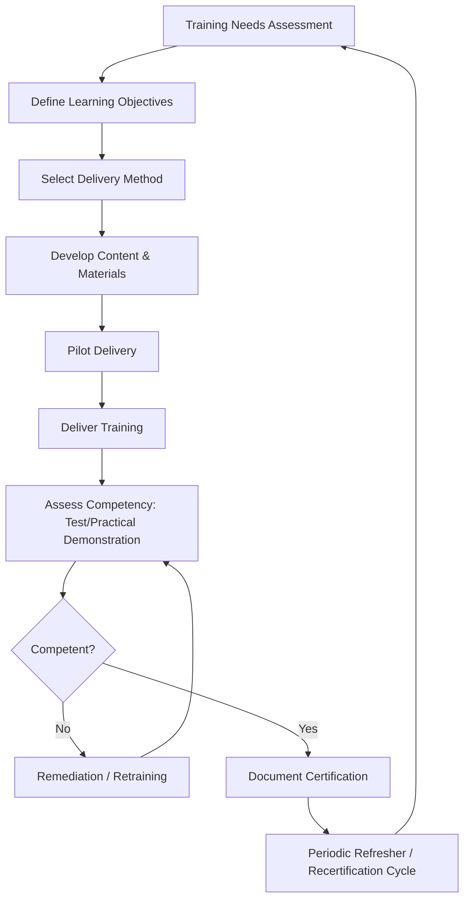

## Quality Training Program Design

### Overview

Quality training program design encompasses the systematic planning, delivery, and effectiveness verification of instruction that builds organizational quality competency — from shop-floor measurement technique to statistical analysis to leadership-level quality philosophy. For precision metrology specifically, training program design determines whether measurement personnel possess demonstrable, auditable competency, a requirement embedded directly in standards such as ISO/IEC 17025 and ISO 9001.

### Foundational Philosophy

**Key Points**

- Deming's system-level view holds that most quality problems originate in the system rather than individual worker error, but inadequate training is itself a systemic failure that management is responsible for correcting
- Ishikawa's advocacy for company-wide quality control explicitly required democratizing statistical tools through structured training (quality circles), not restricting competency to specialists
- Crosby's Zero Defects philosophy identifies training as a prerequisite absolute: workers cannot be expected to meet a zero-defect standard without first being equipped with the knowledge and tools to do so

### Training Needs Assessment (TNA)

**Key Points**

- Precedes program design; identifies the gap between current organizational competency and required competency
- Common assessment methods:
  - **Skills matrices**: mapping required competencies against current employee certification/training status by role
  - **Gap analysis against standards**: comparing current training records against ISO 9001, ISO/IEC 17025, IATF 16949, or AS9100 competency requirements
  - **Failure mode/root cause trending**: recurring nonconformances traced to measurement error, misapplication of GD&T, or SPC misinterpretation indicate specific training gaps
  - **Audit findings**: internal/external audit nonconformances citing inadequate training or competency evidence

### Training Program Structure

**Key Points**

- **Onboarding/foundational training**: quality policy, QMS overview, basic measurement principles, and role-specific safety and procedural requirements for new hires
- **Role-specific technical training**: differentiated by function — operators (basic gauge use, SPC data recording), inspectors (CMM operation, GD&T interpretation, calibration procedures), quality engineers (DOE, MSA, statistical analysis), leadership (quality philosophy, management review, resource allocation)
- **Continuing/refresher training**: periodic recertification, particularly for measurement personnel where skill decay or procedural drift can occur without reinforcement
- **Specialized certification tracks**: e.g., ASQ Certified Quality Engineer (CQE), Certified Quality Technician (CQT), Certified Calibration Technician (CCT), Six Sigma Green/Black Belt certifications

### Metrology-Specific Training Content

**Key Points**

- **Fundamentals of measurement**: accuracy vs. precision, resolution, repeatability vs. reproducibility, measurement uncertainty concepts
- **Instrument-specific operation**: calibrated use of micrometers, calipers, height gauges, CMMs, optical comparators, surface roughness testers, and other precision instruments
- **GD&T (Geometric Dimensioning and Tolerancing)** interpretation per ASME Y14.5 or ISO 1101, critical for correctly applying and measuring against engineering drawings
- **Gauge R&R / MSA execution**: hands-on training in conducting and interpreting Gauge Repeatability and Reproducibility studies
- **Calibration procedures and traceability**: understanding of calibration intervals, traceability chains to national standards, and out-of-tolerance (OOT) handling
- **SPC data collection and interpretation**: correct subgroup sampling, control chart construction, and distinguishing common from special cause variation

### Training Delivery Methods

**Key Points**

- **Classroom/instructor-led training (ILT)**: effective for conceptual and statistical topics requiring discussion and Q&A
- **Hands-on/practical training**: essential for measurement equipment operation — competency in metrology is demonstrably better verified through practical skill demonstration than written testing alone
- **On-the-job training (OJT) with mentorship**: pairing new personnel with experienced operators/inspectors for supervised practice before independent certification
- **E-learning/self-paced modules**: efficient for standardized, scalable content (policy training, basic conceptual overviews) but less suited to hands-on measurement skill development alone
- **Blended approaches**: combining e-learning for conceptual foundation with practical hands-on assessment for skill verification is common in mature metrology training programs [Inference: the specific blend ratio is highly program- and organization-dependent]

### Competency Assessment and Certification

**Key Points**

- Training completion (attendance) is distinct from **demonstrated competency**; standards such as ISO/IEC 17025 explicitly require evidence of competency, not merely training records
- **Written assessment**: tests conceptual understanding (e.g., GD&T symbol interpretation, statistical concept application)
- **Practical/performance assessment**: direct observation of measurement task execution against a defined standard, often including a **proficiency testing** or **inter-laboratory comparison** element for calibration/testing personnel under ISO/IEC 17025
- **Certification and recertification cycles**: defined validity periods after which competency must be re-demonstrated, particularly important where equipment, procedures, or standards have changed

### Training Program Governance and Records

**Key Points**

- **Training matrices/records**: auditable documentation linking each employee to required competencies, completion dates, and recertification due dates — a standard audit focus area under ISO 9001 clause 7.2 (Competence)
- **Qualification vs. certification distinction**: qualification typically refers to initial demonstrated capability to perform a task; certification often implies a formal, sometimes external, credential (e.g., ASQ certifications) with defined renewal requirements
- **Training effectiveness verification**: beyond test scores, effectiveness should ideally be verified through downstream indicators — reduced measurement error rates, reduced Gauge R&R failures, reduced nonconformances attributable to operator/inspector error

### Training Program Effectiveness Metrics

| Metric | Purpose |
| --- | --- |
| Training completion rate | Compliance tracking against required schedule |
| Post-training assessment pass rate | Immediate knowledge/skill verification |
| Gauge R&R pass rate (post-training) | Downstream measurement competency verification |
| Nonconformance rate attributable to human error | Long-term effectiveness indicator |
| Recertification compliance rate | Sustained competency maintenance |

### Common Program Design Pitfalls

**Key Points**

- **Training-as-compliance-checkbox**: designing programs to satisfy audit documentation requirements without genuine competency verification
- **One-size-fits-all content**: failing to differentiate training depth and focus by role, leading to either insufficient depth for technical roles or excessive irrelevant content for others
- **No refresher cadence**: treating training as a one-time onboarding event rather than an ongoing cycle, allowing skill and procedural drift, particularly problematic for infrequently performed measurement tasks
- **Disconnected from root cause data**: failing to feed nonconformance and audit trend data back into training needs assessment, missing the opportunity to close identified competency gaps proactively

### Conclusion

Effective quality training program design treats competency as a demonstrable, auditable, and continuously maintained organizational asset rather than a one-time compliance event. For precision metrology functions, this means structured needs assessment, role-differentiated content spanning conceptual and hands-on measurement skill, rigorous practical competency verification, and a governed recertification cycle — collectively providing the evidentiary basis that measurement personnel are genuinely capable of producing the trustworthy data on which the entire quality system depends.

**Related Topics**

- ISO/IEC 17025 competency and proficiency testing requirements
- Gauge R&R / Measurement System Analysis (MSA) methodology
- GD&T interpretation per ASME Y14.5
- ISO 9001 Clause 7.2 (Competence) requirements
- ASQ certification pathways (CQE, CQT, CCT)
- Skills matrices and training needs assessment methods