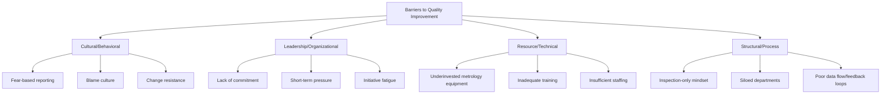

## Barriers to Quality Improvement

### Overview

Barriers to quality improvement are the systemic, cultural, resource, and structural obstacles that prevent organizations from translating quality philosophy into sustained practice. Recognizing these barriers is a diagnostic complement to the quality frameworks covered earlier in this chapter: Deming, Juran, and Crosby each implicitly or explicitly identified specific failure modes that quality leadership must actively counteract.

### Cultural and Behavioral Barriers

**Key Points**

- **Fear-based culture**: Deming's 8th Point ("drive out fear") directly addresses this — employees who fear punishment for reporting defects, measurement anomalies, or process problems will conceal rather than surface the data quality systems depend on
- **Blame culture / individual attribution bias**: attributing defects to "operator error" without root-cause investigation into system factors (tooling, training, measurement system capability) perpetuates recurring problems rather than resolving them
- **Resistance to change**: established habits, particularly around informal or undocumented "tribal knowledge" measurement practices, resist replacement even when formal procedures are demonstrably more reliable
- **Silo mentality**: departmental boundaries (design, production, quality, metrology) that inhibit cross-functional collaboration, directly contradicting Deming's 9th Point on breaking down barriers between departments

### Leadership and Organizational Barriers

**Key Points**

- **Lack of visible management commitment**: Crosby's model places management commitment as the explicit first step of quality improvement; without it, initiatives lack authority and resourcing
- **Short-term financial pressure**: prioritizing quarterly cost or output targets over quality investment, particularly problematic for metrology infrastructure (calibration, MSA studies, equipment upgrades) whose value is realized over longer time horizons
- **Initiative fatigue**: sequential launch of quality programs (TQM, Six Sigma, Lean) without sustained follow-through erodes organizational trust and willingness to engage with subsequent initiatives
- **Numerical quotas without method** (Deming's 11th Point): production or inspection throughput targets set without regard to actual process capability drive shortcuts, including measurement shortcuts (skipped calibration checks, inadequate sample sizes) to meet quotas

### Resource and Technical Barriers

**Key Points**

- **Underinvestment in measurement infrastructure**: treating calibration programs, Gauge R&R studies, and precision measurement equipment as discretionary cost centers rather than risk-mitigation investment directly undermines data trustworthiness across every downstream quality process
- **Inadequate training and competency gaps**: as covered in training program design, insufficient measurement competency produces unreliable data regardless of how well-designed the surrounding quality system is
- **Legacy systems and data fragmentation**: disconnected data systems (separate SPC software, calibration management, ERP, and inspection records) prevent the integrated analysis needed to detect systemic trends across processes or suppliers
- **Insufficient measurement system capability relative to tolerance**: a measurement system with excessive variation relative to the tolerance band it is verifying (poor %GRR) cannot reliably distinguish conforming from nonconforming parts, undermining every downstream quality decision regardless of process capability

### Structural and Process Barriers

**Key Points**

- **Inspection-only (detection) mindset**: organizations that rely on end-of-line inspection to "catch" defects rather than designing quality into the process perpetuate Shewhart and Deming's foundational critique — detection does not prevent recurrence
- **Poor feedback loop design**: measurement and nonconformance data that does not flow back efficiently to design, process engineering, or supplier management functions cannot drive systemic improvement, regardless of how much data is collected
- **Specification-tolerance thinking without loss-function awareness**: treating any in-tolerance part as equally acceptable (rather than recognizing Taguchi's continuous loss function) removes incentive to center processes on target rather than merely stay within limits
- **Inadequate corrective action rigor**: closing nonconformances based on documentation completion rather than verified effectiveness (data-confirmed recurrence prevention) allows the same root causes to persist

### Supplier and Supply Chain Barriers

**Key Points**

- **Price-only sourcing**: Deming's explicit criticism of awarding business on price alone (4th Point) remains a persistent barrier where procurement incentives are misaligned with quality objectives
- **Measurement system disagreement across the supply chain**: unresolved gauge correlation gaps between supplier and customer measurement systems generate recurring disputes that consume resources without addressing actual process capability
- **Adversarial rather than developmental supplier relationships**: relying solely on rejection-based receiving inspection rather than investing in supplier development perpetuates recurring supplier nonconformance rather than resolving root causes

### Measurement and Data-Specific Barriers

**Key Points**

- **Data without statistical context**: collecting measurement data without applying SPC principles (distinguishing common from special cause variation) can lead to overreaction to normal process noise or underreaction to genuine process shifts — Deming referred to this as "tampering"
- **Confirmation bias in measurement**: informal or undocumented adjustment of measurement technique to achieve expected/desired results, particularly risky in borderline conformance decisions near tolerance limits
- **Uncalibrated or under-maintained equipment**: gradual measurement drift that goes undetected between calibration cycles can silently erode data reliability across an entire production run before detection

### Overcoming Barriers: Structural Countermeasures

**Key Points**

- **Leadership modeling** (Gemba walks, visible management review participation) directly counters commitment and cultural barriers
- **Psychological safety practices**: explicit non-punitive nonconformance reporting channels counter fear-based concealment
- **Integrated data systems**: connecting SPC, calibration management, and nonconformance tracking systems removes structural barriers to cross-functional feedback loops
- **Resourced supplier development** (rather than rejection-only incoming inspection) addresses supply chain barriers at the root rather than the symptom
- **Effectiveness-verified corrective action**: requiring data-confirmed recurrence prevention, not documentation closure alone, addresses structural corrective action weaknesses

### Conclusion

Barriers to quality improvement rarely originate from a single root cause; they typically compound across cultural, leadership, resource, structural, and data-integrity dimensions simultaneously. The quality pioneers' frameworks — Deming's system focus, Crosby's management commitment model, Taguchi's loss-function thinking — each function as much as diagnostic lenses for identifying these barriers as they do prescriptive improvement methodologies. For precision metrology specifically, barriers rooted in underinvested measurement infrastructure, inadequate training, and fragmented data systems are particularly consequential, since unreliable or untrustworthy measurement data undermines the evidentiary foundation on which every other quality improvement effort depends.

**Related Topics**

- Deming's 14 Points for Management
- Cost of Quality (COQ) and resource allocation barriers
- Measurement System Analysis (MSA) and %GRR acceptance criteria
- Corrective action effectiveness verification methods
- Supplier development vs. rejection-based incoming inspection
- Psychological safety and non-punitive nonconformance reporting systems